# 高可用存储架构

## 1. 概述

存储高可用方案的本质都是通过将数据复制到多个存储设备，通过数据冗余的方式来实现高可用，其复杂性主要体现在如何应对复制延迟和中断导致的数据不一致问题。因此，对任何一个高可用存储方案，我们需要从以下几个方面去进行思考和分析：

* 数据如何复制？
* 各个节点的职责是什么？
* 如何应对复制延迟？
* 如何应对复制中断？

常见的高可用存储架构有**主备、主从、主主、集群、分区**，每一种又可以根据业务的需求进行一些特殊的定制化功能，由此衍生出更多的变种。

> 可以分为：双机、集群、分区三种类型

由于不同业务的定制功能难以通用化，本文主要分析常见的几种高可用架构。

## 2. 双机架构

**双机高可用架构**：主备、主从、主备 / 主从切换和主主。

主备和主从的差异：

* 主备：备可以理解为**备份**，备机只做备份用，不提供其他服务。
* 主从：从可以理解为**仆从**，从机除了备份外还提供读服务。

### 主备复制

主备复制是最常见也是最简单的一种存储高可用方案，几乎所有的存储系统都提供了主备复制的功能，例如 MySQL、Redis、MongoDB 等。

下面是标准的主备方案结构图：

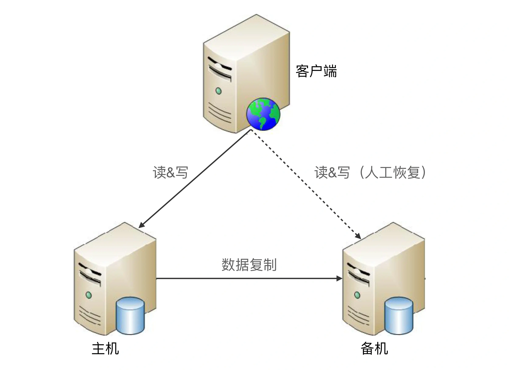

其整体架构比较简单，主备架构中的“备机”主要还是起到一个备份作用，并不承担实际的业务读写操作，如果要把备机改为主机，需要人工操作。

主备复制架构的优点就是简单，表现有：

* 对于客户端来说，不需要感知备机的存在，即使灾难恢复后，原来的备机被人工修改为主机后，对于客户端来说，只是认为主机的地址换了而已，无须知道是原来的备机升级为主机。

* 对于主机和备机来说，双方只需要进行数据复制即可，无须进行状态判断和主备切换这类复杂的操作。

主备复制架构的缺点主要有：

* 备机仅仅只为备份，并没有提供读写操作，硬件成本上有浪费。

* 故障后需要人工干预，无法自动恢复。

> 人工处理的效率是很低的，可能打电话找到能够操作的人就耗费了 10 分钟，甚至如果是深更半夜，出了故障都没人知道。人工在执行恢复操作的过程中也容易出错，因为这类操作并不常见，可能 1 年就 2、3 次，实际操作的时候很可能遇到各种意想不到的问题。

综合主备复制架构的优缺点，**内部的后台管理系统使用主备复制架构的情况会比较多**，例如学生管理系统、员工管理系统、假期管理系统等，因为这类系统的数据变更频率低，即使在某些场景下丢失数据，也可以通过人工的方式补全。

### 主从复制

在主备的基础上，如果备机还提供读服务的话就是主从了。

下面是标准的主从复制架构：

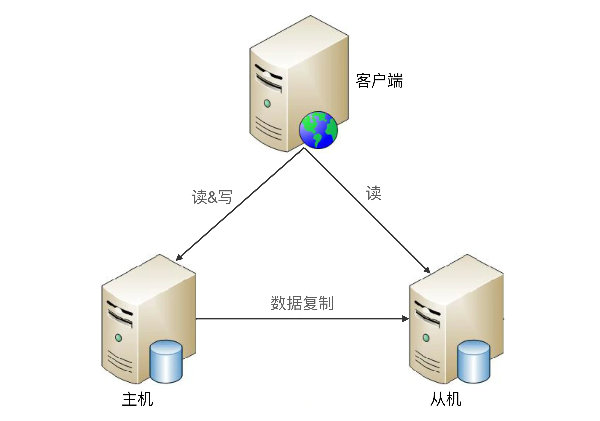

主从复制与主备复制相比，优点有：

* 主从复制在主机故障时，读操作相关的业务可以继续运行。

* 主从复制架构的从机提供读操作，发挥了硬件的性能。

缺点有：

* 主从复制架构中，客户端需要感知主从关系，并将不同的操作发给不同的机器进行处理，复杂度比主备复制要高。
* 主从复制架构中，从机提供读业务，如果主从复制延迟比较大，业务会因为数据不一致出现问题。
* 故障时需要人工干预。

综合主从复制的优缺点，一般情况下，**写少读多的业务使用主从复制的存储架构比较多**。例如，论坛、BBS、新闻网站这类业务，此类业务的读操作数量是写操作数量的 10 倍甚至 100 倍以上。

### 双机切换

主备复制和主从复制方案存在两个共性的问题：

* 主机故障后，无法进行写操作。
* 如果主机无法恢复，需要人工指定新的主机角色。

双机切换就是为了解决这两个问题而产生的，包括主备切换和主从切换两种方案。简单来说，这两个方案就是**在原有方案的基础上增加“切换”功能**，即系统自动决定主机角色，并完成角色切换。

#### 关键设计点

要实现一个完善的切换方案，必须考虑这几个关键的设计点：

* 主备间状态判断
* 切换决策
* 数据冲突解决

**主备间状态判断**主要包括两方面：状态传递的渠道，以及状态检测的内容。

* **状态传递的渠道**：是相互间互相连接，还是第三方仲裁？
* **状态检测的内容**：例如机器是否掉电、进程是否存在、响应是否缓慢等。

**切换决策**主要包括几方面：切换时机、切换策略、自动程度。

* **切换时机**：什么情况下备机应该升级为主机？是机器掉电后备机才升级，还是主机上的进程不存在就升级，还是主机响应时间超过 2 秒就升级，还是 3 分钟内主机连续重启 3 次就升级等。

* **切换策略**：原来的主机故障恢复后，要再次切换，确保原来的主机继续做主机，还是原来的主机故障恢复后自动成为新的备机？

* **自动程度**：切换是完全自动的，还是半自动的？例如，系统判断当前需要切换，但需要人工做最终的确认操作（例如，单击一下“切换”按钮）。

**数据冲突解决**主要处理当原有故障的主机恢复后，新旧主机之间存在数据冲突的情况。

例如，用户在旧主机上新增了一条 ID 为 100 的数据，这个数据还没有复制到旧的备机，此时发生了切换，旧的备机升级为新的主机，用户又在新的主机上新增了一条 ID 为 100 的数据，当旧的故障主机恢复后，这两条 ID 都为 100 的数据，应该怎么处理？

> 以上设计点并没有放之四海而皆准的答案，不同的业务要求不一样，所以切换方案比复制方案不只是多了一个切换功能那么简单，而是复杂度上升了一个量级。

#### 常见方案

根据状态传递渠道的不同，常见的主备切换架构有三种形式：互连式、中介式和模拟式。

##### 互连式

故名思议，互连式就是指主备机直接建立状态传递的渠道。

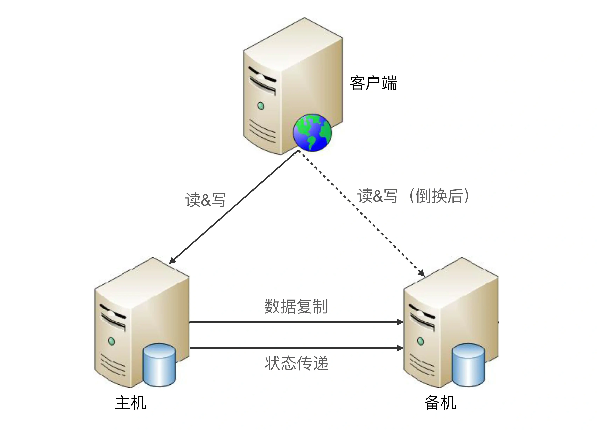

在主备复制的架构基础上，主机和备机多了一个“状态传递”的通道，这个通道就是用来传递状态信息的。这个通道的具体实现可以有很多方式：

* 可以是网络连接（例如，各开一个端口），
* 也可以是非网络连接（用串口线连接）。
* 可以是主机发送状态给备机，也可以是备机到主机来获取状态信息。
* 可以和数据复制通道共用，也可以独立一条通道。状态传递通道可以是一条，也可以是多条，还可以是不同类型的通道混合（例如，网络 + 串口）。

为了充分利用切换方案能够自动决定主机这个优势，客户端这里也会有一些相应的改变，常见的方式有：

* 为了切换后不影响客户端的访问，主机和备机之间共享一个对客户端来说唯一的地址。例如虚拟 IP，主机需要绑定这个虚拟的 IP。

* 客户端同时记录主备机的地址，哪个能访问就访问哪个；备机因为不能对外提供服务，因此如果收到了客户端的请求就直接拒绝掉。

互连式主备切换主要的缺点在于：**无法可靠的进行状态传递**。

如果状态传递的通道本身有故障（例如，网线被人不小心踢掉了），那么备机也会认为主机故障了从而将自己升级为主机，而此时主机并没有故障，最终就可能出现两个主机。

> 虽然可以通过增加多个通道来增强状态传递的可靠性，但这样做只是降低了通道故障概率而已，不能从根本上解决这个缺点，而且通道越多，后续的状态决策会更加复杂，因为对备机来说，可能从不同的通道收到了不同甚至矛盾的状态信息。

##### 中介式

中介式指的是在主备两者之外引入第三方中介，主备机之间不直接连接，而都去连接中介，并且通过中介来传递状态信息，其架构图如下：

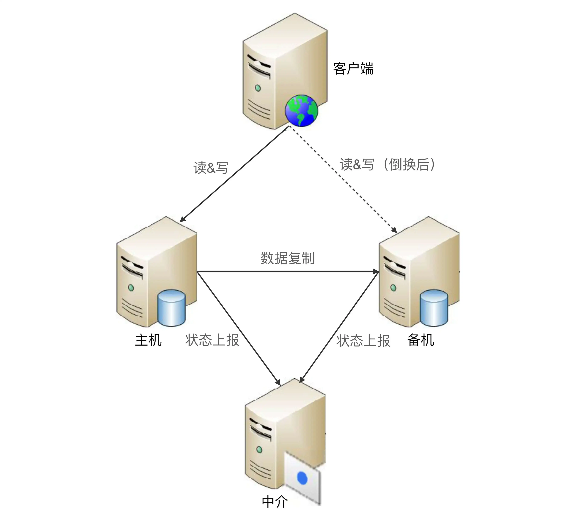

主机和备机不再通过互联通道传递状态信息，而是都将状态上报给中介这一角色。

单纯从架构上看，中介式似乎比互连式更加复杂了，首先要引入中介，然后要各自上报状态。然而事实上，中介式架构在状态传递和决策上却更加简单了，这是为何呢？

**连接管理更简单**：主备机无须再建立和管理多种类型的状态传递连接通道，只要连接到中介即可，实际上是降低了主备机的连接管理复杂度。

**状态决策更简单**：主备机的状态决策简单了，无须考虑多种类型的连接通道获取的状态信息如何决策的问题，只需要按照下面简单的算法即可完成状态决策。

* 无论是主机还是备机，初始状态都是备机，并且只要与中介断开连接，就将自己降级为备机，因此可能出现双备机的情况。
* 主机与中介断连后，中介能够立刻告知备机，备机将自己升级为主机。
* 如果是网络中断导致主机与中介断连，主机自己会降级为备机，网络恢复后，旧的主机以新的备机身份向中介上报自己的状态。
* 如果是掉电重启或者进程重启，旧的主机初始状态为备机，与中介恢复连接后，发现已经有主机了，保持自己备机状态不变。
* 主备机与中介连接都正常的情况下，按照实际的状态决定是否进行切换。例如，主机响应时间超过 3 秒就进行切换，主机降级为备机，备机升级为主机即可。

虽然中介式架构在状态传递和状态决策上更加简单，但并不意味着这种优点是没有代价的，其**关键代价就在于如何实现中介本身的高可用**。因为如果中介自己宕机了，整个系统就进入了双备的状态，写操作相关的业务就不可用了。

> 这就陷入了一个递归的陷阱：为了实现高可用，我们引入中介，但中介本身又要求高可用，于是又要设计中介的高可用方案……如此递归下去就无穷无尽了。

幸运的是，**开源方案已经有比较成熟的中介式解决方案，例如 ZooKeeper 和 Keepalived**。ZooKeeper 本身已经实现了高可用集群架构，因此已经帮我们解决了中介本身的可靠性问题，在工程实践中推荐基于 ZooKeeper 搭建中介式切换架构。

MongoDB 的 Replica Set 采取的就是这种方式，其基本架构如下：

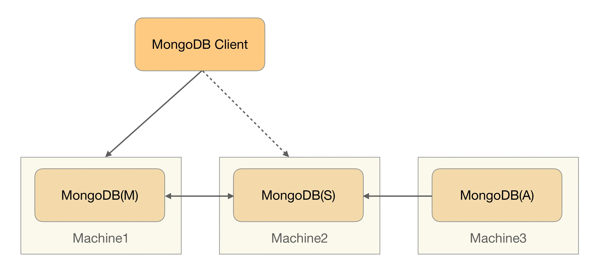

MongoDB(M) 表示主节点，MongoDB(S) 表示备节点，MongoDB(A) 表示仲裁节点。主备节点存储数据，仲裁节点不存储数据。客户端同时连接主节点与备节点，不连接仲裁节点。

##### 模拟式

模拟式指主备机之间并不传递任何状态数据，而是备机模拟成一个客户端，向主机发起模拟的读写操作，根据读写操作的响应情况来判断主机的状态。其基本架构如下：

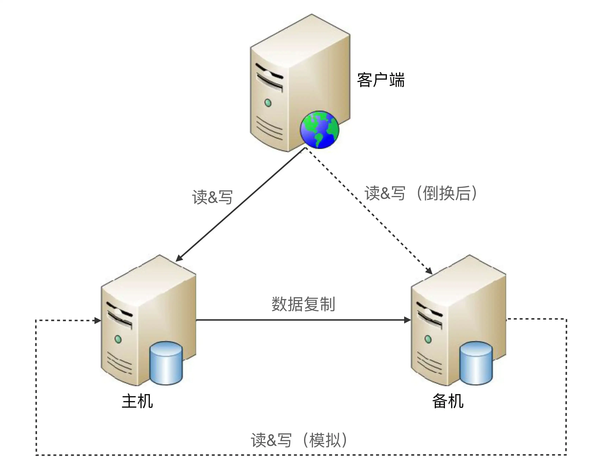

模拟式切换与互连式切换相比，**优点是实现更加简单**，因为省去了状态传递通道的建立和管理工作。

简单既是优点，同时也是缺点：

* 因为模拟式读写操作获取的状态信息只有响应信息（例如，HTTP 404，超时、响应时间超过 3 秒等），
* 没有互连式那样多样（除了响应信息，还可以包含 CPU 负载、I/O 负载、吞吐量、响应时间等）

**基于有限的状态来做状态决策，可能出现偏差**。

### 主主复制

主主复制(也叫作双主)指的是两台机器都是主机，互相将数据复制给对方，客户端可以任意挑选其中一台机器进行读写操作，下面是基本架构图：

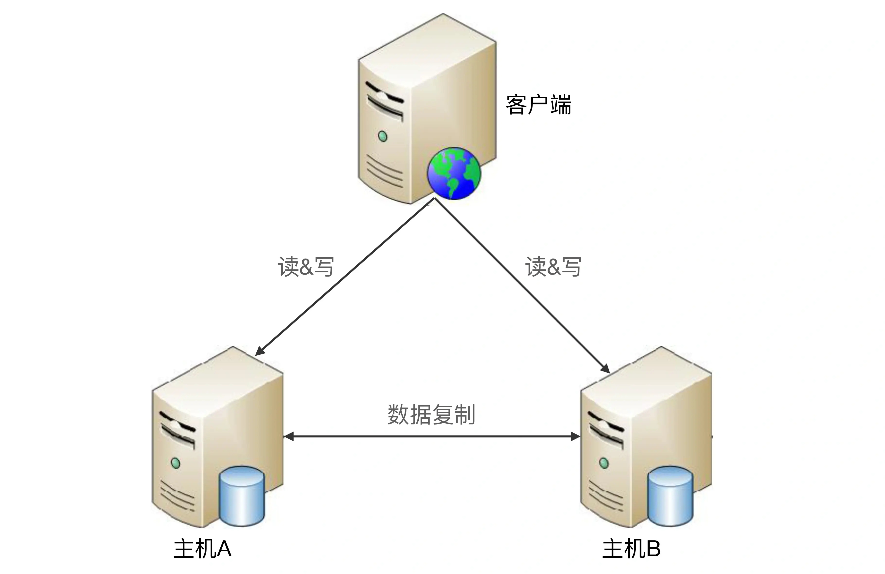

相比主备切换架构，主主复制架构具有如下特点：

* 两台都是主机，不存在切换的概念。
* 客户端无须区分不同角色的主机，随便将读写操作发送给哪台主机都可以。

从上面的描述来看，主主复制架构从总体上来看要简单很多，无须状态信息传递，也无须状态决策和状态切换。

然而事实上主主复制架构也并不简单，而是有其独特的复杂性，具体表现在：**如果采取主主复制架构，必须保证数据能够双向复制，而很多数据是不能双向复制的**。

例如：

* **自增用户 ID **，用户注册后生成的用户 ID，如果按照数字增长，那就不能双向复制，否则就会出现 X 用户在主机 A 注册，分配的用户 ID 是 100，同时 Y 用户在主机 B 注册，分配的用户 ID 也是 100，这就出现了冲突。
* **库存**，例如，一件商品库存 100 件，主机 A 上减了 1 件变成 99，主机 B 上减了 2 件变成 98，然后主机 A 将库存 99 复制到主机 B，主机 B 原有的库存 98 被覆盖，变成了 99，而实际上此时真正的库存是 97。类似的还有余额数据。

因此，**主主复制架构对数据的设计有严格的要求，一般适合于那些临时性、可丢失、可覆盖的数据场景**。例如，用户登录产生的 session 数据（可以重新登录生成）、用户行为的日志数据（可以丢失）、论坛的草稿数据（可以丢失）等。

**具体解决方案的话主要是设计数据防冲突策略和冲突解决方案**，例如A机房生成奇数数据，B机房生成偶数数据，这样即可解决自增用户 ID 的问题。

## 3. 集群架构

根据集群中机器承担的不同角色来划分，集群可以分为两类：

* 数据集中集群：可以看做是副本集。
* 数据分散集群：可以看做是分片。

### 数据集中集群

**数据集中集群与主备、主从这类架构相似，我们也可以称数据集中集群为 1 主多备或者 1 主多从**。无论是 1 主 1 从、1 主 1 备，还是 1 主多备、1 主多从，数据都只能往主机中写，而读操作可以参考主备、主从架构进行灵活多变。

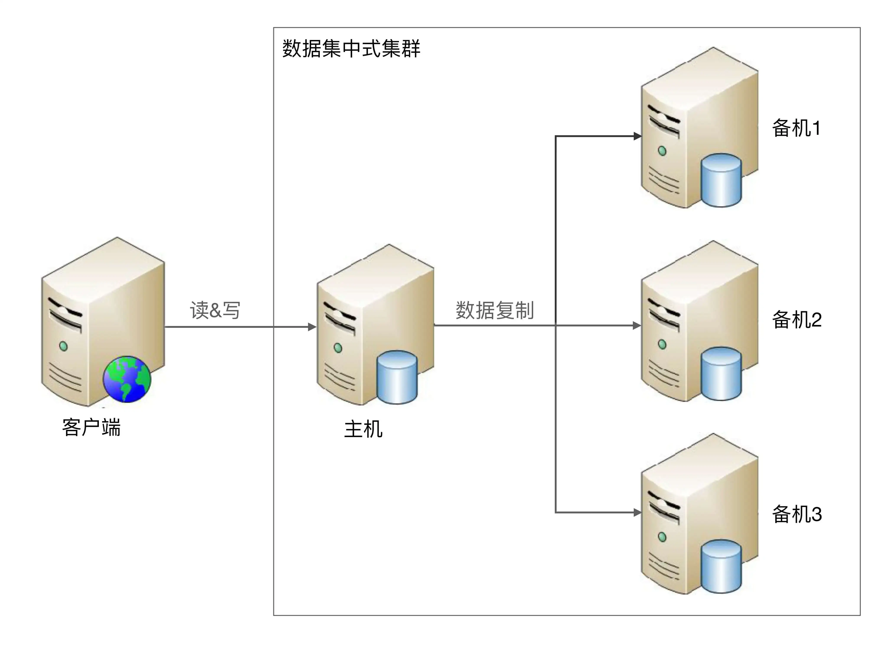

虽然架构上是类似的，但由于集群里面的服务器数量更多，导致复杂度整体更高一些，具体体现在：

* 主机如何将数据复制给备机

* 备机如何检测主机状态

* 主机故障后，如何决定新的主机

  

**主机如何将数据复制给备机**：主备和主从架构中，只有一条复制通道，而数据集中集群架构中，存在多条复制通道。

* 多条复制通道首先会增大主机复制的压力，某些场景下我们需要考虑如何降低主机复制压力，或者降低主机复制给正常读写带来的压力。
* 其次，多条复制通道可能会导致多个备机之间数据不一致，某些场景下我们需要对备机之间的数据一致性进行检查和修正。

**备机如何检测主机状态**：主备和主从架构中，只有一台备机需要进行主机状态判断。在数据集中集群架构中，多台备机都需要对主机状态进行判断，而不同的备机判断的结果可能是不同的，如何处理不同备机对主机状态的不同判断，是一个复杂的问题。

**主机故障后，如何决定新的主机**：主从架构中，如果主机故障，将备机升级为主机即可；而在数据集中集群架构中，有多台备机都可以升级为主机，但实际上只能允许一台备机升级为主机，那么究竟选择哪一台备机作为新的主机，备机之间如何协调，这也是一个复杂的问题。

目前开源的数据集中集群以 ZooKeeper 为典型，ZooKeeper 通过 ZAB 算法来解决上述提到的几个问题，但 ZAB 算法的复杂度是很高的。

### 数据分散集群

数据分散集群指多个服务器组成一个集群，每台服务器都会负责存储一部分数据；同时，为了提升硬件利用率，每台服务器又会备份一部分数据。

数据分散集群的复杂点在于如何将数据分配到不同的服务器上，算法需要考虑这些设计点：

* **均衡性**：算法需要保证服务器上的数据分区基本是均衡的，不能存在某台服务器上的分区数量是另外一台服务器的几倍的情况。
* **容错性**：当出现部分服务器故障时，算法需要将原来分配给故障服务器的数据分区分配给其他服务器。
* **可伸缩性**：当集群容量不够，扩充新的服务器后，算法能够自动将部分数据分区迁移到新服务器，并保证扩容后所有服务器的均衡性。

数据分散集群和数据集中集群的不同点在于，数据分散集群中的每台服务器都可以处理读写请求，因此不存在数据集中集群中负责写的主机那样的角色。但**在数据分散集群中，必须有一个角色来负责执行数据分配算法**，这个角色可以是独立的一台服务器，也可以是集群自己选举出的一台服务器。如果是集群服务器选举出来一台机器承担数据分区分配的职责，则这台服务器一般也会叫作主机，但我们需要知道这里的“主机”和数据集中集群中的“主机”，其职责是有差异的。

**Elasticsearch 集群就是一个数据分散集群**，通过选举一台服务器来做数据分区的分配，叫作 master node，其数据分区管理架构是：

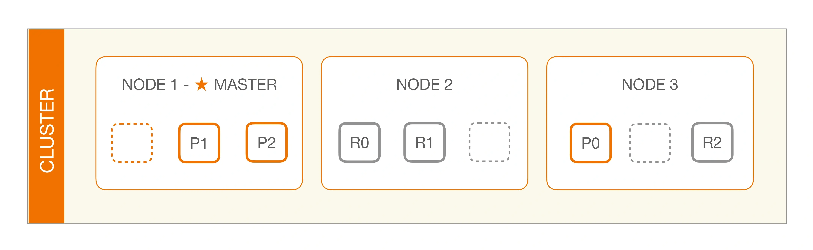

Elasticsearch 集群主节点具体职责如下：

> The master node is responsible for lightweight cluster-wide actions such as creating or deleting an index, tracking which nodes are part of the cluster, and deciding which shards to allocate to which nodes. It is important for cluster health to have a stable master node.

### 小结

数据集中集群架构中，客户端只能将数据写到主机；数据分散集群架构中，客户端可以向任意服务器中读写数据。正是因为这个关键的差异，决定了两种集群的应用场景不同。

* **一般来说，数据集中集群适合数据量不大，集群机器数量不多的场景**。例如，ZooKeeper 集群，一般推荐 5 台机器左右，数据量是单台服务器就能够支撑；

* **而数据分散集群，由于其良好的可伸缩性，适合业务数据量巨大、集群机器数量庞大的业务场景**。例如，Elasticsearch 集群、Hadoop 集群、HBase 集群，大规模的集群可以达到上百台甚至上千台服务器。

## 4. 分区架构

前面我们讨论的存储高可用架构都是基于硬件故障的场景去考虑和设计的，主要考虑当部分硬件可能损坏的情况下系统应该如何处理。

但对于一些影响非常大的灾难或者事故来说，有可能所有的硬件全部故障。例如，新奥尔良水灾、美加大停电、洛杉矶大地震等这些**极端灾害或者事故，可能会导致一个城市甚至一个地区的所有基础设施瘫痪**，这种情况下基于硬件故障而设计的高可用架构不再适用，**因此我们需要基于地理级别的故障来设计高可用架构**，这就是数据分区架构产生的背景。

**数据分区指将数据按照一定的规则进行分区，不同分区分布在不同的地理位置上，每个分区存储一部分数据，通过这种方式来规避地理级别的故障所造成的巨大影响**。采用了数据分区的架构后，即使某个地区发生严重的自然灾害或者事故，受影响的也只是一部分数据，而不是全部数据都不可用；当故障恢复后，其他地区备份的数据也可以帮助故障地区快速恢复业务。

设计一个良好的数据分区架构，需要从多方面去考虑：

* 数据量
* 分区规则
* 分区复制规则

**数据量的大小直接决定了分区的规则复杂度**。例如，使用 MySQL 来存储数据，假设一台 MySQL 存储能力是 500GB，那么 2TB 的数据就至少需要 4 台 MySQL 服务器；而如果数据是 200TB，并不是增加到 800 台的 MySQL 服务器那么简单。如果按照 4 台服务器那样去平行管理 800 台服务器，复杂度会发生本质的变化，具体表现为：

* 800 台服务器里面可能每周都有一两台服务器故障，从 800 台里面定位出 2 台服务器故障，很多情况下并不是一件容易的事情，运维复杂度高。
* 增加新的服务器，分区相关的配置甚至规则需要修改，而每次修改理论上都有可能影响已有的 800 台服务器的运行，不小心改错配置的情况在实践中太常见了。
* 如此大量的数据，如果在地理位置上全部集中于某个城市，风险很大，遇到了水灾、大停电这种灾难性的故障时，数据可能全部丢失，因此分区规则需要考虑地理容灾。

因此，数据量越大，分区规则会越复杂，考虑的情况也越多。

**分区规则主要根据地理位置远近分类**，包括洲际分区、国家分区、城市分区。具体采取哪种或者哪几种规则，需要综合考虑业务范围、成本等因素。

* 通常情况下，洲际分区主要用于面向不同大洲提供服务，由于跨洲通讯的网络延迟已经大到不适合提供在线服务了，因此洲际间的数据中心可以不互通或者仅仅作为备份；
* 国家分区主要用于面向不同国家的用户提供服务，不同国家有不同语言、法律、业务等，国家间的分区一般也仅作为备份；
* 城市分区由于都在同一个国家或者地区内，网络延迟较低，业务相似，分区同时对外提供服务，可以满足业务异地多活之类的需求。

**常见的分区复制规则有三种：集中式、互备式和独立式**。每个分区本身的数据量虽然只是整体数据的一部分，但还是很大，这部分数据如果损坏或者丢失，损失同样难以接受。因此即使是分区架构，同样需要考虑复制方案。

### 分区复制规则

常见的分区复制规则有三种：集中式、互备式和独立式。

#### 集中式

集中式备份指存在一个总的备份中心，所有的分区都将数据备份到备份中心，其基本架构如下：

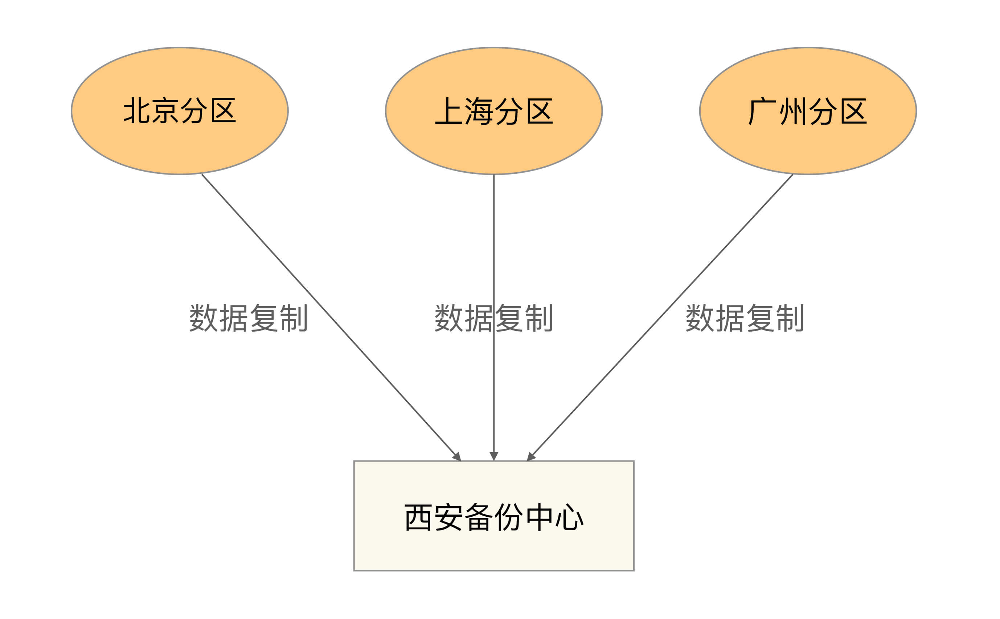

集中式备份架构的优缺点是：

* 设计简单，各分区之间并无直接联系，可以做到互不影响。
* 扩展容易，如果要增加第四个分区（例如，武汉分区），只需要将武汉分区的数据复制到西安备份中心即可，其他分区不受影响。
* 成本较高，需要建设一个独立的备份中心。

#### 互备式

互备式备份指每个分区备份另外一个分区的数据，其基本架构如下：

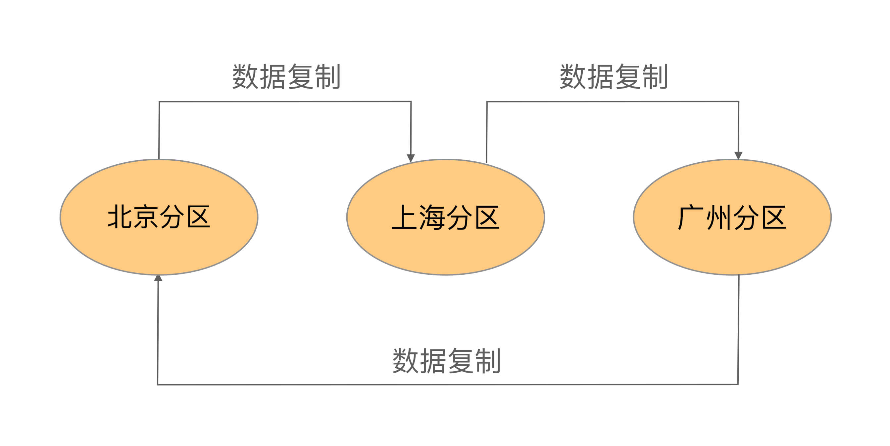

互备式备份架构的优缺点是：

* 设计比较复杂，各个分区除了要承担业务数据存储，还需要承担备份功能，相互之间互相关联和影响。
* 扩展麻烦，如果增加一个武汉分区，则需要修改广州分区的复制指向武汉分区，然后将武汉分区的复制指向北京分区。而原有北京分区已经备份了的广州分区的数据怎么处理也是个难题，不管是做数据迁移，还是广州分区历史数据保留在北京分区，新数据备份到武汉分区，无论哪种方式都很麻烦。
* 成本低，直接利用已有的设备。

#### 独立式

独立式备份指每个分区自己有独立的备份中心，其基本架构如下：

有一个细节需要特别注意，各个分区的备份并不和原来的分区在一个地方，以规避同城或者相同地理位置同时发生灾难性故障的极端情况。

> 例如，北京分区的备份放到了天津，上海的放到了杭州，广州的放到了汕头，如果北京分区机房在朝阳区，而备份机房放在通州区，整个北京停电的话，两个机房都无法工作。

独立式备份架构的优缺点是：

* 设计简单，各分区互不影响。
* 扩展容易，新增加的分区只需要搭建自己的备份中心即可。
* 成本高，每个分区需要独立的备份中心，备份中心的场地成本是主要成本，因此独立式比集中式成本要高很多。

## 5. 小结

如果要求不高，双机架构就行了，可以保证数据不丢失，真出问题在手动切换。

如果业务量不大，基本上双机架构+自动切换实现高可用就可以满足要求了。

如果业务量很大，超过单机承受能力（请求量或者数据量）就需要集群架构了。

如果对可用性要求更新，可以再做分区架构，把数据备份到不同可用区，以实现对极端情况的高可用。

需要注意的是 数据分散集群和分区架构是不一样的，分区架构一般都是物理上隔离的，网络传输很慢，如果直接跨区域搭建集群在网络上就是一个很大的挑战，是**强烈不推荐**的做法。

跨区域一般是先根据业务划分出各个区域，然后各个区域搭建集群，再把数据做一个跨区域备份。

高可用存储架构核心为以下两点：

* 数据冗余
* 故障转移

比如双机架构（主备、主从）就满足了数据冗余。但是没有自动故障转移功能，因此配合上双机切换就可以实现高可用。