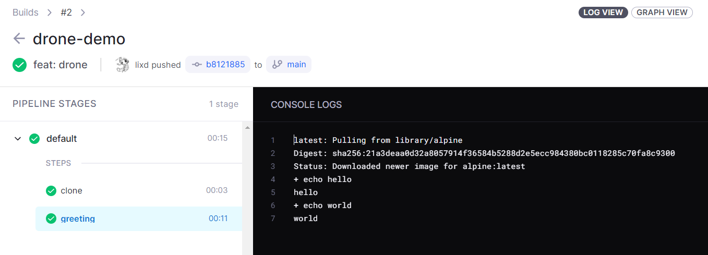

# drone 入门教程

还是比较简单的，照着官方文档一步一步来就行了，不过在本地部署比较麻烦。

[Drone 官方文档](https://docs.drone.io/)

[快速理解持续集成工具 Drone CI 核心概念](https://zhuanlan.zhihu.com/p/38281927)

[Drone CI：搭建自己CI/CD（一）](https://zhuanlan.zhihu.com/p/163526198)

[Drone CI：搭建自己CI/CD（二）](https://zhuanlan.zhihu.com/p/163681924)


## 1. CICD 简介

**`CI`全称为`Continuous Integration`，意为`持续集成`**。

`持续集成` 指在源代码变更后自动检测、拉取、构建和进行自动化测试的过程，属于开发人员的自动化流程。该解决方案可以解决在一次开发中有太多应用分支，从而导致相互冲突的问题。其基本思路是，自动化监测代码仓库的变化并拉取最新代码、编译构建和自动化测试。`CI`的触发方式可分为以下三种： *轮询：按一定的时间间隔反复询问代码仓库是否发生了变更，若发生了变更则开启CI流程* 定时：定期从代码仓库拉去最新代码并进行构建与测试，不必关心是否有变更发生 * 推送：当代码仓库发生变更时，通过推送的方式(如`webhook`)通知`CI`进行任务，这需要`CI`环境被代码仓库访问到，因此需要一个外网可达地址

**`CD`指的是`持续交付(Continuous Delivery)`或`持续部署(Continuous Deployment)`**。`持续交付`通常是指开发人员对应用的更改会自动进行错误测试并上传到存储库（如 [GitHub](https://link.zhihu.com/?target=https%3A//redhatofficial.github.io/%23!/main) 或容器注册表），然后由运维团队将其部署到实时生产环境中。`持续部署`指的是自动将开发人员的更改从存储库发布到生产环境，它以持续交付为基础，实现了管道后续阶段的自动化。 `CI/CD` 既可能仅指持续集成和持续交付构成的关联环节，也可以指持续集成、持续交付和持续部署这三项构成的关联环节。 

> 请参考：[redhat：什么是CI/CD](https://link.zhihu.com/?target=https%3A//www.redhat.com/zh/topics/devops/what-is-ci-cd)


## 2. Drone 

[Drone CI](https://link.zhihu.com/?target=https%3A//drone.io/) 	官网说：

> Drone is a self-service Continuous Delivery platform for busy development teams.

Drone 非常简洁，不像`Jenkins`那样复杂，但同时它拥有可以满足基本需求的能力，并且提供了许多实用的[插件](https://link.zhihu.com/?target=http%3A//plugins.drone.io/)，如`GitHub`，`Email`，`helm`，`微信`，`钉钉`等。


[Drone 文档](https://link.zhihu.com/?target=https%3A//docs.drone.io/)给出了相对于不同 git 仓库和部署方式的方案，支持的 git 仓库有：

* Github
* GitLab
* Gitea
* Gogs
* Bitbucket Cloud
* Bitbucket Server

本节给出对于**GitHub**的**单机**部署方案，对官方[部署方案](https://link.zhihu.com/?target=https%3A//docs.drone.io/installation/github/single-machine/)做了`docker-compose`方案的补充


## 3. [安装 Drone](https://docs.drone.io/server/provider/github/)

正常需要部署一个 Git 仓库，比如 GitLab，然后再部署 Drone，不过为了方便我们直接用 Github，这样只需要部署 Drone 就可以了。


1）获取 Oauth 授权信息

ClientID 9834baddbfea7fa4b272

Client Secrets e8bb591eebd1b7bd2f30a1f16f0ff2d7fe8dbc99


生成一个密钥，主要用于 Drone Server 和 Drone Runner之间 RPC 通信校验。

使用 openssl 生成共享密钥：

```bash
$ openssl rand -hex 16
bea26a2221fd8090ea38720fc445eca6
```


2）拉取 Drone 镜像

```bash
docker pull drone/drone:2
```


3）配置

Drone 服务器使用环境变量进行配置。本文引用了配置选项的子集，定义如下。有关[配置](https://docs.drone.io/server/reference/)选项的完整列表，请参阅配置。

- **DRONE_GITHUB_CLIENT_ID**

  必需的字符串值提供您在上一步中生成的 GitHub oauth 客户端 ID。

- **DRONE_GITHUB_CLIENT_SECRET**

  必需的字符串值提供您在上一步中生成的 GitHub oauth 客户端密码。

- **DRONE_RPC_SECRET**

  必需的字符串值提供在上一步中生成的共享密钥。这用于验证服务器和运行器之间的 rpc 连接。必须为服务器和运行器提供相同的秘密值。

- **DRONE_SERVER_HOST**

  必需的字符串值提供您的外部主机名或 IP 地址。如果使用 IP 地址，您可以包括端口。例如`drone.company.com`.

- **DRONE_SERVER_PROTO**

  必需的字符串值提供您的外部协议方案。此值应设置为 http 或 https。如果您配置 ssl 或 acme，此字段默认为 https。*如果您将 Drone 部署在负载均衡器或带有 SSL 终止的反向代理后面，**则应设置此值。`https`*


4）启动服务器

语法如下：

```bash
docker run \
  --volume=/var/lib/drone:/data \
  --env=DRONE_GITHUB_CLIENT_ID=your-id \
  --env=DRONE_GITHUB_CLIENT_SECRET=super-duper-secret \
  --env=DRONE_RPC_SECRET=super-duper-secret \
  --env=DRONE_SERVER_HOST=drone.company.com \
  --env=DRONE_SERVER_PROTO=https \
  --publish=80:80 \
  --publish=443:443 \
  --restart=always \
  --detach=true \
  --name=drone \
  drone/drone:2
```

本例中的具体命令为：

```bash
docker run \
  --volume=/var/lib/drone:/data \
  --env=DRONE_GITHUB_CLIENT_ID=9834baddbfea7fa4b272 \
  --env=DRONE_GITHUB_CLIENT_SECRET=0182c7ffb23059dcf71ec4ba33e06f289655b790 \
  --env=DRONE_RPC_SECRET=bea26a2221fd8090ea38720fc445eca6 \
  --env=DRONE_SERVER_HOST=127.0.0.1 \
  --env=DRONE_SERVER_PROTO=http \
  --env=DRONE_LOGS_DEBUG=true \
  --publish=80:80 \
  --publish=443:443 \
  --restart=always \
  --detach=true \
  --name=drone \
  drone/drone:2
```

> 多加了一个 DRONE_LOGS_DEBUG=true 开启 debug 日志，编译后续排查问题


5）安装 Runner

```bash
docker pull drone/drone-runner-docker:1
```

Docker 运行器是使用环境变量配置的。本文引用了以下配置选项。有关[配置](https://docs.drone.io/runner/docker/configuration/reference/)选项的完整列表，请参阅配置。

- **DRONE_RPC_HOST**

  提供 Drone 服务器的主机名（和可选端口）。运行程序连接到主机地址的服务器以接收管道以执行。

- **DRONE_RPC_PROTO**

  提供用于连接 Drone 服务器的协议。该值必须是 http 或 https。

- **DRONE_RPC_SECRET**

  提供用于向 Drone 服务器进行身份验证的共享密钥。这必须与您的 Drone 服务器配置中定义的密钥匹配。

语法如下

```bash
docker run --detach \
  --volume=/var/run/docker.sock:/var/run/docker.sock \
  --env=DRONE_RPC_PROTO=https \
  --env=DRONE_RPC_HOST=drone.company.com \
  --env=DRONE_RPC_SECRET=super-duper-secret \
  --env=DRONE_RUNNER_CAPACITY=2 \
  --env=DRONE_RUNNER_NAME=my-first-runner \
  --publish=3000:3000 \
  --restart=always \
  --name=runner \
  drone/drone-runner-docker:1
```

本例中完整命令如下：

```bash
docker run --detach \
  --volume=/var/run/docker.sock:/var/run/docker.sock \
  --env=DRONE_RPC_PROTO=http \
  --env=DRONE_RPC_HOST=127.0.0.1 \
  --env=DRONE_RPC_SECRET=bea26a2221fd8090ea38720fc445eca6 \
  --env=DRONE_RUNNER_CAPACITY=2 \
  --env=DRONE_RUNNER_NAME=my-first-runner \
  --publish=3000:3000 \
  --restart=always \
  --name=runner \
  drone/drone-runner-docker:1
```

然后查看 runner 是否成功跑起来了

```bash
docker logs runner
```

发现一直在报错，连接不上，因为这里指定的 127.0.0.1 那么 runner 就会去连接容器里的网络， server 是在宿主机上跑的肯定连不上，改一下直接用 host 网络把

```bash
docker run --detach \
  --volume=/var/run/docker.sock:/var/run/docker.sock \
  --env=DRONE_RPC_PROTO=http \
  --env=DRONE_RPC_HOST=ci.lixueduan.com:9876 \
  --env=DRONE_RPC_SECRET=bea26a2221fd8090ea38720fc445eca6 \
  --env=DRONE_RUNNER_CAPACITY=2 \
  --env=DRONE_RUNNER_NAME=my-first-runner \
  --publish=3000:3000 \
  --restart=always \
  --name=runner \
  --network=host \
  drone/drone-runner-docker:1
```

这次就可以连上了。


## 4. [使用 Drone](https://docs.drone.io/quickstart/)

1）认证

首先访问我们的 Drone Dashboard，http://127.0.0.1。首次访问会跳转到 Github 进行登录，登录完成后同步 Github 的 Repo 过来。

2）启用 Repo

找到 drone-demo 仓库，在 settings 里面点击 ACTIVITE REPOSITORY 按钮以启用该仓库。

这里一直报错，提示 Validation Failed。

查看 Drone Server 日志如下:

```bash
$ docker logs drone
{"error":"Validation Failed","level":"debug","msg":"api: cannot create or update hook","name":"drone-demo","namespace":"lixd","request-id":"28gKRW1QOZEKPZHoxNC6a6v7hXw","time":"2022-05-04T02:53:01Z","user.login":"lixd"}

```

看起来是调用 github api 失败了。

找一下发现是因为我们用的地址时 127.0.0.1，Github 无法访问这个地址，所以导致创建失败。。。

弄个隧道，让本地服务能公网访问即可解决该问题。

> 这里用的是 [ frp](https://github.com/fatedier/frp)，或者直接在有公网 IP 的机器上部署也行。

然后把Github Oauth app 里的链接改一下,**同时把 drone 启动时的 DRONE_SERVER_HOST 环境变量换成公网地址**，然后就可以启用仓库了。

然后去 Github 仓库的 Settings--> WebHooks 下面就能看到多了一个 webhook。

3）配置 .drone.yaml

在根目录下创建一个`.drone.yml`文件，里面定义了每次收到 webhook 时触发的操作。

> 注意：文件名是`.drone.yml`
>
> 注意：文件名是`.drone.yml`
>
> 注意：文件名是`.drone.yml`

这里就弄一个最简单的吧：

```yaml
kind: pipeline
type: docker
name: default

steps:
- name: greeting
  image: alpine
  commands:
  - echo hello
  - echo world
```

4）提交

把上述 yaml 文件提交到 Git 仓库并推送到 Github，当你推送代码时，GitHub 会向 Drone 发送一个 webhook，然后 Drone 会执行我们定义的 pipeline。

> 测试的时候发现隧道转发这个好像用不了。。。webhook 一直无法触发，收到点击 builds 测试了一下是可以用的。

然后打开 Drone dashboard 找到对应仓库的 builds 界面就可以看到触发的 build 了。

大概是这样的：




## 5. 小结

整个流程基本走通了，不过不是太顺畅，因为是本地部署的，需要隧道才能勉强使用，如果在公网部署应该会好一些。

后续就是 pipeline 的编写了。

最后 Github 上一般都用的 Github Actions，Drone 应该是配合 GitLab 使用才对，后续换 GitLab 试试。