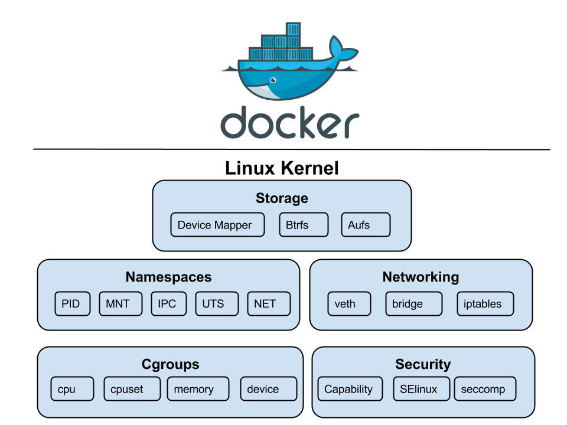

# LXC & Docker

[training-kubernetes](https://github.com/99cloud/training-kubernetes)


## 什么是 Linux 容器？

### 虚拟化技术的演进

具体如下图所示：


* 传统部署：在硬件上安装操作系统，然后在操作系统上运行 app。
* 虚拟机部署：在硬件上安装操作系统，在操作系统上运行 Hypervisor(kvm,xen) 等虚拟化程序，然后在虚拟出来的硬件上安装操作系统，最后在运行 app。
  * 虚拟机就是运行再
* 容器化部署：在硬件上安装操作系统，在操作系统上运行容器运行时，在容器运行时上运行容器。

差异点：

* 虚拟化和传统部署最大区别在于，**虚拟化实际上是在欺骗操作系统**，让操作系统认为自己是运行再真实的硬件上的。
  * 操作系统其实是一个进程，如果这是一个 8 核的虚拟机，那么这个进程里会有 8 个线程。而这个操作系统调用的各个 api 其实使用 Hypervisor 等虚拟化程序提供的。
    * 这也解释了为什么在 Windows 上可以安装 Linux 系统的虚拟机，因为是软件实现的，不兼容的 API 也可以通过软件进行模拟。
  * **虚拟机中运行的 app 则是运行再进程里的一个进程**
* 容器化和虚拟化相比则更加**轻量级**，不需要额外部署操作系统，所以容器拥有启动快，资源开销小等特点。
  * **容器技术运行的 app 就是真实运行再宿主机上的**，和宿主机进程一一对应，不像虚拟机中的 app 那样是进程中的进程。

> 总的来说虚拟机和容器都算是虚拟化的一种。

### 虚拟化是为了解决什么问题？

资源隔离 & 资源限制

资源隔离主要指将物理基础架构（如服务器、网络硬件、存储等）与计算环境（如操作系统和应用程序等）分开。

> 比如可以通过 Hypervisor 技术在一个 8C16G 的机器上虚拟出两台 4C8G 的机器，分别运行 Windows 和 Linux 系统。

资源限制则是限制不同 app 能占用的最大资源数，防止单系统中运行多个 app 时，其中某个 app 因为程序 bug 或者其他原因占用大量资源，导致其他 app 无法正常运行的情况出现。

> 比如同时运行了 mysql 和 redis，自然不希望 redis 占用大量内存而导致 mysql 无法使用了，所以可以分别限制这两个 app 能使用 cpu、memory 等资源。


### 什么是 Linux 容器？

linux 容器就是指在 linux 上通过 namespace & cgroup 实现的容器。

> linux container --> lxc


### 什么是 namespace？


每个进程在用户空间是彼此隔离的，因此就是某个 app 因为自身原因 crash 掉了也不会影响到其他进程。

而在内核态其实进程间是没有隔离的，所以如果某个 app 在内核态的时候 crash 了，会造成整个操作系统 crash。

> 比如在 Windows 下显卡驱动出问题就会影响到整个操作系统，比如直接蓝屏。

这也是为什么 shell 中的 ps 指令可以看到操作系统中的所有进程。

而容器技术则是通过 namespace 将对应进程完全进行隔离了，使得在容器内 ps -ef 只能看到容器自身运行的进程。


### 什么是 CGroup？


### Mac 和 Win 上 有容器技术么？

有，但是不完善，比如 Windows 上的容器技术只有 namespace 实现比较好，cgroup 技术实现还不完善，因此资源隔离不够彻底。

> 可以简单限制 CPU 使用，比如限制为 1 个 或者两个，但是不能像 Linux 这样限制为 千分之一。
>
> 而内存则完全不能限制，这些都是因为操作系统底层设计问题导致的。


## 2. 容器和虚拟机有何区别？

- 原理
- 应用场景


### 原理

虚拟机通过虚拟化 API 实现的，容器则是通过容器 API（比如 lxc 就是 namespace & cgroup） 实现的。

虚拟机需要安装操作系统，而容器则是在原生操作系统上进行隔离和限制，因此容器更加轻量级。


### 应用场景

**隔离性**

容器是基于原生操作系统进行隔离和限制的，如果只有一台 Linux 主机，但是 app 需要运行再 Windows 上，此时容器就无法实现了，而虚拟机则可以。甚至于不同 app 可能对 Linux 内核版本要求不同，容器技术也无法实现，这种情况都需要用到虚拟机。

**安全性**

因为容器隔离并不完善，因为都是直接运行再原生操作系统上的，可能存在安全问题，而虚拟机则不同，每台虚拟机都有一个独立的操作系统，完全隔离开的，相比于容器安全性更好。

当然了为了解决容器的安全性问题，现在也出现了安全容器的概念，比如 kata、gvisor 等。号称是像虚拟机一样安全，容器一样快速。

**性能**

但是虚拟机由于需要单独操作系统，因此性能上有额外损耗，追求性能但是对安全性要求不高的场景则比较推荐使用容器。


## 3. Docker 和容器技术的关系

### 什么是 Docker

Docker 最大的贡献就是**将容器技术简单化**。

> linux 容器用到的 namespace & cgroup 很早就存在的，但是直到 docker 的诞生才流行起来。

Docker 镜像分层是一个最大的创新，通过分层，增量更新等方式极大减小了镜像体积，运行时再通过 aufs 将各个 layer 合并起来，组合成一个完成的镜像。



### Docker 和容器有什么关系？

why Linus don't care docker？

Docker 是容器的一层封装。


### Docker 有哪些竞争产品？

[CRI-O ？](https://zhuanlan.zhihu.com/p/30667806)


### 1.4 Docker 的架构和概念空间是怎样的？


### 1.5 什么是所谓的安全容器技术？

安全容器本质上是虚拟机，用的是虚拟机的 API，但是又符合容器的接口（CRI、OCI）

- 容器的天然不安全与天然安全

- [Kata Container](https://katacontainers.io/learn/)，[PDF](https://katacontainers.io/collateral/kata-containers-1pager.pdf)

  

- 竞争者：gVisor / firecracker / rustVM


### 1.6 实验：Docker Quick Start

- 在 Ubuntu 18.04 / Ubuntu 20.04 / CentOS 7 上配置 Docker

  ```bash
  # 更新依赖仓库
  apt-get update -y || yum update -y
  
  # 安装 Docker
  apt-get install docker.io -y || yum install docker -y
  systemctl enable docker
  systemctl start docker
  
  # 检查 docker 服务状态
  systemctl status docker
  
  # ubuntu 中需要把 docker 的 cgroup driver 改成 systemd
  # !! centos 默认就是 systemd，不要修改这个文件，改了 docker 会起不来，保持 {} 就好
  vi /etc/docker/daemon.json
  
  {
    "exec-opts": ["native.cgroupdriver=systemd"]
  }
  
  systemctl restart docker
  
  # run hello-world
  docker run hello-world
  ```

  >Note：2021 年 7 月之后，ubuntu 环境 kubeadmin 默认都是 1.22+ 版本，因此需要将 docker 的 cgroup driver 改成 systemd（原来是 cgroup）。如果不改，后续 kubeadm init 时，会报错：`[kubelet-check] The HTTP call equal to 'curl -sSL http://localhost:10248/healthz' failed with error: Get "http://localhost:10248/healthz": dial tcp [::1]:10248: connect: connection refused.`
  >
  >检查 journalctl -x -u kubelet，可以看到：`Aug 07 15:10:45 ckalab2 kubelet[11394]: E0807 15:10:45.179485   11394 server.go:294] "Failed to run kubelet" err="failed to run Kubelet: misconfiguration: kubelet cgroup driver: \"systemd\" is different from docker cgroup driver: \"cgroupfs\""`
  >
  >看官方文档：<https://kubernetes.io/docs/tasks/administer-cluster/kubeadm/configure-cgroup-driver/>：`In v1.22, if the user is not setting the cgroupDriver field under KubeletConfiguration, kubeadm will default it to systemd.`
  >
  >所以我们需要把 docker 的 cgroup driver 改成 systemd
  >
  >修改步骤参考：<https://stackoverflow.com/questions/43794169/docker-change-cgroup-driver-to-systemd>
  >
  >修改完成后，检查一下 docker cgroup，确保 docker cgroup 是 systemd 了：`sudo docker info | grep -i cgroup`

- 如何创建一个镜像？如何启动和调试容器？[Github](https://github.com/99cloud/lab-openstack/tree/master/src/docker-quickstart) 或 [Gitee](https://gitee.com/dev-99cloud/lab-openstack/tree/master/src/docker-quickstart)

  ```console
  $ mkdir ~/test
  $ cd ~/test
  $ wget https://gitee.com/dev-99cloud/lab-openstack/raw/master/src/docker-quickstart/app.py
  $ wget https://gitee.com/dev-99cloud/lab-openstack/raw/master/src/docker-quickstart/requirements.txt
  $ wget https://gitee.com/dev-99cloud/lab-openstack/raw/master/src/docker-quickstart/Dockerfile
  
  # 如果是 CentOS 7.x 需要安装下 python3
  $ yum install python3 python3-pip
  
  # pip3 install -r requirements.txt
  $ pip3 install -i https://pypi.tuna.tsinghua.edu.cn/simple -r requirements.txt
  
  $ python3 app.py
   * Running on http://0.0.0.0:80/ (Press CTRL+C to quit)
  
  # 此时可以从浏览器访问 http://<ip>/
  
  $ docker build --tag=friendlyhello .
  
  # 可以看一下本地镜像列表
  $ docker images
  
  $ docker rm testFlask
  $ docker run --rm -p 4000:80 --name=testFlask 99cloud/friendlyhello:3.9.6
   * Running on http://0.0.0.0:80/ (Press CTRL+C to quit)
  
  # 此时可以从浏览器访问 http://<ip>:4000
  
  # 如果要跑在后台，可以加 -d 参数
  $ docker run -d --rm -p 4000:80 --name=testNew 99cloud/friendlyhello:3.9.6
  
  # 进入容器调试
  $ docker exec -it testFlask /bin/bash
  root@4224b69e7ee3:/app# env
  HOSTNAME=4224b69e7ee3
  PWD=/app
  HOME=/root
  NAME=World
  ...
  
  root@4224b69e7ee3:/app# ps -ef
  
  # 查看容器日志
  $ docker logs -f testFlask
  
  # 结束容器
  $ docker stop testFlask
  
  # 启动容器
  $ docker start testFlask
  
  # 从容器生成新的镜像
  $ docker stop testFlask
  $ docker commit testFlask test-new
  
  # 删除容器
  $ docker rm testFlask
  
  # 删除镜像
  $ docker rmi maodouzi/get-started:part2
  ```

- [Docker 官方入门参考资料](


### 1.7 Docker 的网络模型


演示

```console
# docker 容器实现没有把 network namespaces 放到标准路径 `/var/run/netns` 下，所以 `ip netns list` 命令看不到

# 但是可以看 `ll /proc/<pid>/ns`，两个进程的 namespaces id 相同说明在同一个 namespaces

[root@cloud025 ns]# ll /proc/2179/ns/
total 0
lrwxrwxrwx 1 root root 0 Aug 10 11:58 ipc -> ipc:[4026531839]
lrwxrwxrwx 1 root root 0 Aug 10 11:58 mnt -> mnt:[4026531840]
lrwxrwxrwx 1 root root 0 Aug 10 11:58 net -> net:[4026531956]
lrwxrwxrwx 1 root root 0 Aug 10 11:58 pid -> pid:[4026531836]
lrwxrwxrwx 1 root root 0 Aug 10 11:58 user -> user:[4026531837]
lrwxrwxrwx 1 root root 0 Aug 10 11:58 uts -> uts:[4026531838]

# 做个软链接，就可以看到 netns 了

[root@cloud025 ns]# docker ps
CONTAINER ID        IMAGE                         COMMAND                  CREATED             STATUS              PORTS                  NAMES
07297a3ac7ea        nginx:latest                  "/docker-entrypoin..."   29 minutes ago      Up 29 minutes       80/tcp                 devtest
0935b08509a4        test-new                      "python app.py"          35 minutes ago      Up 35 minutes       0.0.0.0:5000->80/tcp   testNew
c23c76dd779c        99cloud/friendlyhello:3.9.6   "python app.py"          37 minutes ago      Up 36 minutes       0.0.0.0:4000->80/tcp   testFlask

[root@cloud025 ns]# docker inspect testFlask | grep -i pid
            "Pid": 1159,
            "PidMode": "",
            "PidsLimit": 0,
[root@cloud025 ns]# mkdir -p /var/run/netns
[root@cloud025 ns]# ln -s /proc/1159/ns/net /var/run/netns/testFlask
[root@cloud025 ns]# ip netns list
testFlask (id: 0)
devtest (id: 2)
testNew (id: 1)

# 进入对应的 namespaces，看 ip，pod namespace 里虚拟网卡的 link-netnsid 始终等于 0
[root@cloud025 ns]# ip netns exec testNew ip a
...
44: eth0@if45: <BROADCAST,MULTICAST,UP,LOWER_UP> mtu 1500 qdisc noqueue state UP group default
    link/ether 02:42:ac:11:00:03 brd ff:ff:ff:ff:ff:ff link-netnsid 0
    inet 172.17.0.3/16 scope global eth0
      valid_lft forever preferred_lft forever
    inet6 fe80::42:acff:fe11:3/64 scope link
      valid_lft forever preferred_lft forever

# 在 root namespaces 中 ip a，可以看到 link-netnsid = 1，1 是前面 ip netns list 里的 namespaces id
[root@cloud025 ns]# ip a
45: vethb6d08be@if44: <BROADCAST,MULTICAST,UP,LOWER_UP> mtu 1500 qdisc noqueue master docker0 state UP group default
    link/ether 0e:d9:14:d1:86:98 brd ff:ff:ff:ff:ff:ff link-netnsid 1
    inet6 fe80::cd9:14ff:fed1:8698/64 scope link
      valid_lft forever preferred_lft forever

# 这是一对 veth pair，看他们的序号和 if 可以发现

# 看网桥，可以看到这个 root namespaces 的虚拟网卡绑在 docker0 网桥上
# 在 CentOS 上，需要安装一下：yum install bridge-utils
[root@cloud025 ~]# brctl show
bridge name	bridge id		STP enabled	interfaces
docker0		8000.02428c25c112	no		vethb6d08be
virbr0		8000.525400d583b9	yes		virbr0-nic
```


### 1.8 Docker 的存储模型

[Mount 模式](https://docs.docker.com/storage/)


Docker 有 3 种 Mount 模式：

* tmpfs mount：存储在宿主机内存中，易丢失
* volume：存储到宿主机文件系统，但是在宿主机中表现为一个文件，在容器中则是挂载为一个磁盘，只能在容器中进行修改。
  * 在宿主机中看来就是一个文件，所以不方便修改。
* bind mount：在宿主机和容器中都是一个文件夹或者文件，在宿主机和容器都可以进行修改，比较方便。

一般都会选择 bind mount 模式。


```console
[root@cka-studenta-1 ~]# mkdir testhaha
[root@cka-studenta-1 ~]# docker run -d -it --name devtest -v "$(pwd)"/testhaha:/app nginx:latest
Unable to find image 'nginx:latest' locally
Trying to pull repository docker.io/library/nginx ...
latest: Pulling from docker.io/library/nginx
...
7897813b7065a0390db335656443782895155655f263de6ee8264a6f2185fe16

[root@cka-studenta-1 ~]# docker ps
CONTAINER ID        IMAGE                         COMMAND                  CREATED             STATUS              PORTS                  NAMES
7897813b7065        nginx:latest                  "/docker-entrypoin..."   6 seconds ago       Up 4 seconds        80/tcp                 devtest
b667b8e2f90b        99cloud/friendlyhello:3.9.6   "python app.py"          3 hours ago         Up 3 hours          0.0.0.0:4000->80/tcp   testFlask
[root@cka-studenta-1 ~]# docker exec -it 7897813b7065 /bin/sh

# ls
app  bin  boot  dev  docker-entrypoint.d  docker-entrypoint.sh  etc  home  lib  lib64  media  mnt  opt  proc  root  run  sbin  srv  sys  tmp  usr  var
# cd app
# ls
# echo fsdfasfdasdfsa > xxxxxxxx.txt
# exit

[root@cka-studenta-1 ~]# ls
test  testhaha
[root@cka-studenta-1 ~]# cd testhaha/
[root@cka-studenta-1 testhaha]# ls
xxxxxxxx.txt
[root@cka-studenta-1 testhaha]# cat xxxxxxxx.txt
fsdfasfdasdfsa
```

