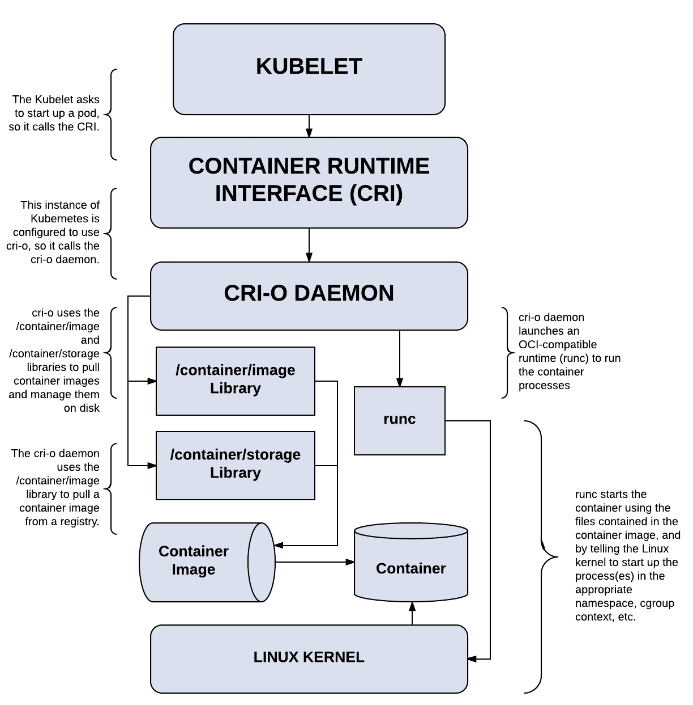
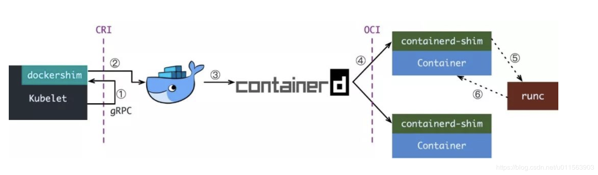
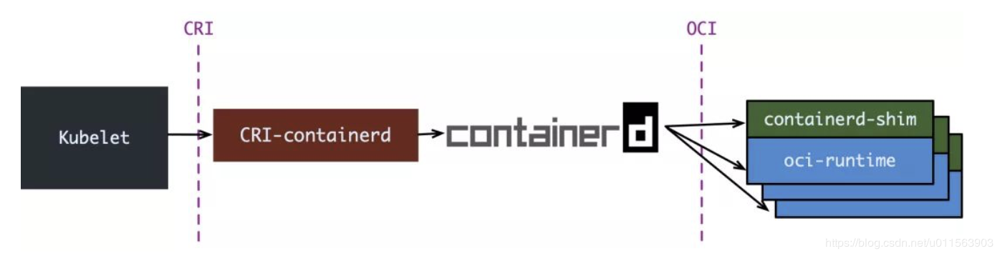
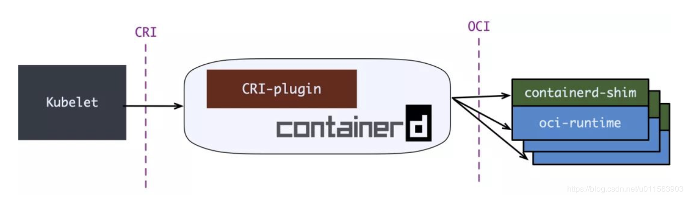
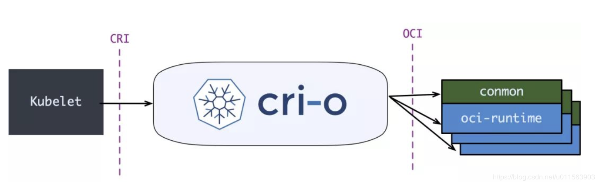
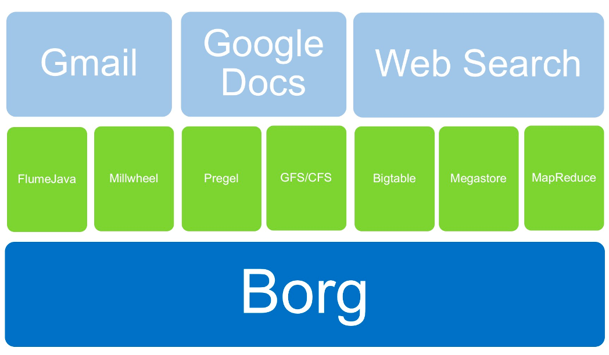

# Kubernetes Concepts

## 1. 什么是 K8S？

### 什么是 Kubernetes？

容器编排工具。

为什么叫 K8S？

Kubernetes，开头的 k 和结尾的 s 中间有 8 个字母，所以缩写为 k8s，类似的比如 i18n。


### K8S 和 Docker 有什么关系？

参考：[Container runtimes](https://kubernetes.io/docs/setup/production-environment/container-runtimes/)

### OCI & CRI

整个调用链关系为：Orchestration API -> Container API (cri-runtime) -> Kernel API(oci-runtime)。

> 简单理解为 k8s 调用 docker，docker 调用 linux api。

k8s 为了摆脱对 docker 的强依赖关系，再各个基金会共同合作下，制定了 OCI 和 CRI 两个标准。

- **OCI**：runC / Kata（ 及其前身 runV 和 Clear Containers ），gVisor，Rust railcar
  - 容器镜像的制作标准，即 **ImageSpec**。大致规定：容器镜像这个压缩了的文件夹里以 xxx 结构放 xxx 文件
  - 容器要需要能接收哪些指令，以及这些指令的行为，即 **RuntimeSpec**。这里面的大致内容就是“容器”要能够执行 “create”，“start”，“stop”，“delete” 这些命令，并且行为要规范。
  - Docker 则把 libcontainer 封装了一下，变成 runC 捐献出来作为 OCI 的参考实现。
- **CRI**：Docker（ 借助 dockershim ），containerd（ 借助 CRI-containerd ），CRI-O，Frakti。是一组 gRPC 接口，[cri-api/pkg/apis/services.go](https://github.com/kubernetes/cri-api/blob/master/pkg/apis/services.go)：
  - 一套针对容器操作的接口，包括创建，启停容器等等
  - 一套针对镜像操作的接口，包括拉取镜像删除镜像等
  - 一套针对 PodSandbox（容器沙箱环境）的操作接口

### k8s 各个 CRI 调用流程

#### 整体流程

在实现 CRI 接口后，k8s 就可以对接任何实现 CRI 接口的运行时了。



#### docker



#### containerd

containerd-1.0，对 CRI 的适配通过一个单独的进程 CRI-containerd 来完成



containerd-1.1，把适配逻辑作为插件放进了 containerd 主进程中



#### CRI-O

CRI-O，更为专注的 cri-runtime，非常纯粹，兼容 CRI 和 OCI，做一个 Kubernetes 专用的运行时。



[CRI-O](https://cri-o.io/) 的架构：


#### 小结

根据调用流程可以看到，containerd 和 cri-o 的流程是比较简洁的，相反 docker 则多了一层，因此 k8s 也是准备逐渐摆脱对 docker 的依赖，在 k8s 1.22 中不推荐使用 docker ，1.24 版本中直接舍弃 docker 了。

而 containerd 和 cri-o 二者中，主流的还是 containerd，cri-o 使用者比较少。


### K8S 和 Borg 有何关系？

Start from Borg, however completely different!




## 2. K8S 是为了解决什么问题？

- K8S 有什么优势？适用于哪些场景？自动化编排：自愈，快速缩放，一键部署和升降级，备份恢复
- 如何查文档？[K8S](https://kubernetes.io/)，[OpenShift Origin](https://www.okd.io/)
- 其它资料：slack、cncf、quay.io


## 3. K8S 不解决什么问题？

- 用户管理
- 限流熔断：istio
- 监控审计：prometheus / grafana / alertmanager / elasticsearch / fluent / kibana
- 用户界面
- 中间件
- 底层云平台支持


## 4. K8S 的模块架构是怎样的？

- [K8S 有哪些组件](https://kubernetes.io/zh/docs/concepts/architecture/#)？api-server、kube-scheduler、kube-controller、etcd、coredns、kubelete、kubeproxy

- 整体结构图

  


## 5. K8S 有哪些竞争产品？

- [OpenShift](https://www.openshift.com/learn/what-is-openshift-x)

  - 和 K8S 相比，OpenShift（ 红帽最有价值的产品 ）有哪些优势？

    

- VMware

- KubeSphere

- Rancher


## 6. 怎么部署出一个 K8S 群集？

- kubeadm
- Ansible


## 7. 实验：K8S 的部署

Ubuntu 18.04 / 20.04 (CentOS 7 见后面)

1. [安装 kubeadm](https://kubernetes.io/docs/setup/production-environment/tools/kubeadm/install-kubeadm/)

   ```bash
   # iptables 看到 bridged 流量
   cat <<EOF | sudo tee /etc/sysctl.d/k8s.conf
   net.bridge.bridge-nf-call-ip6tables = 1
   net.bridge.bridge-nf-call-iptables = 1
   EOF
   sudo sysctl --system
   
   # Install kubeadm
   apt-get update && apt-get install -y apt-transport-https curl
   curl -s https://packages.cloud.google.com/apt/doc/apt-key.gpg | sudo apt-key add -
   cat <<EOF | sudo tee /etc/apt/sources.list.d/kubernetes.list
   deb https://apt.kubernetes.io/ kubernetes-xenial main
   EOF
   apt-get update -y && apt-get install -y kubelet kubeadm kubectl
   
   # 重启 kubelet
   systemctl daemon-reload
   systemctl restart kubelet
   
   # 检查 kubelet 状态，在加入 k8s 集群之前，kubelet 状态会一直处于 activating 状态
   systemctl status kubelet
   ```

1. [用 kubeadm 创建一个 k8s 群集](https://kubernetes.io/docs/setup/production-environment/tools/kubeadm/create-cluster-kubeadm/)

   ```bash
   # 拉起 k8s 群集
   kubeadm init --pod-network-cidr 192.168.1.90/16
   
   # 配置 kubectl 客户端
   mkdir -p $HOME/.kube
   sudo cp -i /etc/kubernetes/admin.conf $HOME/.kube/config
   sudo chown $(id -u):$(id -g) $HOME/.kube/config
   ```

1. 此时可以观察到 node 并未 ready，导致 coredns 无法调度。接下来需要：[安装网络插件](https://kubernetes.io/docs/setup/production-environment/tools/kubeadm/create-cluster-kubeadm/#pod-network)，[插件列表](https://kubernetes.io/docs/concepts/cluster-administration/addons/)，这里我们用 [Calico](https://docs.projectcalico.org/getting-started/kubernetes/quickstart)。

   ```bash
   # 添加网络插件
   # Install the Tigera Calico operator and custom resource definitions
   kubectl create -f https://docs.projectcalico.org/manifests/tigera-operator.yaml
   # Install Calico by creating the necessary custom resource
   kubectl create -f https://docs.projectcalico.org/manifests/custom-resources.yaml
   
   # 查看 pods 和 nodes 状态
   kubectl get pods --all-namespaces
   kubectl get nodes
   ```

1. 如果希望在国内环境中安装 K8S（不使用代理访问 gcr），步骤如下（环境是 CentOS 7）：

   ```bash
   # 3. 关闭防火墙（默认就是关闭的，不用做）
   # systemctl stop firewalld.service
   # systemctl disable firewalld.service
   
   # 4. 关闭 selinux（默认就是关闭的，不用做）
   # vi /etc/selinux/config
   # 将 SELINUX=enforcing 改为 SELINUX=disabled
   
   # 5. 关闭 swap（默认就是关闭的，不用做）
   # swapoff /dev/sda2
   # vi /etc/fstab
   # 在 swap 分区这行前加 # 禁用掉，保存退出
   # reboot
   
   # 6. 配置系统相关属性
   cat <<EOF > /etc/sysctl.d/k8s.conf
   net.bridge.bridge-nf-call-ip6tables = 1
   net.bridge.bridge-nf-call-iptables = 1
   net.ipv4.ip_forward = 1
   EOF
   
   sysctl -p
   sysctl --system
   
   # 7. 配置yum源
   cat <<EOF > /etc/yum.repos.d/kubernetes.repo
   [kubernetes]
   name=Kubernetes
   baseurl=http://mirrors.aliyun.com/kubernetes/yum/repos/kubernetes-el7-x86_64
   enabled=1
   gpgcheck=0
   repo_gpgcheck=0
   gpgkey=http://mirrors.aliyun.com/kubernetes/yum/doc/yum-key.gpg
           http://mirrors.aliyun.com/kubernetes/yum/doc/rpm-package-key.gpg
   EOF
   
   # 8. 安装 docker
   yum install docker -y
   systemctl enable docker --now
   
   # 9. 修改 docker 镜像代理仓库
   # vi /etc/docker/daemon.json
   # {
   #  "registry-mirrors": ["http://hub-mirror.c.163.com"]
   # }
   
   # systemctl daemon-reload
   # systemctl restart docker
   
   # 10. 下载 kubernetes
   export k8s_version="1.20.1"
   
   yum install -y kubelet-${k8s_version}-0 kubeadm-${k8s_version}-0 kubectl-${k8s_version}-0  --disableexcludes=kubernetes
   
   # 11. 启动 kubelet
   systemctl restart kubelet
   systemctl enable kubelet
   
   # 12. 用 kubeadm 初始化创建 K8S 集群
   kubeadm init --image-repository registry.aliyuncs.com/google_containers --kubernetes-version=v${k8s_version} --pod-network-cidr=10.244.0.0/16
   
   # 13. 配置 .kube/config 用于使用 kubectl
   mkdir -p $HOME/.kube
   cp -i /etc/kubernetes/admin.conf $HOME/.kube/config
   chown $(id -u):$(id -g) $HOME/.kube/config
   
   # 15. 安装 calico
   kubectl apply -f https://gitee.com/dev-99cloud/lab-openstack/raw/master/src/ansible-cloudlab-centos/playbooks/roles/init04-prek8s/files/calico-${k8s_version}.yaml
   
   # 看到 node Ready 就 OK
   kubectl get nodes
   ```

1. 集群安装/加入 GPU 节点

   ```bash
   # 1. 节点安装显卡驱动
   # 可以参考 https://docs.nvidia.com/cuda/cuda-installation-guide-linux/index.html#abstract
   
   # 2. 安装 docker
   # 见上文
   
   # 3. 安装 nvidia-docker
   distribution=$(. /etc/os-release;echo $ID$VERSION_ID) \ && curl -s -L https://nvidia.github.io/nvidia-docker/$distribution/nvidia-docker.repo | sudo tee /etc/yum.repos.d/nvidia-docker.repo
   
   yum install -y nvidia-docker2
   # ubuntu 等其他系统安装参考文档 https://docs.nvidia.com/datacenter/cloud-native/container-toolkit/install-guide.html#installing-on-centos-7-8
   
   # 4. 更改默认容器运行时
   # 编辑 `/etc/docker/daemon.json`， 添加如下字段:
   {
       "default-runtime": "nvidia",
       "runtimes": {
           "nvidia": {
               "path": "nvidia-container-runtime",
               "runtimeArgs": []
           }
       }
   }
   systemctl daemon-reload && systemctl restart docker
   
   # 5. 安装 k8s 集群或将集群加入节点即可
   
   # 6. 安装 vgpu 插件
   # * Nvidia 官方的插件只能在 k8s 上整卡调度，调度力度太大，在我们的场景中没有太大实际意义
   # * 阿里云 gpushare 是阿里云公有云使用的 cgpu 的部分开源项目，能对 gpu 进行显存划分，多容器调度，但是没有实现显存隔离
   # * 第四范式 vgpu 是第四范式开源的 vgpu 上层实现，底层核心逻辑是 libvgpu.so提供的，没有开源，可以实现对物理 gpu 的切分，实现了显存隔离。
   # 安装第四范式 vgpu 参考 `https://github.com/4paradigm/k8s-device-plugin/blob/master/README_cn.md#Kubernetes%E5%BC%80%E5%90%AFvGPU%E6%94%AF%E6%8C%81`
   ```


## 8. 什么是 Pod？

- Pod 和容器的关系是什么？

  ```bash
  # pod 里的 pause 容器和业务容器共享 ipc / net / user namespaces
  [root@cloud025 ~]# ll /proc/10982/ns/
  total 0
  lrwxrwxrwx 1 root root 0 Aug 10 16:14 ipc -> ipc:[4026532513]
  lrwxrwxrwx 1 root root 0 Aug 10 15:33 mnt -> mnt:[4026532592]
  lrwxrwxrwx 1 root root 0 Aug 10 15:33 net -> net:[4026532516]
  lrwxrwxrwx 1 root root 0 Aug 10 15:33 pid -> pid:[4026532594]
  lrwxrwxrwx 1 root root 0 Aug 10 16:14 user -> user:[4026531837]
  lrwxrwxrwx 1 root root 0 Aug 10 16:14 uts -> uts:[4026532593]
  
  [root@cloud025 ~]# ll /proc/10893/ns/
  total 0
  lrwxrwxrwx 1 root root 0 Aug 10 15:33 ipc -> ipc:[4026532513]
  lrwxrwxrwx 1 root root 0 Aug 10 15:33 mnt -> mnt:[4026532511]
  lrwxrwxrwx 1 root root 0 Aug 10 15:33 net -> net:[4026532516]
  lrwxrwxrwx 1 root root 0 Aug 10 16:15 pid -> pid:[4026532514]
  lrwxrwxrwx 1 root root 0 Aug 10 16:15 user -> user:[4026531837]
  lrwxrwxrwx 1 root root 0 Aug 10 16:15 uts -> uts:[4026532512]
  ```

- 为什么调度的基本单位是 pod 不是容器？


## 9. 启动一个 pod

- [Pod YAML](https://kubernetes.io/docs/concepts/scheduling-eviction/assign-pod-node/)

  ```yaml
  apiVersion: v1
  kind: Pod
  metadata:
    name: nginx
    labels:
      env: test
  spec:
    containers:
    - name: nginx
      image: nginx
  ```

- 启动一个 Pod

  ```
   起 nginx pod
  kubectl apply -f nginx.yaml
  
  # 可以看到 pod 无法被调度，进行诊断
  kubectl describe pod nginx
  
  # 去污点、允许 pod 调度到 master
  kubectl taint nodes $(hostname) node-role.kubernetes.io/master:NoSchedule-
  
  # 查看 pods
  kubectl get pods
  
  # 查看容器
  docker ps | grep nginx
  ```

- 在容器平台上发布 Python 应用

  - 我们将要做什么？

    - 下载应用代码，并且在本地跑起来
    - 为应用构建一个 Docker 镜像，然后启动一个 Docker 容器来运行此应用
    - 创建一个 Deployment 对象，将应用运行在 K8S 平台上
    - 参考：<https://kubernetes.io/blog/2019/07/23/get-started-with-kubernetes-using-python/>
    - 对应的原始代码在：<https://github.com/JasonHaley/hello-python>

  - 预置条件有哪些？

    - 本地具备 Python 3.6+ 的运行环境
    - 安装了 Git（非必须）
    - 安装了 Docker
    - 一个 Kubernetes 平台

  - [代码](../src/hello-python)

    - 其中 `requirements.txt` 里只有一行：flask，是依赖包列表文件

    - 另一个文件是 `main.py`，是应用的逻辑代码

      ```python
      from flask import Flask
      import os
      import socket
      
      app = Flask(__name__)
      
      @app.route("/")
      def hello():
          html = "<h3>Hello {name}!</h3>" \
                 "<b>Hostname:</b> {hostname}<br/>"
          return html.format(name=os.getenv("NAME", "world"), hostname=socket.gethostname())
      
      if __name__ == "__main__":
          app.run(host='0.0.0.0')
      ```

  - 下载代码

    ```bash
    mkdir ~/test-hello-world
    cd ~/test-hello-world/
    
    wget https://gitee.com/dev-99cloud/training-kubernetes/raw/master/src/hello-python/main.py
    wget https://gitee.com/dev-99cloud/training-kubernetes/raw/master/src/hello-python/requirements.txt
    wget https://gitee.com/dev-99cloud/training-kubernetes/raw/master/src/hello-python/Dockerfile
    wget https://gitee.com/dev-99cloud/training-kubernetes/raw/master/src/hello-python/deployment.yaml
    ```

  - 本地运行：

    - 安装依赖：`pip3 install -r requirements.txt`
    - 本地运行：`python3 main.py`，会在本地启动一个用于开发的 web 服务器。
    - 你可以打开浏览器，访问 `http://<IP>:5000` 端口

  - Docker 镜像构建文件，目录下有一个 Dockerfile 文件

    ```dockerfile
    FROM python:3.7
    
    RUN mkdir /app
    WORKDIR /app
    ADD . /app/
    RUN pip install -r requirements.txt
    
    EXPOSE 5000
    CMD ["python", "/app/main.py"]
    ```

  - 构建 Docker 镜像并运行

    - 运行命令构建镜像：`docker build -f Dockerfile -t hello-python:latest .`
    - 构建完成后，可以通过 `docker image ls` 看到刚才构建的镜像
    - 然后运行此镜像：`docker run -p 5001:5000 hello-python`
    - 然后访问 `http://<IP>:5001`，同样可以看到 `Hello form Python!` 字符串

  - 确定 Kubernetes 和 kubectl 运行正常

    - 运行命令：`kubectl version`，如果该命令不报错，就说明 kubectl 安装完成。
    - 运行命令：`kubectl get nodes`，如果返回节点信息，说明 K8S 运行正常，kubectl 配置正常。

  - K8S deployment YAML 文件：

    ```yaml
    apiVersion: v1
    kind: Service
    metadata:
      name: hello-python-service
    spec:
      type: NodePort
      selector:
        app: hello-python
      ports:
      - protocol: "TCP"
        port: 6000
        targetPort: 5000
        nodePort: 31000
    
    ---
    apiVersion: apps/v1
    kind: Deployment
    metadata:
      name: hello-python
    spec:
      selector:
        matchLabels:
          app: hello-python
      replicas: 4
      template:
        metadata:
          labels:
            app: hello-python
        spec:
          containers:
          - name: hello-python
            image: hello-python:latest
            imagePullPolicy: Never
            ports:
            - containerPort: 5000
    ```

  - 将 Deployment 部署到 K8S 平台

    - 运行命令：`kubectl apply -f deployment.yaml`
    - 运行命令：`kubectl get pods，检查 pods`
    - 然后可以打开浏览器，在 `http://<IP>:31000` 看到 `Hello form Python!` 信息

  - 实验

    ```bash
    # 观察 service / deployment 和 pod 的关系，通过 label 关联
    kubectl get pods -l app=hello-python
    kubectl get deploy
    kubectl get deployment
    
    kubectl get svc
    kubectl get service
    kubectl get pods -l app=hello-python -o wide
    
    # 访问应用
    curl http://<pod-ip>:5000
    curl http://<cluster-ip>:6000
    curl http://<host-ip>:31000
    ```
