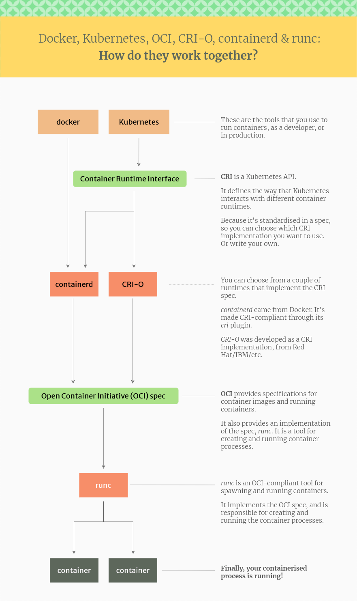

# CRI 和 OCI 的关系与区别

[K8S Runtime CRI OCI contained dockershim 理解](https://blog.csdn.net/u011563903/article/details/90743853)

**CRI：Container Runtime Interface**

高层次的容器运行时抽象接口，比如怎么从仓库拉取镜像，怎么管理镜像。

**OCI：Open Container Initiative**

OCI是由多家公司共同成立的项目，并由linux基金会进行管理，负责制定容器镜像格式，以及容器怎么运行。关心的是靠近底层的容器运行时标准。目前主要有两个标准文档：容器运行时标准 （runtime spec）和 容器镜像标准（image spec）

二者关系如下图：

