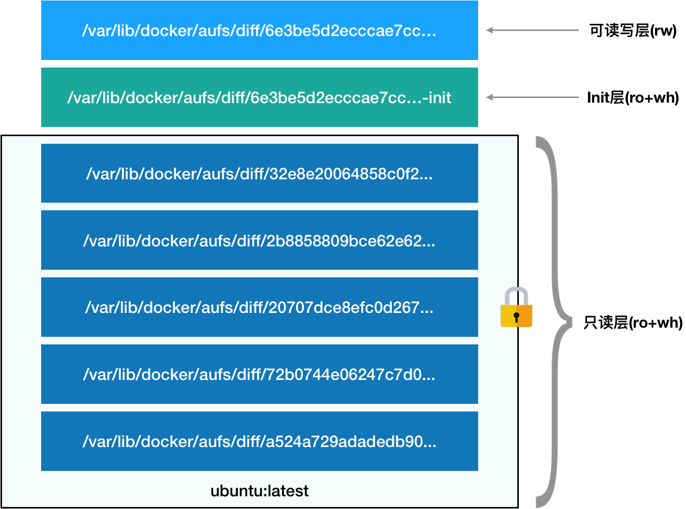

# Docker中的各种ID

## ImageID

**Image ID是在本地由 Docker 根据镜像的描述文件计算的，并用于 imagedb 的目录名称。**

该目录存放的是每一个镜像的配置信息 config，其 id 就是 image-id，里面是 json 格式，其内容比 `docker inspect` 查看镜像的信息更详细。其中`imageID`为某一个文件

> 具体为`/var/lib/docker/image/overlay2/imagedb`目录。

具体计算方式：

```shell
$ sha256sum /var/lib/docker/image/overlay2/imagedb/content/sha256/<imageID>
```

上面指令是**通过计算这个里面的某个`imageID`文件里面的内容，得出 imageID 值**。这个会根据每次拉取会更换，每次计算都不一样,这也是镜像 id 的生成过程。因为它是根据 Content hashes 来计算的。


## layerID-diffID-chainID-cacheID

### layerID 与 diffID

第一步,拉取镜像

```shell
$ docker pull ubuntu:latest

Using default tag: latest
latest: Pulling from library/ubuntu
345e3491a907: Pull complete
57671312ef6f: Pull complete
5e9250ddb7d0: Pull complete
Digest: sha256:adf73ca014822ad8237623d388cedf4d5346aa72c270c5acc01431cc93e18e2d
Status: Downloaded newer image for ubuntu:latest
docker.io/library/ubuntu:latest
```

这里的 345e3491a907，57671312ef6f，5e9250ddb7d0 为压缩的 layer 层的哈希值这些值为 layerID，即distribution hashes，他们从远程的 repository 拉取下来。


第二步，查看镜像详细信息：

然后使用`docker inspect`命令查看镜像详细信息：

```shell
$ docker inspect ubuntu:latest
```

其中有一个 rootfs 的键值对，大概向下面这样：

```shell
"RootFS": {

            "Type": "layers",

            "Layers": ["sha256:ccdbb80308cc5ef43b605ac28fac29c6a597f89f5a169bbedbb8dec29c987439",                "sha256:63c99163f47292f80f9d24c5b475751dbad6dc795596e935c5c7f1c73dc08107",                "sha256:2f140462f3bcf8cf3752461e27dfd4b3531f266fa10cda716166bd3a78a19103"

            ]

        }
```

这是镜像的底层的 rootfs，但是我们发现这些 sha256 值和第一步拉取下来的层 layerID 不一致。

*这是为什么呢？*

因为 pull 下来的是压缩的数据：

* layerID 是压缩数据的 sha256 的值(Layer ID 指 Distribution 根据 layer compressed data 计算的)，
* 而 inspect rootfs 中的值是解压后，对解压的内容进行 sha256 的值。

他们是 diffID，是在本地由 Docker 根据 layer uncompressed data 计算的。

**记住这里的 rootfs layers 的值是 diffID。**


### layerID 和 diffID 的关联

第三步：

**那么从远程拉取下来的layerID和解压后的diffID是如何一一对应的呢？**

docker 将二者映射关系存放到了`/var/lib/docker/image/overlay2/distribution/`目录下。

```shell
$ ls /var/lib/docker/image/overlay2/distribution/
diffid-by-digest  v2metadata-by-diffid
```

* 其中 diffid-by-digest 保存了 digest(layerID)->diffID 的映射关系，即 distribution hashes 和 Content hashes 的映射关系。
  * 也即是正向查询。

* v2metadata-by-diffid 保存了 diffid -> (digest,repository) 的映射关系，这可以方便查找 layer 的 digest 及其所属的 repository。
  * 也即是反向查询，可以从 diffID->layerID（其实就是 digest ）。

例如：

```shell
$ cd /var/lib/docker/image/overlay2/distribution/diffid-by-digest/sha256
# 得到 相对应的diffID
$ cat <layerID>

<diffID>

$ cd /var/lib/docker/image/overlay2/distribution/v2metadata-by-diffid/sha256
# 得到相应的layerID和库相关信息。
$ cat <diffID>

[{"Digest":"sha256:345e3491a907bb7c6f1bdddcf4a94284b8b6ddd77eb7d93f09432b17b20f2bbe","SourceRepository":"docker.io/library/ubuntu","HMAC":""}]
```


### chainID 及其计算公式

第四步,从 diffID 计算 chainID：

layer.ChainID 根据 layer.DiffID 计算，并用于 layerdb 的目录名称。

ChainID 唯一标识了一组（像糖葫芦一样的串的底层）diffID 的 hash 值，包含了这一层和它的父层(底层)：

* 当然这个糖葫芦可以有一颗山楂，也就是 `chainID(layer0)==diffID(layer0)`；
* 对于多颗山楂的糖葫芦，`ChainID(layerN) = SHA256hex(ChainID(layerN-1) + " " + DiffID(layerN))`


具体数据在`/var/lib/docker/image/overlay2/layerdb/sha256`目录。这个 sha256 目录中保存了所有的chainID。

在第二步对镜像的 inspect 中,有一个 sha2556 的数组：

```shell
["sha256:ccdbb80308cc5ef43b605ac28fac29c6a597f89f5a169bbedbb8dec29c987439",                "sha256:63c99163f47292f80f9d24c5b475751dbad6dc795596e935c5c7f1c73dc08107",                "sha256:2f140462f3bcf8cf3752461e27dfd4b3531f266fa10cda716166bd3a78a19103"]
```

这 3 个都是 diffID，第一个是最底层的（即layer0），所以 chainID(layer0)==diffID(layer0)，即 chainID  就是 diffID。


这个`sha256`文件夹中还包含了 diff、cache-id,size 等文件,各文件含义如下：

* cache-id：为具体`/var/lib/docker/overlay2/<cache-id>`存储路径
* diff：diffID，用于计算 ChainID
* size：当前 layer 的大小


*另外两个chainID如何计算呢？*

除了底层的 layer 层，还有一些高层的 layer，他们的 chainID 文件夹中包含了 parent 文件，这个是值为ChainID(layerN-1)，diff 文件存储了 DiffID(layerN)，而文件夹也就是 ChainID(layerN) = SHA256hex(ChainID(layerN-1) + " " + DiffID(layerN))

具体计算如下：

```shell
$ echo -n "sha256:ccdbb80308cc5ef43b605ac28fac29c6a597f89f5a169bbedbb8dec29c987439 sha256:63c99163f47292f80f9d24c5b475751dbad6dc795596e935c5c7f1c73dc08107" | sha256sum | awk '{print $1}'
```

> 一定注意要加上 `sha256:`和中间的空格“ ”这两个字符，否则计算就错误了。

得出中间层 chainID 它也包括自己 diff、parent、cache-id 等：8d8dceacec7085abcab1f93ac1128765bc6cf0caac334c821e01546bd96eb741.

再根据中间层 chainID 计算最后的 chainID：

```shell
$echo -n "sha256:8d8dceacec7085abcab1f93ac1128765bc6cf0caac334c821e01546bd96eb741 sha256:2f140462f3bcf8cf3752461e27dfd4b3531f266fa10cda716166bd3a78a19103" | sha256sum | awk '{print $1}'
```

得出最后的值为：

3dd8c8d4fd5b59d543c8f75a67cdfaab30aef5a6d99aea3fe74d8cc69d4e7bf2

### cacheID 与 磁盘文件

第五步，根据 chainID 找到 cache-id：

目录`/var/lib/docker/image/overlay2/layerdb/sha256/<chainID>`下存储了相关信息，也包括 cache-id:

```shell
$ cd /var/lib/docker/image/overlay2/layerdb/sha256/3dd8c8d4fd5b59d543c8f75a67cdfaab30aef5a6d99aea3fe74d8cc69d4e7bf2
$ cat cache-id
ddd5760e7cbfde67e325e77b540dfc13e7dccf1c7d1b156554d0a79378642bd1
```


第六步，从cache-id得到最终的磁盘文件：

具体磁盘文件再目录`/var/lib/docker/overlay2/<cache-id>`,因此这里的目录就是`/var/lib/docker/overlay2/ddd5760e7cbfde67e325e77b540dfc13e7dccf1c7d1b156554d0a79378642bd1`。

相关文件就是这个目录中。


### 小结

Overlay2 比 overlay 更加高效，因为 overlay2 优化了 inode 的利用。

layerID -> diffID -> chainID -> cacheID

layerID 和 diffID 的对应关系在 `diffid-by-digest` 和 `v2metadata-by-diffid`

chainID 主要存在于 `/var/lib/docker/image/overlay2/layerdb/sha256/<chain-id>`

cacheID 主要存在于 `/var/lib/docker/overlay2/<cache-id>`


## mount id


首先随便运行一个容器：

```shell
$ docker run -it ubuntu bash
```

然后查看该容器的详细信息：

```shell
$ docker inspect <container-id>
```

此命令会打印出很多信息，其中有一段是 GraphDriver 相关的：

```shell
  "GraphDriver": {
            "Data": {
                "LowerDir": "/var/lib/docker/overlay2/9bfd3a8d48472d88a703d1aa34ad748bb5c985eea781ce98d53a3582e3aa890e-init/diff:/var/lib/docker/overlay2/b2bc3a1e6ea9d5ec766cf8ff5744ca7a2f99c9eda0d228eec05c3b67e963b0a0/diff:/var/lib/docker/overlay2/6cc433759d47715d10d103ecc1f477244d0e75c51dc88cb78f6589a790dd1e7e/diff:/var/lib/docker/overlay2/4dce2c85404c8d247ebc5a971df070604bea03209cb154c951125a1290cff852/diff:/var/lib/docker/overlay2/5c8ababba785d8574541ea23aa07af5f05a762363a73f5f9f94b7d6ff6a37455/diff:/var/lib/docker/overlay2/9bcebbec5285737a758112ec4eca90a7450e5384461b3430ebad42ce04b377b1/diff:/var/lib/docker/overlay2/dace177500d7d03dfdee47ca85b8c0c33e7c97f23d1b3d4de4bad725a6922099/diff",
                "MergedDir": "/var/lib/docker/overlay2/9bfd3a8d48472d88a703d1aa34ad748bb5c985eea781ce98d53a3582e3aa890e/merged",
                "UpperDir": "/var/lib/docker/overlay2/9bfd3a8d48472d88a703d1aa34ad748bb5c985eea781ce98d53a3582e3aa890e/diff",
                "WorkDir": "/var/lib/docker/overlay2/9bfd3a8d48472d88a703d1aa34ad748bb5c985eea781ce98d53a3582e3aa890e/work"
            },
            "Name": "overlay2"
        },
```

根据输出可以看到，这里使用的是 overlay2 文件系统。

四个文件夹，LowerDir、MergedDir、UpperDir、WorkDir都是 overlayfs 所需要的。

* WorkDir：overlayfs 的工作目录
* LowerDir：overlayfs 的 lower 层目录，只可读
* UpperDir：overlayfs 的 upper 层目录，可读写，docker 中的所有修改都会出现在这一层。
* MergedDir：overlayfs 的 merged 目录，是 lower 层和 upper 层的叠加视图。


这些inspect信息保存在了`/var/lib/docker/image/overlay2/layerdb/mounts`下：

```shell
$ ls /var/lib/docker/image/overlay2/layerdb/mounts/<container-id>
# 其中包含了以下3个文件
init-id  mount-id  parent
```

init-id 存储了 init 层的编号，

mount-id 则包含了 mount 编号。

parent 包含了最高层的 chainID，也就是说通过最高层的 chainID，再找其真正的 cache-id

```shell
$ cat init-id 
9bfd3a8d48472d88a703d1aa34ad748bb5c985eea781ce98d53a3582e3aa890e-init
$ cat mount-id 
9bfd3a8d48472d88a703d1aa34ad748bb5c985eea781ce98d53a3582e3aa890e
$ cat parent 
sha256:7d6df3e396909e947be01c1b7d6924183b7837225b8618c82cb621c2144d4591
```

可以看到，init-id 只比 mount-id 多了一个 `-init` 后缀。

进入具体的 mount （`/var/lib/docker/overlay2/<mount-id>`）目录查看

```shell
$ cd  /var/lib/docker/overlay2/9bfd3a8d48472d88a703d1aa34ad748bb5c985eea781ce98d53a3582e3aa890e
$ ls
diff  link  lower  merged  work
# 这里运行的是一个 etcd 容器，所以包含了相关数据
$ ls diff
etcd1.etcd  etcd-data
```

 这里就是容器中的文件存放位置，当前了这是 overlayfs 中的位置。

进入具体的 init 目录看下：

```shell
$  cd  /var/lib/docker/overlay2/9bfd3a8d48472d88a703d1aa34ad748bb5c985eea781ce98d53a3582e3aa890e-init
$ ls
committed  diff  link  lower  work
$ ls diff
dev  etc
$ ls diff/etc/
hostname  hosts  mtab  resolv.conf
```

可以看到，init 层主要包含一些配置信息，比如  hosts 文件等。

> init 是一个以“-init”结尾的层，夹在只读层和读写层之间。Init 层是 Docker 项目单独生成的一个内部层，专门用来存放 /etc/hosts、/etc/resolv.conf 等信息。


## docker 中的 layer


Docker 镜像由很多 layer 组成 ，其中 dockerfile 中每一行指令为一层，均为只读型，并按照顺序分别堆叠起来。

当以容器运行起来的时候，再创建一个新的可读写 layer,称为 container layer。

**镜像和容器最大的不同是顶层可读写的 layer**，所有的增删查改都在这个可读写的顶层 layer上，当删除这个容器，也能保证镜像没有变化。

> 也就是当多个同类型的容器，他们拥有共同的镜像，只是最顶层的可读写 layer 不同。


Docker 容器的 rootfs 可以分为 3 层：

* 只读层（image layer）
* 可读写层（container layer）
* Init 层（特殊层）

下图为一个 ubuntu 容器的 rootfs 分层结构：




**第一部分，只读层。**

它是这个容器的 rootfs 最下面的五层，对应的正是 ubuntu:latest 镜像的五层。可以看到，它们的挂载方式都是只读的（ro+wh，即 readonly+whiteout），因为只读层可以算作是镜像的组成部分，可能被多个镜像共享，因此必须是只读的。


**第二部分，可读写层。**

它是这个容器的 rootfs 最上面的一层（6e3be5d2ecccae7cc），它的挂载方式为：rw，即 read write。在没有写入文件之前，这个目录是空的。而一旦在容器里做了写操作，你修改产生的内容就会以增量的方式出现在这个层中。

由于每个容器都有自己的动态数据需要保存，因此在最上层增加了一个可读写层（container layer）来存储这些数据。

可是，你有没有想到这样一个问题：*如果我现在要做的，是删除只读层里的一个文件呢？*

比如，你要删除只读层里一个名叫 foo 的文件，那么这个删除操作实际上是在可读写层创建了一个名叫.wh.foo 的文件。这样，当这两个层被联合挂载之后，foo 文件就会被.wh.foo 文件“遮挡”起来，“消失”了。这个功能，就是“ro+wh”的挂载方式，即只读 +whiteout 的含义。我喜欢把 whiteout 形象地翻译为：“白障”。

所以，最上面这个可读写层的作用，就是专门用来存放你修改 rootfs 后产生的增量，无论是增、删、改，都发生在这里。而当我们使用完了这个被修改过的容器之后，还可以使用 docker commit 和 push 指令，保存这个被修改过的可读写层，并上传到 Docker Hub 上，供其他人使用；而与此同时，原先的只读层里的内容则不会有任何变化。这，就是增量 rootfs 的好处。


**第三部分，Init 层。**

同时由于一些特殊原因，Docker 中新增了 Init 层。

它是一个以“-init”结尾的层，夹在只读层和读写层之间。Init 层是 Docker 项目单独生成的一个内部层，专门用来存放 /etc/hosts、/etc/resolv.conf 等信息。

需要这样一层的原因是，这些文件本来属于只读的 Ubuntu 镜像的一部分，但是用户往往需要在启动容器时写入一些指定的值比如 hostname，所以就需要在可读写层对它们进行修改。可是，这些修改往往只对当前的容器有效，我们并不希望执行 docker commit 时，把这些信息连同可读写层一起提交掉。所以，Docker 做法是，在修改了这些文件之后，以一个单独的层挂载了出来。而用户执行 docker commit 只会提交可读写层，所以是不包含这些内容的。
