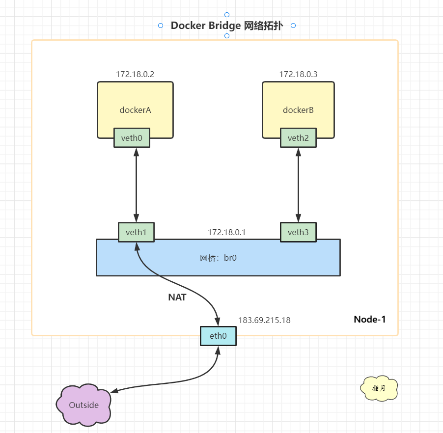

# Docker 网络原理

## 1. 概述

Docker有多种网络模型。对于单机上运行的多个容器，可以使用缺省的 [bridge 网络驱动](https://docs.docker.com/network/bridge/)。

我们按照下图创建网络拓扑，让容器之间网络互通，从容器内部可以访问外部资源，同时，容器内可以暴露服务让外部访问。

桥接网络的一个拓扑结构如下：



上述网络拓扑实现了：让容器之间网络互通，从容器内部可以访问外部资源，同时，容器内可以暴露服务让外部访问。

根据网络拓扑图可以看到，容器内的数据通过 veth pair 设备传递到宿主机上的网桥上，最终通过宿主机的 eth0 网卡发送出去（或者再通过 veth pair 进入到另外的容器），而接收数据的流程则恰好相反。


## 2. 预备知识

### veth pair

> 对 Veth pairs 不了解的可以参考一下这篇文章： [veth-pair 笔记](https://github.com/lixd/daily-notes/blob/master/ComputerScience/Linux/veth%E8%AE%BE%E5%A4%87%E5%AF%B9.md)

`Veth`是成对出现的两张虚拟网卡，从一端发送的数据包，总会在另一端接收到。利用`Veth`的特性，我们可以将一端的虚拟网卡"放入"容器内，另一端接入虚拟交换机。这样，接入同一个虚拟交换机的容器之间就实现了网络互通。


### bridge

> 对 Linux Bridge 不了解的可以参考一下这篇文章：[Linux bridge 设备笔记](https://github.com/lixd/daily-notes/blob/master/ComputerScience/Linux/bridge%E8%AE%BE%E5%A4%87.md)

我们可以认为`Linux bridge`就是虚拟交换机，连接在同一个`bridge`上的容器组成局域网，不同的`bridge`之间网络是隔离的。 `docker network create [NETWORK NAME]`实际上就是创建出虚拟交换机。

交换机是工作在数据链路层的网络设备，它转发的是二层网络包。最简单的转发策略是将到达交换机输入端口的报文，广播到所有的输出端口。当然更好的策略是在转发过程中进行学习，记录交换机端口和MAC地址的映射关系，这样在下次转发时就能够根据报文中的MAC地址，发送到对应的输出端口。


### NAT

> 对 iptables 不了解的可以参考这篇文章：[iptables 笔记](https://github.com/lixd/daily-notes/blob/master/ComputerScience/Linux/iptables.md)

NAT（Network Address Translation），是指网络地址转换。

> 一般是在 IPtables 中进行处理。 

因为容器中的IP和宿主机的IP是不一样的，为了保证发出去的数据包能正常回来，需要对IP层的源IP/目的IP进行转换。

* SNAT：源地址转换
* DNAT：目的地址转换


SNAT

比如上图中的 eth0 ip 是 `183.69.215.18`，而容器 dockerA 的 IP 却是 `172.187.0.2`。

因此容器中发出来的数据包，`源IP`肯定是  `172.187.0.2`，如果就这样不处理直接发出去，那么接收方处理后发回来的响应数据包的 `目的IP` 自然就会填成  `172.187.0.2`，那么我们肯定接收不到这个响应了。

DNAT

如果发出去做了 SNAT，源IP改成了宿主机的 `183.69.215.18`，那么回来的响应数据包目的IP自然就是`183.69.215.18`，我们可以成功收到这个响应，但是如果直接把源IP是`183.69.215.18`的数据包发到容器里面去，由于容器IP是`172.187.0.2`,那肯定不会处理这个包，所以宿主机收到响应包只会需要进行DNAT，将目的IP地址改成容器中的`172.187.0.2`。


## 3. 演示

实验环境 Ubuntu 20.04

### 环境准备

首先需要创建对应的容器，veth pair 设备以及 bridge 设备 并分配对应 IP。

#### 创建“容器”

从前面的背景知识了解到，容器的本质是 `Namespace + Cgroups + rootfs`。因此本实验我们可以仅仅创建出`Namespace`网络隔离环境来模拟容器行为：

```shell
$ sudo ip netns add ns1
$ sudo ip netns add ns2
$ sudo ip netns show
ns2
ns1
```


#### 创建Veth pairs

```shell
$ sudo ip link add veth0 type veth peer name veth1
$ sudo ip link add veth2 type veth peer name veth3
```

查看以下

```shell
$ ip addr
....
7: veth1@veth0: <BROADCAST,MULTICAST,M-DOWN> mtu 1500 qdisc noop state DOWN group default qlen 1000
    link/ether 96:c5:68:6d:fd:42 brd ff:ff:ff:ff:ff:ff
8: veth0@veth1: <BROADCAST,MULTICAST,M-DOWN> mtu 1500 qdisc noop state DOWN group default qlen 1000
    link/ether 2e:93:7e:33:b0:ed brd ff:ff:ff:ff:ff:ff
9: veth3@veth2: <BROADCAST,MULTICAST,M-DOWN> mtu 1500 qdisc noop state DOWN group default qlen 1000
    link/ether 36:15:80:fa:3c:8b brd ff:ff:ff:ff:ff:ff
10: veth2@veth3: <BROADCAST,MULTICAST,M-DOWN> mtu 1500 qdisc noop state DOWN group default qlen 1000
    link/ether e2:31:15:64:bd:39 brd ff:ff:ff:ff:ff:ff
```

- **将Veth的一端放入“容器”**

将 veth 的一端移动到对应的 `Namespace` 就相当于把这张网卡加入到’容器‘里了。

```shell
$ sudo ip link set veth0 netns ns1
$ sudo ip link set veth2 netns ns2
```

查看宿主机上的网卡

```shell
$ ip addr
7: veth1@if8: <BROADCAST,MULTICAST> mtu 1500 qdisc noop state DOWN group default qlen 1000
    link/ether 96:c5:68:6d:fd:42 brd ff:ff:ff:ff:ff:ff link-netns ns1
9: veth3@if10: <BROADCAST,MULTICAST> mtu 1500 qdisc noop state DOWN group default qlen 1000
    link/ether 36:15:80:fa:3c:8b brd ff:ff:ff:ff:ff:ff link-netns ns2
```

发现少了两个，然后查看以下对应`Namespace`里的网卡

```shell
$ sudo ip netns exec ns1 ip addr
1: lo: <LOOPBACK> mtu 65536 qdisc noop state DOWN group default qlen 1000
    link/loopback 00:00:00:00:00:00 brd 00:00:00:00:00:00
2: tunl0@NONE: <NOARP> mtu 1480 qdisc noop state DOWN group default qlen 1000
    link/ipip 0.0.0.0 brd 0.0.0.0
3: sit0@NONE: <NOARP> mtu 1480 qdisc noop state DOWN group default qlen 1000
    link/sit 0.0.0.0 brd 0.0.0.0
8: veth0@if7: <BROADCAST,MULTICAST> mtu 1500 qdisc noop state DOWN group default qlen 1000
    link/ether 2e:93:7e:33:b0:ed brd ff:ff:ff:ff:ff:ff link-netnsid 0
$ sudo ip netns exec ns2 ip addr
1: lo: <LOOPBACK> mtu 65536 qdisc noop state DOWN group default qlen 1000
    link/loopback 00:00:00:00:00:00 brd 00:00:00:00:00:00
2: tunl0@NONE: <NOARP> mtu 1480 qdisc noop state DOWN group default qlen 1000
    link/ipip 0.0.0.0 brd 0.0.0.0
3: sit0@NONE: <NOARP> mtu 1480 qdisc noop state DOWN group default qlen 1000
    link/sit 0.0.0.0 brd 0.0.0.0
10: veth2@if9: <BROADCAST,MULTICAST> mtu 1500 qdisc noop state DOWN group default qlen 1000
    link/ether e2:31:15:64:bd:39 brd ff:ff:ff:ff:ff:ff link-netnsid 0
```

可以看到，`veth0`和`veth2`确实已经放到“容器”里去了。


#### 创建bridge

一般使用`brctl`进行管理，不是自带的工具，需要先安装一下：

```shell
$ sudo apt-get install bridge-utils
```

创建bridge `br0`：

```shell
$ sudo brctl addbr br0
```

- **将Veth的另一端接入bridge**

```shell
$ sudo brctl addif br0 veth1
$ sudo brctl addif br0 veth3
```

查看接入效果：

```shell
$ sudo brctl show
bridge name     bridge id               STP enabled     interfaces
br0             8000.361580fa3c8b       no              veth1
                                                        veth3
```

可以看到，两个网卡`veth1`和`veth3`已经“插”在`bridge`上。


#### 分配IP并启动

- **为bridge分配IP地址，激活上线**

```shell
$ sudo ip addr add 172.18.0.1/24 dev br0
$ sudo ip link set br0 up
```

- **为"容器“内的网卡分配IP地址，并激活上线**

docker0容器：

```shell
$ sudo ip netns exec ns1 ip addr add 172.18.0.2/24 dev veth0
$ sudo ip netns exec ns1 ip link set veth0 up
```

docker1容器：

```shell
$ sudo ip netns exec ns2 ip addr add 172.18.0.3/24 dev veth2
$ sudo ip netns exec ns2 ip link set veth2 up
```

- **Veth另一端的网卡激活上线**

```shell
$ sudo ip link set veth1 up
$ sudo ip link set veth3 up
```


### 测试

#### 容器互通

测试从容器`docker0` ping  容器`docker1`，测试之前先用 tcpdump 抓包，等会好分析：

```shell
$ sudo tcpdump -i br0 -n
```

在新窗口执行 ping 命令：

```shell
$ sudo ip netns exec ns1 ping -c 3 172.18.0.3
```


`br0`上的抓包数据如下：

```shell
tcpdump: verbose output suppressed, use -v or -vv for full protocol decode
listening on br0, link-type EN10MB (Ethernet), capture size 262144 bytes
12:35:18.285705 ARP, Request who-has 172.18.0.3 tell 172.18.0.2, length 28
12:35:18.285903 ARP, Reply 172.18.0.3 is-at e2:31:15:64:bd:39, length 28
12:35:18.285908 IP 172.18.0.2 > 172.18.0.3: ICMP echo request, id 13829, seq 1, length 64
12:35:18.286034 IP 172.18.0.3 > 172.18.0.2: ICMP echo reply, id 13829, seq 1, length 64
12:35:19.309392 IP 172.18.0.2 > 172.18.0.3: ICMP echo request, id 13829, seq 2, length 64
12:35:19.309589 IP 172.18.0.3 > 172.18.0.2: ICMP echo reply, id 13829, seq 2, length 64
12:35:20.349350 IP 172.18.0.2 > 172.18.0.3: ICMP echo request, id 13829, seq 3, length 64
12:35:20.349393 IP 172.18.0.3 > 172.18.0.2: ICMP echo reply, id 13829, seq 3, length 64
12:35:23.309404 ARP, Request who-has 172.18.0.2 tell 172.18.0.3, length 28
12:35:23.309517 ARP, Reply 172.18.0.2 is-at 2e:93:7e:33:b0:ed, length 28
```

可以看到，先是`172.18.0.2`发起的`ARP`请求，询问`172.18.0.3`的`MAC`地址，然后是`ICMP`的请求和响应，最后是`172.18.0.3`的ARP请求。因为接在同一个bridge `br0`上，所以是二层互通的局域网。

同样，从容器`docker1` `ping` 容器`docker0`也是通的：

```shell
sudo ip netns exec docker1 ping -c 3 172.18.0.2
```


#### 宿主机访问容器

在“容器”`docker0`内启动服务，监听80端口：

```shell
$ sudo ip netns exec ns1 nc -lp 80
```

在宿主机上执行telnet，可以连接到`docker0`的80端口：

```shell
$ telnet 172.18.0.2 80
Trying 172.18.0.2...
Connected to 172.18.0.2.
Escape character is '^]'.
```

可以联通。


#### 容器访问外网

这部分稍微复杂一些，需要配置 NAT 规则。

**1）配置容器内路由**

需要配置容器内的路由，这样才能把网络包从容器内转发出来。具体就是：**将bridge设置为“容器”的缺省网关**。让非`172.18.0.0/24`网段的数据包都路由给`bridge`，这样数据就从“容器”跑到宿主机上来了。

```shell
$ sudo ip netns exec ns1 route add default gw 172.18.0.1 veth0
$ sudo ip netns exec ns2 route add default gw 172.18.0.1 veth2
```

查看“容器”中的路由规则

```shell
$ sudo ip netns exec ns1 route -n
Kernel IP routing table
Destination     Gateway         Genmask         Flags Metric Ref    Use Iface
0.0.0.0         172.18.0.1      0.0.0.0         UG    0      0        0 veth0
172.18.0.0      0.0.0.0         255.255.255.0   U     0      0        0 veth0
```

可以看到，非  172.18.0.0 网段的数据都会走默认规则，也就是发送给网关 172.18.0.1。


**2）宿主机开启转发功能并配置转发规则**

在宿主机上配置内核参数，允许IP forwarding，这样才能把网络包转发出去。

```shell
$ sudo sysctl net.ipv4.conf.all.forwarding=1
```

还有就是要配置 iptables FORWARD规则

首先确认`iptables FORWARD`的缺省策略：

```shell
$ sudo iptables -t filter -L FORWARD
Chain FORWARD (policy ACCEPT)
target     prot opt source               destination
```

一般都是 ACCEPT，如果如果缺省策略是`DROP`，需要设置为`ACCEPT`：

```shell
sudo iptables -t filter -P FORWARD ACCEPT
```


**3）宿主机配置 SNAT 规则**

```shell
$ sudo iptables -t nat -A POSTROUTING -s 172.18.0.0/24 ! -o br0 -j MASQUERADE
```

上面的命令的含义是：在`nat`表的`POSTROUTING`链增加规则，当数据包的源地址为`172.18.0.0/24`网段，出口设备不是`br0`时，就执行`MASQUERADE`动作。

`MASQUERADE`也是一种源地址转换动作，它会动态选择宿主机的一个IP做源地址转换，而`SNAT`动作必须在命令中指定固定的IP地址。


测试能否访问：

```shell
$ sudo ip netns exec ns1 ping -c 3 www.baidu.com
PING www.a.shifen.com (14.215.177.38) 56(84) bytes of data.
64 bytes from 14.215.177.38 (14.215.177.38): icmp_seq=1 ttl=53 time=35.9 ms
64 bytes from 14.215.177.38 (14.215.177.38): icmp_seq=2 ttl=53 time=35.6 ms
64 bytes from 14.215.177.38 (14.215.177.38): icmp_seq=3 ttl=53 time=36.2 ms
```


#### 外部访问容器

外部访问容器需要进行 DNAT，把目的IP地址从宿主机地址转换成容器地址。

```shell
$ sudo iptables -t nat -A PREROUTING  ! -i br0 -p tcp -m tcp --dport 80 -j DNAT --to-destination 172.18.0.2:80
```

上面命令的含义是：在`nat`表的`PREROUTING`链增加规则，当输入设备不是`br0`，目的端口为80时，做目的地址转换，将宿主机IP替换为容器IP。


测试一下

在“容器”docker0内启动服务：

```shell
$ sudo ip netns exec ns1 nc -lp 80
```

在和宿主机同一个局域网的远程主机访问宿主机IP:80

```shell
$ telnet 192.168.2.110 80
```

确认可以访问到容器内启动的服务。


### 环境恢复

删除虚拟网络设备

```shell
$ sudo ip link set br0 down
$ sudo brctl delbr br0
$ sudo ip link  del veth1
$ sudo ip link  del veth3
```

`iptablers`和`Namesapce`的配置在机器重启后被清除。


## 4. 小结

本文主要通过 Linux 提供的各种虚拟设备以及 iptables 模拟出了 [docker bridge网络模型](https://docs.docker.com/network/bridge/)，并测试了几种场景的网络互通。实际上`docker network` 就是使用了`veth`、`Linux bridge`、`iptables`等技术，帮我们创建和维护网络。

具体分析一下：

* 首先 docker 就是一个进程，主要利用 Linux Namespace 进行隔离。
* 为了跨 Namespace 通信，就用到了 Veth pair。
* 然后过个容器都使用 Veth pair 联通的话，不好管理，所以加入了 Linux Bridge，所有 veth 都直接和 bridge 连接，这样就好管理多了。
* 然后容器和外部网络要进行通信，于是又要用到 iptables 的 NAT 规则进行地址转换。


## 5. 参考

[iptables 笔记](https://github.com/lixd/daily-notes/blob/master/ComputerScience/Linux/iptables.md)

[veth-pair 笔记](https://github.com/lixd/daily-notes/blob/master/ComputerScience/Linux/veth%E8%AE%BE%E5%A4%87%E5%AF%B9.md)

[Docker bridge networks](https://docs.docker.com/network/bridge/)

[Docker单机网络模型动手实验](https://github.com/mz1999/blog/blob/master/docs/docker-network-bridge.md)

