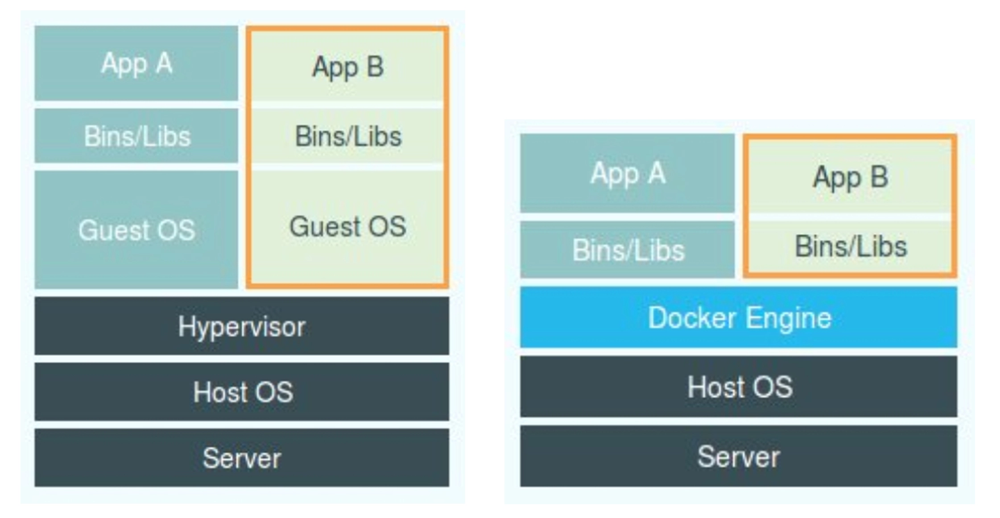

 # 容器基础

## 1. 容器进程

**进程就是程序运行起来后的计算机执行环境的总和。**

对于进程来说，

* 它的静态表现就是程序，平常都安安静静地待在磁盘上；
* 而一旦运行起来，它就变成了计算机里的数据和状态的总和，这就是它的动态表现。

**容器技术的核心功能，就是通过约束和修改进程的动态表现，从而为其创造出一个“边界”**。

对于 Docker 等大多数 Linux 容器来说，**Cgroups 技术**是用来制造约束的主要手段，而 **Namespace 技术**则是用来修改进程视图的主要方法。


**所以，容器，其实是一种特殊的进程而已。**


容器和虚拟机的对比图：



有人会把 Docker 项目称为“轻量级”虚拟化技术，实际上这样的说法并不严谨。

**跟真实存在的虚拟机不同，在使用 Docker 的时候，并没有一个真正的“Docker 容器”运行在宿主机里面**。Docker 项目帮助用户启动的，还是原来的应用进程，只不过在创建这些进程时，Docker 为它们加上了各种各样的 Namespace 参数。

这时，这些进程就会觉得自己是各自 PID Namespace 里的第 1 号进程，只能看到各自 Mount Namespace 里挂载的目录和文件，只能访问到各自 Network Namespace 里的网络设备，就仿佛运行在一个个“容器”里面，与世隔绝。

> 这些不过都是“障眼法”罢了。


## 2. 隔离与限制

### 隔离

 Linux 容器中用来实现“隔离”的技术手段为 Namespace。

**Namespace 技术实际上修改了应用进程看待整个计算机“视图”，即它的“视线”被操作系统做了限制，只能“看到”某些指定的内容**。

> 但对于宿主机来说，这些被“隔离”了的进程跟其他进程并没有太大区别。

基于 Linux Namespace 的隔离机制相比于虚拟化技术优势是

* **占用的资源少**
  * 一个运行着 CentOS 的 KVM 虚拟机启动后，在不做优化的情况下，虚拟机自己就需要占用 100~200  MB 内存
  * 使用 Namespace 作为隔离手段的容器并不需要单独的 Guest OS，这就使得容器额外的资源占用几乎可以忽略不计
* **性能损耗小**
  * 虚拟机里面，它对宿主机操作系统的调用就不可避免地要经过虚拟化软件的拦截和处理，这本身又是一层性能损耗，尤其对计算资源、网络和磁盘 I/O 的损耗非常大。
  * 而容器化后的用户应用，却依然还是一个宿主机上的普通进程，这就意味着这些因为虚拟化而带来的性能损耗都是不存在的

但是也有很多不足之处，其中最主要的问题就是：**隔离得不彻底**。

* 首先，既然容器只是运行在宿主机上的一种特殊的进程，那么多个容器之间使用的就还是同一个宿主机的操作系统内核。
* 其次，在 Linux 内核中，有很多资源和对象是不能被 Namespace 化的，最典型的例子就是：时间。
  * 这就意味着，如果你的容器中的程序使用 settimeofday(2) 系统调用修改了时间，整个宿主机的时间都会被随之修改，会影响到其他容器，这显然不符合用户的预期。

此外，由于上述问题，尤其是共享宿主机内核的事实，容器给应用暴露出来的攻击面是相当大的，应用“越狱”的难度自然也比虚拟机低得多。


### 限制

**Linux Cgroups 就是 Linux 内核中用来为进程设置资源限制的一个重要功能。**

Linux Cgroups 的全称是 Linux Control Group。它最主要的作用，就是限制一个进程组能够使用的资源上限，包括 CPU、内存、磁盘、网络带宽等等。

执行 docker run 时的指定一些限制参数了，然后 docker 就通过创建相应 cgroups 对进程进行限制。比如这样一条命令：

```shell
$ docker run -it --cpu-period=100000 --cpu-quota=20000 ubuntu /bin/bash
```

在启动这个容器后，我们可以通过查看 Cgroups 文件系统下，CPU 子系统中，“docker”这个控制组里的资源限制文件的内容来确认：

```shell
$ cat /sys/fs/cgroup/cpu/docker/5d5c9f67d/cpu.cfs_period_us 
100000
$ cat /sys/fs/cgroup/cpu/docker/5d5c9f67d/cpu.cfs_quota_us 
20000
```

这就意味着这个 Docker 容器，只能使用到 20% 的 CPU 带宽。


Cgroups 对资源的限制能力也有很多不完善的地方，被提及最多的自然是 /proc 文件系统的问题。

众所周知，Linux 下的 /proc 目录存储的是记录当前内核运行状态的一系列特殊文件，用户可以通过访问这些文件，查看系统以及当前正在运行的进程的信息，比如 CPU 使用情况、内存占用率等，这些文件也是 top 指令查看系统信息的主要数据来源。

但是，你如果在容器里执行 top 指令，就会发现，它显示的信息居然是宿主机的 CPU 和内存数据，而不是当前容器的数据。

造成这个问题的原因就是，/proc 文件系统并不知道用户通过 Cgroups 给这个容器做了什么样的资源限制，即：/proc 文件系统不了解 Cgroups 限制的存在。

在生产环境中，这个问题必须进行修正，否则应用程序在容器里读取到的 CPU 核数、可用内存等信息都是宿主机上的数据，这会给应用的运行带来非常大的困惑和风险。

> lxcfs 可解决此问题


**容器是一个“单进程”模型。**

这就意味着，在一个容器中，你没办法同时运行两个不同的应用，除非你能事先找到一个公共的 PID=1 的程序来充当两个不同应用的父进程，这也是为什么很多人都会用 systemd 或者 supervisord 这样的软件来代替应用本身作为容器的启动进程。

这是因为容器本身的设计，就是**希望容器和应用能够同生命周期**，这个概念对后续的容器编排非常重要


## 3. 容器镜像

对 Docker 项目来说，它最核心的原理实际上就是为待创建的用户进程：

* 1）启用 Linux Namespace 配置；
* 2）设置指定的 Cgroups 参数；
* 3）切换进程的根目录（Change Root）。


Docker 镜像由很多 layer 组成 ，其中 dockerfile 中每一行指令为一层，均为只读型，并按照顺序分别堆叠起来。

当以容器运行起来的时候，再创建一个新的可读写 layer,称为 container layer。

**镜像和容器最大的不同是顶层可读写的 layer**，所有的增删查改都在这个可读写的顶层 layer上，当删除这个容器，也能保证镜像没有变化。

> 也就是当多个同类型的容器，他们拥有共同的镜像，只是最顶层的可读写 layer 不同。


Docker 容器的 rootfs 可以分为 3 层：

* 只读层（image layer）
* 可读写层（container layer）
* Init 层（特殊层）

下图为一个 ubuntu 容器的 rootfs 分层结构：


**第一部分，只读层。**

它是这个容器的 rootfs 最下面的五层，对应的正是 ubuntu:latest 镜像的五层。可以看到，它们的挂载方式都是只读的（ro+wh，即 readonly+whiteout），因为只读层可以算作是镜像的组成部分，可能被多个镜像共享，因此必须是只读的。


**第二部分，可读写层。**

它是这个容器的 rootfs 最上面的一层（6e3be5d2ecccae7cc），它的挂载方式为：rw，即 read write。在没有写入文件之前，这个目录是空的。而一旦在容器里做了写操作，你修改产生的内容就会以增量的方式出现在这个层中。

由于每个容器都有自己的动态数据需要保存，因此在最上层增加了一个可读写层（container layer）来存储这些数据。

可是，你有没有想到这样一个问题：*如果我现在要做的，是删除只读层里的一个文件呢？*

比如，你要删除只读层里一个名叫 foo 的文件，那么这个删除操作实际上是在可读写层创建了一个名叫.wh.foo 的文件。这样，当这两个层被联合挂载之后，foo 文件就会被.wh.foo 文件“遮挡”起来，“消失”了。这个功能，就是“ro+wh”的挂载方式，即只读 +whiteout 的含义。我喜欢把 whiteout 形象地翻译为：“白障”。

所以，最上面这个可读写层的作用，就是专门用来存放你修改 rootfs 后产生的增量，无论是增、删、改，都发生在这里。而当我们使用完了这个被修改过的容器之后，还可以使用 docker commit 和 push 指令，保存这个被修改过的可读写层，并上传到 Docker Hub 上，供其他人使用；而与此同时，原先的只读层里的内容则不会有任何变化。这，就是增量 rootfs 的好处。


**第三部分，Init 层。**

同时由于一些特殊原因，Docker 中新增了 Init 层。

它是一个以“-init”结尾的层，夹在只读层和读写层之间。Init 层是 Docker 项目单独生成的一个内部层，专门用来存放 /etc/hosts、/etc/resolv.conf 等信息。

需要这样一层的原因是，这些文件本来属于只读的 Ubuntu 镜像的一部分，但是用户往往需要在启动容器时写入一些指定的值比如 hostname，所以就需要在可读写层对它们进行修改。可是，这些修改往往只对当前的容器有效，我们并不希望执行 docker commit 时，把这些信息连同可读写层一起提交掉。所以，Docker 做法是，在修改了这些文件之后，以一个单独的层挂载了出来。而用户执行 docker commit 只会提交可读写层，所以是不包含这些内容的。