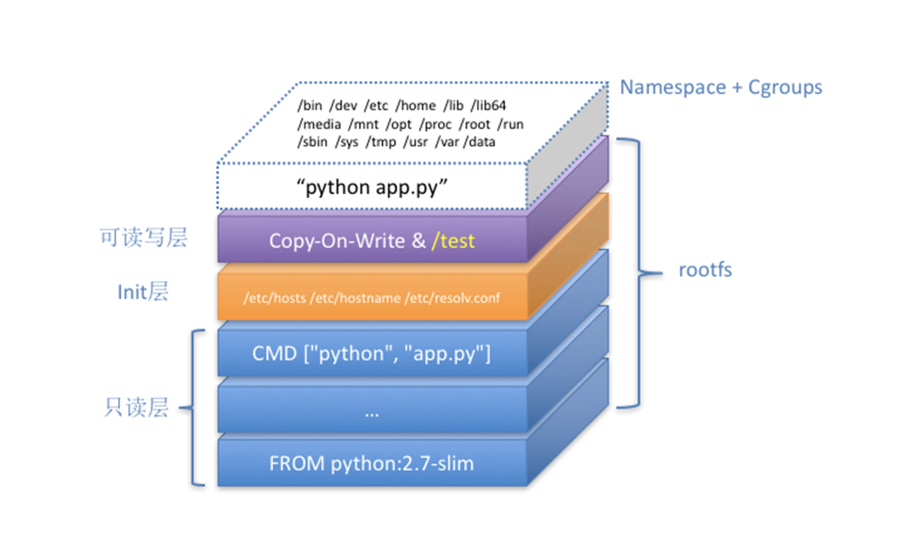

# 重新认识Docker容器

## 1. 概述

Docker 容器启动过程：

* 1）启用 Linux Namespace 配置
* 2）设置指定的 Cgroups 参数
* 3）切换进程的根目录（Change Root）

这样，一个完整的容器就诞生了。

核心实现原理：

* 1）Linux Namespace 的隔离能力
* 2）Linux Cgroups 的限制能力
* 3）基于 rootfs 的文件系统


## 2. docker exec 

docker exec 是怎么做到进入容器里的呢？

实际上，Linux Namespace 创建的隔离空间虽然看不见摸不着，但一个进程的 Namespace 信息在宿主机上是确确实实存在的，并且是以一个文件的方式存在。

比如，通过如下指令，你可以看到当前正在运行的 Docker 容器的进程号（PID）是 25686：

```sh
[root@iZ2ze9ebgot9h2acvk4uabZ ~]# docker inspect --format '{{ .State.Pid }}' c761b86fab28
19841

```

你可以通过查看宿主机的 proc 文件，看到这个 19841进程的所有 Namespace 对应的文件

```sh
[root@iZ2ze9ebgot9h2acvk4uabZ ~]# ls -l /proc/19841/ns
total 0
lrwxrwxrwx 1 root root 0 Feb 20 09:24 ipc -> ipc:[4026532358]
lrwxrwxrwx 1 root root 0 Feb 20 09:24 mnt -> mnt:[4026532356]
lrwxrwxrwx 1 root root 0 Feb 19 23:47 net -> net:[4026532361]
lrwxrwxrwx 1 root root 0 Feb 20 09:24 pid -> pid:[4026532359]
lrwxrwxrwx 1 root root 0 Feb 20 09:24 user -> user:[4026531837]
lrwxrwxrwx 1 root root 0 Feb 20 09:24 uts -> uts:[4026532357]
```

同时Linux 还提供了加入到某个 Namespace （setns()）或者从某个Namespace 脱离（unshare()）的系统调用。

**这也就意味着：一个进程，可以选择加入到某个进程已有的 Namespace 当中，从而达到“进入”这个进程所在容器的目的，这正是 docker exec 的实现原理**。


## 3. –net=host

如果我指定–net=host，就意味着这个容器不会为进程启用 Network Namespace。

这就意味着，这个容器拆除了 Network Namespace 的“隔离墙”，所以，它会和宿主机上的其他普通进程一样，直接共享宿主机的网络栈。这就为容器直接操作和使用宿主机网络提供了一个渠道。


## 4. docker commit

docker commit，实际上就是在容器运行起来后，把最上层的“可读写层”，加上原先容器镜像的只读层，打包组成了一个新的镜像。

> 当然，下面这些只读层在宿主机上是共享的，不会占用额外的空间。

而由于使用了联合文件系统，你在容器里对镜像 rootfs 所做的任何修改，都会被操作系统先复制到这个可读写层，然后再修改。这就是所谓的：**Copy-on-Write**。

而正如前所说，Init 层的存在，就是为了避免你执行 docker commit 时，把 Docker 自己对 /etc/hosts 等文件做的修改，也一起提交掉


## 5. Volume

容器技术使用了 rootfs 机制和 Mount Namespace，构建出了一个同宿主机完全隔离开的文件系统环境。

这时候，我们就需要考虑这样两个问题：

* 1）容器里进程新建的文件，怎么才能让宿主机获取到？
* 2）宿主机上的文件和目录，怎么才能让容器里的进程访问到？

这正是 Docker Volume 要解决的问题：**Volume 机制，允许你将宿主机上指定的目录或者文件，挂载到容器里面进行读取和修改操作**。

当容器进程被创建之后，尽管开启了 Mount Namespace，但是在它**执行 chroot（或者 pivot_root）之前**，容器进程一直可以看到宿主机上的整个文件系统。

所以，我们只需要在 rootfs 准备好之后，在执行 chroot 之前，把 Volume 指定的宿主机目录（比如 /home 目录），挂载到指定的容器目录（比如 /test 目录）在宿主机上对应的目录（即 /var/lib/docker/aufs/mnt/[可读写层 ID]/test）上，这个 Volume 的挂载工作就完成了。

更重要的是，由于执行这个挂载操作时，“容器进程”已经创建了，也就意味着此时 Mount Namespace 已经开启了。所以，这个挂载事件只在这个容器里可见。你在宿主机上，是看不见容器内部的这个挂载点的。这就**保证了容器的隔离性不会被 Volume 打破**。

> 这里提到的"容器进程"，是 Docker 创建的一个容器初始化进程 (dockerinit)，而不是应用进程 (ENTRYPOINT + CMD)。
>
> dockerinit 会负责完成根目录的准备、挂载设备和目录、配置 hostname 等一系列需要在容器内进行的初始化操作。最后，它通过 execv() 系统调用，让应用进程取代自己，成为容器里的 PID=1 的进程。

而这里要使用到的挂载技术，就是 Linux 的**绑定挂载（bind mount）**机制。

它的主要作用就是，允许你将一个目录或者文件，而不是整个设备，挂载到一个指定的目录上。并且，这时你在该挂载点上进行的任何操作，只是发生在被挂载的目录或者文件上，而原挂载点的内容则会被隐藏起来且不受影响。

> 绑定挂载实际上是一个文件系统中 inode 替换的过程。

**所以，在一个正确的时机，进行一次绑定挂载，Docker 就可以成功地将一个宿主机上的目录或文件，不动声色地挂载到容器中**。


### 注意点

Volume 一般存放位置是`/var/lib/docker/volumes/[VOLUME_ID]/_data`

而容器的可读写层一般在`/var/lib/docker/aufs/mnt/[可读写层 ID]/test`

所以 执行 docker commit 的时候不会被提交上去。


## 6. 小结

Docker 容器全景图如下所示：



这个容器进程“python app.py”，运行在由 Linux Namespace 和 Cgroups 构成的隔离环境里；而它运行所需要的各种文件，比如 python，app.py，以及整个操作系统文件，则由多个联合挂载在一起的 rootfs 层提供。

这些 rootfs 层的最下层，是来自 Docker 镜像的只读层。

在只读层之上，是 Docker 自己添加的 Init 层，用来存放被临时修改过的 /etc/hosts 等文件。

而 rootfs 的最上层是一个可读写层，它以 Copy-on-Write 的方式存放任何对只读层的修改，容器声明的 Volume 的挂载点，也出现在这一层。