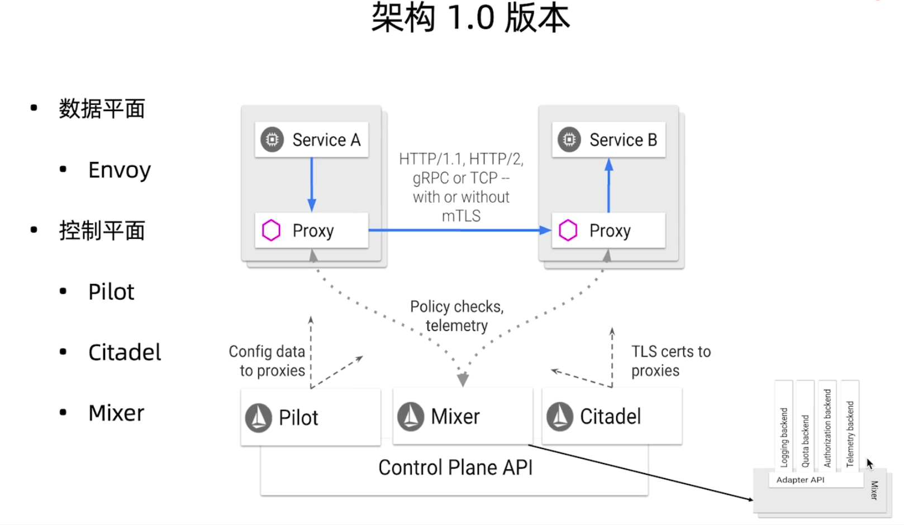
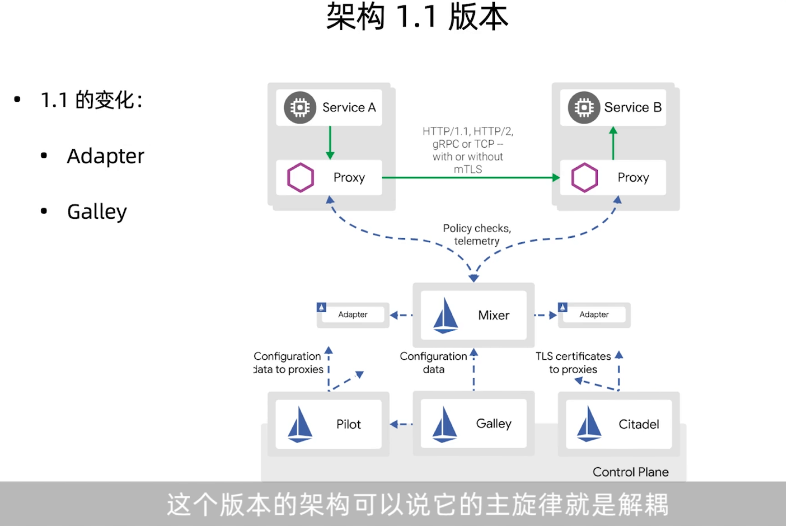
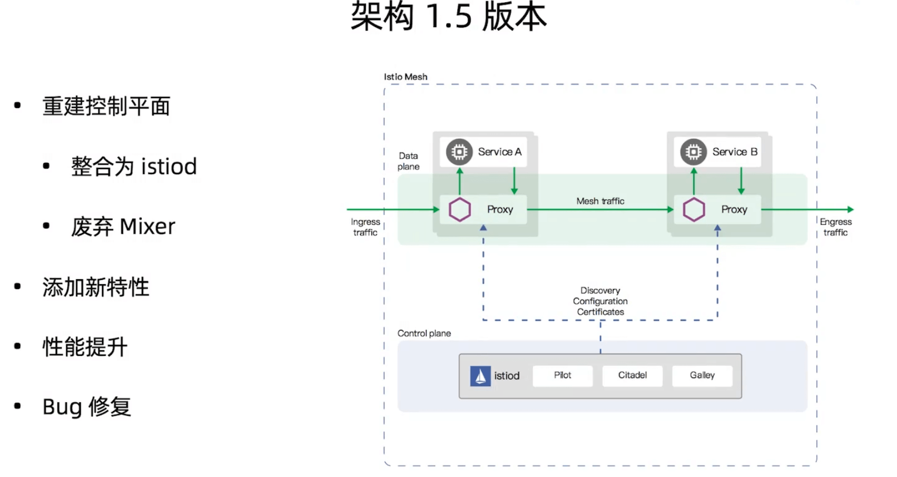

# ServiceMesh 概述

## 1. 概述

[martinfowler-什么是微服务？](https://martinfowler.com/articles/microservices.html)

微服务架构的特性：

* 1）围绕业务构建团队
  * [康威定律](https://en.wikipedia.org/wiki/Conway%27s_law)：设计系统的组织其产生的设计等价于组织间的沟通结构。
* 2）去中心化的数据管理

微服务架构优势：

* 团队层面：内聚，独立开发业务，没有依赖

* 产品层面：服务彼此独立，独立部署，没有依赖

* 微服务是软件架构的银弹吗?

  * [人月神话](https://book.douban.com/subject/1102259/)：没有一种技术和管理上的进步可以极大的提升生产效率。

   

[分布式计算的 8 个谬误](https://en.wikipedia.org/wiki/Fallacies_of_distributed_computing)：

* 网络是可靠的；
* 延迟为 0；
* 带宽是无限的；
* 网络是安全的；
* 拓扑结构是不变的；
* 只有一名管理员；
* 传输成本为 0；
* 网络是同构的。

开发人员在进行业务开发时，潜意识里就很少会考虑到通信上的问题，很难把网络相关的需求纳入到设计中，因此就出现了这 8 个谬误。 

而微服务架构下，服务越来越多，服务间通信更加频繁，导致网络问题出现也越来越多，因此**服务通信成为了微服务架构最大的痛点 **。

如何管理和控制服务间的通信？

* 服务注册/发现
* 路由，流量转移
* 弹性能力（超时、重试、熔断）
* 安全
* 可观察性

> 这些功能实际就是 ServiceMesh 的主要功能。

ServiceMesh 演进过程，建议阅读这篇文章：[Pattern：ServiceMesh](https://philcalcado.com/2017/08/03/pattern_service_mesh.html)。

> 详细介绍了 ServiceMesh 如何从最初原始的状态一步一步演变到现在这种形态的。

### ServiceMesh与K8s的关系

Kubernetes

* 解决容器编排与调度问题
* 本质上是管理应用生命周期(调度器)
* 给予 ServiceMesh 支持和帮助
  * pod 天然支持多容器，为 sidecar 的注入提供了重要支持

ServiceMesh

* 解决服务间网络通信问题
* 本质上是管理服务通信(代理)
* 对Kubernetes的网络提供了扩展和延伸

### ServiceMesh 和 API 网关的区别

ServiceMesh 主要用于对应用内部的网络细节进行一个描述

API Gateway 主要附着在应用边界，对流量进行抽象。

* 功能有重叠，但角色不同
* ServiceMesh 在应用内，API 网关在应用上(边界)

### ServiceMesh 技术标准

* UDPA（Universal Data Plane API）：同一的数据平面 API
  * 提供同一 API 以屏蔽 具体数据面的实现
  * 比如 Envoy、Linkerd
* SMI（Service Mesh Interface）类似于 UDPA，只不过是针对 控制平面的标准

### 没有银弹

然而软件开发没有银弹，传统微服务架构有许多痛点，而服务网格也不例外，也有它的局限性。

- 增加了复杂度。服务网格将 [sidecar](https://www.servicemesher.com/istio-handbook/GLOSSARY.html#sidecar) 代理和其它组件引入到已经很复杂的分布式环境中，会极大地增加整体链路和操作运维的复杂性。
- 运维人员需要更专业。在容器编排器（如 Kubernetes）上添加 [Istio](https://www.servicemesher.com/istio-handbook/GLOSSARY.html#istio) 之类的服务网格，通常需要运维人员成为这两种技术的专家，以便充分使用二者的功能以及定位环境中遇到的问题。
- 延迟。从链路层面来讲，服务网格是一种侵入性的、复杂的技术，可以为系统调用增加显著的延迟。这个延迟是毫秒级别的，但是在特殊业务场景下，这个延迟可能也是难以容忍的。
- 平台的适配。服务网格的侵入性迫使开发人员和运维人员适应高度自治的平台并遵守平台的规则。

## 2. Istio 架构变化

Istio 经过了两次重大的架构变化。

1.0版本架构如下所示：

1.0版本存在的问题就是，耦合。虽然Mixer是以插件形式提供的，但是每次更新完插件都需要重新部署 Mixer。

调整后，1.1 版本架构如下：

为 Mixer 新增 Adapter 组件进行解耦，新增 Galley 组件让 Pilot 和底层解耦。

至此，这个版本的架构可以说是近乎完美的架构。但是最大的问题就是性能低。

每次请求需要和 Mixer 组件通信两次，而 Mixer 组件又是单独部署的，最后 Mixer 还需要和 Adapter 通信，最终导致整个请求效率被严重拉低。

> 不能过分追求架构而忽略了其他

因此 1.5 版本，Istio 又进行了架构调整。

废弃了之前复杂的架构，将组件整个为 istiod，同时废弃了对性能影响最大的 Mixer。

## 3. Istio 核心功能

### 流量控制

主要功能：

* 路由、流量转移
* 流量进出
* 网络弹性能力
* 测试相关

Istio 中的流量控制主要由以下自定义资源实现：

核心资源（CRD）：

* 虚拟服务（Virtual Service）
* 目标规则（Destination Rule）
* 网关（Gateway）
* 服务入口（Service Entry）
* Sidecar

虚拟服务（Virtual Service）

* 将流量路由到给定目标地址
* 请求地址与真实的工作服务解耦
* 包含一组路由规则
* 通常和目标规则成对出现
* 丰富的路由匹配规则

目标规则（Destination Rule）

* 定义虚拟服务路由目标地址的真实地址，即子集（subset）
* 设置负载均衡的方式
  * 随机
  * 权重
  * 最少请求数

网关（Gateway）

* 管理进出网格的流量
* 处在网格边界

服务入口（Service Entry）

* 把外部服务注册到网格中
* 功能：
  * 为外部目录转发请求
  * 添加超时重试等策略
  * 扩展网格

Sidecar

* 调整 Envoy 代理接管的端口和协议
* 限制 Envoy 代理可访问的服务

**网络弹性和测试**

弹性能力

* 超时
* 重试
* 熔断

测试能力

* 故障注入
  * 超时
  * 失败
* 流量镜像

### 可观察性

指标、日志、追踪 3 部分组成。

**指标**

以聚合的方式健康和理解系统行为

Istio 中的指标分类

* 代理级别的指标
  * 收集目标：Sidecar 代理
  * 资源粒度上的网格监控
  * 容许指定收集的代理（针对性调试）
* 服务级别的指标
  * 用于监控服务通信
  * 四个级别的服务监控需求：延迟、流量、错误、饱和
  * 默认指标导出到 Prometheus（可自定义）
  * 可根据需求开启或关闭
* 控制平面指标
  * 收集控制平面的指标来关注 Istio 本身的运行状况

**日志**

通过应用产生的事件来了解系统

包括完整的元数据信息（目标、源）

生成位置可选（本地、远端(如 filebeat)）

日志内容

* 应用日志
* Envoy 日志（$ kubectl logs -l app=demo -c istio-envoy）

**分布式追踪 Distributed tracing**

通过追踪请求，了解服务的调用关系

常用于调用链的问题排查，性能分析等

支持多种追踪系统（Jeager、Zipkin、Datadog）

### 安全

授权+认证。

认证方式

* 对等认证（Peer authentication）
  * 用户服务间身份认证
  * Mutual TLS
* 请求认证（Request authentication）
  * 用户终端用户身份认证
  * JWT

认证策略

* 配置方式
* 配置生效范围
  * 网格
  * 命名空间
  * 工作负载（服务）
* 测试的更新

策略更新可能存在延迟，所以需要做兼容性处理：

* 对等认证可以先用兼容模式，等测试通过后再切换到严格模式
* 请求认证则可以同时把新旧JWT都配置上，等测试后再删除旧JWT

授权

* 授权级别
* 策略分发
* 授权引擎
* 无需显式启用（默认已启用）

授权策略

* 通过创建 AuthorizationPolicy 实现
* 组成部分
  * Selector
  * Action
  * Rules
    * from
    * to
    * when

授权测试的设置

* 范围设置 ：metadata/namespace，selector
* 值匹配：精确、模糊、前缀、后缀、
* 全部容许或拒绝
* 自定义条件