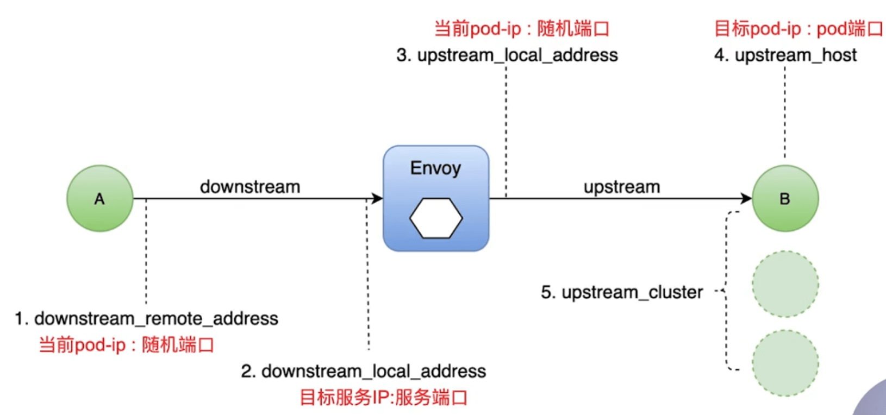

# Istio 概述

[istio 知识地图](https://github.com/servicemesher/istio-knowledge-map)

istio 中的 sidecar 注入，使用的是 k8s 中的  [Admission Controllers](https://kubernetes.io/docs/reference/access-authn-authz/admission-controllers/) 功能。

## 1. 流量管理相关功能

Istio 中的流量管理主要依赖于[虚拟服务（Virtual Service）](https://istio.io/latest/zh/docs/reference/config/networking/virtual-service/#VirtualService) 和[目标规则（Destination Rule）](https://istio.io/latest/zh/docs/concepts/traffic-management/#destination-rules) 。


### Virtual Service

```yaml
apiVersion: networking.istio.io/v1alpha3
# 通过kind指定这是一个 虚拟服务 虚拟服务让您配置如何在服务网格内将请求路由到服务，这基于 Istio 和平台提供的基本的连通性和服务发现能力
kind: VirtualService
metadata:
  name: reviews
spec:
  # hosts 指定虚拟服务对应的 host，可以有多个 类似于nginx service 中配置的 domain
  # 满足条件的 host 请求就会进入到这个虚拟服务,这个 reviews 是在destination_rule中指定的
  hosts:
    - reviews
  # 在 http 字段包含了虚拟服务的路由规则，用来描述匹配条件和路由行为，它们把 HTTP/1.1、HTTP2 和 gRPC 等流量发送到 hosts 字段指定的目标（
  # 您也可以用 tcp 和 tls 片段为 TCP 和未终止的 TLS 流量设置路由规则）。一个路由规则包含了指定的请求要流向哪个目标地址，具有 0 或多个匹配条件，取决于您的使用场景。
  http:
    # match 自定义匹配规则，即 header 中有指定 end-user=jason 的请求会转到reviews的v2版本
    - match:
        # 自定义匹配条件
        - headers:
            end-user:
              exact: jason
      # 指定匹配上该条件时的转发规则
      route:
        - destination:
            host: reviews
            subset: v2
    # 这是另一个路由规则(没有match条件，可以看做时默认规则)，多个优先级按照从上到下的优先级执行，因此没有匹配上前面的路由规则的请求都会进入这个规则 即转发到 reviews的v3版本
    - route:
        - destination:
            host: reviews
            subset: v3

# 还可以按百分比”权重“分发请求。这在 A/B 测试和金丝雀发布中非常有用
# spec:
#  hosts:
#  - reviews
#  http:
#  - route:
#    - destination:
#        host: reviews
#        subset: v1
#      weight: 75
#    - destination:
#        host: reviews
#        subset: v2
#      weight: 25
```

根据对应配置，将访问虚拟服务的流量转发到对应的真实服务上去。

而配置中的 host  - reviews 和 subset v1、v2这些则是在  Destination Rule 中配置的。


### Destination Rule

目标规则主要是根据 labels 来映射 k8s 中的 pod 到 istio 中的 subset。

比如以下目标规则创建了一个 host-my-svc，然后指定了多个 subset，通过 labels 将 k8s 中的 pod 和 subset 进行关联。

前面的 虚拟服务中指定的 host 就是目标规则中定义的host，而虚拟服务中指定的转发到哪个 subset 也是在目标规则这里定义的。

> 相当于虚拟服务定义了外部流量转发规则，请求中带了什么header的要转发到哪个subset，其他的又转发给哪个subset
> 目标规则则是定义内部流量转发规则：即某个subset具体对应k8s中的那个pod。

```yaml
apiVersion: networking.istio.io/v1alpha3
# 目标规则 您可以将虚拟服务视为将流量如何路由到给定目标地址，然后使用目标规则来配置该目标的流量
kind: DestinationRule
metadata:
  name: my-destination-rule
spec:
  # 虚拟服务中指定的 host 就是这里定义的
  host: my-svc
  trafficPolicy:
    loadBalancer:
      simple: RANDOM
  # 虚拟服务中指定的subset也是由此定义
  subsets:
    - name: v1
      # 每个子集都是基于一个或多个 labels 定义的，在 Kubernetes 中它是附加到像 Pod 这种对象上的键/值对。
      # 这些标签应用于 Kubernetes 服务的 Deployment 并作为 metadata 来识别不同的版本。
      # v1 subset 具体对应的即使有 version=v1这个标签的服务
      labels:
        version: v1
    - name: v2
      labels:
        version: v2
      # 这里也定义了一个 trafficPolicy，这个v2子集则会最终是由这个trafficPolicy，而不是前面全局定义的trafficPolicy
      # 相当于可以给每个 subset 定义不同的规则
      trafficPolicy:
        loadBalancer:
          simple: ROUND_ROBIN
    - name: v3
      labels:
        version: v3
```


**为什么需要虚拟服务？**

> [Istio虚拟服务 (Virtual Service) ](https://www.cnblogs.com/zhangmingcheng/p/15717351.html)

k8s 提供了 service，可以对请求做简单的负载均衡，遇到多版本的情况，即一个service关联多个deployment，部署的是一个服务的多个版本。这种情况下 service 也只能平均分发流量。

Istio 的虚拟服务可以从 deployment 层面来控制流量。

DestinationRule 根据标签将流量分成不同的子集，以提供 VirtualService 进行调度，并且设置相关的负载百分比实现精准的控制。以达到精准的流量控制。

小结：**k8s service 只能做简单的负载均衡，虚拟服务可以精准的控制**。


### Geteway

Istio 中网关用于处理入站和出站的流量。

网关配置被用于运行在网格边界的独立 Envoy 代理，而不是服务工作负载的 sidecar 代理。

以下网关配置让 HTTPS 流量从 `ext-host.example.com` 通过 443 端口流入网格：

```yaml
apiVersion: networking.istio.io/v1alpha3
kind: Gateway
metadata:
  name: ext-host-gwy
spec:
  selector:
    app: my-gateway-controller
  servers:
  - port:
      number: 443
      name: https
      protocol: HTTPS
    hosts:
    - ext-host.example.com
    tls:
      mode: SIMPLE
      serverCertificate: /tmp/tls.crt
      privateKey: /tmp/tls.key
```

不过没有为请求指定任何路由规则。为想要工作的网关指定路由，您必须把网关绑定到虚拟服务上：

```yaml
apiVersion: networking.istio.io/v1alpha3
kind: VirtualService
metadata:
  name: virtual-svc
spec:
  hosts:
    - ext-host.example.com
  # 虚拟服务中指定网关，通过name来关联，这样网关中的流量就可以根据这个虚拟服务中的规则进行转发了
  gateways:
    - ext-host-gwy
```


### Service Entry

使用[服务入口（Service Entry）](https://istio.io/latest/zh/docs/reference/config/networking/service-entry/#ServiceEntry) 来添加一个入口到 Istio 内部维护的服务注册中心。添加了服务入口后，Envoy 代理可以向服务发送流量，就好像它是网格内部的服务一样。

> 默认网格中运行的服务都会自动注册到 Istio，不需要手动添加。Service Entry 则是让我们手动注册一个服务到 Istio，即使这个服务不是跑在网格中的。
>
> 比如遗留的老项目，不好改动部署方式了，通过服务入口手动注册到 Istio，这样也能使用 Istio 中的功能进行管理。

配置服务入口允许您管理运行在网格外的服务的流量，它包括以下几种能力：

- 为外部目标 redirect 和转发请求，例如来自 web 端的 API 调用，或者流向遗留老系统的服务。
- 为外部目标定义[重试](https://istio.io/latest/zh/docs/concepts/traffic-management/#retries)、[超时](https://istio.io/latest/zh/docs/concepts/traffic-management/#timeouts)和[故障注入](https://istio.io/latest/zh/docs/concepts/traffic-management/#fault-injection)策略。
- 添加一个运行在虚拟机的服务来[扩展您的网格](https://istio.io/latest/zh/docs/examples/virtual-machines/single-network/#running-services-on-the-added-VM)。
- 从逻辑上添加来自不同集群的服务到网格，在 Kubernetes 上实现一个[多集群 Istio 网格](https://istio.io/latest/zh/docs/setup/install/multicluster)。


```yaml
apiVersion: networking.istio.io/v1alpha3
kind: ServiceEntry
metadata:
  name: svc-entry
spec:
  hosts:
  - ext-svc.example.com
  ports:
  - number: 443
    name: https
    protocol: HTTPS
  location: MESH_EXTERNAL
  resolution: DNS
```

同样可以配置虚拟服务和目标规则，以更细粒度的方式控制到服务入口的流量，就像控制网格中的应用一样。


### Sidecar

默认情况下，Istio 让每个 Envoy 代理都可以访问来自和它关联的工作负载的所有端口的请求，然后转发到对应的工作负载。

Istio 中提供了 sidecar 类型来配置 sidecar，比如：

- 微调 Envoy 代理接受的端口和协议集。
- 限制 Envoy 代理可以访问的服务集合。


```yaml
apiVersion: networking.istio.io/v1alpha3
kind: Sidecar
metadata:
  name: default
  namespace: bookinfo
spec:
  egress:
  - hosts:
    - "./*"
    - "istio-system/*"
```


### 网络弹性和测试

**超时和重试**

```yaml
apiVersion: networking.istio.io/v1alpha3
kind: VirtualService
metadata:
  name: ratings
spec:
  hosts:
    - ratings
  http:
    - route:
        - destination:
            host: ratings
            subset: v1
      # 配置超时
      timeout: 10s
      # 配置重试
      retries:
        attempts: 3
        perTryTimeout: 2s
```


**熔断**

```yaml
apiVersion: networking.istio.io/v1alpha3
kind: DestinationRule
metadata:
  name: reviews
spec:
  host: reviews
  subsets:
    - name: v1
      labels:
        version: v1
      # 配置熔断，限制100个并发连接
      trafficPolicy:
        connectionPool:
          tcp:
            maxConnections: 100
```


**故障注入**

```yaml
apiVersion: networking.istio.io/v1alpha3
kind: VirtualService
metadata:
  name: ratings
spec:
  hosts:
    - ratings
  http:
    # 设置故障注入，用于测试
    - fault:
        delay:
          # 为千分之一的请求配置了一个 5 秒的延迟：
          percentage:
            value: 0.1 # 百分比，当前为0.1%
          fixedDelay: 5s
      route:
        - destination:
            host: ratings
            subset: v1
```


## 2. 简单分析

### 流量路由

Istio 中的流量管理主要依赖于[虚拟服务（Virtual Service）](https://istio.io/latest/zh/docs/reference/config/networking/virtual-service/#VirtualService) 和[目标规则（Destination Rule）](https://istio.io/latest/zh/docs/concepts/traffic-management/#destination-rules) 。

二者关系如下图所示：


二者配置信息如下：


可以看到，Virtual Service 主要通过 http.route.destination 和 DestationRule 中的 subsets.name 进行关联。

例如：

```yaml
apiVersion: networking.istio.io/v1alpha3
kind: VirtualService
metadata:
  name: details
spec:
  hosts:
  - details
  http:
  - route:
    - destination:
        host: details
        subset: v1 # 这里是 v1
        
---
apiVersion: networking.istio.io/v1alpha3
kind: DestinationRule
metadata:
  name: details
spec:
  host: details
  subsets:
  - name: v1 # vs 中的 v1 指的就是这个 v1
    labels:
      version: v1
  - name: v2
    labels:
      version: v2
```

> 详细配置见 [destination rule](https://istio.io/latest/docs/reference/config/networking/destination-rule/) 和 [virtual service](https://istio.io/latest/docs/reference/config/networking/virtual-service/)


具体应用场景：

* 按服务版本路由
* 按比例切分流量
* 根据匹配规则进行路由
* 定义各种测试
  * 负载均衡
  * 连接池
  * ...


### 网关

什么是网关？

* 一个运行在网格边缘的负载均衡器
* 接收外部请求，转发给网格内的服务
* 配置对外的端口、协议与内部服务的映射


> 这里的网关只是一个逻辑上的网关，并不会真正的运行一个 Pod，只是通过这个配置告诉 Istio 将流量放进来。


而这个网关也只是一个流量入口，如果需要对流量做路由控制还是需要配合 Virtual Service 。

二者配置关系如下：


可以看到，早 Virtual Service 中通过 gateways 字段来指定网关，即接收该网关的流量。然后通过该 虚拟服务中的规则进行流量控制

例如：

```yaml
apiVersion: networking.istio.io/v1alpha3
kind: Gateway
metadata:
  name: bookinfo-gateway # 指定网关的名字，虚拟服务中通过名字进行关联
spec:
  # 通过selector指定这个网关要运行再哪个Pod上
  selector:
    istio: ingressgateway # use istio default controller
  # 最后则指定该网关暴露的服务域名及端口协议等
  servers:
  - port:
      number: 80
      name: http
      protocol: HTTP
    hosts:
    - "*"
---
apiVersion: networking.istio.io/v1alpha3
kind: VirtualService
metadata:
  name: bookinfo
spec:
  hosts:
  - "*"
  gateways:
  - bookinfo-gateway # 指定接管这个网关的流量
  http:
  # 这里则是具体的路由规则
  - match:
    - uri:
        exact: /productpage
    - uri:
        prefix: /static
    - uri:
        exact: /login
    - uri:
        exact: /logout
    - uri:
        prefix: /api/v1/products
    route:
    - destination:
        host: productpage
        port:
          number: 9080
```

> 详细配置见 [gateway](https://istio.io/latest/docs/reference/config/networking/gateway/)

应用场景：

* 暴露网格内服务给外界访问
* 访问安全（HTTPS、mTLS等）
* 统一应用入口，API聚合


### 服务入口

什么是服务入口？

* 添加外部服务到网格内
* 管理到外部服务的请求
* 扩展网格


具体如下：

```yaml
piVersion: networking.istio.io/v1alpha3
kind: ServiceEntry
metadata:
  name: httpbin-ext
spec:
  # 要访问的外部服务域名
  hosts:
  - httpbin.org 
  # 要访问的外部服务端口即访问协议
  ports:
  - number: 80
    name: http
    protocol: HTTP
  # 服务发现模式
  resolution: DNS
  # 指定服务的位置，在网格内部还是外部
  location: MESH_EXTERNAL
```

> 详细配置见 [service-entry](https://istio.io/latest/zh/docs/reference/config/networking/service-entry/)


location 字段为什么还能填网格内部呢？

因为有些内部服务不一定能被网格内的服务发现所注册，比如说定义在网格内部的虚拟机上的一些服务。所以需要有 INTERNAL 这样一个配置项。


### Ingress

* 服务的访问入口，接收外部请求并转发到后端服务
* Istio 和 Ingress gateway 和 Kubernetes 的 Ingress 有什么区别？
  * K8s Ingress 针对 L7 协议（资源受限），可定义路由规则
  * Istio Ingress gateway， 针对 L4-L6协议，只定义接入点，复用 Virtual Service 的 L7 路由定义


### Egress

Egress 网关定义了网格的出口点，允许你将监控、路由等功能应用于离开网格的流量。

应用场景

* 所有出口流量必须流经一组专用节点（安全因素）
* 为无法访问公网的内部服务做代理


访问外部服务的方法：

* 配置 global.outboundTrafficPolicy.mode= ALLOW_ANY
* 使用服务入口（ServiceEntry）
* 配置 sidecar 让流量绕过代理
* 配置 Egress 网关


流量控制主要功能：

* 路由、流量转移
  * 蓝绿、灰度、A/B测试
* 弹性能力
  * 超时、重试、熔断
* 调试
  * 故障注入、流量镜像


## 3. 可观测性

### 指标

Istio 集成了 Prometheus 进行指标采集，通过以下命令可以进入 dashboard 查看：

```shell
$ istioctl dashboard prometheus
```


同时 Istio 集成了 Grafana 用于可视化的方式查询指标。

```shell
$ istioctl dashboard grafana
```

Istio 中已经默认设置好了几个 Grafana 的 dashboard：

Mesh Bashboard：查看应用（服务）数据

* 网格数据总览
* 服务视图
* 工作服务视图

Performance Dashboard：查看 Istio 自身（各组件）数据

* Istio 系统总览
* 各组件负载情况


### 日志

Istio 中 Envoy 会记录详细的日志，便于排查问题。

首先要确认 Envoy 日志配置开启

```shell
--set values.global.proxy.accessLogFile="/dev/stdout"
```

若日志输出文件为空，则不会输出日志。


Envoy 流量五元组。


* 1）downstream_remote_address
* 2）downstream_local_address
* 3）upstream_local_address
* 4）upstream_host
* 5）upstream_cluster




注：这里的downstream、upstream、local、remote都是相对于 Envoy 来说了，这样比较容易理解。


调试关键字段：response_flags，Istio 中会把相关错误信息用该字段记录。

部分取值如下：

* UH：upstream cluster 中没有健康的 host，503
* UF：upstream 连接失败，503
* UO：upstream overflow（熔断）
* NR：没有路由配置，404
* URX：请求被拒，应为限流或最大连接次数
* ...


Envoy 日志配置项

global.proxy.accessLogFile：日志输出文件，空表示关闭输出

global.proxy.accessLogEncoding：日志编码格式，JSON、TEXT

global.proxy.accessLogFormat：配置显示在日志中的字段，为空则使用默认格式

global.proxy.logLevel：日志级别，默认为 warning，可选值 trace、debug、info、warning、error、critical、off


### 分布式追踪

分析和监控应用的监控方法

查找故障点、分析性能问题

观测请求范围内的信息

起源于 Google 的 Dapper

OpenTracing：API 规范、框架、库的组合


Istio 支持多种分布式追踪工具，比如Go生态中的 Jaeger。

```shell
$ istioctl dashboard jaeger
```


### 小结

可观测性有 指标、日志、分布式追踪三部分组成，这三部分功能互相有重叠，但是各种侧重点不同，建议配合使用。


## 4. 安全

认证策略的分类

* 对等认证
* 请求认证

认证策略范围

* 网格
* 命名空间
* 特定服务

优先级：最窄原则（即取最小范围的策略生效）


### 对等认证

Istio 中默认已经开启了对等认证，但是用的是兼容模式，即兼容了明文传输方式，开启严格模式后就只能接收密文传输。

具体配置如下：

```yaml
apiVersion: security.istio.io/v1beta1
# 这是一个对等认证
kind: PeerAuthentication
metadata:
  name: "httpbin"
  # 指定该命名空间下开启认证
  namespace: "bar"
spec:
  # 也可以指定只对某个服务开启
  selector:
    matchLabels:
      app: httpbin
  mtls:
    mode: STRICT
```

只需要创建一个 PeerAuthentication 即可启用 mTLS认证。


不需要配置其他东西，完全有 Istio Sidecar 自动配置。

> 比如证书的生成、下发、配置等完全由 Istio 管理。


### 请求认证

请求认证则需要配置两部分：

```yaml
apiVersion: security.istio.io/v1beta1
kind: RequestAuthentication
metadata:
  name: "jwt-example"
  # 指定命名空间
  namespace: istio-system
spec:
  # 指定服务
  selector:
    matchLabels:
      istio: ingressgateway
  jwtRules:
  - issuer: "testing@secure.istio.io"
    jwksUri: "https://raw.githubusercontent.com/istio/istio/release-1.12/security/tools/jwt/samples/jwks.json"
```

该配置表示 istio-system 命名空间下，带有 istio: ingressgateway 标签的负载收到的流量需要JWT认证。默认情况下这表示所有入站流量都需要进行 JWT 认证。


注意：此时只是配置了 JWT 认证，如果 JWT 正确可以访问，错误则不能访问，但是如果不带 JWT 就不会触发 JWT 错误，所以依旧可以访问。为了限制这种情况还需要配置授权策略：

```yaml
apiVersion: security.istio.io/v1beta1
kind: AuthorizationPolicy
metadata:
  name: "frontend-ingress"
  namespace: istio-system
spec:
  selector:
    matchLabels:
      istio: ingressgateway
  action: DENY
  rules:
  - from:
    - source:
      notRequestPrincipals: ["*"]
```

这样，没有带token的就会直接被拒绝掉


### 小结

Istio 提供了一种透明的安全解决方案。

* 透明的安全层
* CA：密钥和证书管理
* APIServer：认证、授权策略分发
* Envoy：服务间安全通信（认证、加密）


