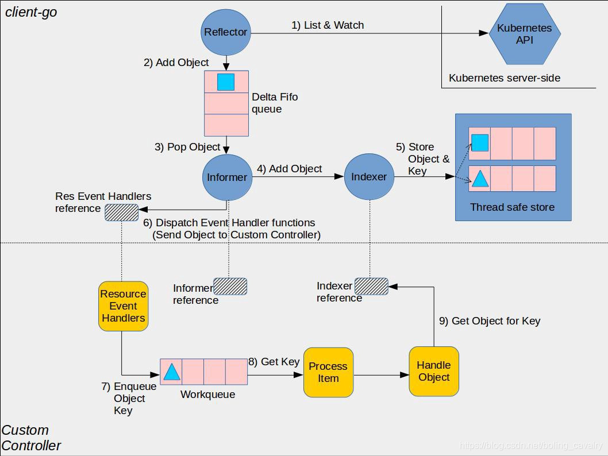

# client-go 实战

相关教程：

[client-go实战之一：准备工作](https://xinchen.blog.csdn.net/article/details/113753087)

[client-go实战之二:RESTClient](https://xinchen.blog.csdn.net/article/details/113487087)

[client-go实战之三：Clientset](https://xinchen.blog.csdn.net/article/details/113788269)

[client-go实战之四：dynamicClient](https://xinchen.blog.csdn.net/article/details/113795523)

[client-go实战之五：DiscoveryClient](https://xinchen.blog.csdn.net/article/details/113800054)

[【k8s开发篇】k8s client-go 之 四种client](https://blog.csdn.net/qq_24433609/article/details/122999959)

[Kubernetes的Group、Version、Resource学习小记](https://xinchen.blog.csdn.net/article/details/113715847)


相关文档：

[k8s reference](https://kubernetes.io/zh/docs/reference/)

[具体API资源的文档](https://kubernetes.io/docs/reference/generated/kubernetes-api/v1.23/#pod-v1-core)


## 1. 准备工作

### client-go 简介

client-go 是 kubernetes 官方提供的 go 语言的客户端库，go 应用使用该库可以访问 kubernetes 的 API Server，这样我们就能通过编程来对 kubernetes 资源进行增删改查操作；

除了提供丰富的 API 用于操作 kubernetes 资源，client-go 还为 controller 和 operator 提供了重要支持，如下图，client-go 的 informer 机制可以将 controller 关注的资源变化及时带给此 controller，使 controller 能够及时响应变化：




###  环境准备

首先肯定需要一个 k8s 集群，可以使用 minikube、kubeadm 等工具安装一个。

不过需要注意的是 client-go 和 k8s 版本的一个兼容性问题，具体见下表：

|                               | Kubernetes 1.15 | Kubernetes 1.16 | Kubernetes 1.17 | Kubernetes 1.18 | Kubernetes 1.19 | Kubernetes 1.20 |
| ----------------------------- | --------------- | --------------- | --------------- | --------------- | --------------- | --------------- |
| `kubernetes-1.15.0`           | ✓               | +-              | +-              | +-              | +-              | +-              |
| `kubernetes-1.16.0`           | +-              | ✓               | +-              | +-              | +-              | +-              |
| `kubernetes-1.17.0`/`v0.17.0` | +-              | +-              | ✓               | +-              | +-              | +-              |
| `kubernetes-1.18.0`/`v0.18.0` | +-              | +-              | +-              | ✓               | +-              | +-              |
| `kubernetes-1.19.0`/`v0.19.0` | +-              | +-              | +-              | +-              | ✓               | +-              |
| `kubernetes-1.20.0`/`v0.20.0` | +-              | +-              | +-              | +-              | +-              | ✓               |
| `HEAD`                        | +-              | +-              | +-              | +-              | +-              | +-              |

这里解释一下表格中的`✓` 、`+` 、`-` 的含义：

* `✓` 表示精确匹配

- `+` 表示有的新特性是client-go支持的，但是此kubernetes版本却不支持；
- `-` 表示有的新特性是kubernetes支持的，但是此client-go版本却不支持

比较我们是 1.20 版本集群那么 client-go 选择 v0.20.0 就是最好的。

> 这里安装的是 1.23.5 的集群，不过 client-go 没有最新版本，所以可能某些特性不支持。


### 四种客户端

client-go 提供了以下四种客户端对象：

* **RESTClient**：这是最基础的客户端对象，仅对 HTTPRequest 进行了封装，实现 RESTFul 风格 API，这个对象的使用并不方便，因为很多参数都要使用者来设置，于是 client-go 基于 RESTClient 又实现了三种新的客户端对象；

* **ClientSet**：把 Resource 和 Version 也封装成方法了，用起来更简单直接，不过 ClientSet 只能访问内置资源，访问不了自定义资源；
  * 一个资源是一个客户端，多个资源就对应了多个客户端，所以ClientSet就是多个客户端的集合了，这样就好理解了。

* **DynamicClient**：可以访问内置资源和自定义资源，个人感觉有点像 java 的集合操作，拿出的内容是 Object类型，按实际情况自己去做强制转换，当然了也会有强转失败的风险；

* **DiscoveryClient**：用于发现 kubernetes 的 API Server 支持的 Group、Version、Resources 等信息；


## 2. RESTClient

RESTClient 就是简单的对 HTTPRequest 进行了封装，所以我们要进行的编码就是找到对应资源的 http path。

> 这里可以去查 官方 API 文档。

使用RESTClient对kubernetes的资源进行增删改查的基本步骤如下：

* 1）确定要操作的资源类型(例如查找deployment列表)，去官方API文档中找到对于的path、数据结构等信息，后面会用到；
* 2）加载配置kubernetes配置文件（和kubectl使用的那种kubeconfig完全相同）；
* 3）根据配置文件生成配置对象，并且通过API对配置对象就行设置（例如请求的path、Group、Version、序列化反序列化工具等）；
* 4）创建RESTClient实例，入参是配置对象；
* 5）调用RESTClient实例的方法向kubernetes的API Server发起请求，编码用fluent风格将各种参数传入(例如指定namespace、资源等)，如果是查询类请求，还要传入数据结构实例的指针，改数据结构用于接受kubernetes返回的查询结果；


### 查询pods

实战内容：查询 kube-system 这个 namespace 下的所有 pod，然后在控制台打印每个 pod 的几个关键字段；


#### 参数主备

[k8s api 文档](https://kubernetes.io/zh/docs/reference/)

找到 pod 的相关参数，请求路径、参数以及返回值，具体在[这里](https://kubernetes.io/docs/reference/generated/kubernetes-api/v1.23/#list-pod-v1-core)

* **http path**：GET /api/v1/namespaces/{namespace}/pods
* **Parameters**： namespace
* **Response**：PodList
  * apiVersion
  * items
  * kind
  * metadata

掌握了请求和响应的详细信息，可以开始编码了；


#### 编码

```go
package main

import (
	"context"
	"fmt"

	corev1 "k8s.io/api/core/v1"
	metav1 "k8s.io/apimachinery/pkg/apis/meta/v1"
	"k8s.io/client-go/kubernetes/scheme"
	"k8s.io/client-go/rest"
	"k8s.io/client-go/tools/clientcmd"
)

func main() {
	// 1) 加载配置文件
	// kubeconfig := "~/.kube/config"
	kubeconfig := "D:\\Home\\17x\\Projects\\i-go\\cloud-natinve\\kubeconfig"
	// 从指定的URL加载kubeconfig配置文件
	// 这里直接从本机加载，因此第一个参数为空字符串
	config, err := clientcmd.BuildConfigFromFlags("", kubeconfig)
	if err != nil { // kubeconfig加载失败就直接退出了
		panic(err.Error())
	}
	// 2）构建client
	// 参考path : /api/v1/namespaces/{namespace}/pods
	config.APIPath = "api"
	// pod的group是空字符串
	config.GroupVersion = &corev1.SchemeGroupVersion
	// 指定序列化工具
	config.NegotiatedSerializer = scheme.Codecs

	// 根据配置信息构建restClient实例
	restClient, err := rest.RESTClientFor(config)
	if err != nil {
		panic(err.Error())
	}
	// 3）组装请求并接收结果
	// 保存pod结果的数据结构实例
	result := &corev1.PodList{}
	// 参考path : /api/v1/namespaces/{namespace}/pods
	// 设置请求参数，然后发起请求
	err = restClient.Get(). // GET请求
				Namespace("kube-system").                                                //  指定namespace，
				Resource("pods").                                                        // 查找多个pod
				VersionedParams(&metav1.ListOptions{Limit: 100}, scheme.ParameterCodec). // 指定大小限制和序列化工具
				Do(context.TODO()).                                                      // 请求
				Into(result)                                                             // 结果存入result
	if err != nil {
		panic(err.Error())
	}
	// 4）打印结果到控制台
	// 表头
	fmt.Printf("namespace\t status\t\t name\n")
	// 每个pod都打印namespace、status.Phase、name三个字段
	for _, d := range result.Items {
		fmt.Printf("%v\t %v\t %v\n",
			d.Namespace,
			d.Status.Phase,
			d.Name)
	}
}

```


#### 测试

输出如下

```bash
namespace        status          name
kube-system      Running         calico-kube-controllers-56fcbf9d6b-rblvc
kube-system      Running         calico-node-8ssw2
kube-system      Running         calico-node-dlvpn
kube-system      Running         coredns-6d8c4cb4d-gcpl4
kube-system      Running         coredns-6d8c4cb4d-kztc9
kube-system      Running         etcd-k8s-master
kube-system      Running         kube-apiserver-k8s-master
kube-system      Running         kube-controller-manager-k8s-master
kube-system      Running         kube-proxy-8ktnn
kube-system      Running         kube-proxy-qck9n
kube-system      Running         kube-scheduler-k8s-master
```


### deployment

根据 pods 查询案例，自己实现一个 deployments 的查询功能。

具体改动点如下：

* 1）构建 client 参数调整
  * deployment 的 APIPath 为 apps
  * deployment 的 Group 为 apps
* 2）组装请求并接收结果
  * 结果用 deploymentlist 来接收
  * 资源名改成 deployment
* 3）处理结果
  * 打印部分逻辑调整一下即可

```go
func deployment() {
	// 1) 加载配置文件
	// kubeconfig := "~/.kube/config"
	kubeconfig := "D:\\Home\\17x\\Projects\\i-go\\cloud-natinve\\kubeconfig"
	// 从指定的URL加载kubeconfig配置文件
	// 这里直接从本机加载，因此第一个参数为空字符串
	config, err := clientcmd.BuildConfigFromFlags("", kubeconfig)
	if err != nil { // kubeconfig加载失败就直接退出了
		panic(err.Error())
	}
	// 2）构建client
	// 参考path : /apis/apps/v1/namespaces/{namespace}/deployments
	config.APIPath = "apis"
	// deployment的group是apps
	config.GroupVersion = &appsv1.SchemeGroupVersion
	// 指定序列化工具
	config.NegotiatedSerializer = scheme.Codecs

	// 根据配置信息构建restClient实例
	restClient, err := rest.RESTClientFor(config)
	if err != nil {
		panic(err.Error())
	}
	// 3）组装请求并接收结果
	// 保存pod结果的数据结构实例
	result := &appsv1.DeploymentList{}
	// 参考path : /apis/apps/v1/namespaces/{namespace}/deployments
	// 设置请求参数，然后发起请求
	err = restClient.Get(). // GET请求
				Namespace("kube-system").                                                //  指定namespace，
				Resource("deployments").                                                 // 查找多个pod
				VersionedParams(&metav1.ListOptions{Limit: 100}, scheme.ParameterCodec). // 指定大小限制和序列化工具
				Do(context.TODO()).                                                      // 请求
				Into(result)                                                             // 结果存入result
	if err != nil {
		panic(err.Error())
	}
	// 4）处理结果--这里就打印结果到控制台
	// 表头
	fmt.Printf("namespace\t replicas\t available\t name\n")
	for _, d := range result.Items {
		fmt.Printf("%v\t %v\t\t %v\t\t %v\n",
			d.Namespace,
			d.Status.Replicas,
			d.Status.AvailableReplicas,
			d.Name)
	}
}

```


输出如下：

```bash
namespace        replicas        available       name
kube-system      1               1               calico-kube-controllers
kube-system      2               2               coredns
```


### 创建 pod

最后再试一下更新操作，创建一个简单的 nginx pod。

```go
func createPod() {
	kubeconfig := "D:\\Home\\17x\\Projects\\i-go\\cloud-natinve\\kubeconfig"
	config, err := clientcmd.BuildConfigFromFlags("", kubeconfig)
	if err != nil {
		panic(err.Error())
	}
	// 2）构建client
	// 参考path : POST /api/v1/namespaces/{namespace}/pods
	config.APIPath = "api"
	config.GroupVersion = &corev1.SchemeGroupVersion
	config.NegotiatedSerializer = scheme.Codecs

	// 根据配置信息构建restClient实例
	restClient, err := rest.RESTClientFor(config)
	if err != nil {
		panic(err.Error())
	}
	result := &corev1.Pod{}
	// 构建一个pod对象，这个还是挺麻烦的，建议对照着yaml来写
	/*
		比如这是一个简单的nginx pod yaml内容，照着转换成 corev1.pod 结构即可
		字段上有// +optional注释的则可以不填，其他的必须都填
		---
		apiVersion: v1
		kind: Pod
		metadata:
		  name: nginx
		  labels:
		    app: nginx
		spec:
		  containers:
		  - name: nginx
		    image: nginx:1.20.0
		    ports:
		    - containerPort: 80
	*/
	pod := &corev1.Pod{
		TypeMeta: metav1.TypeMeta{
			Kind:       "pod",
			APIVersion: "v1",
		},
		ObjectMeta: metav1.ObjectMeta{
			Name:      "my-pod",
			Namespace: "default",
			Labels:    map[string]string{"app": "nginx"},
		},
		Spec: corev1.PodSpec{
			InitContainers: []corev1.Container{},
			Containers: []corev1.Container{{
				Name:  "nginx",
				Image: "nginx:1.20",
				Ports: []corev1.ContainerPort{{
					ContainerPort: 80,
				}},
			}},
		},
		Status: corev1.PodStatus{},
	}
	code := new(int)
	err = restClient.Post().
		Namespace("default"). // 这个namespace需要和pod里指定的相匹配，然后pod里的namespace未指定在会用这里的来填充
		Resource("pods").
		VersionedParams(&metav1.CreateOptions{}, scheme.ParameterCodec).
		Body(pod).
		Do(context.Background()).
		StatusCode(code).
		Into(result)
	if err != nil {
		log.Println("post err: ", err)
		return
	}
	// 根据返回状态码不同，代码不同含义
	switch *code {
	case 200:
		fmt.Println("OK")
	case 201:
		fmt.Println("Created")
	case 202:
		fmt.Println("Accepted")
	}
	fmt.Println(result)
}
```


执行后去集群中查看

```bash
[root@k8s-master ~]# kubectl get pods
NAME                                READY   STATUS    RESTARTS   AGE
my-pod                              1/1     Running   0          83s
```

果然多了一个 pod


### 删除 pod

删除就比较简单了，提供namespace和pod name 即可删除。

```go
func deletePod() {
	kubeconfig := "D:\\Home\\17x\\Projects\\i-go\\cloud-natinve\\kubeconfig"
	config, err := clientcmd.BuildConfigFromFlags("", kubeconfig)
	if err != nil {
		panic(err.Error())
	}
	// 2）构建client
	// 参考path : POST /api/v1/namespaces/{namespace}/pods
	config.APIPath = "api"
	config.GroupVersion = &corev1.SchemeGroupVersion
	config.NegotiatedSerializer = scheme.Codecs

	// 根据配置信息构建restClient实例
	restClient, err := rest.RESTClientFor(config)
	if err != nil {
		panic(err.Error())
	}
	err = restClient.Delete().
		Namespace("default").
		Resource("pods").
		Name("my-pod").
		Body(&metav1.DeleteOptions{}).
		Do(context.Background()).
		Error()
	if err != nil {
		log.Println("delete pod err: ", err)
	}
}
```


### 小结

整个 restClient 使用过程大致分为以下几个步骤：

* 1）加载 kubeconfig 配置文件
* 2）构建 restClient 实例
* 3）组装请求并接收结果
* 4）处理结果
  * 案例中就是简单的打印


## 3. ClientSet

restClient 只是对 HTTPRequest 的简单封装，因此使用的时候需要写大量代码，还是不够方便，为了解决这个问题，k8s 开发人员推送了 ClientSet 客户端,通过对 restClient 进行封装来提升易用性。

ClientSet 是所有 Group 和 Version 组合对象的集合。

根据资源对象的 Group 和 Version 生成了相关的 CRUD 操作，内部还是调用的 restClient 执行请求的。

> 这部分代码也是由 client gen 自动生成的


### 实战1

第一个实战是把之前用 restClient 写的 listPod、createPod 以及 deletePod 这 3 个方法用 clientSet 实现一遍。


```go
package main

import (
	"context"
	"fmt"
	"log"

	corev1 "k8s.io/api/core/v1"
	metav1 "k8s.io/apimachinery/pkg/apis/meta/v1"
	"k8s.io/client-go/kubernetes"
	"k8s.io/client-go/tools/clientcmd"
)

func main() {
	refactorPod()
}
func refactorPod() {
	// 1）加载配置文件
	kubeconfig := "D:\\Home\\17x\\Projects\\i-go\\cloud-natinve\\kubeconfig"
	config, err := clientcmd.BuildConfigFromFlags("", kubeconfig)
	if err != nil {
		panic(err.Error())
	}

	// 2）实例化clientset对象
	clientSet, err := kubernetes.NewForConfig(config)
	if err != nil {
		panic(err.Error())
	}
	// 	3) 具体逻辑
	listPod(clientSet)
	createPod(clientSet)
	deletePod(clientSet)
}

func listPod(clientSet *kubernetes.Clientset) {
	list, err := clientSet.CoreV1().Pods("kube-system").List(context.Background(), metav1.ListOptions{})
	if err != nil {
		return
	}
	fmt.Printf("namespace\t status\t\t name\n")
	for _, d := range list.Items {
		fmt.Printf("%v\t %v\t %v\n",
			d.Namespace,
			d.Status.Phase,
			d.Name)
	}
}

func createPod(clientSet *kubernetes.Clientset) {
	pod := &corev1.Pod{
		TypeMeta: metav1.TypeMeta{
			Kind:       "pod",
			APIVersion: "v1",
		},
		ObjectMeta: metav1.ObjectMeta{
			Name:      "my-pod",
			Namespace: "default",
			Labels:    map[string]string{"app": "nginx"},
		},
		Spec: corev1.PodSpec{
			InitContainers: []corev1.Container{},
			Containers: []corev1.Container{{
				Name:  "nginx",
				Image: "nginx:1.20",
				Ports: []corev1.ContainerPort{{
					ContainerPort: 80,
				}},
			}},
		},
		Status: corev1.PodStatus{},
	}
	result, err := clientSet.CoreV1().Pods("default").Create(context.TODO(), pod, metav1.CreateOptions{})
	if err != nil {
		log.Println("create pod err:", err.Error())
		return
	}
	fmt.Println("create pod success:", result)
}

func deletePod(clientSet *kubernetes.Clientset) {
	err := clientSet.CoreV1().Pods("default").Delete(context.TODO(), "my-pod", metav1.DeleteOptions{})
	if err != nil {
		log.Println("delete pod err:", err.Error())
		return
	}
}

```


可以发现代码量一下子就减少了很多，用起来非常方便。


### 实战2

本次编码实战的需求如下：

实现一个 cmd，接收 operate 参数

* 如果operate参数等于create，就执行以下操作：
  * 新建名为test-clientset的namespace
  * 新建一个deployment，namespace为test-clientset，镜像用tomcat，副本数为2
  * 新建一个service，namespace为test-clientset，类型是NodePort

* 如果operate参数等于clean
  * 就删除create操作中创建的service、deployment、namespace等资源：

以上需求使用Clientset客户端实现，完成后咱们用浏览器访问来验证tomcat是否正常；


```go
package main

import (
	"context"
	"flag"
	"fmt"

	appsv1 "k8s.io/api/apps/v1"
	corev1 "k8s.io/api/core/v1"
	metav1 "k8s.io/apimachinery/pkg/apis/meta/v1"
	"k8s.io/client-go/kubernetes"
	"k8s.io/client-go/tools/clientcmd"
	"k8s.io/utils/pointer"
)

const (
	namespace      = "test-clientset"
	deploymentName = "client-test-deployment"
	serviceName    = "client-test-service"
)

var operate string

// go build main.go
// ./main -operate create
// ./main -operate clean
func init() {
	// 获取用户输入的操作类型，默认是create，还可以输入clean，用于清理所有资源
	flag.StringVar(&operate, "operate", "create", "operate type : create or clean")
	flag.Parse()
	fmt.Printf("operation is %v\n", operate)
}

func main() {
	tomcat()
}

func tomcat() {
	// 1）加载配置文件
	kubeConfig := "D:\\Home\\17x\\Projects\\i-go\\cloud-natinve\\kubeconfig"
	config, err := clientcmd.BuildConfigFromFlags("", kubeConfig)
	if err != nil {
		panic(err.Error())
	}

	// 2）实例化clientset对象
	clientSet, err := kubernetes.NewForConfig(config)
	if err != nil {
		panic(err.Error())
	}

	// 3）根据参数执行对应操作
	switch operate {
	case "create":
		createNamespace(clientSet)
		createDeployment(clientSet)
		createService(clientSet)
	case "clean":
		clean(clientSet)
	default:
		fmt.Println("unknown operate")
	}
}

// 清理本次实战创建的所有资源
func clean(clientSet *kubernetes.Clientset) {
	// 删除service
	if err := clientSet.CoreV1().Services(namespace).Delete(context.TODO(), serviceName, metav1.DeleteOptions{}); err != nil {
		panic(err.Error())
	}
	// 删除deployment
	if err := clientSet.AppsV1().Deployments(namespace).Delete(context.TODO(), serviceName, metav1.DeleteOptions{}); err != nil {
		panic(err.Error())
	}
	// 删除namespace
	if err := clientSet.CoreV1().Namespaces().Delete(context.TODO(), namespace, metav1.DeleteOptions{}); err != nil {
		panic(err.Error())
	}
}

// 新建namespace
func createNamespace(clientSet *kubernetes.Clientset) {
	namespaceClient := clientSet.CoreV1().Namespaces()
	ns := &corev1.Namespace{
		ObjectMeta: metav1.ObjectMeta{
			Name: namespace,
		},
	}
	result, err := namespaceClient.Create(context.TODO(), ns, metav1.CreateOptions{})
	if err != nil {
		panic(err.Error())
	}
	fmt.Printf("Create namespace %s \n", result.GetName())
}

// 新建service
func createService(clientSet *kubernetes.Clientset) {

	// 得到service的客户端
	serviceClient := clientSet.CoreV1().Services(namespace)
	// 实例化一个数据结构
	service := &corev1.Service{
		ObjectMeta: metav1.ObjectMeta{
			Name: serviceName,
		},
		Spec: corev1.ServiceSpec{
			Ports: []corev1.ServicePort{{
				Name:     "http",
				Port:     8080,
				NodePort: 30080,
			},
			},
			Selector: map[string]string{
				"app": "tomcat",
			},
			Type: corev1.ServiceTypeNodePort,
		},
	}

	result, err := serviceClient.Create(context.TODO(), service, metav1.CreateOptions{})
	if err != nil {
		panic(err.Error())
	}

	fmt.Printf("Create service %s \n", result.GetName())
}

// 新建deployment
func createDeployment(clientSet *kubernetes.Clientset) {
	// 得到deployment的客户端
	deploymentClient := clientSet.AppsV1().Deployments(namespace)

	// 实例化一个数据结构
	deployment := &appsv1.Deployment{
		ObjectMeta: metav1.ObjectMeta{
			Name: deploymentName,
		},
		Spec: appsv1.DeploymentSpec{
			Replicas: pointer.Int32Ptr(2),
			Selector: &metav1.LabelSelector{
				MatchLabels: map[string]string{
					"app": "tomcat",
				},
			},

			Template: corev1.PodTemplateSpec{
				ObjectMeta: metav1.ObjectMeta{
					Labels: map[string]string{
						"app": "tomcat",
					},
				},
				Spec: corev1.PodSpec{
					Containers: []corev1.Container{
						{
							Name:            "tomcat",
							Image:           "tomcat:8.0.18-jre8",
							ImagePullPolicy: "IfNotPresent",
							Ports: []corev1.ContainerPort{
								{
									Name:          "http",
									Protocol:      corev1.ProtocolSCTP,
									ContainerPort: 8080,
								},
							},
						},
					},
				},
			},
		},
	}

	result, err := deploymentClient.Create(context.TODO(), deployment, metav1.CreateOptions{})

	if err != nil {
		panic(err.Error())
	}

	fmt.Printf("Create deployment %s \n", result.GetName())
}

```


### 小结

clientSet 是对 restClient 的封装，主要是为了简化使用。这不像技术活，更像体力活，所以最好能自动化完成，因此相关代码都是使用 client-gen 工具自动生成的。

易用性远超 restClient，所以一般都是使用 clientSet。


## 4. dynamicClient

Clientset 的代码中可没有用户自定义的东西，显然就用不上 Clientset 了，此时本篇的主角 dynamicClient 就要登场啦！

与 Clientset 不同，dynamicClient 为各种类型的资源都提供统一的操作API，资源需要包装为 Unstructured 数据结构，内部依旧使用 Restclient 与 kubernetes 交互；

```go
type Unstructured struct {
	// Object is a JSON compatible map with string, float, int, bool, []interface{}, or
	// map[string]interface{}
	// children.
	Object map[string]interface{}
}
```

Unstructured 结构用于存储非结构化资源，比如我们的 CRD，不是内置资源对象，client-go 这个包里面没有对应的 struct 定义，只能用 interface 来存了。然后通过反射实现Unstructured与资源对象的相互转换。


### 实战

本次实战还是实现一个 listPod 方法。

> 为了方便就不去写 CRD 了，就把 pod 当做是一个 CRD，然后使用 dynamicClient 进行查询。


注意点：

* 1）Resource方法指定了本次操作的资源类型；
* 2）List方法向kubernetes发起请求；
* 3）FromUnstructured将Unstructured数据结构转成PodList


### 小结

dynamicClient 是名副其实的动态客户端工具，用一套 API 处理所有资源，除了突破 Clientset 的内置资源限制，还让我们的业务代码有了更大的灵活性。

实现也比较容易理解，由于不知道具体结构，所以请求时需要指定 GRV， 然后返回值也解析不了就用 Unstructured 数据结构（interface）来存储，然后 FromUnstructured 进行转换的时候，需要调用者传入具体的结构体，内部使用反射进行转换。

所以实际上还是需要得到具体的结构体才行，只是没有定义在 client-go 的代码里了。


## 5. DiscoveryClient

之前学习的 Clientset 和 dynamicClient 都是面向资源对象的（例如创建 deployment 实例、查看 pod 实例），而 DiscoveryClient 则不同，它聚焦的是资源，例如查看当前 kubernetes 有哪些 Group、Version、Resource。


### 实战

本次实战的需求很简单：从kubernetes查询所有的Group、Version、Resource信息，在控制台打印出来；


```go
package main

import (
	"fmt"

	"k8s.io/apimachinery/pkg/runtime/schema"
	"k8s.io/client-go/discovery"
	"k8s.io/client-go/tools/clientcmd"
)

func main() {
	// 1) 配置 kubeConfig
	kubeConfig := "D:\\Home\\17x\\Projects\\i-go\\cloud-natinve\\kubeconfig"
	config, err := clientcmd.BuildConfigFromFlags("", kubeConfig)
	if err != nil {
		panic(err.Error())
	}

	// 2）新建discoveryClient实例
	discoveryClient, err := discovery.NewDiscoveryClientForConfig(config)
	if err != nil {
		panic(err.Error())
	}

	// 3）获取所有分组和资源数据
	APIGroup, APIResourceListSlice, err := discoveryClient.ServerGroupsAndResources()
	if err != nil {
		panic(err.Error())
	}
	// 4）处理数据
	// 先看Group信息
	fmt.Printf("APIGroup :\n\n %v\n\n\n\n", APIGroup)

	// APIResourceListSlice是个切片，里面的每个元素代表一个GroupVersion及其资源
	for _, singleAPIResourceList := range APIResourceListSlice {

		// GroupVersion是个字符串，例如"apps/v1"
		groupVerionStr := singleAPIResourceList.GroupVersion

		// ParseGroupVersion方法将字符串转成数据结构
		gv, err := schema.ParseGroupVersion(groupVerionStr)

		if err != nil {
			panic(err.Error())
		}

		fmt.Println("*****************************************************************")
		fmt.Printf("GV string [%v]\nGV struct [%#v]\nresources :\n\n", groupVerionStr, gv)

		// APIResources字段是个切片，里面是当前GroupVersion下的所有资源
		for _, singleAPIResource := range singleAPIResourceList.APIResources {
			fmt.Printf("%v\n", singleAPIResource.Name)
		}
	}
}

```


输出如下：

```bash
# 截取了一部分
*****************************************************************
GV string [crd.projectcalico.org/v1]
GV struct [schema.GroupVersion{Group:"crd.projectcalico.org", Version:"v1"}]
resources :

ippools
felixconfigurations
networkpolicies
blockaffinities
ipamhandles
caliconodestatuses
ipamconfigs
bgppeers
bgpconfigurations
clusterinformations
globalnetworkpolicies
ipreservations
hostendpoints
kubecontrollersconfigurations
globalnetworksets
ipamblocks
networksets

```

有没有感觉和 `kubectl api-resources` 的输出有点类似。

实际上 kubectl api-resources 也是用  DiscoveryClient 实现的。

