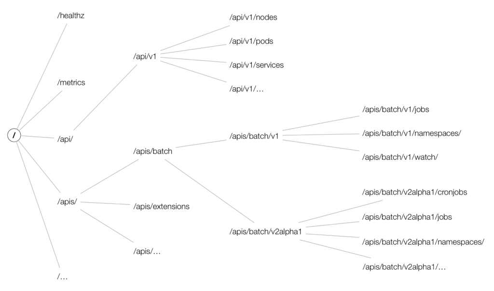

# k8s 源码分析

[k8s 学习笔记合集](https://blog.csdn.net/qq_24433609/category_11359650.html)

[【k8s基础篇】k8s基础1之API概念与http path](https://blog.csdn.net/qq_24433609/article/details/122999270)

[【k8s基础篇】k8s基础2之GVK与GVR](https://blog.csdn.net/qq_24433609/article/details/122999327)

[【k8s基础篇】k8s基础3之接口文档](https://blog.csdn.net/qq_24433609/article/details/122999367)

[【k8s源码篇】k8s类型定义1之yaml与单体、list对象转换](https://blog.csdn.net/qq_24433609/article/details/122999413)

[【k8s源码篇】k8s类型定义2之基础设施TypeMeta与ObjectMeta](https://blog.csdn.net/qq_24433609/article/details/122999462)

[【k8s源码篇】k8s类型定义3之顶层设计runtime.Object接口](https://blog.csdn.net/qq_24433609/article/details/122999501)

[K8s源码分析(12)-资源的数据访问层](https://blog.csdn.net/weixin_46073333/article/details/121724692)

[K8s源码分析(13)-资源的服务层接口定义](https://blog.csdn.net/weixin_46073333/article/details/122389224)

## API 对象

* runtime.Object是所有API单体对象的根类(interface)；
* schema.ObjectKind是对API对象类型的抽象(interface)；
* metav1.Object是对API对象公共属性的抽象(interface)；
* metav1.ListInterface是对API对象列表公共属性的抽象(interface)；
* metav1.TypeMeta是schema.ObjectKind的一个实现，API对象类型继承之；
* metav1.ObjectMeta是metav1.Object的一个实现，API对象类型继承之；
* metav1.ListMeta是metav1.ListInterface的一个实现，API对象列表继承之；