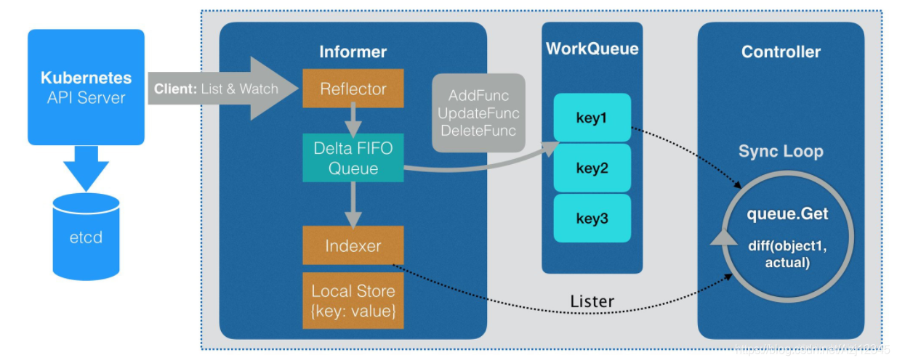

# 自定义 CRD 教程

[Kubernetes中自定义Controller](https://mdnice.com/writing/96db31f3c4e14fe281531b8cae1ca51d)


>[使用 CustomResourceDefinition 扩展 Kubernetes API](https://kubernetes.io/zh/docs/tasks/extend-kubernetes/custom-resources/custom-resource-definitions/)
>
>[k8s自定义controller三部曲之一:创建CRD（Custom Resource Definition）](https://blog.csdn.net/boling_cavalry/article/details/88917818)
>
>[k8s自定义controller三部曲之二:自动生成代码](https://blog.csdn.net/boling_cavalry/article/details/88924194)
>
>[k8s自定义controller三部曲之三：编写controller代码](https://blog.csdn.net/boling_cavalry/article/details/88934063)


## 1. 概述

自定义 CRD 大致可以分为以下 3 步：

* 1）创建 CRD
* 2）生成代码
* 3）编写 Controller


## 2. 创建 CRD

###  student.yaml

然后创建一个 student.yaml，内容如下：

```yaml
apiVersion: apiextensions.k8s.io/v1beta1
kind: CustomResourceDefinition
metadata:
  # metadata.name的内容是由"复数名.分组名"构成，如下，students是复数名，bolingcavalry.k8s.io是分组名
  name: students.bolingcavalry.k8s.io
spec:
  # 分组名，在REST API中也会用到的，格式是: /apis/分组名/CRD版本
  group: bolingcavalry.k8s.io
  # list of versions supported by this CustomResourceDefinition
  versions:
    - name: v1
      # 是否有效的开关.
      served: true
      # 只有一个版本能被标注为storage
      storage: true
  # 范围是属于namespace的
  scope: Namespaced
  names:
    # 复数名
    plural: students
    # 单数名
    singular: student
    # 类型名
    kind: Student
    # 简称，就像service的简称是svc
    shortNames:
    - stu
```


然后部署这个 crd

```bash
kubectl apply -f student.yaml
```


后续如果发起对类型为 Student 的对象的处理，k8s 的 api server 就能识别到该对象类型了，如下所示，可以用 kubectl get crd 和 kubectl describe crd stu 命令查看更多细节。

> 其中 stu 是在 student.yaml 中定义的 shortNames。


也可以直接去访问 etcd，查看在 etcd 里是个什么样子的：

```bash
ETCDCTL_API=3 etcdctl --endpoints=https://127.0.0.1:2379 --cacert=/etc/kubernetes/pki/etcd/ca.crt --cert=/etc/kubernetes/pki/etcd/healthcheck-client.crt --key=/etc/kubernetes/pki/etcd/healthcheck-client.key get /registry/apiextensions.k8s.io/customresourcedefinitions/ --prefix
```


### 创建 stduent 对象

在前面部署完 student.yaml 之后，k8s 已经认识 student 这个对象了，因此我们可以直接通过 k8s api 创建 student 对象，就像创建一个 pod 或者 deployment 等内置对象一样。


定义一个 object-student.yaml 文件，内容如下：

```yaml
apiVersion: bolingcavalry.k8s.io/v1
kind: Student # kind 就是我们前面定义的类型
metadata:
  name: object-student
spec:
  name: "张三"
  school: "深圳中学"
```

然后用 apply 命令部署一下：

```bash
kubectl apply -f object-student.yaml
```

查看一下刚部署 student 对象

```bash
[root@master custom_controller]# kubectl get stu
NAME             AGE
object-student   15s
```


直接去 etcd 查看

```bash
ETCDCTL_API=3 etcdctl --endpoints=https://127.0.0.1:2379 --cacert=/etc/kubernetes/pki/etcd/ca.crt --cert=/etc/kubernetes/pki/etcd/healthcheck-client.crt --key=/etc/kubernetes/pki/etcd/healthcheck-client.key get /registry/bolingcavalry.k8s.io/students/default/object-student --print-value-only

```

> Key 格式：/registry/{group}/{名称复数}/{namespace}/{对象名字}

至此，自定义 API 对象（也就是 CRD）就创建成功了，此刻我们只是让 k8s 能识别到 Student这个对象的身份，但是当我们创建 Student 对象的时候，还没有触发任何业务（相对于创建Pod 对象的时候，会触发 kubelet 在 node 节点创建 docker 容器），这也是后面的章节要完成的任务。


## 3. 生成代码

具体 workflow 如下：



controller 的开发还是比较复杂的，为了简化我们开发，k8s 的大师们利用自动代码生成工具将 controller 之外的事情都做好了，我们只要专注于 controller 的开发就好。


我们要做的事就是编写 API 对象 Student 相关的声明的定义代码，然后用代码生成工具结合这些代码，自动生成 Client、Informet、WorkQueue 相关的代码；


### 准备文件

创建项目文件夹 k8s_customize_controller，以及 crd 相关的三层目录：

```shell
mkdir -p k8s_customize_controller
cd k8s_customize_controller
mkdir -p pkg/apis/bolingcavalry
```

在新建的 bolingcavalry 目录下创建文件 register.go，内容如下：

```go
package bolingcavalry

const (
        GroupName = "bolingcavalry.k8s.io"
        Version   = "v1"
)

```

在 bolingcavalry 目录下创建名为**v1**的文件夹；

在 v1 文件夹下创建文件 doc.go，内容如下：

```go
// +k8s:deepcopy-gen=package

// +groupName=bolingcavalry.k8s.io
package v1

```

两行注释主要用于生成代码：

* 一个是声明为整个 v1 包下的类型定义生成 DeepCopy 方法
* 另一个声明了这个包对应的 API 的组名，和 CRD 中的组名一致；

> 请注意，此注释必须位于正上方的注释块中package


在 v1 文件夹下创建文件 types.go，里面定义了 Student 对象的具体内容：

```go
package v1

import (
	metav1 "k8s.io/apimachinery/pkg/apis/meta/v1"
)

// +genclient
// +genclient:noStatus
// +k8s:deepcopy-gen:interfaces=k8s.io/apimachinery/pkg/runtime.Object

type Student struct {
	metav1.TypeMeta   `json:",inline"`
	metav1.ObjectMeta `json:"metadata,omitempty"`
	Spec              StudentSpec `json:"spec"`
}

type StudentSpec struct {
	name   string `json:"name"`
	school string `json:"school"`
}

// +k8s:deepcopy-gen:interfaces=k8s.io/apimachinery/pkg/runtime.Object

// StudentList is a list of Student resources
type StudentList struct {
	metav1.TypeMeta `json:",inline"`
	metav1.ListMeta `json:"metadata"`

	Items []Student `json:"items"`
}
```

> 需要定义 Student 和 StudentList 两个结构

然后也是一些注释，用于生成相关的代码。

* `+genclient`：告诉 client-gen 为这种类型创建一个客户端.
* `+genclient:noStatus`：告诉client-gen 这种类型没有通过/status子资源使用规范状态分离。生成的客户端将没有该UpdateStatus方法（client-gen 会盲目地生成该方法，知道Status在你的结构中找到一个字段）。
* 


在 v1 目录下创建 register.go 文件，此文件的作用是通过 addKnownTypes 方法使得 client 可以知道 Student 类型的 API 对象：

```go
package v1

import (
	metav1 "k8s.io/apimachinery/pkg/apis/meta/v1"
	"k8s.io/apimachinery/pkg/runtime"
	"k8s.io/apimachinery/pkg/runtime/schema"

	"k8s_customize_controller/pkg/apis/bolingcavalry"
)

var SchemeGroupVersion = schema.GroupVersion{
	Group:   bolingcavalry.GroupName,
	Version: bolingcavalry.Version,
}

var (
	SchemeBuilder = runtime.NewSchemeBuilder(addKnownTypes)
	AddToScheme   = SchemeBuilder.AddToScheme
)

func Resource(resource string) schema.GroupResource {
	return SchemeGroupVersion.WithResource(resource).GroupResource()
}

func Kind(kind string) schema.GroupKind {
	return SchemeGroupVersion.WithKind(kind).GroupKind()
}

func addKnownTypes(scheme *runtime.Scheme) error {
	scheme.AddKnownTypes(
		SchemeGroupVersion,
		&Student{},
		&StudentList{},
	)

	// register the type in the scheme
	metav1.AddToGroupVersion(scheme, SchemeGroupVersion)
	return nil
}

```

到此，为自动生成代码做的准备工作已经完成了，后续开始生成代码。

### 生成代码

通过脚本生成相关代码

```bash
./generate-groups.sh all
```


会生成一大堆文件，其中 zz_generated.deepcopy.go就是DeepCopy代码文件。


## 4. 创建 controller

Controller 的逻辑其实是很简单的：监听 CRD 实例（以及关联的资源）的 CRUD 事件，然后执行相应的业务逻辑。


## 5. 小结

需要手动编写的文件如下所示：

```bash
├── controller.go
├── main.go
└── pkg
    ├── apis
    │   └── bolingcavalry
    │       ├── register.go
    │       └── v1
    │           ├── doc.go
    │           ├── register.go
    │           └── types.go
    └── signals
        ├── signal.go
        ├── signal_posix.go
        └── signal_windows.go

```

