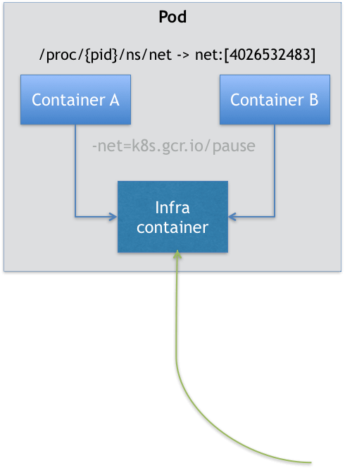

# Pod 对象

## 1. 为什么需要Pod

为什么 Kubernetes 项目又突然搞出一个 Pod 来呢？

**为了更好的管理。**


首先，关于 Pod 最重要的一个事实是：它只是一个逻辑概念。

Kubernetes 真正处理的，还是宿主机操作系统上 Linux 容器的 Namespace 和 Cgroups，而并不存在一个所谓的 Pod 的边界或者隔离环境。


**Pod 这个看似复杂的 API 对象，实际上就是对容器的进一步抽象和封装而已，其实是一组共享了某些资源的容器。**

具体的说：Pod 里的所有容器，共享的是同一个 Network Namespace，并且可以声明共享同一个 Volume。


### Network Namespace

这好像通过 docker run --net --volumes-from 这样的命令就能实现嘛，比如：

```sh
$ docker run --net=B --volumes-from=B --name=A image-A
```

这样的前提条件是：容器 B 就必须比容器 A 先启动。这会导致一个 Pod 里的多个容器就不是对等关系，而是拓扑关系了。

所以，在 Kubernetes 项目里，Pod 的实现需要使用一个**中间容器**，这个容器叫作 Infra 容器。在这个 Pod 中，Infra 容器永远都是第一个被创建的容器，而其他用户定义的容器，则通过 Join Network Namespace 的方式，与 Infra 容器关联在一起。

> 在 Kubernetes 项目里，Infra 容器一定要占用极少的资源，所以它使用的是一个非常特殊的镜像，叫作：k8s.gcr.io/pause。
>
> 这个镜像是一个用汇编语言编写的、永远处于“暂停”状态的容器，解压后的大小也只有 100~200 KB 左右。

而在 Infra 容器“Hold 住”Network Namespace 后，用户容器就可以加入到 Infra 容器的 Network Namespace 当中了。所以，如果你查看这些容器在宿主机上的 Namespace 文件（这个 Namespace 文件的路径，我已经在前面的内容中介绍过），它们指向的值一定是完全一样的。

具体如下图所示：



图源：深入剖析Kubernetes


### Volume 

有了 Infra 这个设计之后，共享 Volume 就简单多了：Kubernetes 项目只要把所有 Volume 的定义都设计在 Pod 层级即可。

这样，一个 Volume 对应的宿主机目录对于 Pod 来说就只有一个，Pod 里的容器只要声明挂载这个 Volume，就一定可以共享这个 Volume 对应的宿主机目录。

```yaml
---
apiVersion: v1
kind: Pod
metadata:
  name: two-containers
spec:
  restartPolicy: Never
  volumes:
  - name: shared-data
    hostPath:      
      path: /data
  containers:
  - name: nginx-container
    image: nginx
    volumeMounts:
    - name: shared-data
      mountPath: /usr/share/nginx/html
  - name: debian-container
    image: debian
    volumeMounts:
    - name: shared-data
      mountPath: /pod-data
    command: ["/bin/sh"]
    args: ["-c", "echo Hello from the debian container > /pod-data/index.html"]
```

在这个例子中，debian-container 和 nginx-container 都声明挂载了 shared-data 这个 Volume。而 shared-data 是 hostPath 类型。所以，它对应在宿主机上的目录就是：/data。而这个目录，其实就被同时绑定挂载进了上述两个容器当中。


### 容器设计模式

Pod 这种“超亲密关系”容器的设计思想，实际上就是希望，当用户想在一个容器里跑多个功能并不相关的应用时，应该优先考虑它们是不是更应该被描述成一个 Pod 里的多个容器。

**第一个最典型的例子是：WAR 包与 Web 服务器。**

我们现在有一个 Java Web 应用的 WAR 包，它需要被放在 Tomcat 的 webapps 目录下运行起来。假如，你现在只能用 Docker 来做这件事情，那该如何处理这个组合关系呢？

* 一种方法是，把 WAR 包直接放在 Tomcat 镜像的 webapps 目录下，做成一个新的镜像运行起来。可是，这时候，如果你要更新 WAR 包的内容，或者要升级 Tomcat 镜像，就要重新制作一个新的发布镜像，非常麻烦。

* 另一种方法是，你压根儿不管 WAR 包，永远只发布一个 Tomcat 容器。不过，这个容器的 webapps 目录，就必须声明一个 hostPath 类型的 Volume，从而把宿主机上的 WAR 包挂载进 Tomcat 容器当中运行起来。
  * 不过，这样你就必须要解决一个问题，即：如何让每一台宿主机，都预先准备好这个存储有 WAR 包的目录呢？

实际上，有了 Pod 之后，这样的问题就很容易解决了。我们可以把 WAR 包和 Tomcat 分别做成镜像，然后把它们作为一个 Pod 里的两个容器“组合”在一起。这个 Pod 的配置文件如下所示：

```yaml
---
apiVersion: v1
kind: Pod
metadata:
  name: javaweb-2
spec:
  initContainers:
  - image: geektime/sample:v2
    name: war
    command: ["cp", "/sample.war", "/app"]
    volumeMounts:
    - mountPath: /app
      name: app-volume
  containers:
  - image: geektime/tomcat:7.0
    name: tomcat
    command: ["sh","-c","/root/apache-tomcat-7.0.42-v2/bin/start.sh"]
    volumeMounts:
    - mountPath: /root/apache-tomcat-7.0.42-v2/webapps
      name: app-volume
    ports:
    - containerPort: 8080
      hostPort: 8001 
  volumes:
  - name: app-volume
    emptyDir: {}
```

在这个 Pod 中，我们定义了两个容器，第一个容器使用的镜像是 war，这个镜像里只有一个 WAR 包（sample.war）放在根目录下。而第二个容器则使用的是一个标准的 Tomcat 镜像。

WAR 包容器的类型不再是一个普通容器，而是一个 Init Container 类型的容器。在 Pod 中，所有 Init Container 定义的容器，都会比 spec.containers 定义的用户容器先启动。并且，Init Container 容器会按顺序逐一启动，而直到它们都启动并且退出了，用户容器才会启动。

所以，这个 Init Container 类型的 WAR 包容器启动后，我执行了一句"cp /sample.war /app"，把应用的 WAR 包拷贝到 /app 目录下，然后退出。而后这个 /app 目录，就挂载了一个名叫 app-volume 的 Volume。接下来就很关键了。Tomcat 容器，同样声明了挂载 app-volume 到自己的 webapps 目录下。

所以，等 Tomcat 容器启动时，它的 webapps 目录下就一定会存在 sample.war 文件：这个文件正是 WAR 包容器启动时拷贝到这个 Volume 里面的，而这个 Volume 是被这两个容器共享的。

实际上，这个所谓的“组合”操作，正是容器设计模式里最常用的一种模式，它的名字叫：sidecar。sidecar 指的就是我们可以在一个 Pod 中，启动一个辅助容器，来完成一些独立于主进程（主容器）之外的工作。


**第二个例子，则是容器的日志收集。**

比如，我现在有一个应用，需要不断地把日志文件输出到容器的 /var/log 目录中。

这时，我就可以把一个 Pod 里的 Volume 挂载到应用容器的 /var/log 目录上。

然后，我在这个 Pod 里同时运行一个 sidecar 容器，它也声明挂载同一个 Volume 到自己的 /var/log 目录上。

这样，接下来 sidecar 容器就只需要做一件事儿，那就是不断地从自己的 /var/log 目录里读取日志文件，转发到 MongoDB 或者 Elasticsearch 中存储起来。

这样，一个最基本的日志收集工作就完成了。


**Pod 的另一个重要特性是，它的所有容器都共享同一个 Network Namespace**。这就使得很多与 Pod 网络相关的配置和管理，也都可以交给 sidecar 完成，而完全无须干涉用户容器。这里最典型的例子莫过于 Istio 这个微服务治理项目了。

### 小结

> Docker 容器核心实现原理：Namespace 做隔离，Cgroups 做限制，rootfs 做文件系统。

* **容器**的本质是**进程**。

* **容器镜像**就是这个系统里的“.exe”**安装包**。

* **Pod**就是**进程组**。

* **Kubernetes **就是**操作系统**！


## 2. Pod 基本概念


## 2. Field

**NodeSelector **：是一个供用户将 Pod 与 Node 进行绑定的字段。

```yaml
apiVersion: v1
kind: Pod
...
spec:
 nodeSelector:
   disktype: ssd
```

**NodeName**：一旦 Pod 的这个字段被赋值，Kubernetes 项目就会被认为这个 Pod 已经经过了调度，调度的结果就是赋值的节点名字。所以，这个字段一般由调度器负责设置，但用户也可以设置它来“骗过”调度器，当然这个做法一般是在测试或者调试的时候才会用到。

**HostAliases**：定义了 Pod 的 hosts 文件（比如 /etc/hosts）里的内容

```yaml
apiVersion: v1
kind: Pod
...
spec:
  hostAliases:
  - ip: "10.1.2.3"
    hostnames:
    - "foo.remote"
    - "bar.remote"
...
```

这样，这个 Pod 启动后，/etc/hosts 文件的内容将如下所示：

```sh
cat /etc/hosts
# Kubernetes-managed hosts file.
127.0.0.1 localhost
...
10.244.135.10 hostaliases-pod
10.1.2.3 foo.remote
10.1.2.3 bar.remote
```

最后两行就是通过 hostnames 指定的。


凡是跟容器的 Linux Namespace 相关的属性，也一定是 Pod 级别的。这个原因也很容易理解：Pod 的设计，就是要让它里面的容器尽可能多地共享 Linux Namespace，仅保留必要的隔离和限制能力。

```yaml

apiVersion: v1
kind: Pod
metadata:
  name: nginx
spec:
  # 共享PID Namespace
  shareProcessNamespace: true
  # 共享宿主机的 Network、IPC 和 PID Namespace
  hostNetwork: true
  hostIPC: true
  hostPID: true
  containers:
  - name: nginx
    image: nginx
  - name: shell
    image: busybox
    stdin: true
    tty: true
```


**Containers**

Pod 中最重要的字段当然是**Containers**了。

**首先，是 ImagePullPolicy 字段**，它定义了镜像拉取的策略，默认是 Always即每次创建 Pod 都重新拉取一次镜像。

**其次，是 Lifecycle 字段。**它定义的是 Container Lifecycle Hooks，在容器状态发生变化时触发一系列“钩子”。

```yaml

apiVersion: v1
kind: Pod
metadata:
  name: lifecycle-demo
spec:
  containers:
  - name: lifecycle-demo-container
    image: nginx
    lifecycle:
      postStart:
        exec:
          command: ["/bin/sh", "-c", "echo Hello from the postStart handler > /usr/share/message"]
      preStop:
        exec:
          command: ["/usr/sbin/nginx","-s","quit"]
```

postStart 容器启动后通过 echo 命令写入一段欢迎信息。

> 执行在 Docker 容器 ENTRYPOINT 执行之后，但不保证严格顺序，也就是说，在 postStart 启动时，ENTRYPOINT 有可能还没有结束。

preStop 容器被杀死之前（比如，收到了 SIGKILL 信号）调用 nginx 退出命令，优雅停止。

> 而需要明确的是，preStop 操作的执行，是同步的。所以，它会**阻塞**当前的容器杀死流程，直到这个 Hook 定义操作完成之后，才允许容器被杀死，这跟 postStart 不一样。


## 3. Status

Pod 生命周期的变化，主要体现在 Pod API 对象的 Status 部分，这是它除了 Metadata 和 Spec 之外的第三个重要字段。其中，pod.status.phase，就是 Pod 的当前状态，它有如下几种可能的情况：

1. **Pending**。这个状态意味着，Pod 的 YAML 文件已经提交给了 Kubernetes，API 对象已经被创建并保存在 Etcd 当中。但是，这个 Pod 里有些容器因为某种原因而不能被顺利创建。比如，调度不成功。
2. **Running**。这个状态下，Pod 已经调度成功，跟一个具体的节点绑定。它包含的容器都已经创建成功，并且至少有一个正在运行中。
3. **Succeeded**。这个状态意味着，Pod 里的所有容器都正常运行完毕，并且已经退出了。这种情况在运行一次性任务时最为常见。
4. **Failed**。这个状态下，Pod 里至少有一个容器以不正常的状态（非 0 的返回码）退出。这个状态的出现，意味着你得想办法 Debug 这个容器的应用，比如查看 Pod 的 Events 和日志。
5. **Unknown**。这是一个异常状态，意味着 Pod 的状态不能持续地被 kubelet 汇报给 kube-apiserver，这很有可能是主从节点（Master 和 Kubelet）间的通信出现了问题。


更进一步地，Pod 对象的 Status 字段，还可以再细分出一组 Conditions。这些细分状态的值包括：`PodScheduled`、`Ready`、`Initialized`，以及 `Unschedulable`。它们主要用于描述造成当前 Status 的具体原因是什么。

比如，Pod 当前的 Status 是 Pending，对应的 Condition 是 Unschedulable，这就意味着它的调度出现了问题。


## 4. 健康检查

在 Kubernetes 中，你可以为 Pod 里的容器定义一个健康检查“探针”（Probe）。这样，kubelet 就会根据这个 Probe 的返回值决定这个容器的状态，而不是直接以容器镜像是否运行（来自 Docker 返回的信息）作为依据。这种机制，是生产环境中保证应用健康存活的重要手段。


我们一起来看一个 Kubernetes 文档中的例子:

```yaml

apiVersion: v1
kind: Pod
metadata:
  labels:
    test: liveness
  name: test-liveness-exec
spec:
  containers:
  - name: liveness
    image: busybox
    args:
    - /bin/sh
    - -c
    - touch /tmp/healthy; sleep 30; rm -rf /tmp/healthy; sleep 600
    livenessProbe:
      exec:
        command:
        - cat
        - /tmp/healthy
      initialDelaySeconds: 5
      periodSeconds: 5
```

在这个 Pod 中，我们定义了一个有趣的容器。它在启动之后做的第一件事，就是在 /tmp 目录下创建了一个 healthy 文件，以此作为自己已经正常运行的标志。而 30 s 过后，它会把这个文件删除掉。

与此同时，我们定义了一个这样的 livenessProbe（健康检查）。它的类型是 exec，这意味着，它会在容器启动后，在容器里面执行一条我们指定的命令，比如：“cat /tmp/healthy”。这时，如果这个文件存在，这条命令的返回值就是 0，Pod 就会认为这个容器不仅已经启动，而且是健康的。这个健康检查，在容器启动 5 s 后开始执行（initialDelaySeconds: 5），每 5 s 执行一次（periodSeconds: 5）。

除了在容器中执行命令外，livenessProbe 也可以定义为发起 HTTP 或者 TCP 请求的方式，定义格式如下：

```yaml
...
livenessProbe:
     httpGet:
       path: /healthz
       port: 8080
       httpHeaders:
       - name: X-Custom-Header
         value: Awesome
       initialDelaySeconds: 3
       periodSeconds: 3
```

```yaml

    ...
    livenessProbe:
      tcpSocket:
        port: 8080
      initialDelaySeconds: 15
      periodSeconds: 20
```

所以，**你的 Pod 其实可以暴露一个健康检查 URL（比如 /healthz），或者直接让健康检查去检测应用的监听端口**。这两种配置方法，在 Web 服务类的应用中非常常用。


## 5. 恢复机制

Kubernetes 里的 Pod 恢复机制，也叫 **restartPolicy**。它是 Pod 的 Spec 部分的一个标准字段（pod.spec.restartPolicy），默认值是 Always，即：任何时候这个容器发生了异常，它一定会被重新创建。

但一定要强调的是，Pod 的恢复过程，永远都是发生在当前节点上，而不会跑到别的节点上去。事实上，一旦一个 Pod 与一个节点（Node）绑定，除非这个绑定发生了变化（pod.spec.node 字段被修改），否则它永远都不会离开这个节点。这也就意味着，如果这个宿主机宕机了，这个 Pod 也不会主动迁移到其他节点上去。

> 而如果你想让 Pod 出现在其他的可用节点上，就必须使用 Deployment 这样的“控制器”来管理 Pod，哪怕你只需要一个 Pod 副本。

除了 Always，它还有 OnFailure 和 Never 两种情况：

* Always：在任何情况下，只要容器不在运行状态，就自动重启容器；
* OnFailure: 只在容器 异常时才自动重启容器；
* Never: 从来不重启容器。

在实际使用时，我们需要根据应用运行的特性，合理设置这三种恢复策略。

> 而如果你要关心这个容器退出后的上下文环境，比如容器退出后的日志、文件和目录，就需要将 restartPolicy 设置为 Never。


## 6. PodPreset

PodPreset 是一种 K8s API 资源，用于在创建 Pod 时注入其他运行时需要的信息，这些信息包括 secrets、volume mounts、environment variables 等。

> 可以看做是 Pod 模板。


首先定义一个 PodPreset 对象，把想要的字段都加进去:

```yaml
---
apiVersion: settings.k8s.io/v1alpha1
kind: PodPreset
metadata:
  name: allow-database
spec:
  selector:
    matchLabels:
      role: frontend
  env:
    - name: DB_PORT
      value: "6379"
  volumeMounts:
    - mountPath: /cache
      name: cache-volume
  volumes:
    - name: cache-volume
      emptyDir: {}
```

通过`matchLabels`:`role: frontend`匹配到对应的Pod，然后k8s会自动把PodPreset对象里的预定义的字段添加进去，这里就是`env`、`volumeMounts`、`volumes`3个字段。


然后我们写一个简单的Pod

```yaml
---
apiVersion: v1
kind: Pod
metadata:
  name: website
  labels:
    app: website
    role: frontend
spec:
  containers:
    - name: website
      image: nginx
      ports:
        - containerPort: 80
```

其中的 Label `role: frontend`和PodPreset `allow-database` 匹配，所以会在创建Pod之前自动把预定义字段添加进去。

需要说明的是，**PodPreset 里定义的内容，只会在 Pod API 对象被创建之前追加在这个对象本身上，而不会影响任何 Pod 的控制器的定义。**