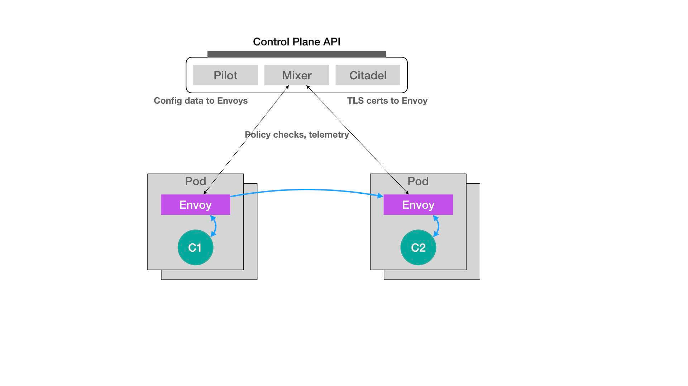

# 声明式API与Kubernetes编程范式

## 1. 声明式API

举个例子。我们知道，Docker Swarm 的编排操作都是基于命令行的，比如：

```sh
$ docker service create --name nginx --replicas 2  nginx
$ docker service update --image nginx:1.7.9 nginx
```

像这样的两条命令，就是用 Docker Swarm 启动了两个 Nginx 容器实例。其中，第一条 create 命令创建了这两个容器，而第二条 update 命令则把它们“滚动更新”成了一个新的镜像。

对于这种使用方式，我们称为**命令式命令行操作**。

那么，像上面这样的创建和更新两个 Nginx 容器的操作，在 Kubernetes 里又该怎么做呢？

这个流程，相信你已经非常熟悉了：我们需要在本地编写一个 Deployment 的 YAML 文件：

```yaml
apiVersion: apps/v1
kind: Deployment
metadata:
  name: nginx-deployment
spec:
  selector:
    matchLabels:
      app: nginx
  replicas: 2
  template:
    metadata:
      labels:
        app: nginx
    spec:
      containers:
      - name: nginx
        image: nginx
        ports:
        - containerPort: 80
```

然后，我们还需要使用 kubectl create 命令在 Kubernetes 里创建这个 Deployment 对象：

```sh
$ kubectl create -f nginx.yaml
```

而如果要更新这两个 Pod 使用的 Nginx 镜像，该怎么办呢？

比如，我们可以修改这个 YAML 文件里的 Pod 模板部分，把 Nginx 容器的镜像改成 1.7.9，如下所示：

```yaml
    spec:
      containers:
      - name: nginx
        image: nginx:1.7.9
```

而接下来，我们就可以执行一句 kubectl replace 操作，来完成这个 Deployment 的更新：

```sh
$ kubectl replace -f nginx.yaml
```

对于上面这种先 kubectl create，再 replace 的操作，我们称为**命令式配置文件操作**。


那么，到底什么才是“声明式 API”呢？答案是，kubectl apply 命令。

现在，我就使用 kubectl apply 命令来创建这个 Deployment：

```sh
$ kubectl apply -f nginx.yaml
```

这样，Nginx 的 Deployment 就被创建了出来，这看起来跟 kubectl create 的效果一样。然后，我再修改一下 nginx.yaml 里定义的镜像：

```yaml
...
    spec:
      containers:
      - name: nginx
        image: nginx:1.7.9
```

这时候，关键来了。在修改完这个 YAML 文件之后，我不再使用 kubectl replace 命令进行更新，而是继续执行一条 kubectl apply 命令，即：

```sh
$ kubectl apply -f nginx.yaml
```

这时，Kubernetes 就会立即触发这个 Deployment 的“滚动更新”。可是，它跟 kubectl replace 命令有什么本质区别吗？

可是，它跟 kubectl replace 命令有什么本质区别吗？

实际上，你可以简单地理解为，kubectl replace 的执行过程，是使用新的 YAML 文件中的 API 对象，**替换原有的 API 对象**；而 kubectl apply，则是执行了一个**对原有 API 对象的 PATCH 操作**。

> 类似地，kubectl set image 和 kubectl edit 也是对已有 API 对象的修改。

更进一步地，这意味着 kube-apiserver 在响应命令式请求（比如，kubectl replace）的时候，一次只能处理一个写请求，否则会有产生冲突的可能。而对于声明式请求（比如，kubectl apply），**一次能处理多个写操作，并且具备 Merge 能力**。


## 2. Istio

Istio 项目，实际上就是一个基于 Kubernetes 项目的微服务治理框架。



在上面这个架构图中，我们不难看到 Istio 项目架构的核心所在。**Istio 最根本的组件，是运行在每一个应用 Pod 里的 Envoy 容器**。

> 这个 Envoy 项目是 Lyft 公司推出的一个高性能 C++ 网络代理

而 Istio 项目，则把这个代理服务以 sidecar 容器的方式，运行在了每一个被治理的应用 Pod 中。我们知道，Pod 里的所有容器都共享同一个 Network Namespace。所以，**Envoy 容器就能够通过配置 Pod 里的 iptables 规则，把整个 Pod 的进出流量接管下来**。

这时候，Istio 的控制层（Control Plane）里的 Pilot 组件，就能够通过调用每个 Envoy 容器的 API，对这个 Envoy 代理进行配置，从而实现微服务治理。


更重要的是，在整个微服务治理的过程中，无论是对 Envoy 容器的部署，还是像上面这样对 Envoy 代理的配置，用户和应用都是完全“无感”的。

实际上，**Istio 项目使用的，是 Kubernetes 中的一个非常重要的功能，叫作 Dynamic Admission Control，也叫作：Initializer**。

现在，我给你举个例子。比如，我有如下所示的一个应用 Pod：

```yaml
apiVersion: v1
kind: Pod
metadata:
  name: myapp-pod
  labels:
    app: myapp
spec:
  containers:
  - name: myapp-container
    image: busybox
    command: ['sh', '-c', 'echo Hello Kubernetes! && sleep 3600']
```

可以看到，这个 Pod 里面只有一个用户容器，叫作：myapp-container。

接下来，Istio 项目要做的，就是在这个 Pod YAML 被提交给 Kubernetes 之后，在它对应的 API 对象里自动加上 Envoy 容器的配置，使这个对象变成如下所示的样子：

```yaml
apiVersion: v1
kind: Pod
metadata:
  name: myapp-pod
  labels:
    app: myapp
spec:
  containers:
  - name: myapp-container
    image: busybox
    command: ['sh', '-c', 'echo Hello Kubernetes! && sleep 3600']
  - name: envoy
    image: lyft/envoy:845747b88f102c0fd262ab234308e9e22f693a1
    command: ["/usr/local/bin/envoy"]
    ...
```

可以看到，被 Istio 处理后的这个 Pod 里，除了用户自己定义的 myapp-container 容器之外，多出了一个叫作 envoy 的容器，它就是 Istio 要使用的 Envoy 代理。

> 因为是自动添加的，所以说是对用户无感的。

那么，Istio 又是如何在用户完全不知情的前提下完成这个操作的呢？

Istio 要做的，就是编写一个用来为 Pod“自动注入”Envoy 容器的 Initializer。

**首先，Istio 会将这个 Envoy 容器本身的定义，以 ConfigMap 的方式保存在 Kubernetes 当中**。这个 ConfigMap（名叫：envoy-initializer）的定义如下所示：

```yaml

apiVersion: v1
kind: ConfigMap
metadata:
  name: envoy-initializer
data:
  config: |
    containers:
      - name: envoy
        image: lyft/envoy:845747db88f102c0fd262ab234308e9e22f693a1
        command: ["/usr/local/bin/envoy"]
        args:
          - "--concurrency 4"
          - "--config-path /etc/envoy/envoy.json"
          - "--mode serve"
        ports:
          - containerPort: 80
            protocol: TCP
        resources:
          limits:
            cpu: "1000m"
            memory: "512Mi"
          requests:
            cpu: "100m"
            memory: "64Mi"
        volumeMounts:
          - name: envoy-conf
            mountPath: /etc/envoy
    volumes:
      - name: envoy-conf
        configMap:
          name: envoy
```

这个 ConfigMap 的 data 部分，正是一个 Pod 对象的一部分定义。其中，我们可以看到 Envoy 容器对应的 containers 字段，以及一个用来声明 Envoy 配置文件的 volumes 字段。

不难想到，**Initializer 要做的工作，就是把这部分 Envoy 相关的字段，自动添加到用户提交的 Pod 的 API 对象里**。可是，用户提交的 Pod 里本来就有 containers 字段和 volumes 字段，所以 Kubernetes 在处理这样的更新请求时，就必须使用类似于 git merge 这样的操作，才能将这两部分内容合并在一起。

所以说，在 Initializer 更新用户的 Pod 对象的时候，必须使用 PATCH API 来完成。而这种 PATCH API，正是声明式 API 最主要的能力。

**接下来，Istio 将一个编写好的 Initializer，作为一个 Pod 部署在 Kubernetes 中**。这个 Pod 的定义非常简单，如下所示：

```yaml

apiVersion: v1
kind: Pod
metadata:
  labels:
    app: envoy-initializer
  name: envoy-initializer
spec:
  containers:
    - name: envoy-initializer
      image: envoy-initializer:0.0.1
      imagePullPolicy: Always
```

我们可以看到，这个 envoy-initializer 使用的 envoy-initializer:0.0.1 镜像，就是一个事先编写好的“自定义控制器”（Custom Controller）。而该 Initializer 的控制器，不断获取到的“实际状态”，就是用户新创建的 Pod。而它的“期望状态”，则是：这个 Pod 里被添加了 Envoy 容器的定义。

用一段 Go 语言风格的伪代码，来为你描述这个控制逻辑，如下所示：

```go
for {
  // 获取新创建的Pod
  pod := client.GetLatestPod()
  // Diff一下，检查是否已经初始化过
  if !isInitialized(pod) {
    // 没有？那就来初始化一下
    doSomething(pod)
  }
}
```

* 如果这个 Pod 里面已经添加过 Envoy 容器，那么就“放过”这个 Pod，进入下一个检查周期。
* 而如果还没有添加过 Envoy 容器的话，它就要进行 Initialize 操作了，即：修改该 Pod 的 API 对象（doSomething 函数）。

这时候，你应该立刻能想到，Istio 要往这个 Pod 里合并的字段，正是我们之前保存在 envoy-initializer 这个 ConfigMap 里的数据（即：它的 data 字段的值）。

所以，在 Initializer 控制器的工作逻辑里，它首先会从 APIServer 中拿到这个 ConfigMap：

```Go
func doSomething(pod) {
  cm := client.Get(ConfigMap, "envoy-initializer")
}
```

然后，把这个 ConfigMap 里存储的 containers 和 volumes 字段，直接添加进一个空的 Pod 对象里：

```go
func doSomething(pod) {
  cm := client.Get(ConfigMap, "envoy-initializer")
  
  newPod := Pod{}
  newPod.Spec.Containers = cm.Containers
  newPod.Spec.Volumes = cm.Volumes
}
```

现在，关键来了。Kubernetes 的 API 库，为我们提供了一个方法，使得我们可以直接使用新旧两个 Pod 对象，生成一个 TwoWayMergePatch：

```go
func doSomething(pod) {
  cm := client.Get(ConfigMap, "envoy-initializer")

  newPod := Pod{}
  newPod.Spec.Containers = cm.Containers
  newPod.Spec.Volumes = cm.Volumes

  // 生成patch数据
  patchBytes := strategicpatch.CreateTwoWayMergePatch(pod, newPod)

  // 发起PATCH请求，修改这个pod对象
  client.Patch(pod.Name, patchBytes)
}
```

**有了这个 TwoWayMergePatch 之后，Initializer 的代码就可以使用这个 patch 的数据，调用 Kubernetes 的 Client，发起一个 PATCH 请求**。

以上，就是关于 Initializer 最基本的工作原理和使用方法了。相信你此时已经明白，**Istio 项目的核心，就是由无数个运行在应用 Pod 中的 Envoy 容器组成的服务代理网格**。这也正是 Service Mesh 的含义。

此外，不难看到，无论是对 sidecar 容器的巧妙设计，还是对 Initializer 的合理利用，Istio 项目的设计与实现，其实都依托于 Kubernetes 的声明式 API 和它所提供的各种编排能力。可以说，Istio 是在 Kubernetes 项目使用上的一位“集大成者”。

而在使用 Initializer 的流程中，最核心的步骤，莫过于 Initializer“自定义控制器”的编写过程。它遵循的，正是标准的“Kubernetes 编程范式”，即：

**如何使用控制器模式，同 Kubernetes 里 API 对象的“增、删、改、查”进行协作，进而完成用户业务逻辑的编写过程**。

## 3. 小结

 Kubernetes“声明式 API”的独特之处：

* 首先，所谓“声明式”，指的就是我只需要提交一个定义好的 API 对象来“声明”，我所期望的状态是什么样子。
* 其次，“声明式 API”允许有多个 API 写端，以 PATCH 的方式对 API 对象进行修改，而无需关心本地原始 YAML 文件的内容。
* 最后，也是最重要的，有了上述两个能力，Kubernetes 项目才可以基于对 API 对象的增、删、改、查，在完全无需外界干预的情况下，完成对“实际状态”和“期望状态”的调谐（Reconcile）过程。

所以说，**声明式 API，才是 Kubernetes 项目编排能力“赖以生存”的核心所在**。

Istio：

**通过在用户Pod中自动添加 Envoy 容器，接着通过配置 Pod 里的 iptables 规则，把整个 Pod 的进出流量接管下来**。

这时候，Istio 的控制层（Control Plane）里的 Pilot 组件，就能够通过调用每个 Envoy 容器的 API，对这个 Envoy 代理进行配置，从而实现微服务治理


Kubernetes 编程范式：

**如何使用控制器模式，同 Kubernetes 里 API 对象的“增、删、改、查”进行协作，进而完成用户业务逻辑的编写过程**。

