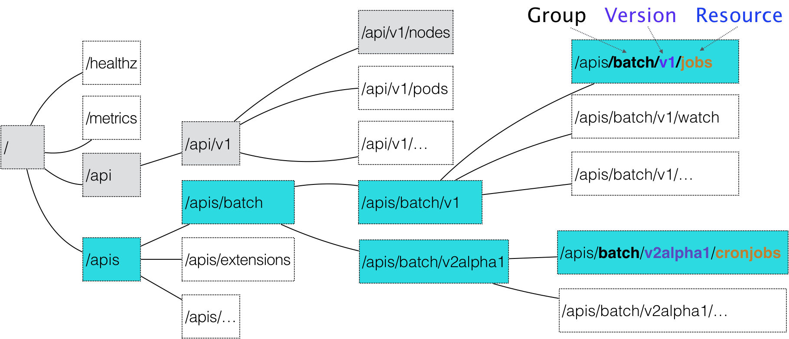
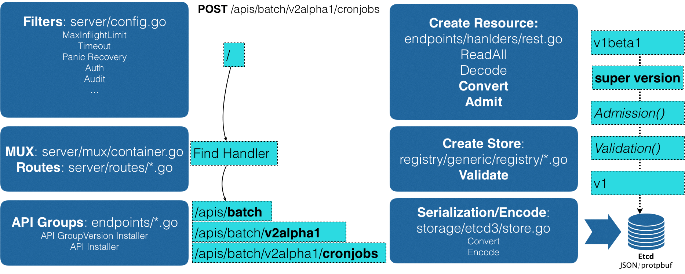

# API对象的奥秘

## 1. 概述

在 Kubernetes 项目中，一个 API 对象在 Etcd 里的完整资源路径，是由：Group（API 组）、Version（API 版本）和 Resource（API 资源类型）三个部分组成的。

通过这样的结构，整个 Kubernetes 里的所有 API 对象，实际上就可以用如下的树形结构表示出来：



可以看到：**Kubernetes 里 API 对象的组织方式，其实是层层递进的。**

比如，现在我要声明要创建一个 CronJob 对象，那么我的 YAML 文件的开始部分会这么写：

```yaml
apiVersion: batch/v2alpha1
kind: CronJob
...
```

在这个 YAML 文件中，“CronJob”就是这个 API 对象的资源类型（Resource），“batch”就是它的组（Group），v2alpha1 就是它的版本（Version）。

当我们提交了这个 YAML 文件之后，Kubernetes 就会把这个 YAML 文件里描述的内容，转换成 Kubernetes 里的一个 CronJob 对象。

那么，Kubernetes 是如何对 Resource、Group 和 Version 进行解析，从而在 Kubernetes 项目里找到 CronJob 对象的定义呢？

**首先，Kubernetes 会匹配 API 对象的组**。

需要明确的是，对于 Kubernetes 里的核心 API 对象，比如：Pod、Node 等，是不需要 Group 的（即：它们的 Group 是“”）。所以，对于这些 API 对象来说，Kubernetes 会直接在 /api 这个层级进行下一步的匹配过程。

而对于 CronJob 等非核心 API 对象来说，Kubernetes 就必须在 /apis 这个层级里查找它对应的 Group，进而根据“batch”这个 Group 的名字，找到 /apis/batch。不难发现，这些 API Group 的分类是以对象功能为依据的，比如 Job 和 CronJob 就都属于“batch” （离线业务）这个 Group。

**然后，Kubernetes 会进一步匹配到 API 对象的版本号。**

对于 CronJob 这个 API 对象来说，Kubernetes 在 batch 这个 Group 下，匹配到的版本号就是 v2alpha1。

> 在 Kubernetes 中，同一种 API 对象可以有多个版本，这正是 Kubernetes 进行 API 版本化管理的重要手段。这样，比如在 CronJob 的开发过程中，对于会影响到用户的变更就可以通过升级新版本来处理，从而保证了向后兼容。

**最后，Kubernetes 会匹配 API 对象的资源类型。**

在前面匹配到正确的版本之后，Kubernetes 就知道，我要创建的原来是一个 /apis/batch/v2alpha1 下的 CronJob 对象。

这时候，APIServer 就可以继续创建这个 CronJob 对象了。为了方便理解，我为你总结了一个如下所示流程图来阐述这个创建过程：



**首先**，当我们发起了创建 CronJob 的 POST 请求之后，我们编写的 YAML 的信息就被提交给了 APIServer。

而 APIServer 的第一个功能，就是过滤这个请求，并完成一些前置性的工作，比如授权、超时处理、审计等。

**然后**，请求会进入 MUX 和 Routes 流程。如果你编写过 Web Server 的话就会知道，MUX 和 Routes 是 APIServer 完成 URL 和 Handler 绑定的场所。而 APIServer 的 Handler 要做的事情，就是按照我刚刚介绍的匹配过程，找到对应的 CronJob 类型定义。

**接着**，APIServer 最重要的职责就来了：根据这个 CronJob 类型定义，使用用户提交的 YAML 文件里的字段，创建一个 CronJob 对象。

而在这个过程中，APIServer 会进行一个 Convert 工作，即：把用户提交的 YAML 文件，转换成一个叫作 Super Version 的对象，它正是该 API 资源类型所有版本的字段全集。这样用户提交的不同版本的 YAML 文件，就都可以用这个 Super Version 对象来进行处理了。

**接下来**，APIServer 会先后进行 Admission() 和 Validation() 操作。比如，我在上一篇文章中提到的 Admission Controller 和 Initializer，就都属于 Admission 的内容。

而 Validation，则负责验证这个对象里的各个字段是否合法。这个被验证过的 API 对象，都保存在了 APIServer 里一个叫作 Registry 的数据结构中。也就是说，只要一个 API 对象的定义能在 Registry 里查到，它就是一个有效的 Kubernetes API 对象。

**最后**，APIServer 会把验证过的 API 对象转换成用户最初提交的版本，进行序列化操作，并调用 Etcd 的 API 把它保存起来。

由此可见：**APIServer 这样一个在其他项目里“平淡无奇”的组件，却成了 Kubernetes 项目的重中之重**。


## 2. CRD

由于同时要兼顾性能、API 完备性、版本化、向后兼容等很多工程化指标，所以 Kubernetes 团队在 APIServer 项目里大量使用了 Go 语言的代码生成功能，来自动化诸如 Convert、DeepCopy 等与 API 资源相关的操作。

在这样一个极其“复杂”的 APIServer 中，添加一个 Kubernetes 风格的 API 资源类型，是一个非常困难的工作。

不过，在 Kubernetes v1.7 增加 CRD（ Custom Resource Definition）插件之后就好多了。

CRD 允许用户在 Kubernetes 中添加一个跟 Pod、Node 类似的、新的 API 资源类型，即：**自定义 API 资源**。

这个 Network 对象的 YAML 文件，名叫 example-network.yaml，它的内容如下所示：

```yaml
apiVersion: samplecrd.k8s.io/v1
kind: Network
metadata:
  name: example-network
spec:
  cidr: "192.168.0.0/16"
  gateway: "192.168.0.1"
```

可以看到，我想要描述“网络”的 API 资源类型是 Network；API 组是samplecrd.k8s.io；API 版本是 v1。

为了让 Kubernetes 知道具体信息，接下来还要编写一个 CRD 的 YAML 文件，它的名字叫作 network.yaml，内容如下所示：

```yaml
apiVersion: apiextensions.k8s.io/v1beta1
kind: CustomResourceDefinition
metadata:
  name: networks.samplecrd.k8s.io
spec:
  group: samplecrd.k8s.io
  version: v1
  names:
    kind: Network
    plural: networks
  scope: Namespaced
```

可以看到，在这个 CRD 中，我指定了“group: samplecrd.k8s.io”“version: v1”这样的 API 信息，也指定了这个 CR 的资源类型叫作 Network，复数（plural）是 networks。然后，我还声明了它的 scope 是 Namespaced，即：我们定义的这个 Network 是一个属于 Namespace 的对象，类似于 Pod。

这时候，Kubernetes 就能够认识和处理所有声明了 API 类型是“samplecrd.k8s.io/v1/network”的 YAML 文件了。


## 3. 自定义控制器

**这个控制器要做的第一件事，是从 Kubernetes 的 APIServer 里获取它所关心的对象，也就是我定义的 Network 对象**。

> 这个操作，依靠的是一个叫作 Informer（可以翻译为：通知器）的代码库完成的。Informer 与 API 对象是一一对应的，所以我传递给自定义控制器的，正是一个 Network 对象的 Informer（Network Informer）。

Informer 的第一个职责是同步本地缓存的工作，也是它最重要的职责。

第二个职责，则是根据这些事件的类型，触发事先注册好的 ResourceEventHandler。

**而如果能够获取到对应的 Network 对象，我就可以执行控制器模式里的对比“期望状态”和“实际状态”的逻辑了**。

* 期望状态：由 自定义控制器 从 APIServer 中获取。
* 实际状态：来自于集群

> 这样，我就通过对比“期望状态”和“实际状态”的差异，完成了一次调协（Reconcile）的过程。

所以，接下来，作为开发者，你就只需要关注如何拿到“实际状态”，然后如何拿它去跟“期望状态”做对比，从而决定接下来要做的业务逻辑即可。