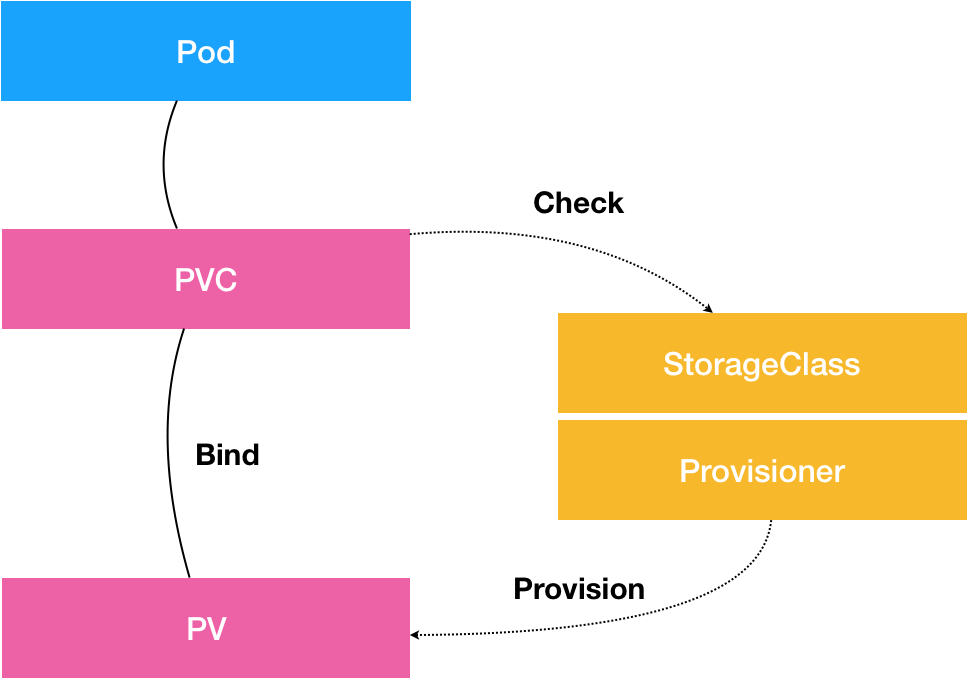

# PV、PVC、StorageClass

## 1. 概述

简单理解：

* PV 是具体实现
* PVC 是接口
* StorageClass 则是根据接口自动创建具体实现的插件


**PV 描述的，是持久化存储数据卷**。这个 API 对象主要定义的是一个持久化存储在宿主机上的目录，比如一个 NFS 的挂载目录。

> 通常情况下，PV 对象是由运维人员事先创建在 Kubernetes 集群里待用的

比如，运维人员可以定义这样一个 NFS 类型的 PV，如下所示：

```yaml
apiVersion: v1
kind: PersistentVolume
metadata:
  name: nfs
spec:
  storageClassName: manual
  capacity:
    storage: 1Gi
  accessModes:
    - ReadWriteMany
  nfs:
    server: 10.244.1.4
    path: "/"
```

**PVC 描述的，则是 Pod 所希望使用的持久化存储的属性**。比如，Volume 存储的大小、可读写权限等等。

> PVC 对象通常由开发人员创建；或者以 PVC 模板的方式成为 StatefulSet 的一部分，然后由 StatefulSet 控制器负责创建带编号的 PVC。

比如，开发人员可以声明一个 1 GiB 大小的 PVC，如下所示：

```yaml
apiVersion: v1
kind: PersistentVolumeClaim
metadata:
  name: nfs
spec:
  accessModes:
    - ReadWriteMany
  storageClassName: manual
  resources:
    requests:
      storage: 1Gi
```


**而用户创建的 PVC 要真正被容器使用起来，就必须先和某个符合条件的 PV 进行绑定**。这里要检查的条件，包括两部分：

* 1）第一个条件，当然是 PV 和 PVC 的 spec 字段。比如，PV 的存储（storage）大小，就必须满足 PVC 的要求。
* 2）而第二个条件，则是 PV 和 PVC 的 storageClassName 字段必须一样。这个机制我会在本篇文章的最后一部分专门介绍

在成功地将 PVC 和 PV 进行绑定之后，Pod 就能够像使用 hostPath 等常规类型的 Volume 一样，在自己的 YAML 文件里声明使用这个 PVC 了，如下所示：

```yaml
apiVersion: v1
kind: Pod
metadata:
  labels:
    role: web-frontend
spec:
  containers:
  - name: web
    image: nginx
    ports:
      - name: web
        containerPort: 80
    volumeMounts:
        - name: nfs
          mountPath: "/usr/share/nginx/html"
  volumes:
  - name: nfs
    persistentVolumeClaim:
      claimName: nfs
```

可以看到，Pod 需要做的，就是在 volumes 字段里声明自己要使用的 PVC 名字。接下来，等这个 Pod 创建之后，kubelet 就会把这个 PVC 所对应的 PV，也就是一个 NFS 类型的 Volume，挂载在这个 Pod 容器内的目录上。

**PVC 和 PV 的设计，其实跟“面向对象”的思想完全一致**。

PVC 可以理解为持久化存储的“接口”，它提供了对某种持久化存储的描述，但不提供具体的实现；而这个持久化存储的实现部分则由 PV 负责完成。

> 这样做的好处是，作为应用开发者，我们只需要跟 PVC 这个“接口”打交道，而不必关心具体的实现是 NFS 还是 Ceph。毕竟这些存储相关的知识太专业了，应该交给专业的人去做。


PV、PVC、StorageClass 具体关系如下图所示：




## 2. PersistentVolumeController

你在创建 Pod 的时候，系统里并没有合适的 PV 跟Pod中定义的 PVC 绑定，也就是说此时容器想要使用的 Volume 不存在。这时候，Pod 的启动就会报错。

但是，过了一会儿，运维人员也发现了这个情况，所以他赶紧创建了一个对应的 PV。

> 这时候，我们当然希望 Kubernetes 能够再次完成 PVC 和 PV 的绑定操作，从而启动 Pod。

所以在 Kubernetes 中，实际上存在着一个专门处理持久化存储的控制器，PersistentVolumeController。

它会不断地查看当前每一个 PVC，是不是已经处于 Bound（已绑定）状态。如果不是，那它就会遍历所有的、可用的 PV，并尝试将其与这个“单身”的 PVC 进行绑定。

而所谓将一个 PV 与 PVC 进行“绑定”，其实就是将这个 PV 对象的名字，填在了 PVC 对象的 spec.volumeName 字段上。所以，接下来 Kubernetes 只要获取到这个 PVC 对象，就一定能够找到它所绑定的 PV。


## 持久化 Volume

所谓容器的 Volume，其实就是将一个宿主机上的目录，跟一个容器里的目录绑定挂载在了一起。

**而所谓的“持久化 Volume”，指的就是这个宿主机上的目录，具备“持久性”**。即：这个目录里面的内容，既不会因为容器的删除而被清理掉，也不会跟当前的宿主机绑定。这样，当容器被重启或者在其他节点上重建出来之后，它仍然能够通过挂载这个 Volume，访问到这些内容。

> 所以，大多数情况下，持久化 Volume 的实现，往往依赖于一个远程存储服务，比如：远程文件存储（比如，NFS、GlusterFS）、远程块存储（比如，公有云提供的远程磁盘）等等。

而 Kubernetes 需要做的工作，就是使用这些存储服务，来为容器准备一个持久化的宿主机目录，以供将来进行绑定挂载时使用。而所谓“持久化”，指的是容器在这个目录里写入的文件，都会保存在远程存储中，从而使得这个目录具备了“持久性”。

**这个准备“持久化”宿主机目录的过程，我们可以形象地称为“两阶段处理”**。

* 1）**Attach**，即为虚拟机挂载远程磁盘。
  * 如果是远程块存储的话需要这个阶段，挂载一个磁盘。
  * 如果是远程文件存储，则会跳过该阶段。
* 2）**Mount**，将磁盘设备格式化并挂载到 Volume 宿主机目录。

**Kubernetes 又是如何定义和区分这两个阶段的？**

其实很简单，在具体的 Volume 插件的实现接口上，Kubernetes 分别给这两个阶段提供了两种不同的参数列表：

* 对于“第一阶段”（Attach），Kubernetes 提供的可用参数是 nodeName，即宿主机的名字。
* 而对于“第二阶段”（Mount），Kubernetes 提供的可用参数是 dir，即 Volume 的宿主机目录。所以，作为一个存储插件，你只需要根据自己的需求进行选择和实现即可。

而经过了“两阶段处理”，我们就得到了一个“持久化”的 Volume 宿主机目录。所以，接下来，kubelet 只要把这个 Volume 目录通过 CRI 里的 Mounts 参数，传递给 Docker，然后就可以为 Pod 里的容器挂载这个“持久化”的 Volume 了。

> 对应地，在删除一个 PV 的时候，Kubernetes 也需要 Unmount 和 Dettach 两个阶段来处理。


## 3.控制循环

上述关于 PV 的“两阶段处理”流程，是靠独立于 kubelet 主控制循环（Kubelet Sync Loop）之外的两个控制循环来实现的。

“第一阶段”的 Attach（以及 Dettach）操作是由 Volume Controller 负责维护的，这个控制循环的名字叫作：**AttachDetachController**。

而它的作用，就是不断地检查每一个 Pod 对应的 PV，和这个 Pod 所在宿主机之间挂载情况。从而决定，是否需要对这个 PV 进行 Attach（或者 Dettach）操作。

而“第二阶段”的 Mount（以及 Unmount）操作，必须发生在 Pod 对应的宿主机上，所以它必须是 kubelet 组件的一部分。这个控制循环的名字，叫作：**VolumeManagerReconciler**，它运行起来之后，是一个独立于 kubelet 主循环的 Goroutine。

通过这样将 Volume 的处理同 kubelet 的主循环解耦，Kubernetes 就避免了这些耗时的远程挂载操作拖慢 kubelet 的主控制循环，进而导致 Pod 的创建效率大幅下降的问题。实际上，**kubelet 的一个主要设计原则，就是它的主控制循环绝对不可以被 block**。


## 4. StorageClass

大规模集群中可以存在成千上万个 PVC，这就意味着运维人员必须得事先创建出成千上万个 PV，随着 PVC 的提交，还要同步创建出对应的 PV。在实际操作中，这几乎没办法靠人工做到。

所以，Kubernetes 为我们提供了一套可以**自动创建 PV 的机制**，即：Dynamic Provisioning。

> 相比之下，前面人工管理 PV 的方式就叫作 Static Provisioning。

Dynamic Provisioning 机制工作的核心，在于一个名叫 StorageClass 的 API 对象。

**而 StorageClass 对象的作用，其实就是创建 PV 的模板**。

具体地说，StorageClass 对象会定义如下两个部分内容：

* 1）第一，PV 的属性。比如，存储类型、Volume 的大小等等。
* 2）第二，创建这种 PV 需要用到的存储插件。比如 NFS ，Ceph 等等。

有了这样两个信息之后，Kubernetes 就能够根据用户提交的 PVC，找到一个对应的 StorageClass 了。然后，**Kubernetes 就会调用该 StorageClass 声明的存储插件，创建出需要的 PV**。


现在使用步骤就变成了：

* 1）运维人员创建 StorageClass；
* 2）开发人员在 PVC 中指定要使用的 StorageClass 名字；
* 3）创建 PVC 时 Kubernetes 就会自动创建出对应的 PV。


一个基于 Rook 存储服务的 StorageClass 定义如下：

```yaml
apiVersion: ceph.rook.io/v1beta1
kind: Pool
metadata:
  name: replicapool
  namespace: rook-ceph
spec:
  replicated:
    size: 3
---
apiVersion: storage.k8s.io/v1
kind: StorageClass
metadata:
  name: block-service
provisioner: ceph.rook.io/block
parameters:
  pool: replicapool
  #The value of "clusterNamespace" MUST be the same as the one in which your rook cluster exist
  clusterNamespace: rook-ceph
```

在这个 YAML 文件中，我们定义了一个名叫 block-service 的 StorageClass，它声明使的存储插件是由 Rook 项目。

然后创建这个 StorageClass

```sh
$ kubectl create -f sc.yaml
```

这时候，作为应用开发者，我们只需要在 PVC 里指定要使用的 StorageClass 名字即可，如下所示：

```yaml
apiVersion: v1
kind: PersistentVolumeClaim
metadata:
  name: claim1
spec:
  accessModes:
    - ReadWriteOnce
  storageClassName: block-service
  resources:
    requests:
      storage: 30Gi
```

可以看到，我们在这个 PVC 里添加了一个叫作 **storageClassName **的字段，用于指定该 PVC 所要使用的 StorageClass 的名字是：block-service。

看一下 Kubernetes 自动创建 PV 的过程。

```sh
$ kubectl create -f pvc.yaml
```

我们创建的 PVC 会绑定一个 Kubernetes 自动创建的 PV，如下所示：

```sh
$ kubectl describe pvc claim1
Name:           claim1
Namespace:      default
StorageClass:   block-service
Status:         Bound
Volume:         pvc-e5578707-c626-11e6-baf6-08002729a32b
Labels:         <none>
Capacity:       30Gi
Access Modes:   RWO
No Events.
```

而且，通过查看这个自动创建的 PV 的属性，你就可以看到它跟我们在 PVC 里声明的存储的属性是一致的，如下所示：

```sh
$ kubectl describe pv pvc-e5578707-c626-11e6-baf6-08002729a32b
Name:            pvc-e5578707-c626-11e6-baf6-08002729a32b
Labels:          <none>
StorageClass:    block-service
Status:          Bound
Claim:           default/claim1
Reclaim Policy:  Delete
Access Modes:    RWO
Capacity:        30Gi
...
No events.
```

同时这个自动创建出来的 PV 的 StorageClass 字段的值，也是 block-service。这是因为，**Kubernetes 只会将 StorageClass 相同的 PVC 和 PV 绑定起来**。


需要注意的是，**StorageClass 并不是专门为了 Dynamic Provisioning 而设计的**。

因为 Kubernetes 只会将 StorageClass 相同的 PVC 和 PV 绑定起来，所以利用`storageClassName` 字段可以控制 PVC 和 PV 的绑定关系。


## 5. 小结


* PVC 描述的，是 Pod 想要使用的持久化存储的属性，比如存储的大小、读写权限等。
* PV 描述的，则是一个具体的 Volume 的属性，比如 Volume 的类型、挂载目录、远程存储服务器地址等。
* 而 StorageClass 的作用，则是充当 PV 的模板。并且，只有同属于一个 StorageClass 的 PV 和 PVC，才可以绑定在一起。

使用步骤：

* 1）运维人员创建 StorageClass ；
* 2）开发人员在 PVC 中指定要使用的 StorageClass 名字；
* 3）创建 PVC 时 Kubernetes 就会自动创建出对应的 PV。

简单理解：

* PV是具体实现
* PVC是接口
* StorageClass 则是根据接口自动创建具体实现的插件