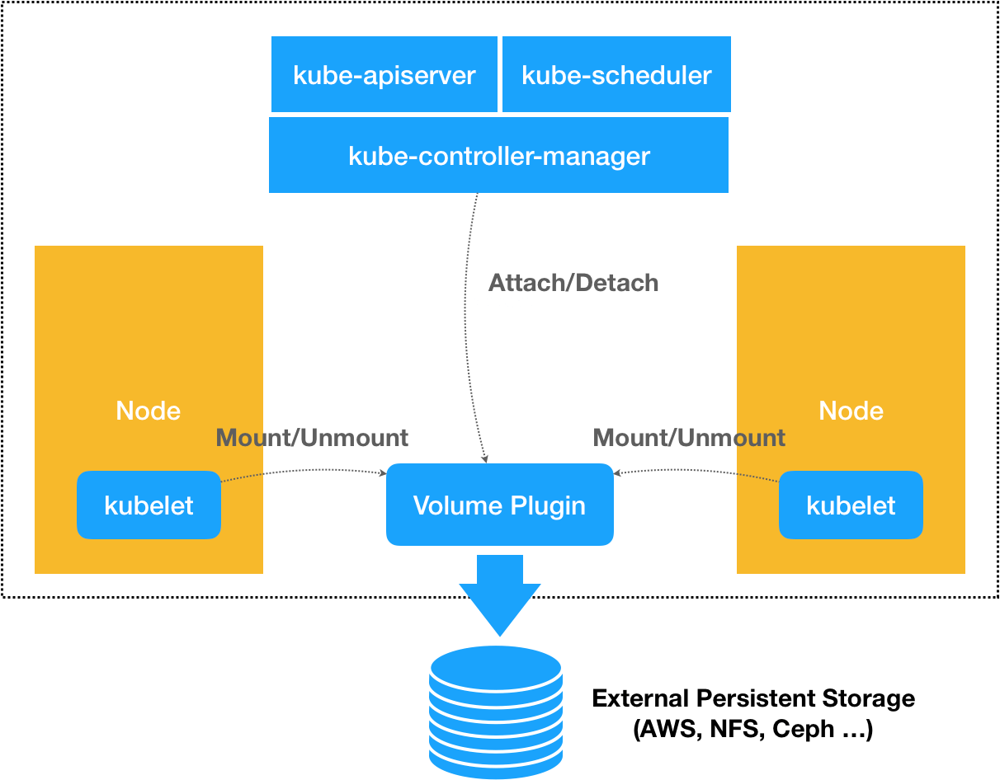
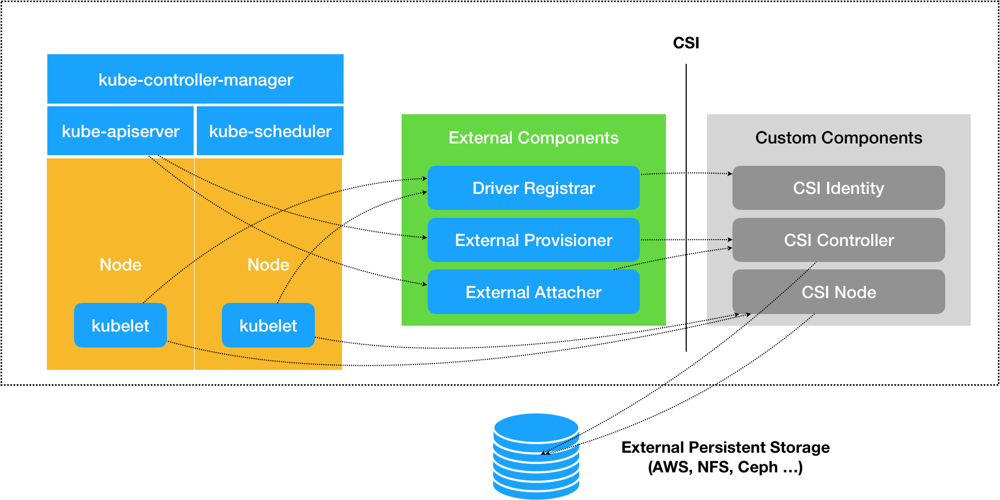

# CSI插件


## 1. 概述

在 Kubernetes 中，存储插件的开发有两种方式：FlexVolume 和 CSI。


## 2. FlexVolume 

**FlexVolume 可以看做和其他普通 Volume 一样，只是需要自定义 `Attach /DeAttach`、`Mount/UnMount` 这两阶段的具体实现**。

举个例子，现在我们要编写的是一个使用 NFS 实现的 FlexVolume 插件。

对于一个 FlexVolume 类型的 PV 来说，它的 YAML 文件如下所示：

```yaml
apiVersion: v1
kind: PersistentVolume
metadata:
  name: pv-flex-nfs
spec:
  capacity:
    storage: 10Gi
  accessModes:
    - ReadWriteMany
  flexVolume:
    driver: "k8s/nfs"
    fsType: "nfs"
    options:
      server: "10.10.0.25" # 改成你自己的NFS服务器地址
      share: "export"
```

以看到，这个 PV 定义的 Volume 类型是 flexVolume。并且，**我们指定了这个 Volume 的 driver 叫作 k8s/nfs**。

而 Volume 的 options 字段，则是一个自定义字段。也就是说，它的类型，其实是 map[string]string。所以，你可以在这一部分自由地加上你想要定义的参数。

像这样的一个 PV 被创建后，一旦和某个 PVC 绑定起来，这个 FlexVolume 类型的 Volume 就会进入到我们前面讲解过的 Volume 处理流程。

> 这个流程的名字叫作“两阶段处理”，即“Attach 阶段”和“Mount 阶段”。它们的主要作用，是在 Pod 所绑定的宿主机上，完成这个 Volume 目录的持久化过程，比如为虚拟机挂载磁盘（Attach），或者挂载一个 NFS 的共享目录（Mount）。

而在具体的控制循环中，这两个操作实际上调用的，正是 Kubernetes 的 pkg/volume 目录下的存储插件（Volume Plugin）。在我们这个例子里，就是 pkg/volume/flexvolume 这个目录里的代码。**这个目录就是 FlexVolume 插件的入口**。

以“Mount 阶段”为例，在 FlexVolume 目录里，它的处理过程非常简单，如下所示：

```go
// SetUpAt creates new directory.
func (f *flexVolumeMounter) SetUpAt(dir string, fsGroup *int64) error {
  ...
  call := f.plugin.NewDriverCall(mountCmd)
  
  // Interface parameters
  call.Append(dir)
  
  extraOptions := make(map[string]string)
  
  // pod metadata
  extraOptions[optionKeyPodName] = f.podName
  extraOptions[optionKeyPodNamespace] = f.podNamespace
  
  ...
  
  call.AppendSpec(f.spec, f.plugin.host, extraOptions)
  
  _, err = call.Run()
  
  ...
  
  return nil
}
```

上面这个名叫 SetUpAt() 的方法，正是 FlexVolume 插件对“Mount 阶段”的实现位置。而 SetUpAt() 实际上只做了一件事，那就是封装出了一行命令（即：NewDriverCall），由 kubelet 在“Mount 阶段”去执行。

**kubelet 要通过插件在宿主机上执行的命令，如下所示**：

```sh
/usr/libexec/kubernetes/kubelet-plugins/volume/exec/k8s~nfs/nfs mount <mount dir> <json param>
```

其中，/usr/libexec/kubernetes/kubelet-plugins/volume/exec/k8s~nfs/nfs 就是插件的可执行文件的路径。这个名叫 nfs 的文件，正是你要编写的插件的实现。它可以是一个二进制文件，也可以是一个脚本。总之，只要能在宿主机上被执行起来即可。

> 而且这个路径里的 k8s~nfs 部分，正是这个插件在 Kubernetes 里的名字。它是从 driver="k8s/nfs"字段解析出来的。
>
> 这个 driver 字段的格式是：vendor/driver。比如，一家存储插件的提供商（vendor）的名字叫作 k8s，提供的存储驱动（driver）是 nfs，那么 Kubernetes 就会使用 k8s~nfs 来作为插件名。

所以说，**当你编写完了 FlexVolume 的实现之后，一定要把它的可执行文件放在每个节点的插件目录下**。

而紧跟在可执行文件后面的“mount”参数，定义的就是当前的操作。在 FlexVolume 里，这些操作参数的名字是固定的，比如 init、mount、unmount、attach，以及 dettach 等等，分别对应不同的 Volume 处理操作。

而跟在 mount 参数后面的两个字段：`<mount dir>`和`<json params>`，则是 FlexVolume 必须提供给这条命令的两个执行参数。

其中第一个执行参数`<mount dir>`，正是 kubelet 调用 SetUpAt() 方法传递来的 dir 的值。它代表的是当前正在处理的 Volume 在宿主机上的目录。在我们的例子里，这个路径如下所示：

```sh
/var/lib/kubelet/pods/<Pod ID>/volumes/k8s~nfs/test
```

其中，test 正是我们前面定义的 PV 的名字；而 k8s~nfs，则是插件的名字。可以看到，插件的名字正是从你声明的 driver="k8s/nfs"字段里解析出来的。

而第二个执行参数`<json params>`，则是一个 JSON Map 格式的参数列表。我们在前面 PV 里定义的 options 字段的值，都会被追加在这个参数里。此外，在 SetUpAt() 方法里可以看到，这个参数列表里还包括了 Pod 的名字、Namespace 等元数据（Metadata）。在明白了存储插件的调用方式和参数列表之后，这个插件的可执行文件的实现部分就非常容易理解了。


在这个例子中，我直接编写了一个简单的 shell 脚本来作为插件的实现，它对“Mount 阶段”的处理过程，如下所示：

```sh
domount() {
 MNTPATH=$1
 
 NFS_SERVER=$(echo $2 | jq -r '.server')
 SHARE=$(echo $2 | jq -r '.share')
 
 ...
 
 mkdir -p ${MNTPATH} &> /dev/null
 
 mount -t nfs ${NFS_SERVER}:/${SHARE} ${MNTPATH} &> /dev/null
 if [ $? -ne 0 ]; then
  err "{ \"status\": \"Failure\", \"message\": \"Failed to mount ${NFS_SERVER}:${SHARE} at ${MNTPATH}\"}"
  exit 1
 fi
 log '{"status": "Success"}'
 exit 0
}
```

简单的从命令行获取参数并解析，然后执行 mount 命令。

需要注意的是，当这个 mount -t nfs 操作完成后，你必须把一个 JOSN 格式的字符串，比如：{“status”: “Success”}，返回给调用者，也就是 kubelet。这是 kubelet 判断这次调用是否成功的唯一依据。


不过，**像这样的 FlexVolume 实现方式，虽然简单，但局限性却很大**。

比如，我的插件在执行 mount 操作的时候，可能会生成一些挂载信息。这些信息，在后面执行 unmount 操作的时候会被用到。可是，在上述 FlexVolume 的实现里，你没办法把这些信息保存在一个变量里，等到 unmount 的时候直接使用。

**FlexVolume 每一次对插件可执行文件的调用，都是一次完全独立的操作**。所以，我们只能把这些信息写在一个宿主机上的临时文件里，等到 unmount 的时候再去读取。

## 3. CSI

和 FlexVolume 不同， CSI 直接对两阶段的流程进行了调整，扩展成了 Provision、Attach 和 Mount 三个阶段。

原理如下:



可以看到，在上述体系下，无论是 FlexVolume，还是 Kubernetes 内置的其他存储插件，它们实际上担任的角色，仅仅是 Volume 管理中的“Attach 阶段”和“Mount 阶段”的具体执行者。而像 Dynamic Provisioning 这样的功能，就不是存储插件的责任，而是 Kubernetes 本身存储管理功能的一部分。

相比之下，**CSI 插件体系的设计思想，就是把这个 Provision 阶段，以及 Kubernetes 里的一部分存储管理功能，从主干代码里剥离出来，做成了几个单独的组件**。



而图中最右侧的部分，就是需要我们编写代码来实现的 CSI 插件。一个 CSI 插件只有一个二进制文件，但它会以 gRPC 的方式对外提供三个服务（gRPC Service），分别叫作：CSI Identity、CSI Controller 和 CSI Node。


* Driver Registrar 组件，负责将插件注册到 kubelet 里面；
* External Provisioner 组件，负责的正是 Provision 阶段；
* External Attacher 组件，负责的正是“Attach 阶段”。


## 4. 小结

FlexVolume 只是一个存储插件。

**FlexVolume 可以看做和其他普通 Volume 一样，只是需要自定义 `Attach /DeAttach`、`Mount/UnMount` 这两阶段的具体实现**。

CSI 则类似于一套通用的存储插件设计。

相比于 FlexVolume，CSI 的设计思想，把插件的职责从“两阶段处理”，扩展成了 Provision、Attach 和 Mount 三个阶段。其中，Provision 等价于“创建磁盘”，Attach 等价于“挂载磁盘到虚拟机”，Mount 等价于“将该磁盘格式化后，挂载在 Volume 的宿主机目录上”。

在有了 CSI 插件之后，Kubernetes 数据卷处理本身流程没有变化，只是具体调用有所不同。

* 当 AttachDetachController 需要进行“Attach”操作时（“Attach 阶段”），它实际上会执行到 pkg/volume/csi 目录中，创建一个 VolumeAttachment 对象，从而触发 External Attacher 调用 CSI Controller 服务的 ControllerPublishVolume 方法。
* 当 VolumeManagerReconciler 需要进行“Mount”操作时（“Mount 阶段”），它实际上也会执行到 pkg/volume/csi 目录中，直接向 CSI Node 服务发起调用 NodePublishVolume 方法的请求。