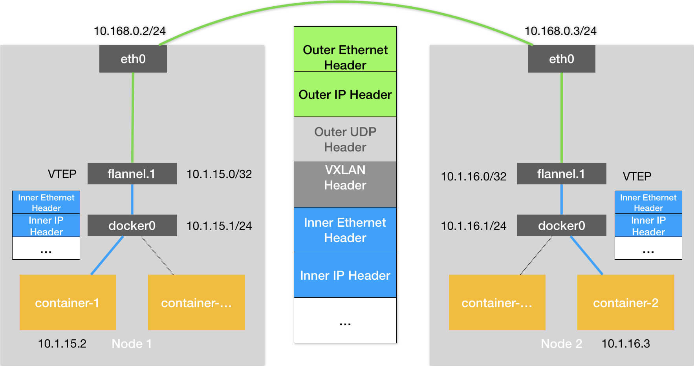
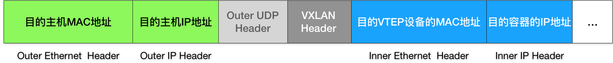

# Kubernetes 跨主机网络

## 1. 概述

Docker 的默认配置下，不同宿主机上的容器通过 IP 地址进行互相访问是根本做不到的。

为了解决这个容器“跨主通信”的问题，社区里才出现了那么多的容器网络方案。

Flannel 项目是 CoreOS 公司主推的容器网络方案。目前，Flannel 支持三种后端实现，分别是：

* 1）VXLAN；
* 2）host-gw；
* 3）UDP

而 UDP 模式，是 Flannel 项目最早支持的一种方式，却也是性能最差的一种方式。所以，这个模式目前已经被弃用。不过，Flannel 之所以最先选择 UDP 模式，就是因为这种模式是最直接、也是最容易理解的容器跨主网络实现。


在这个例子中，我有两台宿主机。

* 宿主机 Node 1 上有一个容器 container-1，它的 IP 地址是 100.96.1.2，对应的 docker0 网桥的地址是：100.96.1.1/24。
* 宿主机 Node 2 上有一个容器 container-2，它的 IP 地址是 100.96.2.3，对应的 docker0 网桥的地址是：100.96.2.1/24。

我们现在的任务，就是让 container-1 访问 container-2。

## 2. Flannel UDP

### 1. 大致流程

UDP 方案具体流程如下图所示：


### 2. flannel0

该方案使用时会在各个 Work 节点上运行一个Flannel 进程，同时创建一个 flannel0 ，而这个 flannel0 它是一个 TUN 设备（Tunnel 设备）。

在 Linux 中，TUN 设备是一种工作在三层（Network Layer）的虚拟网络设备。TUN 设备的功能非常简单，即：**在操作系统内核和用户应用程序之间传递 IP 包**。


当操作系统将一个 IP 包发送给 flannel0 设备之后，flannel0 就会把这个 IP  包，交给创建这个设备的应用程序，也就是 Flannel 进程。

> 这是一个从内核态向用户态的流动方向。

反之，如果 Flannel 进程向 flannel0 设备发送了一个 IP 包，那么这个 IP 包就会出现在宿主机网络栈中，然后根据宿主机的路由表进行下一步处理。

> 这是一个从用户态向内核态的流动方向。


### 3. Subnet

子网（Subnet)  是  Flannel 项目里一个非常重要的概念。

事实上，在由 Flannel 管理的容器网络里，一台宿主机上的所有容器，都属于该宿主机被分配的一个“子网”。

> 在我们的例子中，Node 1 的子网是 100.96.1.0/24，container-1 的 IP 地址是 100.96.1.2。Node 2 的子网是 100.96.2.0/24，container-2 的 IP 地址是 100.96.2.3。

而这些子网与宿主机的对应关系，正是保存在 Etcd 当中，如下所示：

```sh
$ etcdctl ls /coreos.com/network/subnets
/coreos.com/network/subnets/100.96.1.0-24
/coreos.com/network/subnets/100.96.2.0-24
/coreos.com/network/subnets/100.96.3.0-24
```

所以，flanneld 进程在处理由 flannel0 传入的 IP 包时，就可以根据目的 IP 的地址（比如 100.96.2.3），匹配到对应的子网（比如 100.96.2.0/24），从 Etcd 中找到这个子网对应的宿主机的 IP 地址是 10.168.0.3，如下所示：

```sh
$ etcdctl get /coreos.com/network/subnets/100.96.2.0-24
{"PublicIP":"10.168.0.3"}
```

> 即根据容器IP确定子网，根据子网确定宿主机IP。


### 4. 具体步骤

**step 1：容器到宿主机**

container-1 容器里的进程发起的 IP 包，其源地址就是 100.96.1.2，目的地址就是 100.96.2.3。

由于目的地址 100.96.2.3 并不在 Node 1 的 docker0 网桥的网段里，所以这个 IP 包会被交给默认路由规则，通过容器的网关进入 docker0 网桥（如果是同一台宿主机上的容器间通信，走的是直连规则），从而出现在宿主机上。

**step 2：宿主机路由到 flannel0 设备**

这时候，这个 IP 包的下一个目的地，就取决于宿主机上的路由规则了。

> Flannel 已经在宿主机上创建出了一系列的路由规则。

以 Node 1 为例，如下所示：

```sh
# 在Node 1上
$ ip route
default via 10.168.0.1 dev eth0
100.96.0.0/16 dev flannel0  proto kernel  scope link  src 100.96.1.0
100.96.1.0/24 dev docker0  proto kernel  scope link  src 100.96.1.1
10.168.0.0/24 dev eth0  proto kernel  scope link  src 10.168.0.2
```

由于我们的 IP 包的目的地址是 100.96.2.3，只能匹配到第二条、也就是 100.96.0.0/16 对应的这条路由规则，从而进入到一个叫作 flannel0 的设备中。

**step 3：flanneld 进程转发给 Node2**

flannel0 设备收到 IP 包后转给 flanned 进程。然后，flanneld 根据这个 IP 包的目的地址，是 100.96.2.3，去 etcd 中查询到对应的宿主机IP，就是 Node2，因此会把它发送给了 Node 2 宿主机，不过发送之前会对该 IP包 进行封装。

**step 4：封装UDP包**

flanneld 进程会把这个 IP 包直接封装在一个 UDP 包里，然后发送给 Node 2。不难理解，这个 UDP 包的源地址，就是 flanneld 所在的 Node 1 的地址，而目的地址，则是 container-2 所在的宿主机 Node 2 的地址。

> 由于 flanneld 进程监听的是 8285 端口，所以会发送给 Node2 的 8285 端口。

**step 5：Node2 解析并处理UDP包**

Node2 上的 flanneld 进程收到这个 UDP 包之后就可以从里面解析出container-1 发来的原 IP 包。

解析后将其发送给 flannel0 设备，flannel0 则会将其转发给操作系统内核。

**step 6：内核处理IP包**

Linux 收到这个IP包之后，Linux 内核网络栈就会负责处理这个 IP 包。具体的处理方法，就是通过本机的路由表来寻找这个 IP 包的下一步流向。

> 该路由规则同样由 Flannel 维护。

而 Node 2 上的路由表，跟 Node 1 非常类似，如下所示：

```sh
# 在Node 2上
$ ip route
default via 10.168.0.1 dev eth0
100.96.0.0/16 dev flannel0  proto kernel  scope link  src 100.96.2.0
100.96.2.0/24 dev docker0  proto kernel  scope link  src 100.96.2.1
10.168.0.0/24 dev eth0  proto kernel  scope link  src 10.168.0.3
```

由于这个 IP 包的目的地址是 100.96.2.3，它跟第三条、也就是 100.96.2.0/24 网段对应的路由规则匹配更加精确。所以，Linux 内核就会按照这条路由规则，把这个 IP 包转发给 docker0 网桥。

**step 7：容器网络**

IP 包到 docker0 网桥后的流程就属于容器网络了。


### 5. 分析

实际上，相比于两台宿主机之间的直接通信，基于 Flannel UDP 模式的容器通信多了一个额外的步骤，即 flanneld 的处理过程。

而这个过程，由于使用到了 flannel0 这个 TUN 设备，仅在发出 IP 包的过程中，就**需要经过三次用户态与内核态之间的数据拷贝**，如下所示：


* 1）第一次，用户态的容器进程发出的 IP 包经过 docker0 网桥进入内核态；
* 2）第二次，IP 包根据路由表进入 TUN（flannel0）设备，从而回到用户态的 flanneld 进程；
* 3）第三次，flanneld 进行 UDP 封包之后重新进入内核态，将 UDP 包通过宿主机的 eth0 发出去。

此外，我们还可以看到，Flannel 进行 UDP 封装（Encapsulation）和解封装（Decapsulation）的过程，也都是在用户态完成的。在 Linux 操作系统中，上述这些上下文切换和用户态操作的代价其实是比较高的，这也正是造成 Flannel UDP 模式性能不好的主要原因。

所以说，**我们在进行系统级编程的时候，有一个非常重要的优化原则，就是要减少用户态到内核态的切换次数，并且把核心的处理逻辑都放在内核态进行**。这也是为什么，Flannel 后来支持的VXLAN 模式，逐渐成为了主流的容器网络方案的原因。


## 3. Flannel VXLAN

VXLAN，即 Virtual Extensible LAN（虚拟可扩展局域网），是 Linux 内核本身就支持的一种网络虚似化技术。

所以说，VXLAN 可以完全在内核态实现上述封装和解封装的工作，从而通过与前面相似的“隧道”机制，构建出覆盖网络（Overlay Network）。

VXLAN 的覆盖网络的设计思想是：**在现有的三层网络之上，“覆盖”一层虚拟的、由内核 VXLAN 模块负责维护的二层网络，使得连接在这个 VXLAN 二层网络上的“主机”（虚拟机或者容器都可以）之间，可以像在同一个局域网（LAN）里那样自由通信**。

> 当然，实际上，这些“主机”可能分布在不同的宿主机上，甚至是分布在不同的物理机房里。

### 1. VTEP

而为了能够在二层网络上打通“隧道”，VXLAN 会在宿主机上设置一个特殊的网络设备作为“隧道”的两端。**这个设备就叫作 VTEP，即：VXLAN Tunnel End Point（虚拟隧道端点）**。

而 VTEP 设备的作用，其实跟前面的 flanneld 进程非常相似。只不过，它进行封装和解封装的对象，是二层数据帧（Ethernet frame）；而且这个工作的执行流程，全部是在**内核**里完成的（因为 VXLAN 本身就是 Linux 内核中的一个模块）。

具体流程如下：



可以看到，图中每台宿主机上名叫 flannel.1 的设备，就是 VXLAN 所需的 VTEP 设备，它既有 IP 地址，也有 MAC 地址。

### 2. 路由规则

每台宿主机上的 flanneld 进程会负责维护相关的路由规则。比如，当 Node 2 启动并加入 Flannel 网络之后，在 Node 1（以及所有其他节点）上，flanneld 就会添加一条如下所示的路由规则：

```sh
$ route -n
Kernel IP routing table
Destination     Gateway         Genmask         Flags Metric Ref    Use Iface
...
10.1.16.0       10.1.16.0       255.255.255.0   UG    0      0        0 flannel.1
```

这条规则的意思是：凡是发往 10.1.16.0/24 网段的 IP 包，都需要经过 flannel.1 设备发出，并且，它最后被发往的网关地址是：10.1.16.0。

> 10.1.16.0 正是 Node 2 上的 VTEP 设备（也就是 flannel.1 设备）的 IP 地址。

**即：Flannel1 设备会在当前宿主机增加指向flannel网络中其他节点的路由规则**。类似于 UDP 模式 中的 Subnet，前者是把对应节点 IP 存储在 etcd中，后者则是直接通过路由规则指定。


### 3. ARP 记录

 flanneld 进程启动时，会自动把当前节点上的  ARP 记录发送给当前 flannel 网络中的其他节点。

后续将 IP 包封装成 二层数据帧的时候，用到的目的 MAC 地址就是从这里查询的。


###  4. 网桥设备

flannel.1 设备实际还要扮演一个“网桥”的角色，在二层网络进行 UDP 包的转发。而在 Linux 内核里面，“网桥”设备进行转发的依据，来自于一个叫作 FDB（Forwarding Database）的转发数据库。

flannel.1 设备的 FDB 则由 flanneld 进程维护。


### 5. 具体步骤

**step 1：容器到宿主机**

和UDP一样，当 container-1 发出请求之后，这个目的地址是 10.1.16.3 的 IP 包，根据路由规则，会先出现在 docker0 网桥。

**step 2：宿主机路由到 flannel1 设备**

然后被路由到本机 flannel.1 设备进行处理。也就是说，来到了“隧道”的**入口**。

为了能够将“原始 IP 包”封装并且发送到正确的宿主机，VXLAN 就需要找到这条“隧道”的**出口**，即：目的宿主机的 VTEP 设备。

根据前面提到的 路由规则，知道这个 IP 包要发给 10.1.16.0 ，即 Node 2 上的 VTEP 设备（也就是 flannel.1 设备）的 IP 地址。


**step 3：封装为2层数据帧**

为了方便叙述，后续把 Node 1 和 Node 2 上的 flannel.1 设备分别称为“源 VTEP 设备”和“目的 VTEP 设备”。

而这些 VTEP 设备之间，就需要想办法组成一个虚拟的二层网络，即：通过二层数据帧进行通信。

所以在我们的例子中，“源 VTEP 设备”收到“原始 IP 包”后，就要想办法把“原始 IP 包”加上一个**目的 MAC 地址**，封装成一个二层数据帧，然后发送给“目的 VTEP 设备”。


前面路由记录中我们知道了“目的 VTEP 设备”的 IP 地址，这里就可以使用 IP 地址查询对应的 MAC 地址，这正是 ARP（Address Resolution Protocol ）表的功能。

> 这也就是为什么 flanneld 进程启动后要把本地 ARP 记录发送给其他节点。

```sh
# 在Node 1上
$ ip neigh show dev flannel.1
10.1.16.0 lladdr 5e:f8:4f:00:e3:37 PERMANENT
```

可以看到：IP 地址 10.1.16.0，对应的 MAC 地址是 5e:f8:4f:00:e3:37。

有了这个“目的 VTEP 设备”的 MAC 地址，**Linux 内核就可以开始二层封包工作了**。


**step 4：将二层数据帧封装为外部数据帧，通过UDP发送出去**

上面提到的这些 VTEP 设备的 MAC 地址，对于宿主机网络来说并没有什么实际意义。所以上面封装出来的这个数据帧，并不能在我们的宿主机二层网络里传输。为了方便叙述，我们把它称为**“内部数据帧”（Inner Ethernet Frame）**。

所以接下来，Linux 内核还需要再把“内部数据帧”进一步封装成为宿主机网络里的一个普通的数据帧，好让它“载着”“内部数据帧”，通过宿主机的 eth0 网卡进行传输。

我们把这次要封装出来的、宿主机对应的数据帧称为**“外部数据帧”（Outer Ethernet Frame）**。

为了实现这个“搭便车”的机制，Linux 内核会在“内部数据帧”前面，加上一个特殊的 VXLAN 头，用来表示这个“乘客”实际上是一个 VXLAN 要使用的数据帧。

而这个 VXLAN 头里有一个重要的标志叫作 VNI，它是 VTEP 设备识别某个数据帧是不是应该归自己处理的重要标识。而在 Flannel 中，VNI 的默认值是 1。

> 这也是为何，宿主机上的 VTEP 设备都叫作 flannel.1 的原因，这里的“1”，其实就是 VNI 的值

**然后，Linux 内核会把这个数据帧封装进一个 UDP 包里发出去**。


**step 5：flannel1 设备转发 UDP包**

flannel.1 设备实际上要扮演一个“网桥”的角色，在二层网络进行 UDP 包的转发。而在 Linux 内核里面，“网桥”设备进行转发的依据，来自于一个叫作 FDB（Forwarding Database）的转发数据库。

通过 bridge fdb 命令查看 flannel.1 设备的FDB

```sh
# 在Node 1上，使用“目的VTEP设备”的MAC地址进行查询
$ bridge fdb show flannel.1 | grep 5e:f8:4f:00:e3:37
5e:f8:4f:00:e3:37 dev flannel.1 dst 10.168.0.3 self permanent
```

可以看到，在上面这条 FDB 记录里，指定了这样一条规则，即：

往我们前面提到的“目的 VTEP 设备”（MAC 地址是 5e:f8:4f:00:e3:37）的二层数据帧，应该通过 flannel.1 设备，发往 IP 地址为 10.168.0.3 的主机。显然，这台主机正是 Node 2，UDP 包要发往的目的地就找到了。

所以**接下来的流程，就是一个正常的、宿主机网络上的封包工作**。


**step 6: 宿主机封包并发送**

宿主机把我们准备好的 UDP 包，增加 IP 头组成一个IP包，IP头中的IP则是前面通过 FDB 查询出来的目的主机的 IP 地址，即 Node 2 的 IP 地址 10.168.0.3。

然后增加二层数据帧头，并把 Node 2 的 MAC 地址填进去。这个 MAC 地址本身，是 Node 1 的 ARP 表要学习的内容，无需 Flannel 维护。




接下来，Node 1 上的 flannel.1 设备就可以把这个数据帧从 Node 1 的 eth0 网卡发出去。显然，这个帧会经过宿主机网络来到 Node 2 的 eth0 网卡。


**step 7：Node 2 解包**

Node 2 的内核网络栈会发现这个数据帧里有 VXLAN Header，并且 VNI=1。所以 Linux 内核会对它进行拆包，拿到里面的内部数据帧，然后根据 VNI 的值，把它交给 Node 2 上的 flannel.1 设备。

而 flannel.1 设备则会进一步拆包，取出“原始 IP 包”。接下来就回到了单机容器网络的处理流程。最终，IP 包就进入到了 container-2 容器的 Network Namespace 里。


### 6. 分析

与 UDP 实现相比，VXLAN 方式所有封包工作都在内核态完成，省去了 内核态用户态切换的消耗，拥有较高的效率。


## 4. 小结

本章主要分析了 Flannel 网络中的 UDP 和 VXLAN 实现。

**具体实现**

通过在现有的 3层网络上构建虚拟的二层网络，将容器中发出的3层数据包封装为2层数据帧，然后通过由宿主机网卡发送出去。接收方接收到之后再由对应的程序进行解包处理，得到原始数据包。

> 由于容器中的IP和外面的宿主机不在一个网段，所以容器中出来的IP包不能直接传递，只能先封装成二层数据帧，假装这是由宿主机发送的数据包，这样才能通过宿主机的网卡发送出去。

**比较**

两种实现大致逻辑比较相似：都是在各个节点上运行 flanneld 进程和 flannel 设备来处理相关网络包。

但是 UDP 方式实现有3次内核态用户态切换导致效率低，而 VXLAN 方式则全在 内核态处理，效率较高。

VXLAN 模式组建的覆盖网络，其实就是一个由不同宿主机上的 VTEP 设备，也就是 flannel.1 设备组成的虚拟二层网络。对于 VTEP 设备来说，它发出的“内部数据帧”就仿佛是一直在这个虚拟的二层网络上流动。这，也正是覆盖网络的含义。