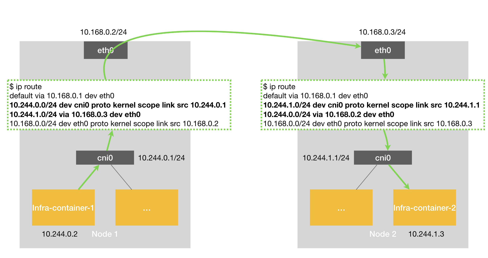
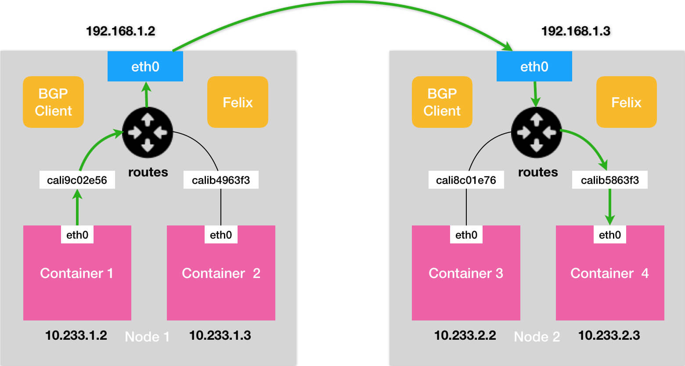
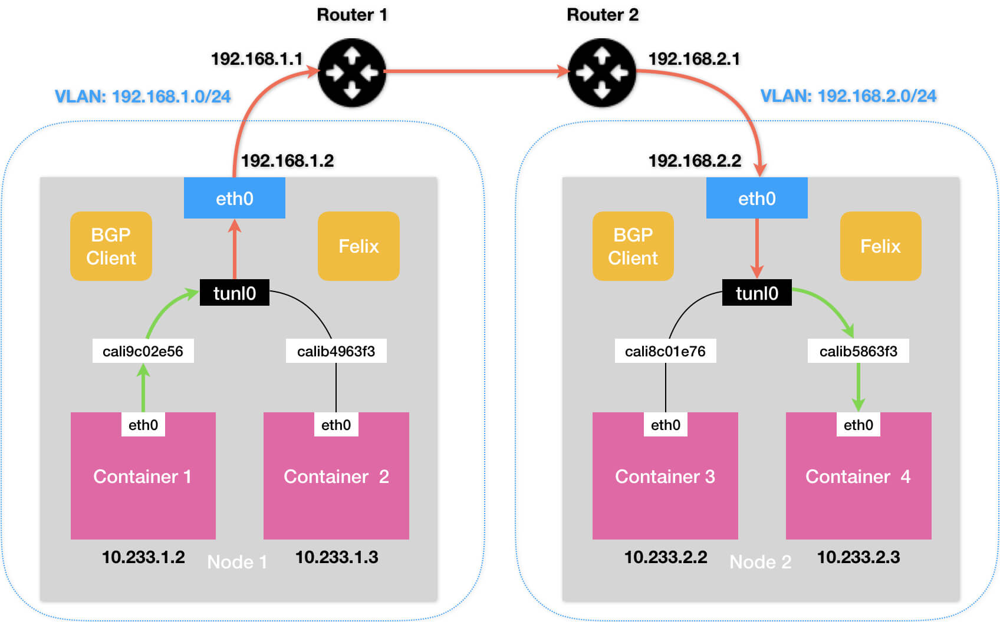

# Kubernetes三层网络方案

## 1. 概述

除了前面讲述的隧道模式之外，Kubernetes 中还有一种纯三层（Pure Layer 3）网络方案。其中的典型例子，莫过于 Flannel 的 host-gw 模式和 Calico 项目了。



当你设置 Flannel 使用 host-gw 模式之后，flanneld 会在宿主机上创建这样一条规则，以 Node 1 为例：

```sh
$ ip route
...
10.244.1.0/24 via 10.168.0.3 dev eth0
```

这条路由规则的含义是：目的 IP 地址属于 10.244.1.0/24 网段的 IP 包，应该经过本机的 eth0 设备发出去（即：dev eth0）；并且，它下一跳地址（next-hop）是 10.168.0.3（即：via 10.168.0.3）。

所谓下一跳地址就是：如果 IP 包从主机 A 发到主机 B，需要经过路由设备 X 的中转。那么 X 的 IP 地址就应该配置为主机 A 的下一跳地址。

> 而从 host-gw 示意图中我们可以看到，这个下一跳地址对应的，正是我们的目的宿主机 Node 2。

一旦配置了下一跳地址，那么接下来，当 IP 包从网络层进入链路层封装成帧的时候，eth0 设备就会使用下一跳地址对应的 MAC 地址，作为该数据帧的目的 MAC 地址。显然，这个 MAC 地址，正是 Node 2 的 MAC 地址。

这样，这个数据帧就会从 Node 1 通过宿主机的二层网络顺利到达 Node 2 上。

而 Node 2 的内核网络栈从二层数据帧里拿到 IP 包后，会“看到”这个 IP 包的目的 IP 地址是 10.244.1.3，即 Infra-container-2 的 IP 地址。这时候，根据 Node 2 上的路由表，该目的地址会匹配到第二条路由规则（也就是 10.244.1.0 对应的路由规则），从而进入 cni0 网桥，进而进入到 Infra-container-2 当中。

可以看到，**host-gw 模式的工作原理，其实就是将每个 Flannel 子网（Flannel Subnet，比如：10.244.1.0/24）的“下一跳”，设置成了该子网对应的宿主机的 IP 地址**。

也就是说，这台“主机”（Host）会充当这条容器通信路径里的“网关”（Gateway）。这也正是“host-gw”的含义。

而且 Flannel 子网和主机的信息，都是保存在 Etcd 当中的。flanneld 只需要 WACTH 这些数据的变化，然后实时更新路由表即可。

而在这种模式下，容器通信的过程就免除了额外的封包和解包带来的性能损耗。根据实际的测试，host-gw 的性能损失大约在 10% 左右，而其他所有基于 VXLAN“隧道”机制的网络方案，性能损失都在 20%~30% 左右。

**host-gw 模式能够正常工作的核心，就在于 IP 包在封装成帧发送出去的时候，会使用路由表里的“下一跳”来设置目的 MAC 地址**。这样，它就会经过二层网络到达目的宿主机。

**所以说，Flannel host-gw 模式必须要求集群宿主机之间是二层连通的**。


## 2. Calico

实际上，Calico 项目提供的网络解决方案，与 Flannel 的 host-gw 模式，几乎是完全一样的。也就是说，Calico 也会在每台宿主机上，添加一个格式如下所示的路由规则：

```sh
<目的容器IP地址段> via <网关的IP地址> dev eth0
```

其中，网关的 IP 地址，正是目的容器所在宿主机的 IP 地址。

而正如前所述，这个三层网络方案得以正常工作的核心，是为每个容器的 IP 地址，找到它所对应的、“下一跳”的**网关**。

不过，**不同于 Flannel 通过 Etcd 和宿主机上的 flanneld 来维护路由信息的做法，Calico 项目使用了一个“重型武器”来自动地在整个集群中分发路由信息**。

**所谓 BGP，就是在大规模网络中实现节点路由信息共享的一种协议**。

BGP 在每个边界网关（路由器）上运行，彼此之间通信更新路由表信息。而 BGP 的这个能力，正好可以取代 Flannel 维护主机上路由表的功能。

> 而且，BGP 这种原生就是为大规模网络环境而实现的协议，其可靠性和可扩展性，远非 Flannel 自己的方案可比。

Calico 由三个部分组成：

* 1）Calico 的 CNI 插件。这就是 Calico 与 Kubernetes 对接的部分。
* 2）Felix。它是一个 DaemonSet，负责在宿主机上插入路由规则（即：写入 Linux 内核的 FIB 转发信息库），以及维护 Calico 所需的网络设备等工作。
* 3）BIRD。它就是 BGP 的客户端，专门负责在集群里分发路由规则信息。


**除了对路由信息的维护方式之外，Calico 项目与 Flannel 的 host-gw 模式的另一个不同之处，就是它不会在宿主机上创建任何网桥设备**。




Calico 的 CNI 插件会为每个容器设置一个 Veth Pair 设备，然后把其中的一端放置在宿主机上（它的名字以 cali 前缀开头）。

此外，由于 Calico 没有使用 CNI 的网桥模式，Calico 的 CNI 插件还需要在宿主机上为每个容器的 Veth Pair 设备配置一条路由规则，用于接收传入的 IP 包。比如，宿主机 Node 2 上的 Container 4 对应的路由规则，如下所示：

```sh
10.233.2.3 dev cali5863f3 scope link
```

即：发往 10.233.2.3 的 IP 包，应该进入 cali5863f3 设备。

> 基于上述原因，Calico 项目在宿主机上设置的路由规则，肯定要比 Flannel 项目多得多。
>
> 不过，Flannel host-gw 模式使用 CNI 网桥的主要原因，其实是为了跟 VXLAN 模式保持一致。否则的话，Flannel 就需要维护两套 CNI 插件了。

有了这样的 Veth Pair 设备之后，容器发出的 IP 包就会经过 Veth Pair 设备出现在宿主机上。然后，宿主机网络栈就会根据路由规则的下一跳 IP 地址，把它们转发给正确的网关。接下来的流程就跟 Flannel host-gw 模式完全一致了。


其中，**这里最核心的“下一跳”路由规则，就是由 Calico 的 Felix 进程负责维护的**。这些路由规则信息，则是通过 BGP Client 也就是 BIRD 组件，使用 BGP 协议传输而来的。

**Calico 项目实际上将集群里的所有节点，都当作是边界路由器来处理，它们一起组成了一个全连通的网络，互相之间通过 BGP 协议交换路由规则。这些节点，我们称为 BGP Peer**。

需要注意的是，**Calico 维护的网络在默认配置下，是一个被称为“Node-to-Node Mesh”的模式**。这时候，每台宿主机上的 BGP Client 都需要跟其他所有节点的 BGP Client 进行通信以便交换路由信息。但是，随着节点数量 N 的增加，这些连接的数量就会以 N²的规模快速增长，从而给集群本身的网络带来巨大的压力。

所以，Node-to-Node Mesh 模式一般推荐用在少于 100 个节点的集群里。而在更大规模的集群中，你需要用到的是一个叫作 Route Reflector 的模式。

在这种模式下，Calico 会指定一个或者几个专门的节点，来负责跟所有节点建立 BGP 连接从而学习到全局的路由规则。而其他节点，只需要跟这几个专门的节点交换路由信息，就可以获得整个集群的路由规则信息了。


## 3. IPIP 模式

对于 Calico 来说，同样要求集群宿主机之间是二层连通的。

举个例子，假如我们有两台处于不同子网的宿主机 Node 1 和 Node 2，对应的 IP 地址分别是 192.168.1.2 和 192.168.2.2。需要注意的是，这两台机器通过路由器实现了三层转发，所以这两个 IP 地址之间是可以相互通信的。

而我们现在的需求，还是 Container 1 要访问 Container 4。

按照我们前面的讲述，Calico 会尝试在 Node 1 上添加如下所示的一条路由规则：

```sh
10.233.2.0/16 via 192.168.2.2 eth0
```

上面这条规则里的下一跳地址是 192.168.2.2，可是它对应的 Node 2 跟 Node 1 却根本不在一个子网里，没办法通过二层网络把 IP 包发送到下一跳地址。

**在这种情况下，你就需要为 Calico 打开 IPIP 模式**。



在 Calico 的 IPIP 模式下，Felix 进程在 Node 1 上添加的路由规则，会稍微不同，如下所示：

```sh
10.233.2.0/24 via 192.168.2.2 tunl0
```

这一次，要负责将 IP 包发出去的设备，变成了 tunl0，Calico 使用的这个 tunl0 设备，是一个 IP 隧道（IP tunnel）设备。

P 包进入 IP 隧道设备之后，就会被 Linux 内核的 IPIP 驱动接管。IPIP 驱动会将这个 IP 包直接封装在一个宿主机网络的 IP 包中，如下所示：


其中，经过封装后的新的 IP 包的目的地址（图中的 Outer IP Header 部分），正是原 IP 包的下一跳地址，即 Node 2 的 IP 地址：192.168.2.2。

而原 IP 包本身，则会被直接封装成新 IP 包的 Payload。

**这样，原先从容器到 Node 2 的 IP 包，就被伪装成了一个从 Node 1 到 Node 2 的 IP 包**。

由于宿主机之间已经使用路由器配置了三层转发，也就是设置了宿主机之间的“下一跳”。所以这个 IP 包在离开 Node 1 之后，就可以经过路由器，最终“跳”到 Node 2 上。

这时，Node 2 的网络内核栈会使用 IPIP 驱动进行解包，从而拿到原始的 IP 包。然后，原始 IP 包就会经过路由规则和 Veth Pair 设备到达目的容器内部。

以上，就是 Calico 项目主要的工作原理了。

> 额外的封包和解包工作会导致集群网络性能下降，在实际测试中，Calico IPIP 模式与 Flannel VXLAN 模式的性能大致相当。


## 4. 小结

**三层网络主要通过维护路由规则，将数据包直接转发到对应的宿主机上**。

* Flannel host-gw 主要通过 etcd 中的子网信息来维护路由规则；

* Calico 则通过 BGP 协议收集路由信息，由 Felix进程来维护；

* 隧道模式主要通过在 IP 包外再封装一层 MAC 包头来实现。


**使用场景**

在大规模集群里，三层网络方案在宿主机上的路由规则可能会非常多，这会导致错误排查变得困难。此外，在系统故障的时候，路由规则出现重叠冲突的概率也会变大。

* 1）如果是在`公有云`上，由于宿主机网络本身比较“直白”，一般推荐更加简单的 Flannel host-gw 模式。
* 2）但不难看到，在`私有部署环境`里，Calico 项目才能够覆盖更多的场景，并为你提供更加可靠的组网方案和架构思路。


**三层和隧道的异同**：

相同之处是都实现了跨主机容器的三层互通，而且都是通过对目的 MAC 地址的操作来实现的；不同之处是三层通过配置下一条主机的路由规则来实现互通，隧道则是通过通过在 IP 包外再封装一层 MAC 包头来实现。

* 三层的优点：少了封包和解包的过程，性能肯定是更高的。
* 三层的缺点：需要自己想办法维护路由规则。
* 隧道的优点：简单，原因是大部分工作都是由 Linux 内核的模块实现了，应用层面工作量较少。
* 隧道的缺点：主要的问题就是性能低。

