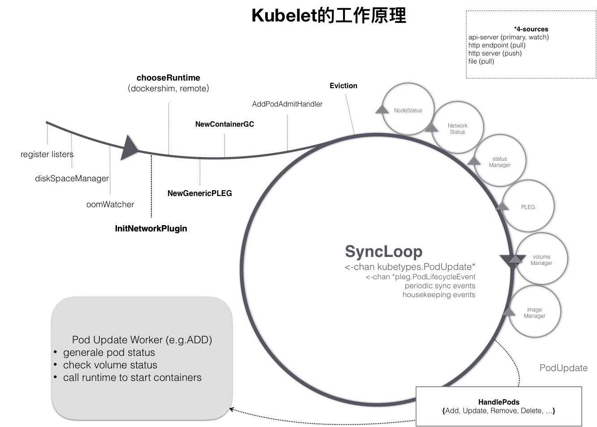
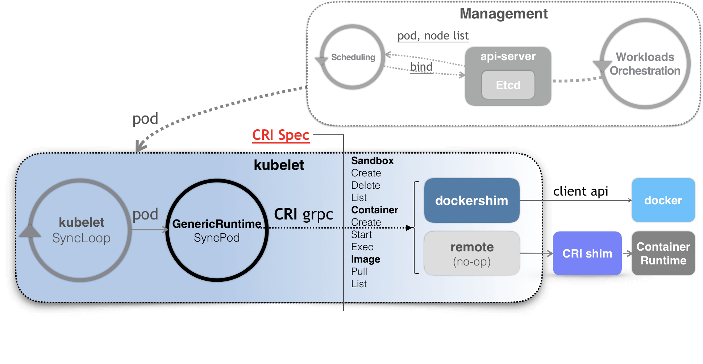

# SIG-Node与CRI

## 1. 概述

SIG-Node 以及 kubelet，其实是 Kubernetes 整套体系里非常核心的一个部分。 毕竟，它们才是 Kubernetes 这样一个容器编排与管理系统，跟容器打交道的主要“场所”。

而 kubelet 这个组件本身，也是 Kubernetes 里面第二个不可被替代的组件（第一个不可被替代的组件当然是 kube-apiserver）。

**无论如何，我都不太建议你对 kubelet 的代码进行大量的改动。保持 kubelet 跟上游基本一致的重要性，就跟保持 kube-apiserver 跟上游一致是一个道理。**

## 2. kubelet

 kubelet 本身，也是按照“控制器”模式来工作的。它实际的工作原理，可以用如下所示的一幅示意图来表示清楚:

可以看到，kubelet 的工作核心，就是一个控制循环，即：**SyncLoop**（图中的大圆圈）。而驱动这个控制循环运行的事件，包括四种：

* Pod 更新事件；
* Pod 生命周期变化；
* kubelet 本身设置的执行周期；
* 定时的清理事件。

所以，跟其他控制器类似，kubelet 启动的时候，要做的第一件事情，就是设置 Listers，也就是注册它所关心的各种事件的 Informer。这些 Informer，就是 SyncLoop 需要处理的数据的来源。

此外，kubelet 还负责维护着很多很多其他的子控制循环（也就是图中的小圆圈）。这些控制循环的名字，一般被称作某某 Manager，比如 Volume Manager、Image Manager、Node Status Manager 等等。这些控制循环的责任，就是通过控制器模式，完成 kubelet 的某项具体职责。

**SyncLoop，又是如何根据 Pod 对象的变化，来进行容器操作的呢？**

实际上，kubelet 也是通过**Watch**机制，监听了与自己相关的 Pod 对象的变化。

而当一个 Pod 完成调度、与一个 Node 绑定起来之后， 这个 Pod 的变化就会触发 kubelet 在控制循环里注册的 Handler，也就是上图中的 HandlePods 部分。此时，通过检查该 Pod 在 kubelet 内存里的状态，kubelet 就能够判断出这是一个新调度过来的 Pod，从而触发 Handler 里 ADD 事件对应的处理逻辑。

在具体的处理过程当中，kubelet 会启动一个名叫 Pod Update Worker 的、单独的 Goroutine 来完成对 Pod 的处理工作。

比如，如果是 ADD 事件的话，kubelet 就会为这个新的 Pod 生成对应的 Pod Status，检查 Pod 所声明使用的 Volume 是不是已经准备好。然后，调用下层的容器运行时（比如 Docker），开始创建这个 Pod 所定义的容器。

而如果是 UPDATE 事件的话，kubelet 就会根据 Pod 对象具体的变更情况，调用下层容器运行时进行容器的重建工作。

## 3. CRI

**kubelet 调用下层容器运行时的执行过程，并不会直接调用 Docker 的 API，而是通过一组叫作 CRI（Container Runtime Interface，容器运行时接口）的 gRPC 接口来间接执行的。**

Kubernetes 项目之所以要在 kubelet 中引入 CRI 这样一层单独的抽象，当然是为了对 Kubernetes 屏蔽下层容器运行时的差异。

因为之前版本中 Kubernetes 可以支持 Docker 和 CoreOS 公司的 rkt，导致**kubelet 任何一次重要功能的更新，都不得不考虑 Docker 和 rkt 这两种容器运行时的处理场景，然后分别更新 Docker 和 rkt 两部分代码**。

而在有了 CRI 之后，Kubernetes 以及 kubelet 本身的架构，就可以用如下所示的一幅示意图来描述。

可以看到，当 Kubernetes 通过编排能力创建了一个 Pod 之后，调度器会为这个 Pod 选择一个具体的节点来运行。这时候，kubelet 当然就会通过前面讲解过的 SyncLoop 来判断需要执行的具体操作，比如创建一个 Pod。那么此时，kubelet 实际上就会调用一个叫作 GenericRuntime 的通用组件来发起创建 Pod 的 CRI 请求。

**这个 CRI 请求，又该由谁来响应呢？**

如果你使用的容器项目是 Docker 的话，那么负责响应这个请求的就是一个叫作 dockershim 的组件。它会把 CRI 请求里的内容拿出来，然后组装成 Docker API 请求发给 Docker Daemon。

> Kubernetes 新版本已经移除 dockershim 了。

而更普遍的场景，就是你需要在每台宿主机上单独安装一个负责响应 CRI 的组件，这个组件，一般被称作 CRI shim。顾名思义，CRI shim 的工作，就是扮演 kubelet 与容器项目之间的“垫片”（shim）。所以它的作用非常单一，那就是实现 CRI 规定的每个接口，然后把具体的 CRI 请求“翻译”成对后端容器项目的请求或者操作。

## 4. 小结

scheduler 将 Pod 调度到具体某一个 Node 之后，后续就由 kubelet 接手。

通过抽象 CRI 将 kubelet 和具体 ContainerRuntime 解耦。

