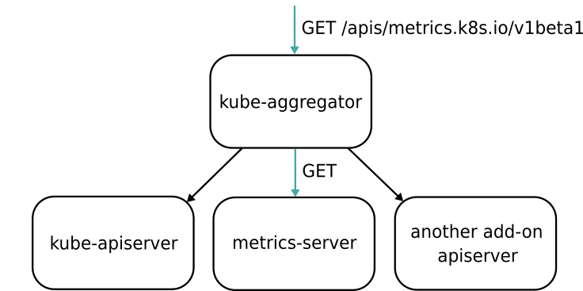

# Kubernetes监控体系

## 1. 概述

Kubernetes 项目的监控体系曾经非常繁杂，但发展到今天，已经完全演变成了以 Prometheus 项目为核心的一套统一的方案。

> 比较有意思的是，Prometheus 项目与 Kubernetes 项目一样，也来自于 Google 的 Borg 体系，它的原型系统，叫作 BorgMon，是一个几乎与 Borg 同时诞生的内部监控系统。

**Prometheus **项目工作的核心，是使用 Pull （抓取）的方式去搜集被监控对象的 Metrics 数据（监控指标数据），然后，再把这些数据保存在一个 TSDB （时间序列数据库，比如 OpenTSDB、InfluxDB 等）当中，以便后续可以按照时间进行检索。

## 2.  Kubernetes 的监控体系

**第一种 Metrics，是宿主机的监控数据。**

* 这部分数据的提供，需要借助一个由 Prometheus 维护的Node Exporter 工具。
* 一般来说，Node Exporter 会以 DaemonSet 的方式运行在宿主机上。
* 其实，所谓的 Exporter，就是代替被监控对象来对 Prometheus 暴露出可以被“抓取”的 Metrics 信息的一个辅助进程。


**第二种 Metrics，是来自于 Kubernetes 的 API Server、kubelet 等组件的 /metrics API。**

除了常规的 CPU、内存的信息外，这部分信息还主要包括了各个组件的核心监控指标。

> 比如，对于 API Server 来说，它就会在 /metrics API 里，暴露出各个 Controller 的工作队列（Work Queue）的长度、请求的 QPS 和延迟数据等等。这些信息，是检查 Kubernetes 本身工作情况的主要依据。

**第三种 Metrics，是 Kubernetes 相关的监控数据。**

这部分数据，一般叫作 Kubernetes 核心监控数据（core metrics）。这其中包括了 Pod、Node、容器、Service 等主要 Kubernetes 核心概念的 Metrics。


## 3. Metrics Server

需要注意的是，这里提到的 Kubernetes 核心监控数据，其实使用的是 Kubernetes 的一个非常重要的扩展能力，叫作 Metrics Server。

比如，下面这个 URL：

```txt
http://127.0.0.1:8001/apis/metrics.k8s.io/v1beta1/namespaces/<namespace-name>/pods/<pod-name>
```

当你访问这个 Metrics API 时，它就会为你返回一个 Pod 的监控数据，而这些数据，其实是从 kubelet 的 Summary API （即 <kubelet_ip>:<kubelet_port>/stats/summary）采集而来的。Summary API 返回的信息，既包括了 cAdVisor 的监控数据，也包括了 kubelet 本身汇总的信息。

需要指出的是， Metrics Server 并不是 kube-apiserver 的一部分，而是通过 Aggregator 这种插件机制，在独立部署的情况下同 kube-apiserver 一起统一对外服务的。

这里，Aggregator APIServer 的工作原理，可以用如下所示的一幅示意图来表示清楚：




**kube-aggregator 其实就是一个根据 URL 选择具体的 API 后端的代理服务器**。


## 4. 指标监控

在具体的监控指标规划上，建议你**遵循业界通用的 USE 原则和 RED 原则**。

其中，USE 原则指的是，按照如下三个维度来规划资源监控指标：

* 1）利用率（Utilization），资源被有效利用起来提供服务的平均时间占比；
* 2）饱和度（Saturation），资源拥挤的程度，比如工作队列的长度；
* 3）错误率（Errors），错误的数量。

而 RED 原则指的是，按照如下三个维度来规划服务监控指标：

* 1）每秒请求数量（Rate）；
* 2）每秒错误数量（Errors）；
* 3）服务响应时间（Duration）。

不难发现， USE 原则主要关注的是“资源”，比如节点和容器的资源使用情况，而 RED 原则主要关注的是“服务”，比如 kube-apiserver 或者某个应用的工作情况。

这两种指标，在 Kubernetes + Prometheus 组成的监控体系中，都是可以完全覆盖到的。


## 5. 自定义 Metrics

自定义metrics主要依赖于kube-aggregator，访问custom.metrics.k8s.io时kube-aggregator会转发给 Custom Metrics APIServer。


使用自定义 Metrics 可以让Auto Scaling等功能不再“食之无味”。

Kubernetes 社区已经为你提供了一套叫作 [ KubeBuilder](https://github.com/kubernetes-sigs/kubebuilder) 的工具库，帮助你生成一个 API Server 的完整代码框架，你只需要在里面添加自定义 API，以及对应的业务逻辑即可。

