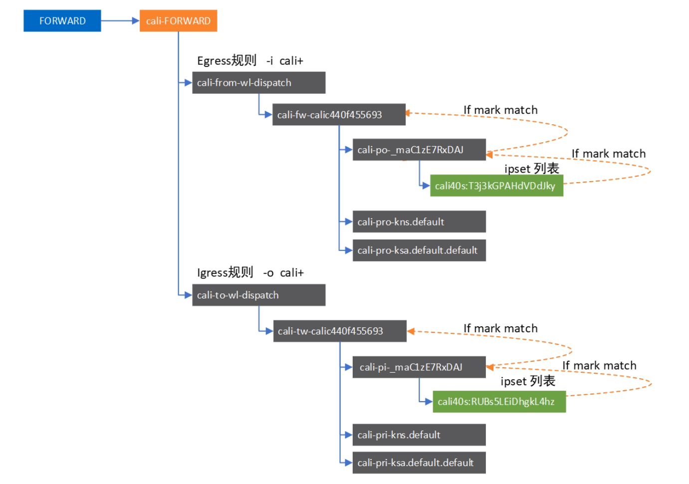

# k8s中的iptables链

Kube链

* **KUBE-SERVICE：**目的地是Service IP这类数据包的入口，它负责匹配IP:Port，然后将符合规则的数据包发给对应的KUBE - SVC链;

* **KUBE-SVC：**担任负载均衡的角色，会平均分配数据包到KUBE-SEP。每个KUBE- SVC都有和Endpoint同样数量的KUBE- SEP (SEP 是Service endpoint意思) ;

* **KUBE-SEP：**它负责的是DNAT，会把Service的IP:Port替换为Pod的IP:Port】
* **KUBE-NODEPORTS：**负责处理NodePort类型的Service。

链引用关系

* **ClusterIP类型：**KUBE- SERVICES -> KUBE-SVC -> KUBE-SEP

* **NodePort类型：**KUBE- SERVICES -> KUBE- NODEPORTS -> KUBE - SVC -> KUBE -SEP

  

连接状态

* **NEW：**conntrack对该 数据包一无所知，该状态出现在收到SYN的时候。
* **ESTABLISHED：**conntrack 知道该数据包属于一个已发布连接，该状态出现于握手完成之后。
* **RELATED：**这个数据包不属于任何连接，但是他是隶属于其它连接的，在FTP之类的协议里常用。
* **INVALID：**有问题的数据包，conntrack不知道如何处理。

## Calico

> [k8s网络模型-2](https://www.bilibili.com/video/BV11T4y1f7Ko)

* cali-INPUT链：进入主机的流量包入口，从INPUT链中添加引用将流量导入; 
* cali-OUTPUT链：从主机发出的流量包入口，从OUTOUT链路添加引用导入流量, 
* cali-FORWARD链：需要转发的例如DNAT/SNAT操作，该链在FORWARD链中有引用;
* cali-wl-to - host链：从Pod发 出流向Node流量将进入此链
* cali-from- host- endpoint链：处理来自node的流量;
* cali-to-host- endpoint链：处理访问Node的流量
* cali-from- hep-forward链：来自node转发的流量
* cali-to-hep-forward链：到达node的转发流量
* **cali-from-wl-dispatch链：**从pod中发出的流量
  * 对应egress规则中的to
* **cali-to-wl- dispatch链：**到达pod的流量
  * 对应Ingress规则中的from
* cali-cidr- block链：纯粹的IP段到IP段的转发流量

注: wl是workload缩写calico将pod在宿主机namespace中的veth网卡称为workload

Calico 实现的 NetWorkPolicy 就是依赖于 cali-from-wl-dispatch链 和 cali-to-wl- dispatch链，具体流程如下：

