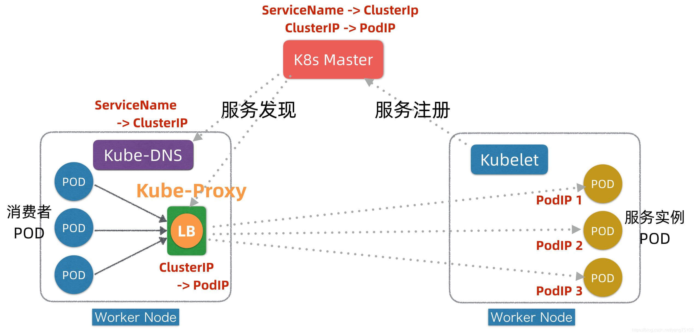
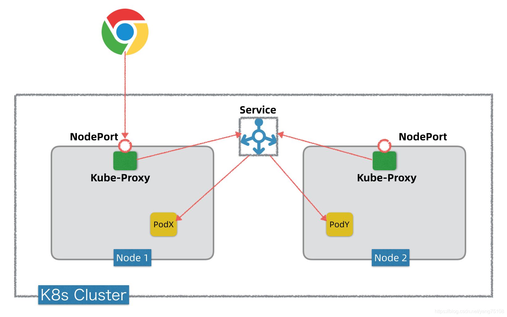
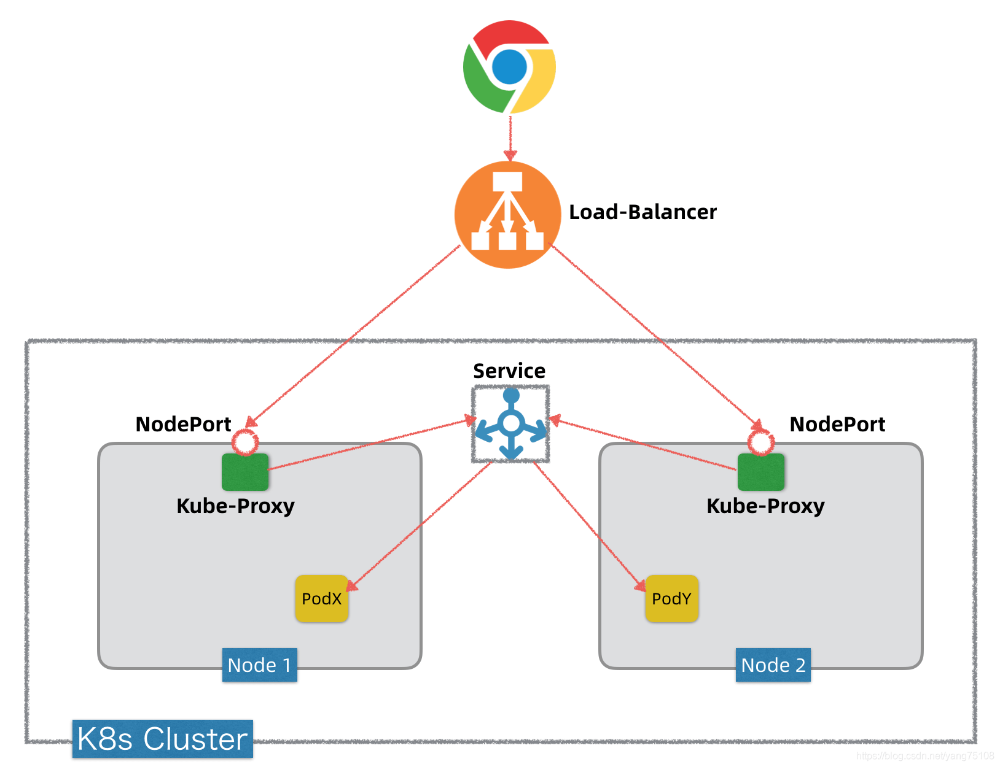
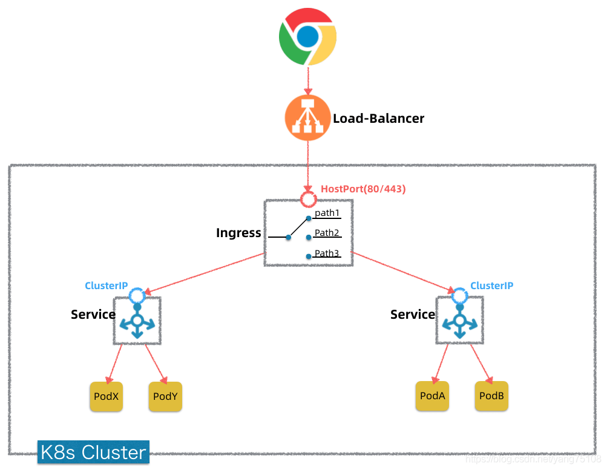
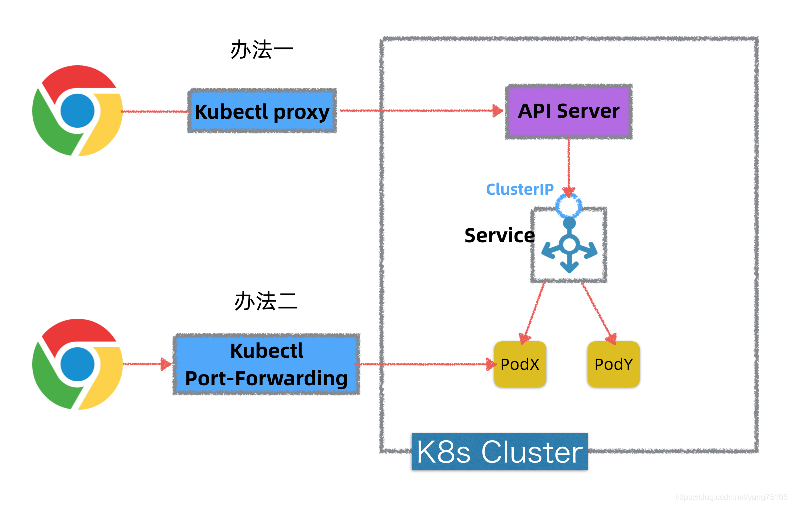

# K8s 网络概述

> [Kubernetes网络三部曲之一～Pod网络](https://blog.csdn.net/yang75108/article/details/101101384)
>
> [Kubernetes网络三部曲之二～Service网络](https://blog.csdn.net/yang75108/article/details/101267444)
>
> [Kubernetes网络三部曲之三 ~ NodePort vs LoadBalancer vs Ingress](https://blog.csdn.net/yang75108/article/details/101268208)

## Pod网络

K8s的网络可以抽象成4层网络，每一层都构建于上一层之上

* 0）节点网络
  * 节点主机互通互联
  * NodeIP+Port
* 1）Pod网络
  * Pod虚拟机互通互联
  * PodIP+Port
* 2）Service网络
  * 服务发现和负载均衡
  * ClusterIP+Port
* 3）外部接入网络
  * 外部流量接入
  * NodePort/Loadbalancer/Ingress

节点内的Pod网络

* 依赖于虚拟网桥/网卡(Linux虚拟设备)
* Pod内容器共享网络栈(由pause容器创建)

不同节点间的Pod网络

* 覆盖方案：不依赖底层网络，但有封包解包开销
* 路由方案：依赖于底层网络设备，但性能开销小

CNI是一个Pod网络集成标准，简化K8s和不同Pod网络实现技术的集成。

有了Pod网络，K8s集群内的所有Pods在逻辑上都可以看作在一个平面网络内，可以正常IP寻址和互通。但是Pod仅仅是K8s云平台中的虚拟机抽象，最终，我们需要在K8s集群中运行的是应用或者说服务(Service)，而一个Service背后一般由多个Pods组成集群，这时候就引入了服务发现(Service Discovery)和负载均衡(Load Balancing)等问题。

## Service网络

* Service网络构建于Pod网络之上，目的:

  * **1）服务发现(Service Discovery)**

  * **2）负载均衡(Load Balancing)**

* 使用 ServiceName + ClusterIP 统一屏蔽服务发现和负载均衡，具体实现原理基于DNS +Service Registry
* 客户端Kube-Proxy + iptables转发，无倾入不穿透，算是现代服务发现机制+传统Linux内核机制的融合

在K8s平台的每个Worker节点上，都部署有两个组件，一个叫Kubelet，另外一个叫Kube-Proxy，这两个组件+Master是K8s实现服务注册和发现的关键。下面我们看下简化的服务注册发现流程。

* **首先**，在服务Pod实例发布时(可以对应K8s发布中的Kind: Deployment)，Kubelet会负责启动Pod实例，启动完成后，Kubelet会把服务的PodIP列表汇报注册到Master节点。
* **其次**，通过服务Service的发布(对应K8s发布中的Kind: Service)，K8s会为服务分配ClusterIP，相关信息也记录在Master上。
* **第三**，在服务发现阶段，Kube-Proxy会监听Master并发现服务ClusterIP和PodIP列表映射关系，并且修改本地的linux iptables转发规则，指示iptables在接收到目标为某个ClusterIP请求时，进行负载均衡并转发到对应的PodIP上。
* **运行时**，当有消费者Pod需要访问某个目标服务实例的时候，它通过ClusterIP发起调用，这个ClusterIP会被本地iptables机制截获，然后通过负载均衡，转发到目标服务Pod实例上。

**实际消费者Pod也并不直接调服务的ClusterIP，而是先调用服务名**，因为ClusterIP也会变(例如针对TEST/UAT/PROD等不同环境的发布，ClusterIP会不同)，只有服务名一般不变。为了屏蔽ClusterIP的变化，K8s在每个Worker节点上还引入了一个KubeDNS组件，它也监听Master并发现服务名和ClusterIP之间映射关系，这样， 消费者Pod通过KubeDNS可以间接发现服务的ClusterIP。

## NodePort vs LoadBalancer vs Ingress

有了Service抽象，K8s中部署的应用都可以通过一个抽象的ClusterIP进行寻址访问，并且消费方不需要关心这个ClusterIP后面究竟有多少个Pod实例，它们的PodIP是什么，会不会变化，如何以负载均衡方式去访问等问题。但是，K8s的Service网络只是一个集群内可见的内部网络，集群外部是看不到Service网络的，也无法直接访问。而我们发布应用，有些是需要暴露出去，要让外网甚至公网能够访问的，这样才能对外提供服务。K8s如何将内部服务暴露出去？

### NodePort

**NodePort是K8s将内部服务对外暴露的基础**，后面的**LoadBalancer底层有赖于NodePort**。

具体实现如下：

> 注意，为了直观形象，上图的Service在K8s集群中被画成一个独立组件，实际是没有独立Service这样一个组件的，只是一个抽象概念。

NodePort 方式的 Service 发布以后，K8s在每个Worker节点上都会开启这个监听端口。**这个端口的背后是Kube-Proxy**，当K8s外部有Client要访问K8s集群内的某个服务，它通过这个服务的NodePort端口发起调用，这个调用通过Kube-Proxy转发到内部的Servcie抽象层，然后再转发到目标Pod上。

### LoadBalancer

LoadBalancer 方式则是引入一个 LoadBalancer 组件，对每个 Node 上暴露的 NodePort 进行负载均衡。

> 即：LoadBalancer 方式依旧会依赖 NodePort。

一般在公有云环境使用，比如阿里云，在 LoadBalancer 类型的 Service 发布后，阿里云K8s不仅会自动创建服务的NodePort端口转发，同时会自动帮我们申请一个SLB，有独立公网IP，并且阿里云K8s会帮我们自动把SLB映射到后台K8s集群的对应NodePort上。

> 值得一提的是，如果是在本地开发测试环境里头搭建的K8s，一般不支持Load Balancer也没必要，因为通过NodePort做测试访问就够了。

### Ingress

有了前面的NodePort + LoadBalancer，将K8s内部服务暴露到外网甚至公网的需求就已经实现了，那么为啥还要引入Ingress这样一个概念呢？它起什么作用？

因为在公有云(阿里云/AWS/GCP)上，公网LB+IP是需要花钱买的。按照LoadBalancer(简称LB)暴露服务的方式，要暴露一个服务就需要购买一个独立的LB+IP，如果要暴露十个服务就需要购买十个LB+IP，显然，从成本考虑这是不划算也不可扩展的。

如果在K8内部部署一个独立的反向代理服务，让它做代理转发，就能省下不少LoadBalance了，K8s 中的这个组件就是 Ingress。

> 注意，Ingress是一个7层反向代理，如果你要暴露的是4层服务，还是需要走独立LB+IP方式。

具体模型如下：

Ingress就是一个特殊的Service，通过节点的**HostPort(80/443)**暴露出去，前置一般也有LB做负载均衡。Ingress转发到内部的其它服务，是通过集群内的Service抽象层/ClusterIP进行转发，最终转发到目标服务Pod上。Ingress的转发可以基于Path转发，也可以基于域名转发等方式，基本上你只需给它设置好转发路由表即可，功能和Nginx无本质差别。

> 注意，上图的Ingress概念模型是一种更抽象的画法，隐去了K8s集群中的节点，实际HostPort是暴露在节点上的。

### Kubectl Proxy & Port Forward

上面提到的服务暴露方案，包括NodePort/LoadBalancer/Ingress，主要针对正式生产环境。如果在本地开发测试环境，需要对本地部署的K8s环境中的服务或者Pod进行快速调试或测试，还有几种简易办法，这边一并简单介绍下，如下图所示：

* 1）通过 **kubectl proxy** 命令，在本机上开启一个代理服务，通过这个代理服务，可以访问K8s集群内的任意服务。
  * 这个Kubectl代理服务通过Master上的API Server间接访问K8s集群内服务，因为Master知道集群内所有服务信息。这种方式只限于7层HTTP转发。
* 2）通过 **kubectl port-forward** 命令，它可以在本机上开启一个转发端口，间接转发到K8s内部的某个Pod的端口上。这样我们通过本机端口就可以访问K8s集群内的某个Pod。这种方式是TCP转发，不限于HTTP。
* 3）通过 **kubectl exec** 命令直接连到Pod上去执行linux命令，功能类似docker exec。

## 小结

|              | 作用                               | 实现                                         |
| ------------ | ---------------------------------- | -------------------------------------------- |
| 节点网络     | Master/Worker 节点之间互通         | 路由器、交换机、网卡                         |
| Pod 网络     | Pod 之间互通                       | 虚拟网卡、虚拟网桥、网卡、路由器 or 覆盖网络 |
| Service 网络 | 服务发现 + 负载均衡                | Kube-proxy、kubelet、Master、kube-DNS        |
| NodePort     | 将 Service 暴露在节点网络上        | Kube-proxy                                   |
| LoadBalancer | 将 Service 暴露在公网上 + 负载均衡 | 公有云 LB + NodePort                         |
| Ingress      | 反向代理，安全，日志监控           | Nginx/Envoy/Traefik...                       |

