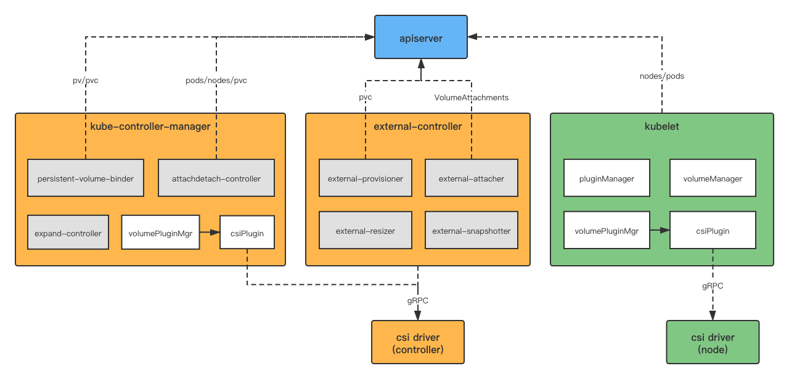
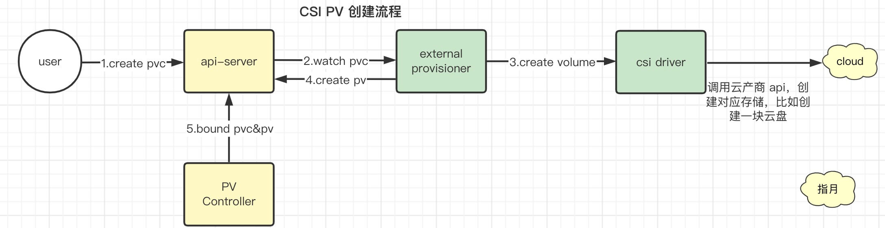
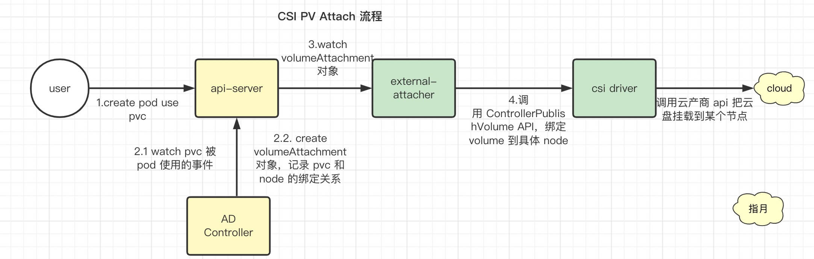
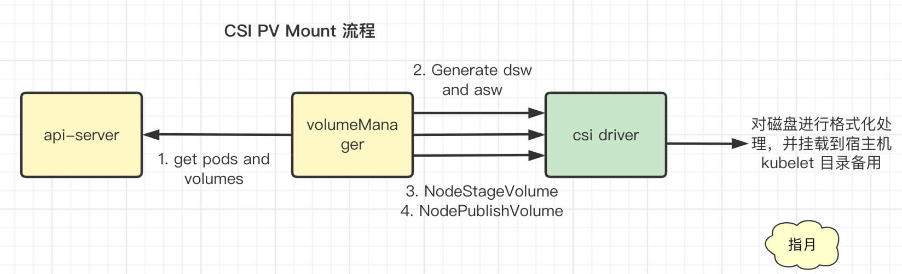
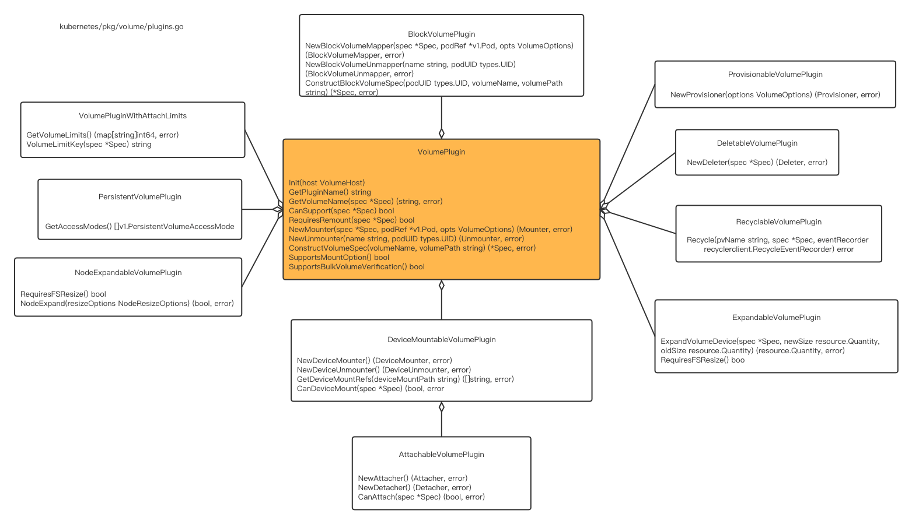
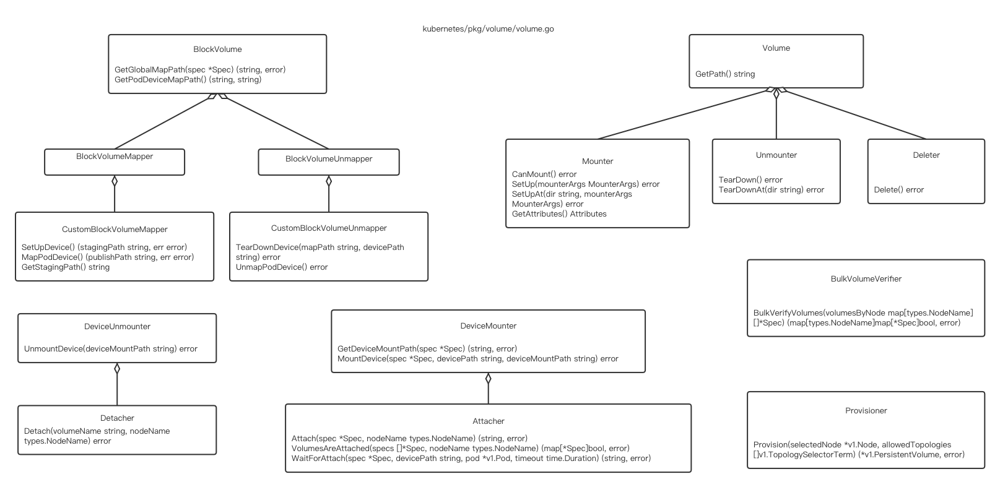

# CSI

> 原文：[Kubernetes Kubelet CSI 机制解析](https://hackerain.me/2021/10/16/kubernetes/kube-kubelet-csi.html)


## CSI 规范

### 交互规范

CSI协议的具体内容在 [这里 ](https://github.com/container-storage-interface/spec/blob/master/spec.md)可以查看，它规定了 CO(Container Orchestration) 和 SP(Storage Provider) 之间的交互规范：

- CO 作为客户端，SP 作为服务端，CO 通过 gRPC 协议向 SP 发送请求；
- 协议为 SP 规定了两种类型的插件，一个是 **Controller Plugin**，一个是 **Node Plugin**；
- Controller Plugin 一般一个集群只部署一个，它的作用主要是处理像**创建/删除卷、向某节点挂载/卸载卷**这种管理类型的操作。
  - 这些操作一般都是由 SP 向存储后端以及 IaaS 平台发送 API 请求完成的，所以一个集群部署一个即可，这些操作称之为 **Controller Service**；

- Node Plugin 则需要在 CO 集群的每个 Worker 节点上部署，主要用来处理**卷的格式化、挂载、以及向容器中映射目录**等操作。
  - 因为这些操作跟具体节点和容器相关的，所以它要在每个节点上部署，这类操作称为 **Node Service**；

- 此外这两种插件还都需要实现能够获取到本插件详细信息的操作，比如插件的名字，插件都实现了哪些功能，以方便 CO 根据插件的信息做出某些判断，这类操作称之为 **Identity Service**；
- Controller Plugin 和 Node Plugin 在实现上可以分开，有各自的 Server，也可以合并在一起，由一个统一的 Server 去实现；


CSI 也像 CRI 和 CNI 一样，提供了一个 [lib库](https://github.com/container-storage-interface/spec/blob/master/lib/go/csi/csi.pb.go)，为上面的操作定义好了相关的数据结构，为客户端实现了相关的 gRPC 方法，为服务端定义好了接口，被 CO 和 SP 引用和实现即可，来看下该 lib 库中，为服务端定义的接口：

```protobuf
// IdentityServer is the server API for Identity service.
type IdentityServer interface {
	GetPluginInfo(context.Context, *GetPluginInfoRequest) (*GetPluginInfoResponse, error)
	GetPluginCapabilities(context.Context, *GetPluginCapabilitiesRequest) (*GetPluginCapabilitiesResponse, error)
	Probe(context.Context, *ProbeRequest) (*ProbeResponse, error)
}

// ControllerServer is the server API for Controller service.
type ControllerServer interface {
	CreateVolume(context.Context, *CreateVolumeRequest) (*CreateVolumeResponse, error)
	DeleteVolume(context.Context, *DeleteVolumeRequest) (*DeleteVolumeResponse, error)
	ControllerPublishVolume(context.Context, *ControllerPublishVolumeRequest) (*ControllerPublishVolumeResponse, error)
	ControllerUnpublishVolume(context.Context, *ControllerUnpublishVolumeRequest) (*ControllerUnpublishVolumeResponse, error)
	ValidateVolumeCapabilities(context.Context, *ValidateVolumeCapabilitiesRequest) (*ValidateVolumeCapabilitiesResponse, error)
	ListVolumes(context.Context, *ListVolumesRequest) (*ListVolumesResponse, error)
	GetCapacity(context.Context, *GetCapacityRequest) (*GetCapacityResponse, error)
	ControllerGetCapabilities(context.Context, *ControllerGetCapabilitiesRequest) (*ControllerGetCapabilitiesResponse, error)
	CreateSnapshot(context.Context, *CreateSnapshotRequest) (*CreateSnapshotResponse, error)
	DeleteSnapshot(context.Context, *DeleteSnapshotRequest) (*DeleteSnapshotResponse, error)
	ListSnapshots(context.Context, *ListSnapshotsRequest) (*ListSnapshotsResponse, error)
	ControllerExpandVolume(context.Context, *ControllerExpandVolumeRequest) (*ControllerExpandVolumeResponse, error)
	ControllerGetVolume(context.Context, *ControllerGetVolumeRequest) (*ControllerGetVolumeResponse, error)
}

// NodeServer is the server API for Node service.
type NodeServer interface {
	NodeStageVolume(context.Context, *NodeStageVolumeRequest) (*NodeStageVolumeResponse, error)
	NodeUnstageVolume(context.Context, *NodeUnstageVolumeRequest) (*NodeUnstageVolumeResponse, error)
	NodePublishVolume(context.Context, *NodePublishVolumeRequest) (*NodePublishVolumeResponse, error)
	NodeUnpublishVolume(context.Context, *NodeUnpublishVolumeRequest) (*NodeUnpublishVolumeResponse, error)
	NodeGetVolumeStats(context.Context, *NodeGetVolumeStatsRequest) (*NodeGetVolumeStatsResponse, error)
	NodeExpandVolume(context.Context, *NodeExpandVolumeRequest) (*NodeExpandVolumeResponse, error)
	NodeGetCapabilities(context.Context, *NodeGetCapabilitiesRequest) (*NodeGetCapabilitiesResponse, error)
	NodeGetInfo(context.Context, *NodeGetInfoRequest) (*NodeGetInfoResponse, error)
}
```


### Volume 生命周期

这些接口方法中，有几个比较特殊的需要解释一下，先来看下协议中给出的一个Volume的生命周期图：

```console
   CreateVolume +------------+ DeleteVolume
 +------------->|  CREATED   +--------------+
 |              +---+----^---+              |
 |       Controller |    | Controller       v
+++         Publish |    | Unpublish       +++
|X|          Volume |    | Volume          | |
+-+             +---v----+---+             +-+
                | NODE_READY |
                +---+----^---+
               Node |    | Node
              Stage |    | Unstage
             Volume |    | Volume
                +---v----+---+
                |  VOL_READY |
                +---+----^---+
               Node |    | Node
            Publish |    | Unpublish
             Volume |    | Volume
                +---v----+---+
                | PUBLISHED  |
                +------------+

Figure 6: The lifecycle of a dynamically provisioned volume, from
creation to destruction, when the Node Plugin advertises the
STAGE_UNSTAGE_VOLUME capability.
```


因为存储多种多样，有块存储、文件存储以及对象存储等等，并且有各种各样的使用方式，iSCSI、FC、RBD 等等，要想设计一套针对所有情况的通用的规范，必须得足够抽象才行，所有上面的方法初步看起来有点困惑。

比如 CreateVolume 和 DeleteVolume 都很好理解，下面几个就会比较困惑：ControllerPublishVolume，NodeStageVolume, NodePublishVolume，分别表示什么意思呢？

* **CreateVolume**：创建卷，这个由Controller Plugin 调用 IaaS 平台的 API 完成。
  * 这里创建出的卷还是独立的，没有任何作用，只是在云平台上显示多了一块云盘而已。
* **DeleteVolume**：删除卷，同上，也是由Controller Plugin 调用 IaaS 平台的 API 完成。

- **ControllerPublishVolume**：挂载卷到节点，卷创建好后，一般都需要将其和某个节点绑定，比如 IaaS 平台中创建的云硬盘，需要挂载到某个虚拟机上，虚拟机中才能够看到这个块设备，这个操作是由 Controller Plugin 调用 IaaS 平台的 API 发起的，所以称之为ControllerPublishVolume，顾名思义就是将卷发布到某个节点。
- **NodeStageVolume & NodePublishVolume**：卷处理，将挂载到节点上的卷处理成容器能直接用的目录。
  - **NodeStageVolume**：比如 IaaS 平台的云硬盘，如果希望以文件系统的方式被容器使用的话，在NodeStageVolume 阶段，就会将云硬盘格式化成对应文件系统，并且挂载到一个临时目录（Staging 目录）上。
  - **NodePublishVolume**：将 Staging 目录，绑定挂载到 Volume 对应的宿主机目录上。由于 Staging 目录，正是 Volume 对应的设备被格式化后挂载在宿主机上的位置，所以当它和 Volume 的宿主机目录绑定挂载之后，这个 Volume 宿主机目录的“持久化”处理也就完成了。
  - 存储插件并不需要实现所有这些方法，根据实际情况，有的可能不需要NodeStageVolume，直接就可以 NodePublishVolume，这样在 NodePlugin 中，就可以申明不支持 `STAGE_UNSTAGE_VOLUME` 这个功能，那么 CO 在跟 SP 交互时，就不会发送NodeStageVolume 这个请求了。
  - 比如 NFS 这种本身就是文件系统的存储，就不需要 Stage 步骤。


从上面的接口定义上，也可以看出

*  CSI 的设计目的主要还是为了给容器提供存储，并且进行简单的管理操作，比如打快照，扩容等；
* 并没有其他复杂的存储管理，比如备份，恢复。

要实现更复杂的存储管理，还是要依靠底层存储系统本身的机制，这些功能不同存储系统间差别还是很大的，想要做到统一抽象是不可能的，也没这个必要。


## CSI协议的实现

相比于内置存储插件，CSI 要更复杂。

因为CSI是针对更一般的情况，要遵循接口规范，并且还要走RPC，所以其实现复杂度就多了一个维度。CSI的实现涉及到apiserver, kube-controller-manager, kubelet, csi driver, 以及csi external controller这几个组件，apiserver用来保存跟Volume相关的API对象，比如PV, PVC, StorageClass, VolumeAttach等，还有提供watch事件机制，kube-controller-manager中有几个Controller用来处理Volume的挂载、卸载、扩展以及绑定等操作，kubelet中有几个Manager用来注册CSIPlugin，以及管理本节点上Volume的mount等操作，csi driver就是真正的存储插件，也就是RPC的服务端，负责跟后端存储打交道，而csi external controller是外置的一些Controller，负责监听apiserver中Volume相关的API对象的事件，向csi driver发送请求，完成相关操作，比如创建、删除、挂载、卸载卷等等，其整体关系图如下：



Kubernetes中对CSI的支持，其实是将CSI作为了一个特殊的内置存储插件来实现的，在CSI之前，就已经有一套完整的存储机制，CSI是在现有的存储框架的基础之上进行适配的，其存储框架大致如下：


### kube-controller-manager

kube-controller-manager涉及到卷相关的主要有下面三个Controller:

* PV Controller(persistent-volume-binder)：主要作用是将 pv 和 pvc 进行绑定。通过watch pv和pvc的增/改/删事件，放入到对应的队列中，然后由worker线程消费，处理分为这么几种情况：
  * **针对pvc**，如果未绑定，则去现有的pv中找匹配的，如果没找到，则会去创建对应的pv：调用对应的存储插件去创建实际的volume，然后再创建pv对象，但是这种情况只针对in-tree的VolumePlugin，如果VolumePlugin是csi的话，则依赖于外部的controller，即external-provisioner，去创建实际的volume和pv，如果找到了匹配的pv，则进行pv和pvc的绑定；
  * **针对pv**，根据各种条件对pv和pvc进行更新，使之符合预期

* **AttachDetachController**：执行挂载卸载卷的操作，通过desiredStateOfWorld和actualStateOfWorld这两个数据结构，维护pod和volume的attach关系，然后在reconcile()循环中，根据dsw中记录的信息，调用对应的VolumePlugin去执行Attach或者Detach操作，如果VolumePlugin是csi的话，则在csi plugin的attach或者detach方法中，只是创建或者删除了VolumeAttachmen对象，然后会由external-attacher根据VolumeAttachment去向csi driver发送grpc请求，去执行

* **ExpandController**：扩展卷，通过watch pvc中容量的变化，向对应的VolumePlugin发送扩容请求，如果VolumePlugin是csi的话，则该Controller不做什么操作，会由外部的external-resizer controller来处理PVC的扩容操作，它监听PVC的变化，然后向csi driver发送grpc请求，最后让底层平台来做最终的扩容操作。


### external-controller

如果VolumePlugin是csi的话，kube-controller-manager中这几个Controller的功能会大大弱化，基本上不做什么实际性的工作，而是将具体操作交给了外部的Controller，它们的作用如下：

- [external-provisioner](https://kubernetes-csi.github.io/docs/external-provisioner.html)，主要负责pv的创建和删除，它会watch pvc的创建、删除事件，然后向csi driver发送 CreateVolume/DeleteVolume请求，csi driver再向外部存储或者底层平台发送请求去创建或者删除卷，成功的话，再通过apiserver创建或者删除对应的pv对象；
- [external-attacher](https://kubernetes-csi.github.io/docs/external-attacher.html)，它的主要作用是用来管理Volume和Node的挂载/卸载操作，会watch VolumeAttachment对象的创建、更新、删除事件，根据VolumeAttachment中记录的Volume和Node的关系，向csi driver发送ControllerPublishVolume/ControllerUnpublishVolume请求，让后端存储或者是底层云平台执行挂载/卸载的操作。需要注意的是VolumeAttachment对象是在kube-controller-manager中的attachdetach-controller中维护的，所以external-attacher目前还是依赖于内部的Controller；
- [external-resizer](https://kubernetes-csi.github.io/docs/external-resizer.html)，它监听PVC的变化，然后向csi driver发送ControllerExpandVolume请求，最后让底层平台来做最终的扩容操作。
- [external-snapshotter](https://kubernetes-csi.github.io/docs/external-snapshotter.html)，它是用来处理给卷打快照的逻辑的，监听VolumeSnapshot / VolumeSnapshotContent对象的变化，向csi driver发送CreateSnapshot / DeleteSnapshot / ListSnapshots等请求。


### kubelet

由于CSI是作为一个in-tree的存储插件而存在的，在Kubelet中，为了适配CSI并不需要做太大改动，还继续沿用原来的存储框架即可，在[Kubernetes Kubelet机制概述](https://hackerain.me/2021/08/15/kubernetes/kube-kubelet-overview.html)中介绍过，Kubelet依赖各种各样的Manager去管理各种资源，跟CSI和Volume相关的主要有3个Manager：

- volumePluginMgr

  - 管理intree和flexvolume动态发现的VolumePlugin，csi也是作为intree的一个plugin的形式存在的，所谓管理就是自动发现，注册，查找VolumePlugin。
  - 在volumePluginMgr中，提供了各种查找其管理的VolumePlugin的方法，比如FindPluginBySpec，FindPluginByName，FindAttachablePluginBySpec等
  - 它的代码位于`kubernetes/pkg/volume/plugins.go`，在kube-controller-manager和kubelet中都会通过它来找某个Volume对应的VolumePlugin
  - flexvolume动态发现插件的默认目录：/usr/libexec/kubernetes/kubelet-plugins/volume/exec/，由配置项VolumePluginDir进行配置

- pluginManager

  - 主要是来注册本节点的CSIPlugin和DevicePlugin
  - 这里面主要有两个loop: desiredStateOfWorldPopulator 和 reconciler
    - 前者是通过fsnotify watch机制从插件目录发现csi的socket文件，默认路径在`/var/lib/kubelet/plugins_registry/`，然后将其信息添加到desiredStateOfWorld结构中；
    - 后者会去对比actualStateOfWorld 和 desiredStateOfWorld中记录的插件注册的情况，desiredStateOfWorld是全部期望注册的插件，而actualStateOfWorld则是全部已经注册的插件，如果没注册的，则会调用operationExecutor去注册，如果插件已经被删除，则调用operationExecutor去删除注册；
  - operationExecutor是用来执行注册方法的执行器，本质上就是通过单独的goroutine去执行注册方法，而operationGenerator则是注册方法生成器，在该注册方法中，首先通过该socket建立了一个grpc的客户端，通过向该socket发送grpc请求，即client.GetInfo()，获取到该CSI插件的信息，根据该插件的种类(CSIPlugin或者是DevicePlugin)，来调用相应的handler，来进一步进行注册，首先要handler.ValidatePlugin()，然后handler.RegisterPlugin()，handler是在服务启动时，添加到pluginManager中的。
  - 如果是CSIPlugin的话，其handler注册流程大致如下：
    - 首先根据插件的socket文件，初始化一个csi的grpc client，用来跟csi server进行交互，csi rpc client又引用了container-storage-interface项目中定义的csi protobuffer协议的接口
    - 发送csi.NodeGetInfo() rpc请求，获取到本节点的相关信息 //NodeGetInfo()即是CSI规范定义的接口
    - 接下来，通过nim，即nodeInfoManager（这个是在volumePluginMgr在进行插件初始化的时候实例化的），继续进行注册，主要分为两步：
      1. 更新本节点的Node对象，添加csi相关的annotation和labels
      2. 创建或者更新本节点对应的CSINode对象，里面包含了该node的CSI插件信息，主要是包含插件的名字

- volumeManager

  - 是用来管理本node上volume和node的attach/detach操作，以及pod和volume的mount操作的

  - 它里面同样有两个循环：

    - DesiredStateOfWorldPopulator 周期性的从podManager中获取本node的pod列表，然后遍历pod列表，获取到每个pod的Volumes，遍历每个volume，获取到详细的信息，然后添加到desiredStateOfWorld中，desiredStateOfWorld用以下的数据结构记录本节点的所有pod的所有volume信息，包括该volume是否可挂载，可mount，以及所属的pod，而且某个volume可能属于多个pod

      ```
      desiredStateOfWorld
           * volumesToMount map[v1.UniqueVolumeName]volumeToMount
           * volumePluginMgr *volume.VolumePluginMgr
      volumeToMount
           * volumeName v1.UniqueVolumeName
           * podsToMount map[types.UniquePodName]podToMount
           * pluginIsAttachable bool
           * pluginIsDeviceMountable bool
           * volumeGidValue string
      podToMount
           * podName types.UniquePodName
           * pod *v1.Pod
           * volumeSpec *volume.Spec
      ```

    - reconciler会周期性的从desiredStateOfWorld中获取到需要进行Attach或者Mount的Volume，然后调用OperatorExecutor来执行具体的Attach/Mount等操作

  - OperatorGenerator是从volume对应的VolumePlugin中获取到对应的AttachVolume/MountVolume等具体实现方法，OperatorExecutor会在goroutine中调用OperatorGenerator中的方法去执行具体的动作，其代码路径位于：`kubernetes/pkg/volume/util/operationexecutor/`

  - 需要注意的是volumeManager也可以用来管理volume和node的attach/detach操作，类似于kube-controller-manager中的attachdetach-controller的作用，但是它是通过一个开关来控制的，EnableControllerAttachDetach，该配置项默认是True，即由kube-controller-manager中的controller而不是kubelet来管理Volume的Attach和Detach操作，这样默认情况下，kubelet就只需要管pod和volume的mount操作了，也就是CSI协议中定义的NodeStageVolume和NodePublishVolume请求。


### csi driver

csi driver就是gRPC的服务端，也就是CSI协议中的SP(Storage Provider)，如CSI协议中所说，csi driver分为Controller, Node两个角色，Controller角色的csi driver需要实现CSI协议中定义的ControllerServer接口，通常它是跟kube-controller-manager部署在一起的，并且csi external controller以sidecar的形式跟它在同一个Pod中，再通过Deployment来管理这个Pod，而Node角色的csi driver需要实现CSI协议中定义的NodeServer接口，并且通过DaemonSet的方式部署在每个Worker节点，和kubelet部署在一起。在代码实现上，csi driver可以将两种接口全都在一个RPC Server上实现，不用分开，只是不同的角色用不同的接口而已。

#### create

具体流程如下：



用户创建了 PVC 对象，external-provisioner 收到该事件之后，会向 csi plugin 发送CreateVolume 的 gRPC 请求，然后 csi plugin 调用后端平台的 API 去创建卷，然后 external-provisioner 再向 apiserver 创建对应的 PV 对象，之后再由 PV Controller 去将 PVC 和 PV 绑定起来。


#### attach



用户将 PVC 被 Pod 使用的关系定义提交到 apiserver，attachdetach-controller 收到该事件后，会创建 VolumeAttachment 对象，记录该关系。之后 external-attacher 会收到VolumeAttachment 对象创建的事件，会向 csi driver 发送 ControllerPublishVolume 的gRPC 请求，由后端平台去执行挂载操作，该挂载操作是将后端平台创建的卷挂载到 Pod 所在的 Node 节点。

> AD Controller 的职责，是不断检查 Pod 所对应的 PV，在它所绑定的宿主机上的挂载情况，从而决定是否需要对这个 PV 进行 Attach（或者 Dettach）操作。

```go
// VolumeAttachmentSpec is the specification of a VolumeAttachment request.
type VolumeAttachmentSpec struct {
 // Attacher indicates the name of the volume driver that MUST handle this
 // request. This is the name returned by GetPluginName().
 Attacher string
 
 // Source represents the volume that should be attached.
 Source VolumeAttachmentSource
 
 // The node that the volume should be attached to.
 NodeName string
}
```

可以看到，VolumeAttachment 中记录了PV 的名字（Source）、宿主机的名字（NodeName）、存储插件的名字（Attacher）等关键信息，而根据这些信息  csi driver 就可以进行 attach 了。

#### mount



volumeManager 从 apiserver 处获取到本节点的 Pod 和 Volume 的绑定关系，结合本地Container 实际跟 Volume 的绑定关系，会在本地以 desiredStateOfWorld 和actualStateOfWorld 的数据结构记录这些关系。然后根据这些信息，向 csi plugin 发送NodeStageVolume 和 NodePublishVolume gRPC 请求，将没有 mount 的 Volume 进行 mount操作。

需要注意的是，Pod 和 Volume 进行 mount，其实有两种方式，一种是以文件系统的方式，即 FileSystem，被容器使用，这是最常见的使用方式，还有一种是以块设备的方式被容器使用，即 Block，这两种方式的实现主要体现在 csi plugin 对 NodeStageVolume 和NodePublishVolume 的实现差别上。

以块设备为例，需要先格式化，然后挂在到 kubelet 目录下备用，等容器启动时再通过 linux 的 bind mount 将对应目录映射到容器中去。


### VolumePlugin机制

最后再来看下Kubernetes中的VolumePlugin机制，重点是看它如何抽象的，VolumePlugin是Kubernetes中的存储插件机制，不论是内置的插件，还是FlexVolume动态发现的插件，以及CSI插件，本质上都是VolumePlugin，只不过CSIPlugin是其中一个特殊的内置VolumePlugin，CSI正是在这套框架的基础上实现的CSI的功能。

先来看下VolumePlugin的接口类图：



最核心的是VolumePlugin这个接口，它定义了一些存储插件最基本的行为，比如初始化方法，Init(), 以及创建执行Mount操作的结构体的方法，NewMounter()等，从最基础的VolumePlugin衍生出了很多具备其他功能的VolumePlugin，比如支持映射块设备的BlockVolumePlugin，支持扩容的ExpandableVolumePlugin，支持挂载卸载的AttachableVolumePlugin等等，内置或者外置的存储插件通过实现这些接口中的方法，来声明自己是哪种VolumePlugin。一般一个VolumePlugin会实现好几个这样的接口，比如内置的cinderPlugin除了实现基础的VolumePlugin中的接口之外，还实现了DeletableVolumePlugin, ProvisionableVolumePlugin, ExpandableVolumePlugin, BlockVolumePlugin等这几个接口，即cinderPlugin具备基础的挂载卸载操作，可删除可创建，可扩容，以及可挂载为块设备等功能。

**csiPlugin 作为一个特殊的内置插件，也实现了类似的接口，只不过在其接口的实现中，不是直接调用的后端存储的接口，而是向 csi driver 发送 CSI 协议中规定的 gRPC 请求，让 csi driver 再去做具体的工作**。

而像上面接口方法中定义的各种创建Mounter, Mapper, Provisioner等，都是在创建实现具体功能的实体，这些实体也遵循一定的接口规范，如下类图：



比如Mounter中的SetUp()就是要实现执行mount操作的逻辑，而Unmounter中的Teardown()则是实现执行unmount操作的逻辑，比如在cinderPlugin中定义了cinderVolumeMounter和cinderVolumeUnmounter这两个结构体，分别实现了SetUp()和TearDown()方法，来实现Cinder卷的mount和unmount操作，在cinderPlugin的VolumePlugin插件中，NewMounter()和NewUnmounter()就是分别在创建cinderVolumeMounter和cinderVolumeUnmounter结构体。

所以这是两个维度上的抽象，VolumePlugin中的各种接口定义了这个插件具备哪些功能属性，而具体的操作则是各种xxxer来实现的，最后来看下Kubelet中的volumeManager在执行mount逻辑时，是如何使用上面的各种接口方法的：

```
// reconciler会周期性的从desiredStateOfWorld中获取到需要进行Attach或者Mount的Volume，然后调用OperatorExecutor来执行具体的Attach/Mount操作
* rc.unmountVolumes()
    * // Filesystem volume case
    * volumePlugin, err := og.volumePluginMgr.FindPluginByName(volumeToUnmount.PluginName)
    * volumeUnmounter, newUnmounterErr := volumePlugin.NewUnmounter()
    * unmountErr := volumeUnmounter.TearDown()
    * // Block volume case
    * blockVolumePlugin, err := og.volumePluginMgr.FindMapperPluginByName(volumeToUnmount.PluginName)
    * blockVolumeUnmapper, newUnmapperErr := blockVolumePlugin.NewBlockVolumeUnmapper()
    * customBlockVolumeUnmapper, ok := blockVolumeUnmapper.(volume.CustomBlockVolumeUnmapper)
    * unmapErr = customBlockVolumeUnmapper.UnmapPodDevice()

* rc.mountAttachVolumes()
    * // if volume is not attached
    * attachableVolumePlugin, err := og.volumePluginMgr.FindAttachablePluginBySpec(volumeToAttach.VolumeSpec)
    * volumeAttacher, newAttacherErr := attachableVolumePlugin.NewAttacher()
    * devicePath, attachErr := volumeAttacher.Attach()
    * // if volume is not mounted
    * GenerateMountVolumeFunc()  // Filesystem volume case
        * volumePlugin, err := og.volumePluginMgr.FindPluginBySpec(volumeToMount.VolumeSpec)
        * volumeMounter, newMounterErr := volumePlugin.NewMounter()
        * attachableVolumePlugin, _ := og.volumePluginMgr.FindAttachablePluginBySpec(volumeToMount.VolumeSpec)
        * volumeAttacher, _ = attachableVolumePlugin.NewAttacher()
        * deviceMountableVolumePlugin, _ := og.volumePluginMgr.FindDeviceMountablePluginBySpec(volumeToMount.VolumeSpec)
        * volumeDeviceMounter, _ = deviceMountableVolumePlugin.NewDeviceMounter()
        * devicePath, err = volumeAttacher.WaitForAttach()
        * // /var/lib/kubelet/plugins/kubernetes.io/csi/pv/{pvname}/globalmount
        * deviceMountPath, err := volumeDeviceMounter.GetDeviceMountPath(volumeToMount.VolumeSpec)
        * err = volumeDeviceMounter.MountDevice(volumeToMount.VolumeSpec, devicePath, deviceMountPath)
            * NodeStageVolume
        * mountErr := volumeMounter.SetUp()
            * c.GetPath() // TargetPath
            * deviceMountPath, err = makeDeviceMountPath(c.plugin, c.spec) // StagingTargetPath
            * NodePublishVolume
    * GenerateMapVolumeFunc()  // Block volume case
        * blockVolumePlugin, err := og.volumePluginMgr.FindMapperPluginBySpec(volumeToMount.VolumeSpec)
        * blockVolumeMapper, newMapperErr := blockVolumePlugin.NewBlockVolumeMapper()
        * attachableVolumePlugin, _ := og.volumePluginMgr.FindAttachablePluginBySpec(volumeToMount.VolumeSpec)
        * volumeAttacher, _ = attachableVolumePlugin.NewAttacher()
        * globalMapPath, err := blockVolumeMapper.GetGlobalMapPath(volumeToMount.VolumeSpec)
        * devicePath, err = volumeAttacher.WaitForAttach()
        * customBlockVolumeMapper, ok := blockVolumeMapper.(volume.CustomBlockVolumeMapper);
        * stagingPath, mapErr = customBlockVolumeMapper.SetUpDevice()
            * NodeStageVolume
        * pluginDevicePath, mapErr := customBlockVolumeMapper.MapPodDevice()
            * NodePublishVolume
        * volumeMapPath, volName := blockVolumeMapper.GetPodDeviceMapPath()
        * util.MapBlockVolume(og.blkUtil, devicePath, globalMapPath, volumeMapPath, volName, volumeToMount.Pod.UID)
```

从上面的代码中可以看到，调用VolumePlugin的一般过程都是先通过volumePluginMgr找到对应的VolumePlugin，然后由该VolumePlugin再创建出对应的执行者，比如Attacher, Mounter，然后再调用执行者对应的方法去执行具体的操作，比如attacher.Attach(), mounter.SetUp()，如果是CSIPlugin的话，则会发送相应的gRPC请求出去，比如在mounter.SetUp()中，发送的就是NodePublishVolume请求。

## 总结

本篇文章重点介绍了Kubernetes是如何实现CSI的，即在原有存储插件框架的基础上，增加了CSI这个存储插件，在CO这一侧支持了CSI协议，同时依赖外置的Controller，去监听Volume相关的事件，向CSI Driver发起相应的请求，再加上kube-controller-manager中的几个Controller，相互配合，组成了CSI相关的功能。在Kubernetes支持了CSI之后，将原本内置的一些第三方厂商的插件，比如AWS EBS, GCE PD, OpenStack Cinder, Azure和VSphere中的Disk等，都标记为了Deprecated，会逐渐从Kubernetes的代码中移除，然后使用CSI机制去对接这些第三方的存储，但是一些通用技术，比如RBD，NFS，FC，ISCSI，肯定还会以内置VolumePlugin的形式存在。