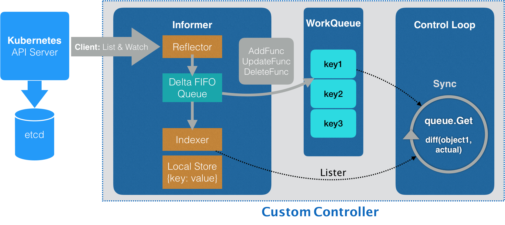

# informer

[client-go under the hood](https://github.com/kubernetes/sample-controller/blob/master/docs/controller-client-go.md)

[深入了解 Kubernetes Informer](https://cloudnative.to/blog/client-go-informer-source-code)

[client-go 中的 informer 源码分析](https://jimmysong.io/kubernetes-handbook/develop/client-go-informer-sourcecode-analyse.html)


## 1. 概述

### 什么是 informer

Informer（也叫做 SharedInformer）是 Kubernetes 控制器（controller）中的模块，是控制器调谐循环（reconcile loop）与 Kubernetes apiserver 事件（也就是 etcd 中 Kubernetes API 数据变化）挂接的桥梁，我们通过 apiserver 增删改某个 Kubernetes API 对象，该资源对应的控制器中的 Informer 会立即感知到这个事件并作出调谐。

可以看出 informer 的主要作用就是**通信**，借助 informer 机制，k8s 实现了在**不依赖中间件的情况下保证消息的实时性，可靠性和顺序性**。


### 具体逻辑

其整体流程图如下所示：


> 图源：[client-go under the hood](https://github.com/kubernetes/sample-controller/blob/master/docs/controller-client-go.md)

这张图分为上下两部分：

* 上半部分为 client-go 内部实现的
* 下半部分则是开发者需要实现的 自定义 Controller

不过真正需要实现的只有黄色图标，而其它的部分是 client-go 已经提供的，直接使用即可。


根据流程图，大致可以分为以下步骤：

- `Reflector` 获取资源数据并写入`DeltaFIFO`。
  -  通过调用 list 拉取全量历史数据
  - 然后通过长连接`watch`资源对象，获取后续的增量数据
- `Informrer`作为消费端，从队列中 pop 出资源对象进行消费;
  - 右侧，将消费的资源对象加入一个本地索引器`indexer`，通过`key-object`方式储存；
  - 左侧，消费的资源对象通过分发给事件处理函数处理;
- 后续就是 controller 的逻辑了
  - `ResourcesEventHanders` 对事件进行过滤后，将感兴趣的事件放入 Workqueue，具体是哪些事件则由开发者控制，一共包括 OnAdd、OnUpdate、OnDelete 三种事件。
  - `ProcessItem` 从 Workqueue 中取出事件进行处理，**这部分就是我们自定义 controller 的核心工作了**。
  - 然后在具体的 Handler 中可以需要查询资源具体数据，这时候就可以直接从 indexer 中查询，减轻了 api server 的压力


Controller 中使用 Workqueue 将 ResourcesEventHanders 和  ProcessItem 解耦。并且使用 indexer 作为缓存减轻了 api server 的压力。





### 为什么需要 informer

因为`k8s`有很多组件，通过和`apiserver`交互获取资源数据，这就带来了性能问题，特别是高并发请求下, 性能的损失是难以想象的。`informer`组件就是在这种背景下产生的，设计 informer 的核心是为了**减少 Ectd 和 Kubernetes API Server 的压力**，增强集群的稳定性。


## 2. 各组件介绍

### Reflector

Reflector 用于从 api server 中拉取指定的 k8s 资源及其变更事件。

启动时调用 List 方法获取全量历史数据，后续通过 Watch 方法获取增量事件。当 watch 的资源发生变化时，就会收到对应的变更的事件，比如 Added，Updated 和 Deleted 事件，并将资源对象存放到本地缓存 DeltaFIFO；


### DeltaFIFO

拆开理解，FIFO 就是一个**队列**，拥有队列基本方法（ADD，UPDATE，DELETE，LIST，POP，CLOSE 等），Delta 是一个资源对象存储，保存存储对象的消费类型，比如 Added，Updated，Deleted，Sync 等；


### Indexer

Indexer 是 Client-go 用来存储资源对象并自带索引功能的**本地存储**，Reflector 从 DeltaFIFO 中将消费出来的资源对象存储到 Indexer，Indexer 与 Etcd 集群中的数据完全保持一致。从而 client-go 可以本地读取，减少 Kubernetes API 和 Etcd 集群的压力。


### Workqueue 

Workqueue 是一个简单的 queue 提供了以下的特性:

- 公平性：每个item 按顺序处理。
- 严格性：一个 item 不会被并发地多次处理，而且一个相同的 item 被多次加入 queue 的话也只会处理一次。
- 支持多个生产者和消费者：它允许一个正在被处理的 item 再次加入队列。


我们建议使用 **RateLimitingQueue**，它相比普通的 workqueue 多了以下的功能: 

- 限流：可以限制一个 item 被 reenqueued 的次数。
- 防止 hot loop：它保证了一个 item 被 reenqueued 后，不会马上被处理。


## 3. SharedInformer

在推出 informer 机制后，广泛被用在 k8s 内部。新的问题就出现了，每个资源、每个 Controller 都要启动自己的 informer，然后 watch 接口需要和 api server 建立长链接，因此 api server 压力还是很大，于是推出了  SharedInformer  来降低 api server 的压力。

**SharedInformer 表明是可以共享使用的**，在使用 client-go 写代码时，若同一资源的 Informer 被实例化太多次，每个 Informer 使用一个 Reflector，会运行过多的相同 ListAndWatch（**即图中的第一步**），太多重复的序列化和反序列化会导致 k8s API Server 负载过重。

而 Shared Informer 通过**对同一类资源 Informer 共享一个 Reflector** 可以节约很多资源，这**通过 map 数据结构**即可实现这样一个共享 Informer 机制。


使用 SharedInformer  后多个资源或者 Controller 共用一个 informer，只和 api server 建立一个长连接，极大降低了 api server 的压力，因此现在一般都是使用 SharedInformer  了。


```go
type sharedInformerFactory struct {
  // ...
  
  // map 数据结构
	informers map[reflect.Type]cache.SharedIndexInformer
	// ...
}
// ...
// InternalInformerFor returns the SharedIndexInformer for obj using an internal client.
// 当示例中调用 xxx.Informer() 时，内部调用了该方法
func (f *sharedInformerFactory) InformerFor(obj runtime.Object, newFunc internalinterfaces.NewInformerFunc) cache.SharedIndexInformer {
	f.lock.Lock()
	defer f.lock.Unlock()

	informerType := reflect.TypeOf(obj)
	informer, exists := f.informers[informerType]
	if exists {
		return informer
	}

	resyncPeriod, exists := f.customResync[informerType]
	if !exists {
		resyncPeriod = f.defaultResync
	}

	informer = newFunc(f.client, resyncPeriod)
	f.informers[informerType] = informer

	return informer
}
```


## 4. Demo

### informer

使用 Informer 的关键流程如下：

```go
clientset, err := kubernetes.NewForConfig(config)
stopCh := make(chan struct{})
defer close(stopch)
sharedInformers := informers.NewSharedInformerFactory(clientset, time.Minute)
informer := sharedInformer.Core().V1().Pods().Informer()
informer.AddEventHandler(cache.ResourceEventHandlerFuncs{
  AddFunc: func(obj interface{} {
    // ...
  },
  UpdateFunc: func(obj interface{} {
    // ...
  },
  DeleteFunc  : func(obj interface{} {
    // ...
  })
  informer.Run(stopCh)
})
```


代码很简单，几步就完成了：

- 实例化一个 Kubernetes 资源 ClientSet
- 实例化一个 SharedInformer 对象
- 得到具体 Pod 资源的 Informer 对象
- 为 Informer 添加增改删事件的回调方法
- 使用一个单独的 goroutine 启动 Informer，`stopCh` 用于在进程退出前通知 Informer 优雅退出


### Reflector

我们在最后一步执行了 `informer.Run(stopCh)`，内部会执行一个 ListAndWatch 方法：

```go
// Run 执行一个 watch 并且把握所有的 watch events，watch 关闭后会重启
// stopCh 关闭时 Run 退出
func (r *Reflector) Run(stopCh <-chan struct{}) {
	klog.V(3).Infof("Starting reflector %v (%s) from %s", r.expectedType, r.resyncPeriod, r.name)
	wait.Until(func() {
		if err := r.ListAndWatch(stopCh); err != nil {
			utilruntime.HandleError(err)
		}
	}, r.period, stopCh)
}
```


## 5. Resync 机制

[Informer 中为什么需要引入 Resync 机制？](https://github.com/cloudnativeto/sig-kubernetes/issues/11)

Resync 机制会将 Indexer 本地存储中的资源对象同步到 DeltaFIFO 中，并将这些资源对象设置为 Sync 的操作类型。

```go
// 重新同步一次 Indexer 缓存数据到 Delta FIFO
func (f *DeltaFIFO) Resync() error {
	f.lock.Lock()
	defer f.lock.Unlock()

	if f.knownObjects == nil {
		return nil
	}
	// 遍历 indexer 中的 key，传入 syncKeyLocked 中处理
	keys := f.knownObjects.ListKeys()
	for _, k := range keys {
		if err := f.syncKeyLocked(k); err != nil {
			return err
		}
	}
	return nil
}

func (f *DeltaFIFO) syncKeyLocked(key string) error {
	obj, exists, err := f.knownObjects.GetByKey(key)
	if err != nil {
		klog.Errorf("Unexpected error %v during lookup of key %v, unable to queue object for sync", err, key)
		return nil
	} else if !exists {
		klog.Infof("Key %v does not exist in known objects store, unable to queue object for sync", key)
		return nil
	}
	// 若 FIFO 队列中已经有相同 key 的 event 进来了，说明该资源对象有了新的 event，
	// Indexer 中旧的缓存失效，直接返回 nil
	id, err := f.KeyOf(obj)
	if err != nil {
		return KeyError{obj, err}
	}
	if len(f.items[id]) > 0 {
		return nil
	}
  // 重新放入 FIFO 队列中
	if err := f.queueActionLocked(Sync, obj); err != nil {
		return fmt.Errorf("couldn't queue object: %v", err)
	}
	return nil
}
```

**为什么需要 Resync 机制呢？**因为在处理 SharedInformer 事件回调时，可能存在处理失败的情况，定时的 Resync 让这些处理失败的事件有了重新 onUpdate 处理的机会。

那么经过 Resync 重新放入 Delta FIFO 队列的事件，和直接从 apiserver 中 watch 得到的事件处理起来有什么不一样呢？

```go
func (s *sharedIndexInformer) HandleDeltas(obj interface{}) error {
	// 上锁

	for _, d := range obj.(Deltas) {
		// 判断事件类型
		switch d.Type {
		case Sync, Replaced, Added, Updated:
			s.cacheMutationDetector.AddObject(d.Object)
			if old, exists, err := s.indexer.Get(d.Object); err == nil && exists {
				if err := s.indexer.Update(d.Object); err != nil {
					return err
				}
				
				isSync := false
				switch {
				case d.Type == Sync:
					// 如果是通过 Resync 重新同步得到的事件则做个标记
					isSync = true
				case d.Type == Replaced:
					...
				}
				// 如果是通过 Resync 重新同步得到的事件，则触发 onUpdate 回调
				s.processor.distribute(updateNotification{oldObj: old, newObj: d.Object}, isSync)
			} else {
				if err := s.indexer.Add(d.Object); err != nil {
					return err
				}
				s.processor.distribute(addNotification{newObj: d.Object}, false)
			}
		case Deleted:
			if err := s.indexer.Delete(d.Object); err != nil {
				return err
			}
			s.processor.distribute(deleteNotification{oldObj: d.Object}, false)
		}
	}
	return nil
}
```

Resync 机制的引入，定时将 Indexer 缓存事件重新同步到 Delta FIFO 队列中，在处理 SharedInformer 事件回调时，让处理失败的事件得到重新处理。并且通过入队前判断 FIFO 队列中是否已经有了更新版本的 event，来决定是否丢弃 Indexer 缓存不进行 Resync 入队。在处理 Delta FIFO 队列中的 Resync 的事件数据时，触发 onUpdate 回调来让事件重新处理。


## 6. 源码

### Indexer

Client-go 用来存储资源对象并自带索引功能的本地存储，Reflector 从 DeltaFIFO 中将消费出来的资源对象存储到 Indexer，Indexer 与 Etcd 集群中的数据完全保持一致。从而 client-go 可以本地读取，减少 Kubernetes API 和 Etcd 集群的压力。

了解 Indexer 之前，先了解 ThreadSafeMap，ThreadSafeMap 是实现并发安全存储，就像 Go 1.9 后推出 `sync.Map` 一样。Kubernetes 开始编写的时候还没有 `sync.Map`。Indexer 在 ThreadSafeMap 的基础上进行了封装，继承了 ThreadSafeMap 的存储相关的增删改查相关操作方法，实现了 Indexer Func 等功能，例如 Index，IndexKeys，GetIndexers 等方法，这些方法为 ThreadSafeMap 提供了索引功能。如下图：

```
        ┌───────────────┐    ┌──────────────┐
        │   Indeices    │--->│    Index     │
        └───────────────┘    └──────────────┘

        ┌───────────────┐    ┌──────────────┐
        │   Indexers    │--->│  IndexFun    │
        └───────────────┘    └──────────────┘

        ┌───────────────────────────────────┐
        │          ThreadSafeStore          │
        └───────────────────────────────────┘
```

#### ThreadSafeStore

ThreadSafeStore 是一个**内存中存储**，数据不会写入本地磁盘，增删改查都会加锁，保证数据一致性。结构如下：

```
vendor/k8s.io/client-go/tools/cache/store.go
// threadSafeMap implements ThreadSafeStore
type threadSafeMap struct {
	lock  sync.RWMutex
	items map[string]interface{}

	// indexers maps a name to an IndexFunc
	indexers Indexers
	// indices maps a name to an Index
	indices Indices
}
```

items 字段存储资源对象数据，其中 items 的 key 通过 keyFunc 函数计算得到，计算默认使用 MetaNamespaceKeyFunc 函数，该函数根据资源对象计算出 `<namespace>/<name>` 格式的 key，value 用于存储资源对象。

而后面两个字段的定义类型如下：

```
vendor/k8s.io/client-go/tools/cache/index.go
// Index maps the indexed value to a set of keys in the store that match on that value
type Index map[string]sets.String

// Indexers maps a name to a IndexFunc
type Indexers map[string]IndexFunc

// Indices maps a name to an Index
type Indices map[string]Index
```

#### Indexer 索引器

每次增删改 ThreadSafeStore 的数据时，都会通过 updateIndices 或 deleteFormIndices 函数变更 Indexer。Indexer 被设计为可以自定义索引函数，他有重要的四个数据结构，**Indexers**，**IndexFunc**，**Indices** 和 **Index**。

看下面这个例子的关键流程：

```go
func UsersIndexFunc(obj interfaces{}) ([]string, error) {
  pod := obj.(*v1.Pod)
  usersString := pod.Annotations["users"]
  return strings.Split(userString, ","), nil
}

func main() {
  index := cache.NewIndexer(cache.MetaNamespaceKeyFunc, cache.Indexers{"byUser": UsersIndexFunc})
  pod1 := &v1.Pod{ObjectMeta: metav1.ObjectMeta{Name: "one", Annotations: map[string]string{"users": "ernie,bert"}}}
  // Initialize pod2 and pod3
  
  index.Add(pod1)
  // Add pod2 and pod3
  erniePods, err := omdex.ByIndex("byUser", "ernie")
}
```

首先定义了一个索引器函数（IndexFunc），UsersIndexFunc。该函数定义查询所有 Pod 资源下 Annotations 字段的 key 为 users 的 Pod：

```go
func UsersIndexFunc(obj interfaces{}) ([]string, error) {
  pod := obj.(*v1.Pod)
  usersString := pod.Annotations["users"]
  return strings.Split(userString, ","), nil
}
```

Main 函数中 `cache.NewIndexer` 实例化了一个 Indexer 对象：

```go
index := cache.NewIndexer(cache.MetaNamespaceKeyFunc, cache.Indexers{"byUser": UsersIndexFunc})
```

第一个参数计算资源对象的 key，默认就是 MetaNamespaceKeyFunc，第二个参数是一个 Indexers 对象，如上一节展示的定义那样，key 为索引器（IndexFunc）的名称，value 为索引器函数。

通过 index.Add 添加了三个 Pod，再通过 index.ByIndex 函数查询使用 byUser 索引器下匹配 ernie 字段的 Pod 列表：

```go
erniePods, err := index.ByIndex("byUser", "ernie")
```

回看这四个类型：

```go
// Indexers maps a name to a IndexFunc
type Indexers map[string]IndexFunc

// IndexFunc knows how to provide an indexed value for an object.
type IndexFunc func(obj interface{}) ([]string, error)

// Indices maps a name to an Index
type Indices map[string]Index

// Index maps the indexed value to a set of keys in the store that match on that value
type Index map[string]sets.String
```

- Indexers：存储索引器，key 为 索引器名称，value 为索引器实现函数；
- IndexFunc：索引器函数，定义为接收一个资源对象，返回检索结果列表；
- Indices：存储缓存器，key 为缓存器名称，value 为缓存数据；
- Index：存储缓存数据，结构为 K/V。

#### Indexer 索引器核心实现

```go
vendor/k8s.io/client-go/tools/cache/thread_safe_store.go
// ByIndex returns a list of items that match an exact value on the index function
func (c *threadSafeMap) ByIndex(indexName, indexKey string) ([]interface{}, error) {
	c.lock.RLock()
	defer c.lock.RUnlock()

	indexFunc := c.indexers[indexName]
	if indexFunc == nil {
		return nil, fmt.Errorf("Index with name %s does not exist", indexName)
	}

	index := c.indices[indexName]

	set := index[indexKey]
	list := make([]interface{}, 0, set.Len())
	for _, key := range set.List() {
		list = append(list, c.items[key])
	}

	return list, nil
}
```

ByIndex 接收两个参数：indexName（索引器名字）以及 indexKey（需要检索的 key），首先从 c.indexers 查找制定的索引器函数，然后从 c.indices 查找返回的缓存器函数，最后根据需要索引的 indexKey 从缓存数据中查到并返回。

⚠️ K8s 将 map 结构类型的 key 作为 Set 数据结构，实现 Set 去重特性。