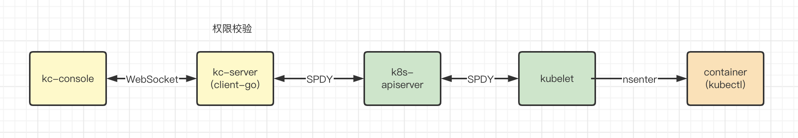

# kubectl-console

Web terminal.

**最终效果**：

在 web 界面实现执行 kubectl 命令以查看集群情况。

**大致方案**：

- 方案一：ssh 到指定集群 master 节点，执行命令时过滤掉非 kubectl 命令

- 方案二：安装集群时启动一个 kubectl 容器，exec 到容器中执行 kubectl 命令

方案二通过容器进行隔离，安全性更好，最终选择方案二。

**具体实现**：

1. 创建集群时在集群中启动一个含有 kubectl 工具的 pod，并且通过 serviceaccount 赋予权限，等待后续连接。

1. 用户打开 kubectl-console 界面时，kc-console 和 kc-server 建立 websocket连接(**连接1**)，同时 kc-server 使用 client-go 调用 k8s apiserver 提供的 exec 接口(**连接2**),进入到 kubectl pod,并执行 sh 命令开启 shell，最终桥接连接1和连接2以实现整个功能。

Todo

限速，防止 apiserver 带宽被占用过多。

危险命令限制，过滤部分命令。

完整调用链如下图：

