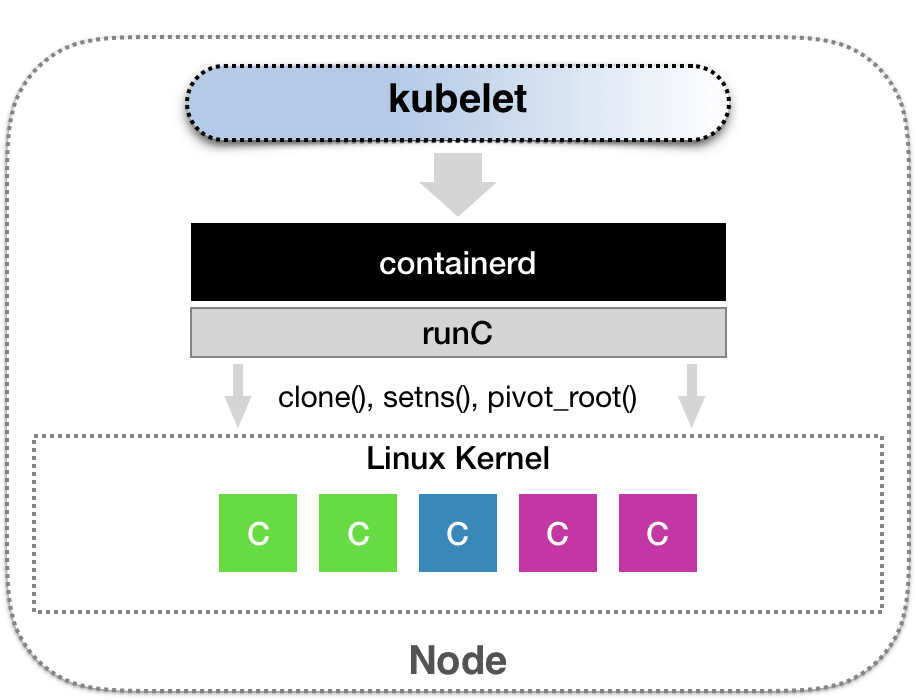
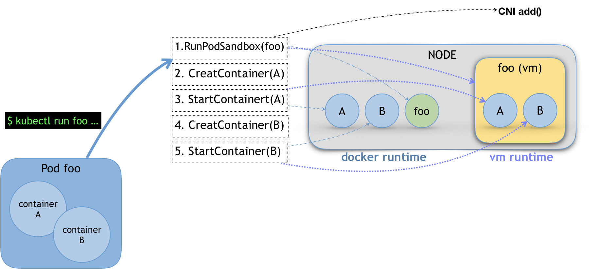
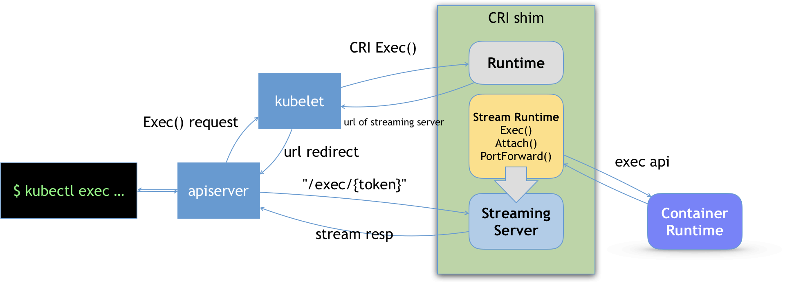

## CRI 与容器运行时

## 1.  概述

CRI 机制能够发挥作用的核心，就在于每一种容器项目现在都可以自己实现一个 CRI shim，自行对 CRI 请求进行处理。这样，Kubernetes 就有了一个统一的容器抽象层，使得下层容器运行时可以自由地对接进入 Kubernetes 当中。

CNCF 里的 containerd 项目，就可以提供一个典型的 CRI shim 的能力，即：将 Kubernetes 发出的 CRI 请求，转换成对 containerd 的调用，然后创建出 runC 容器。而 runC 项目，才是负责执行我们前面讲解过的设置容器 Namespace、Cgroups 和 chroot 等基础操作的组件。



## 2. CRI

具体定义如下：

```go
type RuntimeVersioner interface {
	Version(apiVersion string) (*runtimeapi.VersionResponse, error)
}

type ContainerManager interface {
	CreateContainer(podSandboxID string, config *runtimeapi.ContainerConfig, sandboxConfig *runtimeapi.PodSandboxConfig) (string, error)
	StartContainer(containerID string) error
	StopContainer(containerID string, timeout int64) error
	RemoveContainer(containerID string) error
	ListContainers(filter *runtimeapi.ContainerFilter) ([]*runtimeapi.Container, error)
	ContainerStatus(containerID string) (*runtimeapi.ContainerStatus, error)
	UpdateContainerResources(containerID string, resources *runtimeapi.LinuxContainerResources) error
	ExecSync(containerID string, cmd []string, timeout time.Duration) (stdout []byte, stderr []byte, err error)
	Exec(*runtimeapi.ExecRequest) (*runtimeapi.ExecResponse, error)
	Attach(req *runtimeapi.AttachRequest) (*runtimeapi.AttachResponse, error)
	ReopenContainerLog(ContainerID string) error
}

type PodSandboxManager interface {
	RunPodSandbox(config *runtimeapi.PodSandboxConfig, runtimeHandler string) (string, error)
	StopPodSandbox(podSandboxID string) error
	RemovePodSandbox(podSandboxID string) error
	PodSandboxStatus(podSandboxID string) (*runtimeapi.PodSandboxStatus, error)
	ListPodSandbox(filter *runtimeapi.PodSandboxFilter) ([]*runtimeapi.PodSandbox, error)
	PortForward(*runtimeapi.PortForwardRequest) (*runtimeapi.PortForwardResponse, error)
}

type ContainerStatsManager interface {
	ContainerStats(containerID string) (*runtimeapi.ContainerStats, error)
	ListContainerStats(filter *runtimeapi.ContainerStatsFilter) ([]*runtimeapi.ContainerStats, error)
}

// kubernetes/staging/src/k8s.io/cri-api/pkg/apis/services.go 93行
type RuntimeService interface {
	RuntimeVersioner
	ContainerManager
	PodSandboxManager
	ContainerStatsManager
	UpdateRuntimeConfig(runtimeConfig *runtimeapi.RuntimeConfig) error
	Status() (*runtimeapi.RuntimeStatus, error)
}

type ImageManagerService interface {
	ListImages(filter *runtimeapi.ImageFilter) ([]*runtimeapi.Image, error)
	ImageStatus(image *runtimeapi.ImageSpec) (*runtimeapi.Image, error)
	PullImage(image *runtimeapi.ImageSpec, auth *runtimeapi.AuthConfig, podSandboxConfig *runtimeapi.PodSandboxConfig) (string, error)
	RemoveImage(image *runtimeapi.ImageSpec) error
	ImageFsInfo() ([]*runtimeapi.FilesystemUsage, error)
}
```

具体地说，我们可以把 CRI 分为两组：

* 第一组，是 **RuntimeService**。它提供的接口，主要是跟容器相关的操作。比如，创建和启动容器、删除容器、执行 exec 命令等等。
* 而第二组，则是 **ImageService**。它提供的接口，主要是容器镜像相关的操作，比如拉取镜像、删除镜像等等。

**在这一部分，CRI 设计的一个重要原则，就是确保这个接口本身，只关注容器，不关注 Pod**。这样做的原因，也很容易理解。


第一，Pod 是 Kubernetes 的编排概念，而不是容器运行时的概念。所以，我们就不能假设所有下层容器项目，都能够暴露出可以直接映射为 Pod 的 API。

第二，如果 CRI 里引入了关于 Pod 的概念，那么接下来只要 Pod API 对象的字段发生变化，那么 CRI 就很有可能需要变更。

**PodSandboxManager**：PodSandboxes 相关操作。

> PodSandboxes 只是抽取了部分Pod中与容器运行时有关的概念，比如 HostName、DnsConfig、CgroupParent 等。

**ContainerManager**：主要用于执行 Container 相关操作。比如 Kubernetes 中创建一个 Pod 流程如下：




* 1）调用 PodSandboxManager 中的接口准备好 Pod 环境
* 2）调用 ContainerManager 创建并启动对应的 Container。


比如，当我们执行 kubectl run 创建了一个名叫 foo 的、包括了 A、B 两个容器的 Pod 之后。这个 Pod 的信息最后来到 kubelet，kubelet 就会按照图中所示的顺序来调用 CRI 接口。在具体的 CRI shim 中，这些接口的实现是可以完全不同的。


首先，如果是 Docker 项目，dockershim 就会创建出一个名叫 foo 的 Infra 容器（pause 容器），用来“hold”住整个 Pod 的 Network Namespace。

> 而如果是基于虚拟化技术的容器，比如 Kata Containers 项目，它的 CRI 实现就会直接创建出一个轻量级虚拟机来充当 Pod。

另外在 RunPodSandbox 这个接口的实现中，你需要调用 networkPlugin.SetUpPod(…) 来为这个 Sandbox 设置网络。这个 SetUpPod(…) 方法，实际上就在执行 CNI 插件里的 add(…) 方法，也就是我在前面为你讲解过的 CNI 插件为 Pod 创建网络，并且把 Infra 容器加入到网络中的操作。

然后，kubelet 继续调用 CreateContainer 和 StartContainer 接口来创建和启动容器 A、B。对应到 dockershim 里，就是直接启动 A，B 两个 Docker 容器。所以最后，宿主机上会出现三个 Docker 容器组成这一个 Pod。

> 而如果是 Kata Containers 的话，CreateContainer 和 StartContainer 接口的实现，就只会在前面创建的轻量级虚拟机里创建两个 A、B 容器对应的 Mount Namespace。所以，最后在宿主机上，只会有一个叫作 foo 的轻量级虚拟机在运行。


## 3. Streaming API

除了上述对`容器生命周期`的实现之外，CRI shim 还有一个重要的工作，就是如何实现 `exec`、`logs` 等接口。

这些接口跟前面的操作有一个很大的不同，就是这些 gRPC 接口调用期间，kubelet 需要跟容器项目维护一个长连接来传输数据。这种 API，我们就称之为 Streaming API。



* 1）我们  kubectl exec 命令首先会交给 API Server，然后 API Server 就会调用 kubelet 的 Exec API。
* 2）这时，kubelet 就会调用 CRI 的 Exec 接口，而负责响应这个接口的，自然就是具体的 CRI shim。
  * CRI shim 只会把对应的自己的 Streaming Server 的地址和端口以URL形式 返回给 kubelet，而不是直接调用容器项目。
* 3）kubelet 在拿到这个 URL 之后，就会把它以 Redirect 的方式返回给 API Server。
  * 然后 **API Server 就会通过重定向来向 Streaming Server 发起真正的 /exec 请求，与它建立长连接**。

> 第二步返回 URL 应该是为了让 API Server 与 CRI shim 直连，而不是 API Server 与 kubelet 建立长连接，然后 kubelet 再和 CRI shim 建立长连接。

当然，这个 Streaming Server 本身，是需要通过使用 SIG-Node 为你维护的 Streaming API 库来实现的。并且，Streaming Server 会在 CRI shim 启动时就一起启动。


## 4. 小结

CRI 这个接口的设计，实际上还是比较宽松的，作为 CRI 实现者拥有较高的自由度。

这个自由度不仅包括了容器的生命周期管理，也包括了如何将 Pod 映射成为我自己的实现，还包括了如何调用 CNI 插件来为 Pod 设置网络的过程。

这也正是为什么像 Kata Containers、gVisor 甚至虚拟机这样的“非典型”容器，都可以无缝接入到 Kubernetes 项目里的重要原因。

