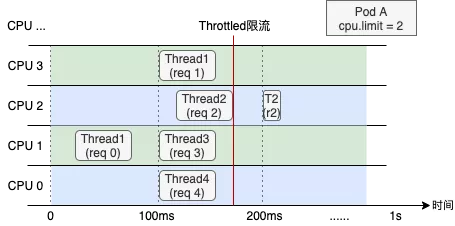
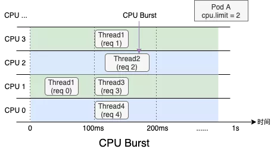

# 如何合理使用 CPU 管理策略，提升容器性能？

## 1. 概述

让应用管理员常常感到疑惑的是，为什么容器的资源利用率并不高，但却频繁出现应用性能下降的问题？

从 CPU 资源的角度来分析，问题通常来自于以下两方面：

* 一是内核在根据 CPU Limit 限制容器资源消耗时产生的 CPU Throttle 问题；
* 二是受 CPU 拓扑结构的影响，部分应用对进程在 CPU 间的上下文切换比较敏感，尤其是在发生跨 NUMA 访问时的情况。

## 2. CPU Throttle

### CPU 资源调度

内核 CFS 调度是通过 cfs_period 和 cfs_quota 两个参数来管理容器 CPU 时间片消耗的，cfs_period 一般为固定值 100 ms，cfs_quota 对应容器的 CPU Limit。例如对于一个 CPU Limit = 0.5 的容器，其 cfs_quota 会被设置为 250ms，表示该容器在每 100ms 的时间周期内最多使用 50ms 的 CPU 时间片。当其 CPU 使用量超出预设的 limit 值时，容器中的进程会受内核调度约束而被限流，只有等到下一个时间周期时才能继续运行。

> 在 100ms 只能运行 50ms 这种情况下，那剩下的 50ms 都无法处理请求，因此接口尾延迟就会特别高。
>
> 比如处理请求需要 10ms，加上被限流的 50ms，延迟可能达到是 60ms。
>
> 而 CPU 使用率看起来并不高，因为我们到的都是平均值。

### 问题分析

下面我们用一个具体的例子来描述 CPU Throttle 导致应用性能下降的过程。图中展示了一个CPU Limit = 2 的 Web 服务类容器，在收到请求后（req）各线程（Thread）的 CPU 资源分配情况。假设每个请求的处理时间均为 60 ms，可以看到，即使容器在最近整体的 CPU 利用率较低，由于在 100 ms～200 ms 区间内连续处理了4 个请求，将该内核调度周期内的时间片预算（200ms）全部消耗，Thread 2 需要等待下一个周期才能继续将 req 2 处理完成，该请求的响应时延（RT）就会变长。这种情况在应用负载上升时将更容易发生，导致其 RT 的长尾情况将会变得更为严重。

### 解决方案-CPU Burst

为了避免 CPU Throttle 的问题，我们只能将容器的 CPU Limit 值调大。然而，若想彻底解决 CPU Throttle，通常需要将 CPU Limit 调大两三倍，有时甚至五到十倍，问题才会得到明显缓解。而为了降低 CPU Limit 超卖过多的风险，还需降低容器的部署密度，进而导致整体资源成本上升。

> 这样明显代价太大

因此阿里云团队用 CPU Burst 技术来满足这种细粒度 CPU 突发需求，在传统的 CPU Bandwidth Controller quota 和 period 基础上引入 burst 的概念。

当容器的 CPU 使用低于 quota 时，可用于突发的 burst 资源累积下来；当容器的 CPU 使用超过 quota，允许使用累积的 burst 资源。最终达到的效果是将容器更长时间的平均 CPU 消耗限制在 quota 范围内，允许短时间内的 CPU 使用超过其 quota。

> **类似于从漏斗桶限流算法切换到了令牌桶算法,可以在请求量低时存一部分令牌用于 burst。**

比例上述例子，使用 CPU Burst 之后就变成下图所示：

> 借助 Burst 处理突发请求，降低 RT 尾延。

在容器场景中使用 CPU Burst 之后，测试容器的服务质量显著提升。观察到 RT 均值下降 68%（从 30+ms 下降到 9.6ms ）；99%  RT 下降 94.5%（从 500+ms 下降到 27.37ms ）

CPU Burst 机制可以有效解决延迟敏感性应用的 RT 长尾问题，提升容器性能表现。

我们使用 Apache HTTP Server 作为延迟敏感型在线应用，通过模拟请求流量，评估 CPU Burst 能力对响应时间（RT）的提升效果。以下数据分别展示了 CPU Burst 策略开启前后的表现情况：

| 环境               | Alibaba Cloud Linux 2 | Alibaba Cloud Linux 2 | Centos 7           | Centos 7 |
| ------------------ | --------------------- | --------------------- | ------------------ | -------- |
| CPU Burst          | 否                    | 是                    | 否                 | 是       |
| apache RT-99       | 107.37 ms (+59.89%）  | 67.18 ms              | 111.69 ms (+56.6%) | 71.30 ms |
| CPU Throttle Ratio | 33.3%                 | 0%                    | 33%                | 0%       |
| Pod CPU 平均利用率 | 31.8%                 | 32.6%                 | 32.5%              | 33.8%    |

对比以上数据可得知：

- 在开启 CPU Burst 能力后，应用的 RT 指标的 p99 分位值得到了明显的优化。
- 对比 CPU Throttled 及利用率指标，可以看到开启 CPU Burst 能力后，CPU Throttled 情况得到了消除，同时 Pod 整体利用率基本保持不变。

CPU Burst 解决了内核 BWC 调度时针对 CPU Limit 的限流问题，可以有效提升延时敏感型任务的性能表现。但 CPU Burst 本质并不是将资源无中生有地变出来，若容器 CPU 利用率已经很高（例如大于50%），CPU Burst 能起到的优化效果将会受限，此时应该通过 HPA 或 VPA 等手段对应用进行扩容。

## 3.  CPU 拓扑结构

在 NUMA 架构下，节点中的 CPU 和内存会被切分成了两部分甚至更多（例如图中 Socket0，Socket1），CPU 被允许以不同的速度访问内存的不同部分，当 CPU 跨 Socket 访问另一端内存时，其访存时延相对更高。

**盲目地在节点为容器分配物理资源可能会降低延迟敏感应用的性能**，因此我们需要避免将 CPU 分散绑定到多个 Socket 上，提升内存访问时的本地性。

如下图所示，同样是为两个容器分配 CPU、内存资源，显然场景B中的分配策略更为合理。

*因此可以无脑绑核吗？*

假设应用收到了 4 个请求需要处理，Static 模式（绑核）下 容器会被固定在 CPU0 和 CPU1 两个核心，各线程只能排队运行，而在 Default 模式（未绑核）下，容器获得了更多的 CPU 弹性，收到请求后各线程可以立即处理。可以看出，**绑核策略并不是“银弹”**，绑核与不绑核都有适合自己的应用场景，需要具体问题具体分析。

## 4. 相关阅读

[如何合理使用 CPU 管理策略，提升容器性能](https://mp.weixin.qq.com/s/N7UWOjqEnZ8oojWgFGBOlQ)