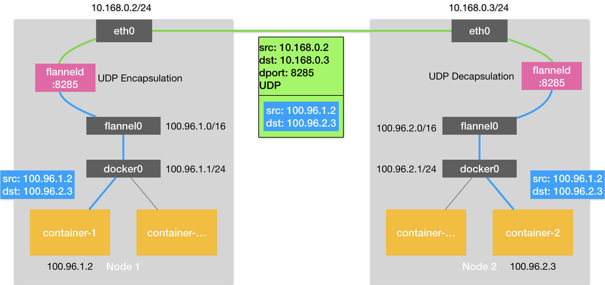
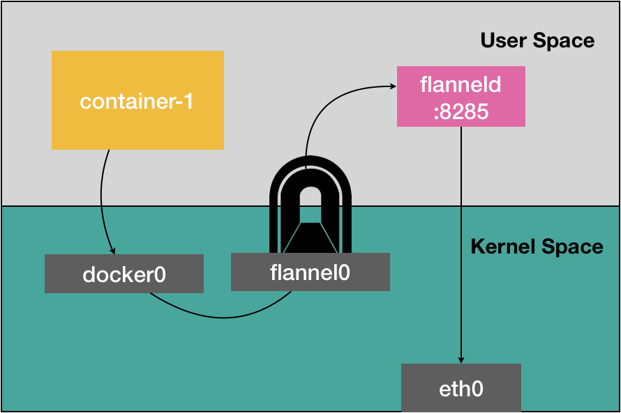

# Kubernetes 跨主机网络

## 1. 概述

 Docker 的默认配置下，不同宿主机上的容器通过 IP 地址进行互相访问是根本做不到的。

为了解决这个容器“跨主通信”的问题，社区里才出现了那么多的容器网络方案。

Flannel 项目是 CoreOS 公司主推的容器网络方案。目前，Flannel 支持三种后端实现，分别是：

* 1）VXLAN；
* 2）host-gw；
* 3）UDP

而 UDP 模式，是 Flannel 项目最早支持的一种方式，却也是性能最差的一种方式。所以，这个模式目前已经被弃用。不过，Flannel 之所以最先选择 UDP 模式，就是因为这种模式是最直接、也是最容易理解的容器跨主网络实现。


在这个例子中，我有两台宿主机。

* 宿主机 Node 1 上有一个容器 container-1，它的 IP 地址是 100.96.1.2，对应的 docker0 网桥的地址是：100.96.1.1/24。
* 宿主机 Node 2 上有一个容器 container-2，它的 IP 地址是 100.96.2.3，对应的 docker0 网桥的地址是：100.96.2.1/24。

我们现在的任务，就是让 container-1 访问 container-2。

## 2. Flannel UDP

### 1. 大致流程

UDP 方案具体流程如下图所示：




### 2. flannel0

该方案使用时会在各个 Work 节点上运行一个Flannel 进程，同时创建一个 flannel0 ，而这个 flannel0 它是一个 TUN 设备（Tunnel 设备）。

在 Linux 中，TUN 设备是一种工作在三层（Network Layer）的虚拟网络设备。TUN 设备的功能非常简单，即：**在操作系统内核和用户应用程序之间传递 IP 包**。


当操作系统将一个 IP 包发送给 flannel0 设备之后，flannel0 就会把这个 IP  包，交给创建这个设备的应用程序，也就是 Flannel 进程。

> 这是一个从内核态向用户态的流动方向。

反之，如果 Flannel 进程向 flannel0 设备发送了一个 IP 包，那么这个 IP 包就会出现在宿主机网络栈中，然后根据宿主机的路由表进行下一步处理。

> 这是一个从用户态向内核态的流动方向。


### 3. Subnet

子网（Subnet)  是  Flannel 项目里一个非常重要的概念。

事实上，在由 Flannel 管理的容器网络里，一台宿主机上的所有容器，都属于该宿主机被分配的一个“子网”。

> 在我们的例子中，Node 1 的子网是 100.96.1.0/24，container-1 的 IP 地址是 100.96.1.2。Node 2 的子网是 100.96.2.0/24，container-2 的 IP 地址是 100.96.2.3。

而这些子网与宿主机的对应关系，正是保存在 Etcd 当中，如下所示：

```sh
$ etcdctl ls /coreos.com/network/subnets
/coreos.com/network/subnets/100.96.1.0-24
/coreos.com/network/subnets/100.96.2.0-24
/coreos.com/network/subnets/100.96.3.0-24
```

所以，flanneld 进程在处理由 flannel0 传入的 IP 包时，就可以根据目的 IP 的地址（比如 100.96.2.3），匹配到对应的子网（比如 100.96.2.0/24），从 Etcd 中找到这个子网对应的宿主机的 IP 地址是 10.168.0.3，如下所示：

```sh
$ etcdctl get /coreos.com/network/subnets/100.96.2.0-24
{"PublicIP":"10.168.0.3"}
```


### 4. 具体步骤

**步骤一：容器到宿主机**

container-1 容器里的进程发起的 IP 包，其源地址就是 100.96.1.2，目的地址就是 100.96.2.3。

由于目的地址 100.96.2.3 并不在 Node 1 的 docker0 网桥的网段里，所以这个 IP 包会被交给默认路由规则，通过容器的网关进入 docker0 网桥（如果是同一台宿主机上的容器间通信，走的是直连规则），从而出现在宿主机上。

**步骤二：宿主机路由到 flannel0 设备**

这时候，这个 IP 包的下一个目的地，就取决于宿主机上的路由规则了。

> Flannel 已经在宿主机上创建出了一系列的路由规则。

以 Node 1 为例，如下所示：

```sh
# 在Node 1上
$ ip route
default via 10.168.0.1 dev eth0
100.96.0.0/16 dev flannel0  proto kernel  scope link  src 100.96.1.0
100.96.1.0/24 dev docker0  proto kernel  scope link  src 100.96.1.1
10.168.0.0/24 dev eth0  proto kernel  scope link  src 10.168.0.2
```

由于我们的 IP 包的目的地址是 100.96.2.3，只能匹配到第二条、也就是 100.96.0.0/16 对应的这条路由规则，从而进入到一个叫作 flannel0 的设备中。

**步骤3：flanneld 进程转发给 Node2**

flannel0 设备收到 IP 包后转给 flanned 进程。然后，flanneld 根据这个 IP 包的目的地址，是 100.96.2.3，去 etcd 中查询到对应的宿主机IP，就是 Node2，因此会把它发送给了 Node 2 宿主机。


**步骤4：封装UDP包**

flanneld 进程会把这个 IP 包直接封装在一个 UDP 包里，然后发送给 Node 2。不难理解，这个 UDP 包的源地址，就是 flanneld 所在的 Node 1 的地址，而目的地址，则是 container-2 所在的宿主机 Node 2 的地址。

由于 flanneld 进程监听的是 8285 端口，所以会发送给 Node2的8285端口。


**步骤5：Node2 解析并处理UDP包**

Node2 上的 flanneld 进程收到这个 UDP包之后就可以从里面解析出container-1 发来的原 IP 包。

解析后将其发送给 flannel0 设备，flannel0 则会将其转发给操作系统内核。


**步骤6：内核处理IP包**

Linux 收到这个IP包之后，Linux 内核网络栈就会负责处理这个 IP 包。具体的处理方法，就是通过本机的路由表来寻找这个 IP 包的下一步流向。

而 Node 2 上的路由表，跟 Node 1 非常类似，如下所示：

```sh
# 在Node 2上
$ ip route
default via 10.168.0.1 dev eth0
100.96.0.0/16 dev flannel0  proto kernel  scope link  src 100.96.2.0
100.96.2.0/24 dev docker0  proto kernel  scope link  src 100.96.2.1
10.168.0.0/24 dev eth0  proto kernel  scope link  src 10.168.0.3
```

由于这个 IP 包的目的地址是 100.96.2.3，它跟第三条、也就是 100.96.2.0/24 网段对应的路由规则匹配更加精确。所以，Linux 内核就会按照这条路由规则，把这个 IP 包转发给 docker0 网桥。

**步骤7：容器网络**

IP包到 docker0 网桥后的流程就属于容器网络了。


### 5. 分析

实际上，相比于两台宿主机之间的直接通信，基于 Flannel UDP 模式的容器通信多了一个额外的步骤，即 flanneld 的处理过程。

而这个过程，由于使用到了 flannel0 这个 TUN 设备，仅在发出 IP 包的过程中，就**需要经过三次用户态与内核态之间的数据拷贝**，如下所示：




* 1）第一次，用户态的容器进程发出的 IP 包经过 docker0 网桥进入内核态；
* 2）第二次，IP 包根据路由表进入 TUN（flannel0）设备，从而回到用户态的 flanneld 进程；
* 3）第三次，flanneld 进行 UDP 封包之后重新进入内核态，将 UDP 包通过宿主机的 eth0 发出去。

此外，我们还可以看到，Flannel 进行 UDP 封装（Encapsulation）和解封装（Decapsulation）的过程，也都是在用户态完成的。在 Linux 操作系统中，上述这些上下文切换和用户态操作的代价其实是比较高的，这也正是造成 Flannel UDP 模式性能不好的主要原因。

所以说，**我们在进行系统级编程的时候，有一个非常重要的优化原则，就是要减少用户态到内核态的切换次数，并且把核心的处理逻辑都放在内核态进行**。这也是为什么，Flannel 后来支持的VXLAN 模式，逐渐成为了主流的容器网络方案的原因。


## 3. Flannel VXLAN

VXLAN，即 Virtual Extensible LAN（虚拟可扩展局域网），是 Linux 内核本身就支持的一种网络虚似化技术。

所以说，VXLAN 可以完全在内核态实现上述封装和解封装的工作，从而通过与前面相似的“隧道”机制，构建出覆盖网络（Overlay Network）。

VXLAN 的覆盖网络的设计思想是：**在现有的三层网络之上，“覆盖”一层虚拟的、由内核 VXLAN 模块负责维护的二层网络，使得连接在这个 VXLAN 二层网络上的“主机”（虚拟机或者容器都可以）之间，可以像在同一个局域网（LAN）里那样自由通信**。

> 当然，实际上，这些“主机”可能分布在不同的宿主机上，甚至是分布在不同的物理机房里。