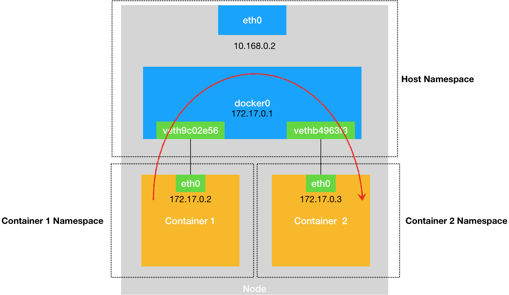
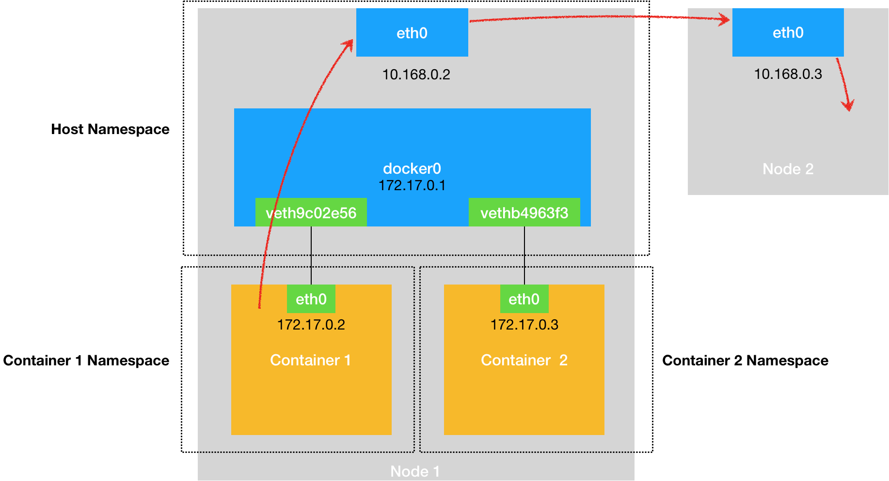
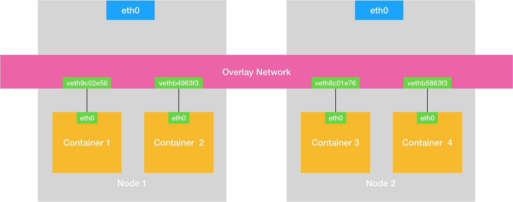

# 容器网络

## 1. 概述

一个 Linux 容器能看见的“网络栈”，实际上是被隔离在它自己的 Network Namespace 当中的。

而所谓“网络栈”，就包括了：网卡（Network Interface）、回环设备（Loopback Device）、路由表（Routing Table）和 iptables 规则。对于一个进程来说，这些要素，其实就构成了它发起和响应网络请求的基本环境。

需要指出的是，作为一个容器，它可以声明直接使用宿主机的网络栈（–net=host），即：不开启 Network Namespace，比如：

```sh
$ docker run –d –net=host --name nginx-host nginx
```

在这种情况下，这个容器启动后，直接监听的就是宿主机的 80 端口。

像这样直接使用宿主机网络栈的方式，虽然可以为容器提供良好的网络性能，但也会不可避免地引入共享网络资源的问题，比如端口冲突。所以，**在大多数情况下，我们都希望容器进程能使用自己 Network Namespace 里的网络栈，即：拥有属于自己的 IP 地址和端口**。


这时候，一个显而易见的问题就是：**这个被隔离的容器进程，该如何跟其他 Network Namespace 里的容器进程进行交互呢？**


## 2. 网桥

我们可以把每一个容器看做一台主机，它们都有一套独立的“网络栈”。

如果你想要实现两台主机之间的通信，最直接的办法，就是把它们用一根网线连接起来；

而如果你想要实现多台主机之间的通信，那就需要用网线，把它们连接在一台`交换机`上。


在 Linux 中，能够起到虚拟交换机作用的网络设备，是**网桥（Bridge）**。它是一个工作在数据链路层（Data Link）的设备，主要功能是根据 MAC 地址学习来将数据包转发到网桥的不同端口（Port）上。

> 此处的端口指的是交换机的物理接口。

而为了实现上述目的，Docker 项目会默认在宿主机上创建一个名叫 docker0 的网桥，凡是连接在 docker0 网桥上的容器，就可以通过它来进行通信。

**可是，我们又该如何把这些容器“连接”到 docker0 网桥上呢？**

这时候，我们就需要使用一种名叫 **Veth Pair **的虚拟设备了。

Veth Pair 设备的特点是：它被创建出来后，总是以两张虚拟网卡（Veth Peer）的形式成对出现的。并且，从其中一个“网卡”发出的数据包，可以直接出现在与它对应的另一张“网卡”上，哪怕这两个“网卡”在不同的 Network Namespace 里。

> 这就使得 Veth Pair 常常被用作连接不同 Network Namespace 的“网线”


## 3. 例子

比如，现在我们启动了一个叫作 nginx-1 的容器：

```sh
$ docker run -d --name nginx-1 nginx
```

然后进入到这个容器中查看一下它的网络设备：

```sh
# 在宿主机上
$ docker exec -it nginx-1 /bin/bash
# 在容器里 需要手动安装工具包 apt-get update apt install net-tools
root@2b3c181aecf1:/# ifconfig
eth0: flags=4163<UP,BROADCAST,RUNNING,MULTICAST>  mtu 1500
        inet 172.18.0.2  netmask 255.255.0.0  broadcast 172.18.255.255
        ether 02:42:ac:12:00:02  txqueuelen 0  (Ethernet)
        RX packets 5153  bytes 9012676 (8.5 MiB)
        RX errors 0  dropped 0  overruns 0  frame 0
        TX packets 5002  bytes 349449 (341.2 KiB)
        TX errors 0  dropped 0 overruns 0  carrier 0  collisions 0

lo: flags=73<UP,LOOPBACK,RUNNING>  mtu 65536
        inet 127.0.0.1  netmask 255.0.0.0
        loop  txqueuelen 1  (Local Loopback)
        RX packets 0  bytes 0 (0.0 B)
        RX errors 0  dropped 0  overruns 0  frame 0
        TX packets 0  bytes 0 (0.0 B)
        TX errors 0  dropped 0 overruns 0  carrier 0  collisions 0
# 路由规则        
root@a1fe241efc33:/bin# route
Kernel IP routing table
Destination     Gateway         Genmask         Flags Metric Ref    Use Iface
default         172.18.0.1      0.0.0.0         UG    0      0        0 eth0
172.18.0.0      0.0.0.0         255.255.0.0     U     0      0        0 eth0
```

可以看到，这个容器里有一张叫作 eth0 的网卡，它正是一个 Veth Pair 设备在容器里的这一端。

同时通过 route 命令查看 nginx-1 容器的路由表，我们可以看到，这个 eth0 网卡是这个容器里的默认路由设备；所有对 172.18.0.0/16 网段的请求，也会被交给 eth0 来处理（第二条 172.18.0.0 路由规则）。

而这个 Veth Pair 设备的另一端，则在宿主机上。你可以通过查看宿主机的网络设备看到它，如下所示：

```sh
[root@iz2ze0ephck4d0aztho5r5z ~]# ifconfig
docker0: flags=4163<UP,BROADCAST,RUNNING,MULTICAST>  mtu 1500
        inet 172.18.0.1  netmask 255.255.0.0  broadcast 172.18.255.255
        ether 02:42:e0:74:96:18  txqueuelen 0  (Ethernet)
        RX packets 5458  bytes 313097 (305.7 KiB)
        RX errors 0  dropped 0  overruns 0  frame 0
        TX packets 5571  bytes 9066021 (8.6 MiB)
        TX errors 0  dropped 0 overruns 0  carrier 0  collisions 0
veth14c464c: flags=4163<UP,BROADCAST,RUNNING,MULTICAST>  mtu 1500
        ether 36:ee:eb:5c:6a:16  txqueuelen 0  (Ethernet)
        RX packets 5005  bytes 349616 (341.4 KiB)
        RX errors 0  dropped 0  overruns 0  frame 0
        TX packets 5156  bytes 9012897 (8.5 MiB)
        TX errors 0  dropped 0 overruns 0  carrier 0  collisions 0
# 需要安装bridge-utils工具包  yum install bridge-utils -y        
[root@iz2ze0ephck4d0aztho5r5z ~]# brctl show 
bridge name	bridge id		STP enabled	interfaces
docker0		8000.0242e0749618	no		veth14c464c
```

通过 ifconfig 命令的输出，你可以看到，nginx-1 容器对应的 Veth Pair 设备，在宿主机上是一张虚拟网卡。它的名字叫作 veth14c464c。并且，通过 brctl show 的输出，你可以看到这张网卡被“插”在了 docker0 上。

这时候，如果我们再在这台宿主机上启动另一个 Docker 容器，比如 nginx-2：

```sh
$ docker run –d --name nginx-2 nginx
$ brctl show
bridge name	bridge id		STP enabled	interfaces
docker0		8000.0242e0749618	no		veth14c464c
							vethe233e2f
```

你就会发现一个新的、名叫 vethb4963f3 的虚拟网卡，也被“插”在了 docker0 网桥上。

这时候，如果你在 nginx-1 容器里 ping 一下 nginx-2 容器的 IP 地址（172.18.0.3），就会发现同一宿主机上的两个容器默认就是相互连通的。

> 具体IP信息可以通过这个命令查看 docker network inspect bridge


```sh
# 进入容器 nginx-1
$ docker exec -it nginx-1 /bin/bash
# 安装 ping 工具
# apt install iputils-ping
root@a1fe241efc33:/bin# ping 172.18.0.3
PING 172.18.0.3 (172.18.0.3) 56(84) bytes of data.
64 bytes from 172.18.0.3: icmp_seq=1 ttl=64 time=0.102 ms
64 bytes from 172.18.0.3: icmp_seq=2 ttl=64 time=0.093 ms
```


## 4. 原理

这其中的原理其实非常简单，我来解释一下。

当你在 nginx-1 容器里访问 nginx-2 容器的 IP 地址（比如 ping 172.18.0.3）的时候，这个目的 IP 地址会匹配到 nginx-1 容器里的第二条路由规则。可以看到，这条路由规则的网关（Gateway）是 0.0.0.0，这就意味着这是一条直连规则，即：凡是匹配到这条规则的 IP 包，应该经过本机的 eth0 网卡，通过二层网络直接发往目的主机。

而要通过二层网络到达 nginx-2 容器，就需要有 172.18.0.3 这个 IP 地址对应的 MAC 地址。所以 nginx-1 容器的网络协议栈，就需要通过 eth0 网卡发送一个 ARP 广播，来通过 IP 地址查找对应的 MAC 地址。

我们前面提到过，这个 eth0 网卡，是一个 Veth Pair，它的一端在这个 nginx-1 容器的 Network Namespace 里，而另一端则位于宿主机上（Host Namespace），并且被“插”在了宿主机的 docker0 网桥上。

> 一旦一张虚拟网卡被“插”在网桥上，它就会变成该网桥的“从设备”。从设备会被“剥夺”调用网络协议栈处理数据包的资格，从而“降级”成为网桥上的一个端口。而这个端口唯一的作用，就是接收流入的数据包，然后把这些数据包的“生杀大权”（比如转发或者丢弃），全部交给对应的网桥。

所以，在收到这些 ARP 请求之后，docker0 网桥就会扮演二层交换机的角色，把 ARP 广播转发到其他被“插”在 docker0 上的虚拟网卡上。这样，同样连接在 docker0 上的 nginx-2 容器的网络协议栈就会收到这个 ARP 请求，从而将 172.18.0.3 所对应的 MAC 地址回复给 nginx-1 容器。

有了这个目的 MAC 地址，nginx-1 容器的 eth0 网卡就可以将数据包发出去。

而根据 Veth Pair 设备的原理，这个数据包会立刻出现在宿主机上的 veth14c464c 虚拟网卡上。不过，此时这个 veth14c464c 网卡的网络协议栈的资格已经被“剥夺”，所以这个数据包就直接流入到了 docker0 网桥里。

docker0 处理转发的过程，则继续扮演二层交换机的角色。此时，docker0 网桥根据数据包的目的 MAC 地址（也就是 nginx-2 容器的 MAC 地址），在它的 CAM 表（即交换机通过 MAC 地址学习维护的端口和 MAC 地址的对应表）里查到对应的端口（Port）为：vethe233e2f，然后把数据包发往这个端口。

而这个端口，正是 nginx-2 容器“插”在 docker0 网桥上的另一块虚拟网卡，当然，它也是一个 Veth Pair 设备。这样，数据包就进入到了 nginx-2 容器的 Network Namespace 里。所以，nginx-2 容器看到的情况是，它自己的 eth0 网卡上出现了流入的数据包。

这样，nginx-2 的网络协议栈就会对请求进行处理，最后将响应（Pong）返回到 nginx-1。以上，就是同一个宿主机上的不同容器通过 docker0 网桥进行通信的流程了。




熟悉了 docker0 网桥的工作方式，你就可以理解，**在默认情况下，被限制在 Network Namespace 里的容器进程，实际上是通过 Veth Pair 设备 + 宿主机网桥的方式，实现了跟同其他容器的数据交换**。

与之类似地，当你在一台宿主机上，访问该宿主机上的容器的 IP 地址时，这个请求的数据包，也是先根据路由规则到达 docker0 网桥，然后被转发到对应的 Veth Pair 设备，最后出现在容器里。这个过程的示意图，如下所示：


同样地，当一个容器试图连接到另外一个宿主机时，比如：ping 10.168.0.3，它发出的请求数据包，首先经过 docker0 网桥出现在宿主机上。然后根据宿主机的路由表里的直连路由规则（10.168.0.0/24 via eth0)），对 10.168.0.3 的访问请求就会交给宿主机的 eth0 处理。所以接下来，这个数据包就会经宿主机的 eth0 网卡转发到宿主机网络上，最终到达 10.168.0.3 对应的宿主机上。当然，这个过程的实现要求这两台宿主机本身是连通的。这个过程的示意图，如下所示：



所以：**当你遇到容器连不通“外网”的时候，你都应该先试试 docker0 网桥能不能 ping 通，然后查看一下跟 docker0 和 Veth Pair 设备相关的 iptables 规则是不是有异常，往往就能够找到问题的答案了**。


## 5. 跨主通信

如果在另外一台宿主机（比如：10.168.0.3）上，也有一个 Docker 容器。那么，我们的 nginx-1 容器又该如何访问它呢？这个问题，其实就是容器的“跨主通信”问题。

在 Docker 的默认配置下，一台宿主机上的 docker0 网桥，和其他宿主机上的 docker0 网桥，没有任何关联，它们互相之间也没办法连通。所以，连接在这些网桥上的容器，自然也没办法进行通信了。

如果我们通过软件的方式，创建一个整个集群“公用”的网桥，然后把集群里的所有容器都连接到这个网桥上，不就可以相互通信了吗？




可以看到，构建这种容器网络的核心在于：我们需要在已有的宿主机网络上，再通过软件构建一个覆盖在已有宿主机网络之上的、可以把所有容器连通在一起的虚拟网络。所以，这种技术就被称为：Overlay Network（覆盖网络）。

我们只需要让宿主机收到网络包后能转发到正确的节点，节点收到发给自己的网络包后能转发给正确的 Container 就行了。


## 6. 小结

本文介绍了在本地环境下，单机容器网络的实现原理和 docker0 网桥的作用。

这里的关键在于，容器要想跟外界进行通信，它发出的 IP 包就必须从它的 Network Namespace 里出来，来到宿主机上。

而解决这个问题的方法就是：为容器创建一个一端在容器里充当默认网卡、另一端在宿主机上的 Veth Pair 设备。


相关文档

[OSI模型](https://www.lifewire.com/layers-of-the-osi-model-illustrated-818017)

[iptables](https://en.wikipedia.org/wiki/Iptables)