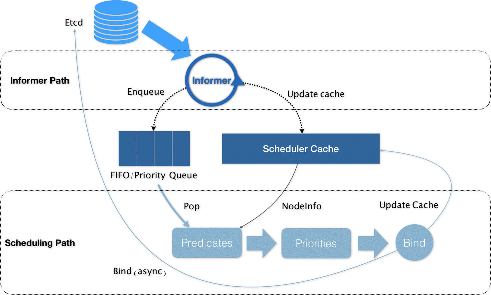

# Kubernetes默认调度器

## 1. 概述

> [官方文档Scheduler](https://kubernetes.io/docs/concepts/scheduling-eviction/kube-scheduler/)

**在 Kubernetes 项目中，默认调度器的主要职责，就是为一个新创建出来的 Pod，寻找一个`最合适`的节点（Node）**。

> 调度器通过 kubernetes 的监测（Watch）机制来发现集群中新创建且尚未被调度到 Node 上的 Pod。 调度器会将发现的每一个未调度的 Pod 调度到一个合适的 Node 上来运行。 调度器会依据下文的调度原则来做出调度选择。

而这里“最合适”的含义，包括两层：

* 1）**过滤**：从集群所有的节点中，根据调度算法挑选出所有可以运行该 Pod 的节点；
* 2）**打分**：第一步的结果中，再根据调度算法挑选一个最符合条件的节点作为最终结果。

最后，kube-scheduler 会将 Pod 调度到得分最高的 Node 上。 如果存在多个得分最高的 Node，kube-scheduler 会从中随机选取一个。

在具体的调度流程中，默认调度器会首先调用一组叫作 `Predicate` 的调度算法，来检查每个 Node。然后，再调用一组叫作 `Priority `的调度算法，来给上一步得到的结果里的每个 Node 打分。最终的调度结果，就是得分最高的那个 Node。

## 2. 流程

具体流程如下图所示：

可以看到，**Kubernetes 的调度器的核心，实际上就是两个相互独立的控制循环**。

其中，**第一个控制循环，我们可以称之为 Informer Path**。它的主要目的，是启动一系列 Informer，用来监听（Watch）Etcd 中 Pod、Node、Service 等与调度相关的 API 对象的变化。比如，当一个待调度 Pod（即：它的 nodeName 字段是空的）被创建出来之后，调度器就会通过 Pod Informer 的 Handler，将这个待调度 Pod 添加进调度队列。

**第二个控制循环，是调度器负责 Pod 调度的主循环，我们可以称之为 Scheduling Path。**

Scheduling Path 的主要逻辑，就是不断地从调度队列里出队一个 Pod。然后，调用 Predicates 算法进行“过滤”。这一步“过滤”得到的一组 Node，就是所有可以运行这个 Pod 的宿主机列表。当然，Predicates 算法需要的 Node 信息，都是从 Scheduler Cache 里直接拿到的，这是调度器保证算法执行效率的主要手段之一。

接下来，调度器就会再调用 Priorities 算法为上述列表里的 Node 打分，分数从 0 到 10。得分最高的 Node，就会作为这次调度的结果。

调度算法执行完成后，调度器就需要将 Pod 对象的 nodeName 字段的值，修改为上述 Node 的名字。**这个步骤在 Kubernetes 里面被称作 Bind**。

## 3. 小结

* 1）通过 Watch 机制找到未调度的 Pod
* 2）通过 Filtering、Scoring 两步找到最合适调度的 Node

