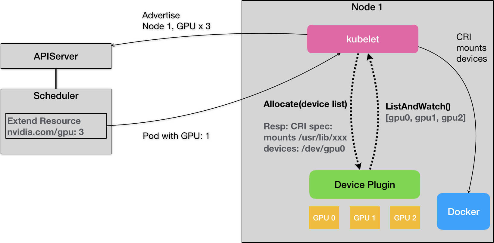

# Kubernetes GPU 管理与 Device Plugin 机制

## 1. 概述

> Kubernetes官方文档
>
> [为节点登记扩展资源](https://kubernetes.io/docs/tasks/administer-cluster/extended-resource-node)
>
> [为容器分配扩展资源](https://kubernetes.io/docs/tasks/configure-pod-container/extended-resource/)

之前调度的时候提到了可以现在Pod能使用的 CPU和内存，不过却没有没有GPU。

随着用户诉求增加，Kubernetes也增加了对GPU的支持。

不过，Kubernetes 在 Pod 的 API 对象里，并没有为 GPU 专门设置一个资源类型字段，**而是使用了一种叫作 Extended Resource（ER）的特殊字段来负责传递 GPU 的信息**。

## 2. Extended Resource

比如下面这个例子：

```yaml
apiVersion: v1
kind: Pod
metadata:
  name: cuda-vector-add
spec:
  restartPolicy: OnFailure
  containers:
    - name: cuda-vector-add
      image: "k8s.gcr.io/cuda-vector-add:v0.1"
      resources:
        limits:
          nvidia.com/gpu: 1
```

可以看到，在上述 Pod 的 limits 字段里，这个资源的名称是`nvidia.com/gpu`，它的值是 1。也就是说，这个 Pod 声明了自己要使用一个 NVIDIA 类型的 GPU。

而在 kube-scheduler 里面，它其实并不关心这个字段的具体含义，只会在计算的时候，一律将调度器里保存的该类型资源的可用量，直接减去 Pod 声明的数值即可。

所以说，**Extended Resource，其实是 Kubernetes 为用户设置的一种对自定义资源的支持**。


当然，为了能够让调度器知道这个自定义类型的资源在每台宿主机上的可用量，宿主机节点本身，就必须能够向 API Server 汇报该类型资源的可用数量。在 Kubernetes 里，各种类型的资源可用量，其实是 Node 对象 Status 字段的内容，比如下面这个例子：

```yaml
apiVersion: v1
kind: Node
metadata:
  name: node-1
...
Status:
  Capacity:
   cpu:  2
   memory:  2049008Ki
```

而为了能够在上述 Status 字段里添加自定义资源的数据，你就必须使用 PATCH API 来对该 Node 对象进行更新，加上你的自定义资源的数量。这个 PATCH 操作，可以简单地使用 curl 命令来发起，如下所示：

```sh
# 启动 Kubernetes 的客户端 proxy，这样你就可以直接使用 curl 来跟 Kubernetes  的API Server 进行交互了
$ kubectl proxy

# 执行 PACTH 操作
$ curl --header "Content-Type: application/json-patch+json" \
--request PATCH \
--data '[{"op": "add", "path": "/status/capacity/nvidia.com/gpu", "value": "1"}]' \
http://localhost:8001/api/v1/nodes/<your-node-name>/status
```

PATCH 操作完成后，你就可以看到 Node 的 Status 变成了如下所示的内容：

```yaml
apiVersion: v1
kind: Node
...
Status:
  Capacity:
   cpu:  2
   memory:  2049008Ki
   nvidia.com/gpu: 1
```

这样在调度器里，它就能够在缓存里记录下 node-1 上的nvidia.com/gpu类型的资源的数量是 1。


## 3. Device Plugin

当然，在 Kubernetes 的 GPU 支持方案里，你并不需要真正去做上述关于 Extended Resource 的这些操作。

**在 Kubernetes 中，对所有硬件加速设备进行管理的功能，都是由一种叫作 Device Plugin 的插件来负责的**。

Device Plugin 定义如下：

```protobuf
  service DevicePlugin {
        // ListAndWatch returns a stream of List of Devices
        // Whenever a Device state change or a Device disappears, ListAndWatch
        // returns the new list
        rpc ListAndWatch(Empty) returns (stream ListAndWatchResponse) {}
        // Allocate is called during container creation so that the Device
        // Plugin can run device specific operations and instruct Kubelet
        // of the steps to make the Device available in the container
        rpc Allocate(AllocateRequest) returns (AllocateResponse) {}
  }
```


这其中，当然也就包括了对该硬件的 Extended Resource 进行汇报的逻辑。




首先，对于每一种硬件设备，都需要有它所对应的 Device Plugin 进行管理，这些 Device Plugin，都通过 gRPC 的方式，同 kubelet 连接起来。

这个 Device Plugin 会通过一个叫作 ListAndWatch 的 API，定期向 kubelet 汇报该 Node 上 GPU 的列表。

kubelet 在拿到这个列表之后，会将这个 GPU 的 ID 列表保存在自己的内存里，并通过 ListAndWatch API 定时更新。然后在它向 APIServer 发送的心跳里，以 Extended Resource 的方式，加上这些 GPU 的数量，比如nvidia.com/gpu=3。所以说，用户在这里是不需要关心 GPU 信息向上的汇报流程的。

> 要注意的是，ListAndWatch 向上汇报的信息，只有本机上 GPU 的 ID 列表，而不会有任何关于 GPU 设备本身的信息。而且 kubelet 在向 API Server 汇报的时候，只会汇报该 GPU 对应的 Extended Resource 的数量


## 4. 调度

具体流程如下：

* 1）正常调用，为Pod找到合适的Node
* 2）kubelet 向 deviceplugin 申请 GPU资源
* 3）deviceplugin 返回对应的设备路径和驱动目录
* 4）kubelet 将设备信息添加到 CRI 请求中

**1）正常调用，为Pod找到合适的Node**

而当一个 Pod 想要使用一个 GPU 的时候，它只需要像我在本文一开始给出的例子一样，在 Pod 的 limits 字段声明nvidia.com/gpu: 1。那么接下来，Kubernetes 的调度器就会从它的缓存里，寻找 GPU 数量满足条件的 Node，然后将缓存里的 GPU 数量减 1，完成 Pod 与 Node 的绑定。

**2）kubelet 向 deviceplugin 申请 GPU资源**

这个调度成功后的 Pod 信息，自然就会被对应的 kubelet 拿来进行容器操作。而当 kubelet 发现这个 Pod 的容器请求一个 GPU 的时候，kubelet 就会从自己持有的 GPU 列表里，为这个容器分配一个 GPU。此时，kubelet 就会向本机的 Device Plugin 发起一个 Allocate() 请求。这个请求携带的参数，正是即将分配给该容器的设备 ID 列表。

**3）deviceplugin 返回对应的设备路径和驱动目录**

当 Device Plugin 收到 Allocate 请求之后，它就会根据 kubelet 传递过来的设备 ID，从 Device Plugin 里找到这些设备对应的设备路径和驱动目录。当然，这些信息，正是 Device Plugin 周期性的从本机查询到的。比如，在 NVIDIA Device Plugin 的实现里，它会定期访问 nvidia-docker 插件，从而获取到本机的 GPU 信息。

**4）kubelet 将设备信息添加到 CRI 请求中**

而被分配 GPU 对应的设备路径和驱动目录信息被返回给 kubelet 之后，kubelet 就完成了为一个容器分配 GPU 的操作。接下来，kubelet 会把这些信息追加在创建该容器所对应的 CRI 请求当中。这样，当这个 CRI 请求发给 Docker 之后，Docker 为你创建出来的容器里，就会出现这个 GPU 设备，并把它所需要的驱动目录挂载进去。

至此，Kubernetes 为一个 Pod 分配一个 GPU 的流程就完成了。


## 5. 小结

Kubernetes 中通过 Extended Resource 和 Device Plugin 实现了 GPU 资源支持，但是粒度很粗，只能按照个数分配，也不能像CPU这样共享。

同时GPU 等硬件设备的调度工作，实际上是由 kubelet 完成的，调度器扮演的角色，仅仅是为 Pod 寻找到可用的、支持这种硬件设备的节点而已。


kubelet 通过调用 DevicePlugin 获取相应数据，并提交给 API Server。

主要依赖 DevicePlugin：

* 1）ListAndWatch：检测当前机器上的硬件设备；
* 2）Allocate：根据设备ID分配硬件设备。


