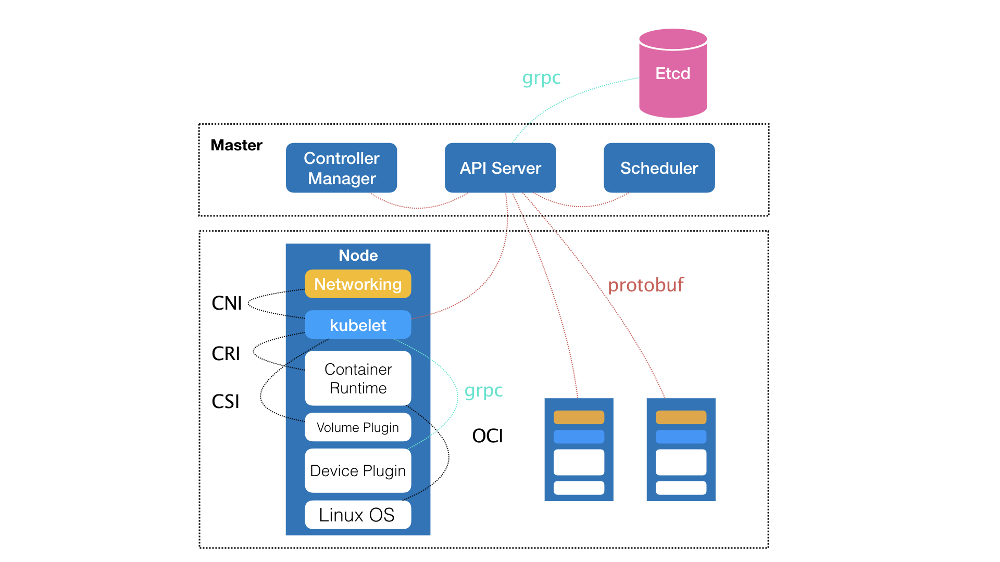

## Kubernetes 简介

> http://gk.link/a/10tN7
>
> https://www.bilibili.com/video/BV1Zv411i7ve

## 为什么Kubernetes如此受欢迎?

* 1）时机：解决容器化热潮的关键问题-容器调度与编排
  * 回顾: 2014年到底发生了什么?
* 2）定位:应用基础设施，介于laas与PaaS之间
  * 面向平台开发者，让每个人能够开发自己的PaaS
* 3）可扩展性极强：基于“声明式API与控制器模式”的插件体系
  * 声明式API理论上可以对一切应用基础设施“能力”进行建模
  * 一旦接受上述设定，开发插件的门槛极低
* 4）社区中立：在早期即捐赠给CNCF (云原生基金会)进行生态维护和社区推广，降低厂商锁定带来的负面影响

### Kubernetes 的核心思想

* 1）声明式API与控制器模式- Infrastructure as Data (IaD)
  * 将任何一个底层基础设施的“能力”都建模为一份`数据`
  * “数据”中的内容是对该`应用基础设期望状态的描述`
  * “数据”的`增删改查会触发控制器`(Controller)执行对应的运维逻辑，以此来驱动底层基础设施向“数据”所定义的期望状态逼近

> 这里说的`数据`就是我们写的 YAML 文件，比如 YAML 中定义了要启动 3 个 Pod，当把这份 YAML 文件提交给 Kubernetes 后，Kubernetes 就会根据 YAML 文件中的定义为我们创建 3 个 Pod。
>
> 然后我们想增加 Pod 数，只需要把 YAML 文件中的 3 改成 10 即可，Kubernetes 会根据 YAML 文件的变化触发对应的运维逻辑。

### Kubernetes 项目的本质

Kubernetes 项目其实只有“两个部分
* 对底层基础设施各种能力的`声明式API定义`
* 上述声明式 API对应的`控制器`

Kubernetes 解决的问题：

运行在大规模集群中的各种任务之间，实际上存在着各种各样的关系。这些关系的处理，才是作业编排和管理系统最困难的地方。

## 2. K8s 中的各种API对象与控制器

### API 对象

K8s 中最核心的 API 对象就是 Pod，Pod 其实就是对 Container 的封装，这些 Container 之间有亲密的耦合关系，需要统一调度处理。

类似的 一个应用我为了高可用，需要多个 Pod，这种描述或者能力在 K8s 中就叫做 Deployment。

然后我现在想访问 这个 Deployment，就需要一个统一的访问方式，需要一个网关或者一个路由规则，这个能力在 K8s 里就是用 Service 来实现的。

然后我这个 Service 还需要一个 七层代理负载均衡，这个在 K8s 里就叫做 Ingress。

**Kubernetes 里所有的概念，实际上都是对基础设施的某种能力或者某种场景的描述。**

> YAML 文件里定义的就是 K8s 在如何对这些基础设施做抽象。

### 控制器

与 API对象 想对应的，**Kubernetes 里个各个组件实际上都是一些控制器**。

无论是 Scheduler 还是 Kubelet 或者说 Device Plugin 这些组件都是通过控制器模式在工作，他们分别订阅或者关注了各自组件需要关注的数据，然后根据数据的变化执行对应的逻辑。

> 比如 Kubelet 关心的是 Node、Pod。Device Plugin 关注的是 GPU、CPU 这样的设备，Scheduler 关心的是 容器、节点这样的资源。

所以 如果要给 Kubernetes 增加一个能力，也只需要定义这两部分即可：

* 1）先定义一个 API 来描述这种能力
* 2）在写一个 Controller 来实现这种能力即可。

## 3. 如何快速上手

**如何快速上手Kubernetes中的概念?**

* 1）详细的查阅它完整的API对象，理解这个对象设计时的建构思路
  * 比如 API 对象 Pod，内部定义了 Init Container，容器本身还有各自的启动命令、镜像等等，这些都是对基础设施的声明或者要求。
* 2）尝试了解它对应的控制器如何工作--大量试验、进行破坏性测试、根据场景阅读源码
  * 控制器对每个事件都有对应的执行逻辑，动手试验是最简单的一种做法。
  * 阅读源码也是要带着问题去看，而不是直接打开 Kubernetes 的源码就开始看，这样完全是浪费时间。
* 3）避免
  * 陷入到 Kubernetes 插件本身的实现细节当中(比如各种网络和存储插件)
  * 插件并不是 Kubernetes 的核心内容，这些插件都是社区、厂商在做

**如何快速部署Kubernetes来进行实验**

* 1）本地个人PC环境
  * Minikube: 建议使用[国内版](https://github.com/AliyunContainerService/minikube)(没有网络困扰)
  * 好处是比较简单，本地即可搭建
* 2）云端实践
  * 购买虚拟机，选择托管Kubernetes服务(这个服务不收钱)
  * 好处是更真实，真的是一个多节点的集群，贴合生产环境
* 3）避免
  * 从第一天就研究社区中的各种部署工具进行自建，陷入到部署的泥潭不能自拔
  * 学好核心概念、 玩好Kubernetes之后，再去搭建也不迟!
  * k8s 部署不像其他的DB或者MQ之类的，一条命令搞定，k8s部署也比较复杂，所以建议先理解概念之后再尝试搭建。

## 4. Kubernetes 发展趋势

###  云时代的 “操作系统”

**现象**

* 无处不在
* 用户的使用目的是交付与管理应用
* 对上暴露基础设施的格式化数据抽象
* 对下提供基础设施接入的标准接口

**趋势**

* Kubernetes 的价值回归到**应用管理**，而不是存储、网络等基础设施概念
  * 存储、网络等基础设施由不同厂商来处理
* 基于K8S 开放应用平台取代传统 Paas 成为主流
  * 既提供最佳的开发者使用体验，同时提供以 k8s 为基础的强大的可打展性

现在的常见操作系统有 Linux、Windows、Mac、iOS、Android 这些，在这些系统上安装一个应用是非常方便的，可能点一下按钮或者一条命令即可。

但是现在想要在 Kubernetes 中部署一个应用还是比较麻烦的，所以 Kubernetes 后续肯定会有一个类似 应用商店 的功能，通过这个 应用商店 用户可以很轻松的部署一个应用。

### 应用与运维能力全面“K8s Operator化“

K8s Operator 就是前面说道的 `声明式API对象`+`控制器`的集合，就是某种基础设施的抽象。

后续 扩容策略、安全组配置、路由策略、发布策略等这些功能都会由 K8s Operator 来提供。

Operator 化本质是通过 控制器来扩展 Kubernetes 本身，并且这个 控制器 能实现整个应用运维的自动化。

### 应用中间件能力“下沉”为K8s的插件化能力

之前的 应用中间件能力 一般是通过**胖客户端**这种方式来实现的，在客户端里增加某些 Library 。

当前 Kubernetes 的使用的是**Service Mesh**来实现这种能力，即通过 **Sidecar** 方式提供应用中间件能力。

后续这种能力肯定会成为 Kubernetes 本身的一种能力，用户可以通过插件的形式来加载。

### 基于K8s的下一代DevOps体系与模型

* 基于关注点分离和上层封装，将更加友好使用体验和 DevOps 协作流用户，而不是直接把 Kubernetes API 暴露出去
  * 不同岗位人员关注点不同，比如研发可能更关注服务怎么接入，运维更关注怎么蓝绿发布这些。
  * 随着后续 K8s 的能力越来越多，越来越复杂，研发人员使用起来也会很吃力，所以 K8s 肯定会对这些对象进一步封装，使其使用起来更加方便
* 基于GitOps和声明式API的CI/CD流水线逐渐普及
  * 把 YAML 文件提交到 Git，通过 Git 事件来驱动 CI/CD 流程，这天然的和 K8s 声明式 API 设计匹配的。
  * Jenkins 的命令式的工作流和K8S就不是很符合。
* 基于K8s API对象和控制器的“自助式运维”成为应用运维的主流方式
  * 一切皆对象， 应用运维能力也是!

现在的 DevOps 模型其实对研发来说心智负担是比较大的，研发完还是去研究部署的事情。

后续的 DevOps 模型会极大降低研发的心智负担，研发就专注研发，运维都是自动化的，运维人员写好各种控制器即可由系统自动化完成整个运维流程。

> 当然后面也有可能是研发写控制器。。。

## 5. Kubernetes 项目核心关注点

* 1）应用管理:声明式应用管理体系
  * 声明式API的本质
  * 控制器模式
  * 容器设计模式
  * 声明式应用定义(Open Applicalion Model项目)
  *  GitOps与基于声明式 API 的 CI/CD流 水线

* 2）可扩展机制: K8s Operator
  * 如何定义CRD (自定义 K8s API对象）
  * 如何为这个CRD 编写控制器
* 3）基于K8s的开放应用平台
  * 提供 PaaS/Serverless 级别的用户体验
  * 保留 K8s 本身的可扩展能力

