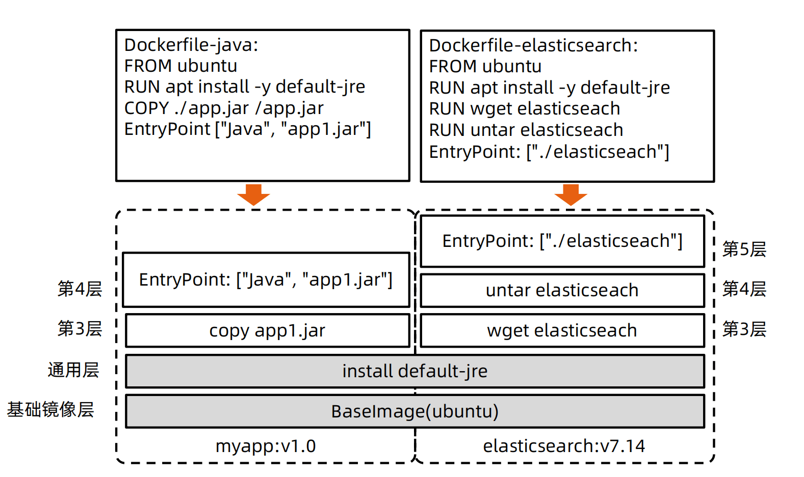
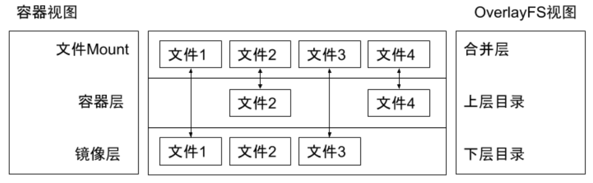
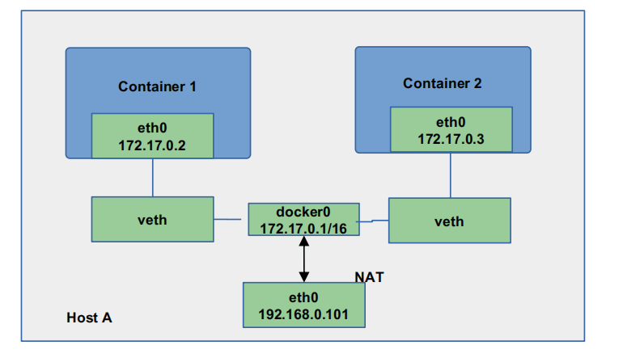
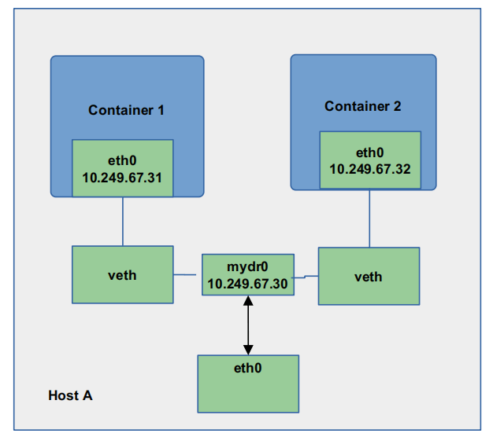

# 文件系统

## UnionFS

* 将不同目录挂载到同一个虚拟文件系统下 （unite several directories into a single virtual filesystem）的文件系统
* 支持为每一个成员目录（类似Git Branch）设定 readonly、readwrite 和 whiteout-able 权限
* 文件系统分层, 对 readonly 权限的 branch 可以逻辑上进行修改(增量地, 不影响 readonly 部分的)。 
* 通常 Union FS 有两个用途, 一方面可以将多个 disk 挂到同一个目录下, 另一个更常用的就是将一个 readonly 的 branch 和一个 writeable 的 branch 联合在一起。


docker 镜像分层：




**典型的 Linux 文件系统组成：**

* Bootfs（boot file system） 
  * Bootloader - 引导加载 kernel
  * Kernel - 当 kernel 被加载到内存中后 umount bootfs
* rootfs （root file system） 
  * /dev，/proc，/bin，/etc 等标准目录和文件。 
  * 对于不同的 linux 发行版, bootfs 基本是一致的，但 rootfs 会有差别


### docker 启动

**Linux**

* 在启动后，首先将 rootfs 设置为 readonly, 进行一系列检查, 然后将其切换为 “readwrite”供用户使用。

**Docker 启动**

* 初始化时也是将 rootfs 以 readonly 方式加载并检查，然而接下来利用 union mount 的方式将一个 readwrite 文件系统挂载在 readonly 的 rootfs 之上；
* 并且允许再次将下层的 FS（file system） 设定为 readonly 并且向上叠加。 
* 这样一组 readonly 和一个 writeable 的结构构成一个 container 的运行时态, 每一个 FS 被称作一个 FS 层。


### 写操作

由于镜像具有共享特性，所以对容器可写层的操作需要依赖存储驱动提供的写时复制和用时分配机制，以此来支持对容器可写层的修改，进而提高对存储和内存资源的利用率。

**写时复制**

* 写时复制，即 Copy-on-Write。 
* 一个镜像可以被多个容器使用，但是不需要在内存和磁盘上做多个拷贝。
* 在需要对镜像提供的文件进行修改时，该文件会从镜像的文件系统被复制到容器的可写层的文件系统进行修改，而镜像里面的文件不会改变。
* 不同容器对文件的修改都相互独立、互不影响。

**用时分配**

* 按需分配空间，而非提前分配，即当一个文件被创建出来后，才会分配空间。


### 存储驱动

| 存储驱动      | Docker                                                       | Containerd |
| ------------- | ------------------------------------------------------------ | ---------- |
| AUFS          | 在 Ubuntu 或 Debian 上支持                                   | 不支持     |
| OverlayFS     | 支持                                                         | 支持       |
| Device Mapper | 支持                                                         | 支持       |
| Btrfs         | 社区版本在 Ubuntu 或者 Debian 上支持，企业版本在 SLES 上支持 | 支持       |
| ZFS           | 支持                                                         |            |


| 存储驱动      | 优点                                                         | 缺点                                                         | 使用场景                           |
| ------------- | ------------------------------------------------------------ | ------------------------------------------------------------ | ---------------------------------- |
| AUFS          | Docker 最早支持的驱动类型，稳定性高                          | 并未进入主线的内核，因此只能在有限的场合下使用。另外在实现上具有多层结构，在层比较多的场景下，做写时复制有时会需要比较长的时间 | 少 I/O 的场景                      |
| OverlayFS     | 并入主线内核，可以在目前几乎所有发行版本上使用。实现上只有两层，因此性能比AUFS 高 | 写时复制机制需要复制整个文件， 而不能只针对修改部分进行复制，因此对大文件操作会需要比较长的时间。其中 Overlay 在 Docker 的后续版本中被移除 | 少 I/O 的场景                      |
| Device Mapper | 并入主线内核，针对块操作，性能比较高。修改文件时只需复制需要修改的块，效率高 | 不同容器之间不能共享缓存。在 Docker 的后续版本中会被移除     | I/O 密集的场景                     |
| Btrfs         | 并入主线内核，虽然是文件级操作系统，但是可以对块进行操作。   | 需要消耗比较多的内存，稳定性相对比较差                       | 需要支持 Snapshot 等比较特殊的场景 |
| ZFS           | 不同的容器之间可以共享缓存，多个容器访问相同的文件能够共享一个单一的 Page Cache。 | 在频繁写操作的场景下，会产生比较严重的磁盘碎片。需要消耗比较多的内存，另外稳定性相对比较差 | 容器高密度部署的场景               |


### 以 OverlayFS 为例

OverlayFS 也是一种与 AUFS 类似的联合文件系统，同样属于文件级的存储驱动，包含了最初的 Overlay 和更新更稳定的 overlay2。

Overlay 只有两层：upper 层和 lower 层，Lower 层代表镜像层，upper 层代表容器可写层。




练习

```bash
# 准备相应目录和文件
mkdir upper lower merged work
echo "from lower" > lower/in_lower.txt
echo "from upper" > upper/in_upper.txt
echo "from lower" > lower/in_both.txt
echo "from upper" > upper/in_both.txt
# 使用 mount 命令进行mount，指定type为overlay
sudo mount -t overlay overlay -o lowerdir=`pwd`/lower,upperdir=`pwd`/upper,workdir=`pwd`/work `pwd`/merged
# 查看lower和upper都有的同名文件，发现是upper层的文件
cat merged/in_both.txt
# 测试删除，发现merged目录中的文件不见了，但是lower目录中的文件还在，但是upper中的没有了
rm -f merged/in_both.txt
# 删除lower层的文件，merged目录不见了，但是 lower中还在，而且upper中出现一个类型为c的同名文件，叫做白障，用来遮住lower中的文件，使得merged中呈现出一种文件被删除了的错觉
rm -f merged/in_lower.txt
#删除upper中来的文件，发现merged中没有了，upper中也没有了
rm -f merged/in_upper.txt
```


## OCI 容器标准

Open Container Initiative

* OCI 组织于 2015 年创建，是一个致力于定义容器镜像标准和运行时标准的开放式组织。
* OCI 定义了镜像标准（Image Specification）、运行时标准（Runtime Specification）和分发标准（Distribution Specification） 
  * 镜像标准定义应用如何打包
  * 运行时标准定义如何解压应用包并运行
  * 分发标准定义如何分发容器镜像


### Docker 网络

Null(--net=None)

* 把容器放入独立的网络空间但不做任何网络配置； 
* 用户需要通过运行 docker network 命令来完成网络配置。

Host

* 使用主机网络名空间，复用主机网络。

Container

* 重用其他容器的网络。

Bridge(--net=bridge)

* 使用 Linux 网桥和 iptables 提供容器互联，Docker 在每台主机上创建一个名叫 docker0 的网桥，通过 veth pair 来连接该主机的每一个 EndPoint。


Overlay(libnetwork, libkv)

* 通过网络封包实现。

Remote(work with remote drivers)

* Underlay
  * 使用现有底层网络，为每一个容器配置可路由的网络 IP。
* Overlay
  * 通过网络封包实现。


Docker overlay 网络驱动原生支持多主机网络；

Libnetwork 是一个内置的基于 VXLAN 的网络驱动。


#### Null 模式-手动为容器配置网络

Null 模式是一个空实现；

可以通过 Null 模式启动容器并在宿主机上通

过命令为容器配置网络。


Create network ns

```bash
# 创建默认的 netns 目录
mkdir -p /var/run/netns
# 删除该目录下所有符号连接,避免干扰
find -L /var/run/netns -type l -delete
```

Start nginx docker with non network mode

```bash
# 以 --network=none模式启动一个容器，这样该容器就是没有配置网络的
docker run --network=none  -d nginx
```

Check corresponding pid

```bash
# 找到该容器的 PID
docker ps|grep nginx
docker inspect <containerid>|grep -i pid

"Pid": 876884,
"PidMode": "",
"PidsLimit": null,
```

Check network config for the container

```bash
# 查看以下当前这个容器的网络配置
nsenter -t 876884 -n ip a
```

Link network namespace

```bash
export pid=876884
# 创建软链接，便于直接用命令查看
ln -s /proc/$pid/ns/net /var/run/netns/$pid
ip netns list
```

Check docker bridge on the host

```bash
# 查看以下 docker0 网桥
brctl show
ip a
4: docker0: <BROADCAST,MULTICAST,UP,LOWER_UP> mtu 1500 qdisc noqueue state UP group default
    link/ether 02:42:35:40:d3:8b brd ff:ff:ff:ff:ff:ff
    inet 172.17.0.1/16 brd 172.17.255.255 scope global docker0
       valid_lft forever preferred_lft forever
    inet6 fe80::42:35ff:fe40:d38b/64 scope link
       valid_lft forever preferred_lft forever
```

Create veth pair

```bash
# 创建一个 veth pair
ip link add A type veth peer name B
```

Config A

```bash
# 把一端添加到 docker0 网桥上并up起来
brctl addif docker0 A
ip link set A up
```

Config B

```bash
#指定要配置的IP、子网掩码、网关等，都是 docker 的默认信息
#可以先执行 ping 172.17.0.10 试一下这个IP有没有被其他容器使用，避免冲突
SETIP=172.17.0.10
SETMASK=16
GATEWAY=172.17.0.1

#把 veth pair 的另一端移动到容器对应的network namespace中
ip link set B netns $pid
#重命名并up起来
ip netns exec $pid ip link set dev B name eth0
ip netns exec $pid ip link set eth0 up
#设置IP和路由信息
ip netns exec $pid ip addr add $SETIP/$SETMASK dev eth0
ip netns exec $pid ip route add default via $GATEWAY
```

Check connectivity

```bash
# 最后再宿主机试试能够请求成功
curl 172.17.0.10
```


#### 默认模式– 网桥和 NAT

为主机 eth0 分配 IP 192.168.0.101；

启动 docker daemon，查看主机 iptables； 


* POSTROUTING -A POSTROUTING -s 172.17.0.0/16 ! -o docker0 -j MASQUERADE

在主机启动容器：

* docker run -d --name ssh -p 2333:22 centos-ssh

* Docker 会以标准模式配置网络：

  * 创建 veth pair；

  * 将 veth pair的一端连接到 docker0 网桥； 

  * veth pair 的另外一端设置为容器名空间的 eth0； 

  * 为容器名空间的 eth0 分配 ip； 

  * 主机上的 Iptables 规则：PREROUTING -A DOCKER ! -i docker0 -p tcp -m tcp --dport 2333 -j DNAT --to

    destination 172.17.0.2:22。





### 跨主机通信-underlay

采用 Linux 网桥设备（sbrctl），通过物理网络连通容器；

* 创建新的网桥设备 mydr0； 
* 将主机网卡加入网桥；
* 把主机网卡的地址配置到网桥，并把默认路由规则转移到网桥 mydr0； 
* 启动容器；
* 创建 veth 对，并且把一个 peer 添加到网桥 mydr0； 
* 配置容器把 veth 的另一个 peer 分配给容器网卡；



直接将底层网络中的 IP 分配给容器，这样就知道具体的路由了，因此也可以实现跨主机容器通信。


## Dockerfile 最佳实践

### 创建 docker 镜像

```dockerfile
FROM ubuntu
# so apt-get doesn't complain
ENV DEBIAN_FRONTEND=noninteractive
RUN sed -i 's/^exit 101/exit 0/' /usr/sbin/policy-rc.d
RUN \
apt-get update && \
apt-get install -y ca-certificates && \
apt-get install -y curl && \
rm -rf /var/lib/apt/lists/*
ADD ./bin/eic eic
ENTRYPOINT ["/eic"]
```


### 回顾 12 Factor 之进程

* 运行环境中，应用程序通常是以一个和多个进程运行的。
  * 12-Factor 应用的进程必须无状态（Stateless）且无共享（Share nothing）。

* 任何需要持久化的数据都要存储在后端服务内，比如数据库。
  * 应在构建阶段将源代码编译成待执行应用。

* Session Sticky 是 12-Factor 极力反对的。
  *  Session 中的数据应该保存在诸如 Memcached 或 Redis 这样的带有过期时间的缓存中。


Docker 遵循以上原则管理和构建镜像。


### 理解构建上下文（Build Context）** 

* **当运行 docker build 命令时，当前工作目录被称为构建上下文。**
* docker build 默认查找当前目录的 Dockerfile 作为构建输入，也可以通过 –f 指定 Dockerfile
  * docker build –f ./Dockerfile
* 当 docker build 运行时，首先会把构建上下文传输给 docker daemon，其他没用的文件包含在构建上下文时，会导致传输时间长，构建需要的资源多，构建出的镜像大等问题。
  * 试着到一个包含文件很多的目录运行下面的命令，会感受到差异；
  * docker build -f $GOPATH/src/github.com/cncamp/golang/httpserver/Dockerfile 
  * docker build $GOPATH/src/github.com/cncamp/golang/httpserver/；
  * 可以通过 **.dockerignore** 文件从编译上下文排除某些文件。 
* 因此需要确保构建上下文清晰，比如创建一个专门的目录放置 Dockerfile，并在目录中运行 docker build。


### Build Cache

构建容器镜像时，Docker 依次读取 Dockerfile 中的指令，并按顺序依次执行构建指令。

Docker 读取指令后，会先判断缓存中是否有可用的已存镜像，只有已存镜像不存在时才会重新构建。

* 通常 Docker 简单判断 Dockerfile 中的指令与镜像。
* 针对 ADD 和 COPY 指令，Docker 判断该镜像层每一个文件的内容并生成一个 checksum，与现存镜像比较时，Docker 比较的是二者的 checksum。 
* 其他指令，比如 RUN apt-get -y update，Docker 简单比较与现存镜像中的指令字串是否一致。
* 当某一层 cache 失效以后，后续所有层级的 cache 均一并失效，后续指令都重新构建镜像。
* **因此写 Dockerfile 时变动越频繁的层越应该放到后面，使得前面的层尽量用到缓存**


### 多段构建（Multi-stage build）

有效减少镜像层级的方式

```dockerfile
FROM golang:1.16-alpine AS build
RUN apk add --no-cache git
RUN go get github.com/golang/dep/cmd/dep
COPY Gopkg.lock Gopkg.toml /go/src/project/
WORKDIR /go/src/project/
RUN dep ensure -vendor-only
COPY . /go/src/project/
RUN go build -o /bin/project # 只有这个二进制文件是产线需要的，其他都是waste

FROM scratch
COPY --from=build /bin/project /bin/project
ENTRYPOINT ["/bin/project"]
CMD ["--help"]
```


### Dockerfile 常用指令

**FROM**：选择基础镜像，推荐 alpine

```dockerfile
FROM [--platform=<platform>] <image>[@<digest>] [AS <name>]
```

**LABELS**：按标签组织项目

```dockerfile
LABEL multi.label1="value1" multi.label2="value2" other="value3”
```

配合 label filter 可过滤镜像查询结果

```bash
docker images -f label=multi.label1="value1" 
```

**RUN**：执行命令

最常见的用法是 RUN apt-get update && apt-get install，这两条命令应该永远用&&连接，如果分开执行，RUN apt-get update 构建层被缓存，可能会导致新 package 无法安装

> && 连起来执行还会减少构建出来的镜像的层级，提升运行效率。

**CMD**：容器镜像中包含应用的运行命令，需要带参数

```dockerfile
CMD ["executable", "param1", "param2"…]
```

**EXPOSE**：发布端口

```dockerfile
EXPOSE <port> [<port>/<protocol>...] 
```

是镜像创建者和使用者的约定,

> 因为光看一个镜像是不知道需要哪些端口的，写在 Dockerfile 里使用者就能清楚的知道需要暴露哪些端口了。

在 docker run –P 时，docker 会自动映射 expose 的端口到主机大端口，如0.0.0.0:32768->80/tcp

**ENV**：设置环境变量

```dockerfile
ENV <key>=<value> ... 
```


**ADD**：从源地址（文件，目录或者 URL）复制文件到目标路径

```dockerfile
ADD [--chown=<user>:<group>] <src>... <dest>

ADD [--chown=<user>:<group>] [“<src>”,... “<dest>”] （路径中有空格时使用）
```

ADD 支持 Go 风格的通配符，如 ADD check* /testdir/ 

src 如果是文件，则必须包含在编译上下文中，ADD 指令无法添加编译上下文之外的文件

src 如果是 URL 并且 dest 结尾没有/，那么 dest 是目标文件名，如果 dest 结尾有/，那么 dest 是目标目录名

如果 src 是一个目录，则所有文件都会被复制至 dest

如果 src 是一个本地压缩文件，则在 ADD 的同时完整解压操作

如果 dest 不存在，则 ADD 指令会创建目标目录

**应尽量减少通过 ADD URL 添加 remote 文件，建议使用 curl 或者 wget && untar**

> 太复杂了，各种规则比较难理解和维护，直接用命令来处理更加直观

**COPY**：从源地址（文件，目录或者URL）复制文件到目标路径

```dockerfile
COPY [--chown=<user>:<group>] <src>... <dest>

COPY [--chown=<user>:<group>] ["<src>",... "<dest>"] // 路径中有空格时使用
```

COPY 的使用与 ADD 类似，但有如下区别

* COPY 只支持本地文件的复制，不支持 URL
* COPY 不解压文件
* COPY 可以用于多阶段编译场景，可以用前一个临时镜像中拷贝文件
  * COPY --from=build /bin/project /bin/project

**COPY 语义上更直白，复制本地文件时，优先使用 COPY**

**ENTRYPOINT**：定义可以执行的容器镜像入口命令

```dockerfile
ENTRYPOINT ["executable", "param1", "param2"] // docker run参数追加模式

ENTRYPOINT command param1 param2 // docker run 参数替换模式
```

 docker run –entrypoint 可替换 Dockerfile 中定义的 ENTRYPOINT

ENTRYPOINT 的最佳实践是用 ENTRYPOINT 定义镜像主命令，并通过 CMD 定义主要参数，如下所示

* ENTRYPOINT ["s3cmd"] 
* CMD ["--help"]

**VOLUME**： 将指定目录定义为外挂存储卷，Dockerfile 中在该指令之后所有对同一目录的修改都无效

```dockerfile
VOLUME ["/data"] 
```

等价于 docker run –v /data，可通过 docker inspect 查看主机的 mount point，/var/lib/docker/volumes/<containerid>/_data

**USER**：切换运行镜像的用户和用户组，因安全性要求，越来越多的场景要求容器应用要以 non-root 身份运行

```dockerfile
USER <user>[:<group>] 
```

**WORKDIR**：等价于 cd，切换工作目录

```dockerfile
WORKDIR /path/to/workdir
```

其他非常用指令

*  ARG
* ONBUILD
* STOPSIGNAL
* HEALTHCHECK
* SHELL


### Dockerfile 最佳实践

* 不要安装无效软件包。
* 应简化镜像中同时运行的进程数，理想状况下，每个镜像应该只有一个进程。
* 当无法避免同一镜像运行多进程时，应选择合理的初始化进程（init process）。
* 最小化层级数
  * 最新的 docker 只有 RUN， COPY，ADD 创建新层，其他指令创建临时层，不会增加镜像大小。
    * 比如 EXPOSE 指令就不会生成新层。
  * 多条 RUN 命令可通过连接符连接成一条指令集以减少层数。
  * 通过多段构建减少镜像层数。
* 把多行参数按字母排序，可以减少可能出现的重复参数，并且提高可读性。
* 编写 dockerfile 的时候，应该把变更频率低的编译指令优先构建以便放在镜像底层以有效利用 build cache。
* 复制文件时，每个文件应独立复制，这确保某个文件变更时，只影响改文件对应的缓存。

**目标：易管理、少漏洞、镜像小、层级少、利用缓存**


### 多进程的容器镜像

选择适当的 init 进程

* 需要捕获 SIGTERM 信号并完成子进程的优雅终止
* 负责清理退出的子进程以避免僵尸进程


开源项目：https://github.com/krallin/tini


### Docker 镜像管理

docker save/load

docker tag

docker push/pull


### 基于 Docker 镜像的版本管理

docker tag 命令可以为容器镜像添加标签

```bash
docker tag 0e5574283393 hub.docker.com/cncamp/httpserver:v1.0
```

相关参数：

* hub.docker.com： 镜像仓库地址，如果不填，则默认为 hub.docker.com
* cncamp: repositry
* httpserver：镜像名
* v1.0：tag，常用来记录版本信息


### Docker tag 与 github 的版本管理合力

以 Kubernetes 为例

* 开发分支
  * git checkout master

* Release 分支
  * git checkout –b release-1.21

* 在并行期，所有的变更同时放进 master 和 release branch

* 版本发布

  * 以 release branch 为基础构建镜像，并为镜像标记版本信息：docker tag 0e5574283393 

    k8s.io/kubernetes/apiserver:v1.21

*  在 github 中保存 release 代码快照

  *  git tag v1.21


### 镜像仓库

Docker hub

* https://hub.docker.com/

创建私有镜像仓库

* sudo docker run -d -p 5000:5000 registry


### Docker 优势

封装性

* 不需要再启动内核，所以应用扩缩容时可以秒速启动。
* 资源利用率高，直接使用宿主机内核调度资源，性能损失小。
* 方便的 CPU、内存资源调整。
* 能实现秒级快速回滚。
* 一键启动所有依赖服务，测试不用为搭建环境犯愁，PE 也不用为建站复杂担心。
* 镜像一次编译，随处使用。
* 测试、生产环境高度一致（数据除外）。

隔离性

* 应用的运行环境和宿主机环境无关，完全由镜像控制，一台物理机上部署多种环境的镜像测试。
* 多个应用版本可以并存在机器上。

镜像增量分发

* 由于采用了 Union FS， 简单来说就是支持将不同的目录挂载到同一个虚拟文件系统下，并实现一种 layer 的概念，每次发布只传输变化的部分，节约带宽。

社区活跃

* Docker 命令简单、易用，社区十分活跃，且周边组件丰富


[Linux内核CFS调度器](https://www.cnblogs.com/XiaoliBoy/p/10410686.html)

[CFS调度器（5）-带宽控制](http://www.wowotech.net/process_management/451.html)