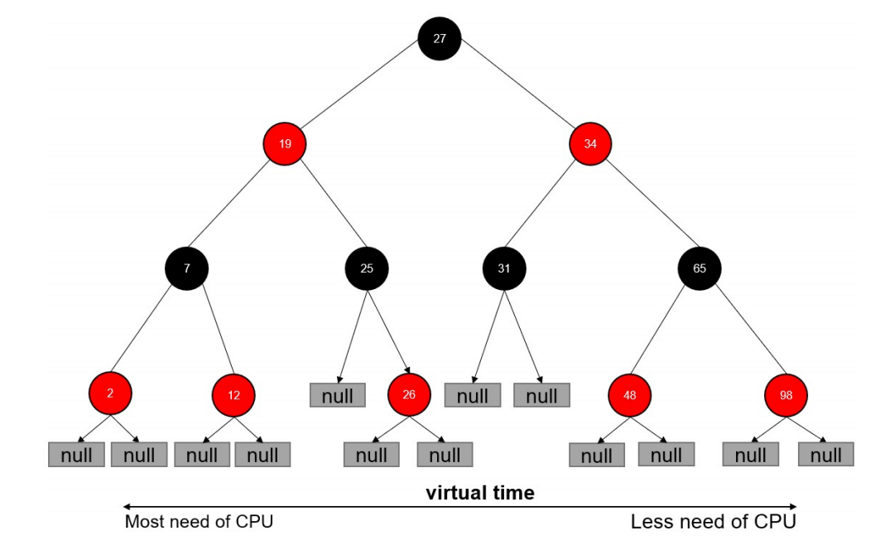

# docker 核心技术

## 1. namespace

lsns --查看当前机器上的 namespace

```bash
# 查看所有 namespace
lsns -l
# 查看 PID 类型的 namespace
# 支持 mnt, net, ipc, user, pid and uts 类型
lsns -t pid
# 详细用法
man lsns
```


进入容器的几种方式


* docker exec：进入容器后开启一个新的终端，可以在里面操作(`常用`）

* docker attach：附着到容器正在运行的终端上，不会启动新的进程

* nsenter(`排查问题时常用`）

  * ```bash
    # 使用 inspect 拿到容器的 pid
    PID=$(docker inspect --format "{{ .State.Pid }}" <container>)
    # 使用 nsenter 进入到该PID对应的namespace，即进入容器
    # -t 指定 pid，后续参数指定要进入的 namespace
    nsenter --target $PID --mount --uts --ipc --net --pid
    nsenter -t $PID -m -u -i -n -p
    # 进入其他 ns 之后记得退出
    exit
    ```


进程数据结构

```c
struct task_struct {
...
/* namespaces */
struct nsproxy *nsproxy;
...
}
```

namespace 数据结构

```c
struct nsproxy {
    atomic_t count;
    struct uts_namespace *uts_ns;
    struct ipc_namespace *ipc_ns;
    struct mnt_namespace *mnt_ns;
    struct pid_namespace
    *pid_ns_for_children;
    struct net *net_ns; 
}
```

**Linux 对 Namespace 操作方法**

**clone**

在创建新进程的系统调用时，可以通过 flags 参数指定需要新建的 Namespace 类型：

```c
// CLONE_NEWCGROUP / CLONE_NEWIPC / CLONE_NEWNET / CLONE_NEWNS / CLONE_NEWPID / CLONE_NEWUSER / CLONE_NEWUTS
int clone(int (*fn)(void *), void *child_stack, int flags, void *arg) 
```

**setns**

该系统调用可以让调用进程加入某个已经存在的 Namespace 中：

```c
int setns(int fd, int nstype) 
```

**unshare**

该系统调用可以将调用进程移动到新的 Namespace 下：

```c
int unshare(int flags)
```


**关于 namespace 的常用操作**

查看当前系统的 namespace：

```bash
lsns –t <type>
```

 查看某进程的 namespace：

```bash
ls -la /proc/<pid>/ns/
```

进入某 namespace 运行命令：

```bash
nsenter -t <pid> -n ip addr
```


练习

在新 network namespace 执行 sleep 指令：
```bash
unshare -fn sleep 300
```

新起一个终端查看进程信息

```bash
ps -ef|grep sleep
root 32882 4935 0 10:00 pts/0 00:00:00 unshare -fn sleep 60
root 32883 32882 0 10:00 pts/0 00:00:00 sleep 60
```

查看网络 Namespace

```bash
lsns -t net
4026532508 net 2 32882 root unassigned unshare
```

进入 unshare 进程所在 Namespace 查看网络配置

```bash
nsenter -t 32882 -n ip a
1: lo: <LOOPBACK> mtu 65536 qdisc noop state DOWN group default qlen 1000
link/loopback 00:00:00:00:00:00 brd 00:00:00:00:00:00
```

发现与主机不一致，可见参数`-n`进入新的 network namespace 生效了


## 2. Cgroups

### 概念

进程数据结构

```c
struct task_struct
{
#ifdef CONFIG_CGROUPS
struct css_set __rcu *cgroups; 
struct list_head cg_list; 
#endif
}
```

css_set 是 cgroup_subsys_state 对象的集合数据结构

```c
struct css_set {
/*
* Set of subsystem states, one for each subsystem. This array is
* immutable after creation apart from the init_css_set during
* subsystem registration (at boot time).
*/
struct cgroup_subsys_state *subsys[CGROUP_SUBSYS_COUNT];
};
```

#### 资源的配额和度量

**cgroups 实现了对资源的配额和度量**

* **blkio**： 这个子系统设置限制每个块设备的输入输出控制。例如:磁盘，光盘以及 USB 等等。
* ***CPU**： 这个子系统使用调度程序为 cgroup 任务提供 CPU 的访问。*
* **cpuacct**： 产生 cgroup 任务的 CPU 资源报告。
* **cpuset**： 如果是多核心的 CPU，这个子系统会为 cgroup 任务分配单独的 CPU 和内存。
* **devices**： 允许或拒绝 cgroup 任务对设备的访问。


**freezer**： 暂停和恢复 cgroup 任务。

**memory**： 设置每个 cgroup 的内存限制以及产生内存资源报告。

**net_cls**： 标记每个网络包以供 cgroup 方便使用。

**ns**： 名称空间子系统。

**pid**: 进程标识子系统。


### CPU 子系统

* **cpu.shares**： 可出让的能获得 CPU 使用时间的相对值。

* **cpu.cfs_period_us**：cfs_period_us 用来配置时间周期长度，单位为 us（微秒）。

* **cpu.cfs_quota_us**：cfs_quota_us 用来配置当前 Cgroup 在 cfs_period_us 时间内最多能使用的 CPU 时间数，单

位为 us（微秒）。

*  **cpu.stat**： Cgroup 内的进程使用的 CPU 时间统计。

*  **nr_periods**： 经过 cpu.cfs_period_us 的时间周期数量。

*  **nr_throttled**： 在经过的周期内，有多少次因为进程在指定的时间周期内用光了配额时间而受到限制。

*  **throttled_time**： Cgroup 中的进程被限制使用 CPU 的总用时，单位是 ns（纳秒）。


#### Linux 调度器

内核默认提供了5个调度器，Linux 内核使用 struct sched_class 来对调度器进行抽象：

* **Stop 调度器**，stop_sched_class：优先级最高的调度类，可以抢占其他所有进程，不能被其他进程抢占；
* **Deadline 调度器**，dl_sched_class：使用红黑树，把进程按照绝对截止期限进行排序，选择最小进程进行调度运行；
* **RT 调度器**， rt_sched_class：实时调度器，为每个优先级维护一个队列；
* **CFS 调度器**， cfs_sched_class：完全公平调度器，采用完全公平调度算法，引入虚拟运行时间概念；
* **IDLE-Task 调度器**， idle_sched_class：空闲调度器，每个 CPU 都会有一个 idle 线程，当没有其他进程可以调度时，调度运行 idle 线程。


##### CFS 调度器

CFS 是 Completely Fair Scheduler 简称，即**完全公平调度器**。

* **CFS 实现的主要思想是维护为任务提供处理器时间方面的平衡**，这意味着应给进程分配相当数量的处理器。
* 分给某个任务的时间失去平衡时，应给失去平衡的任务分配时间，让其执行。
* CFS 通过虚拟运行时间（vruntime）来实现平衡，维护提供给某个任务的时间量。
* vruntime = 实际运行时间*1024 / 进程权重,vruntime 越大的表示越不需要 CPU
  * **进程权重越大那么 vruntime 增长越慢，因此会占有更多的 CPU**
* 进程按照各自不同的速率在物理时钟节拍内前进，优先级高则权重大，其虚拟时钟比真实时钟跑得慢，但获得比较多的运行时间。


CFS 调度器没有将进程维护在运行队列中，而是维护了一个以虚拟运行时间为顺序的红黑树。 红黑树的主要

特点有：

* 1）自平衡，树上没有一条路径会比其他路径长出俩倍。
* 2）O(log n) 时间复杂度，能够在树上进行快速高效地插入或删除进程。




在时钟周期开始时，调度器调用 __schedule() 函数来开始调度的运行。__

* 1）schedule() 函数调用 pick_next_task() 让进程调度器从就绪队列中选择一个最合适的进程 next，即红黑树最左边的节点。
* 2）通过 context_switch() 切换到新的地址空间，从而保证 next 进程运行。
* 3）在时钟周期结束时，调度器调用 entity_tick() 函数来更新进程负载、进程状态以及 vruntime（当前vruntime + 该时钟周期内运行的时间）。
* 4）最后，将该进程的虚拟时间与就绪队列红黑树中最左边的调度实体的虚拟时间做比较，如果小于坐左边的时间，则不用触发调度，继续调度当前调度实体。

#### 练习

在 cgroup cpu 子系统目录中创建目录结构

```bash
cd /sys/fs/cgroup/cpu
mkdir cpudemo
cd cpudemo
```

运行 busyloop

```bash
while : ; do : ; done &
[1] 12501
```

显然，它执行了一个死循环，可以把计算机的 CPU 吃到 100%，根据它的输出，我们可以看到这个脚本在后台运行的进程号（PID）是 27218。

执行 top 查看 CPU 使用情况，CPU 占用 100%

```bash
$ top

PID USER      PR  NI    VIRT    RES    SHR S %CPU %MEM     TIME+ COMMAND    
12501 root      20   0  115680    672    152 R 99.9  0.0   2:07.07 bash                                                  
```

通过 cgroup 限制 cpu

```bash
cd /sys/fs/cgroup/cpu/cpudemo
# 把进程添加到 cgroup 进程配置组
echo 12501 > cgroup.procs
# 设置 cpuquota
echo 10000 > cpu.cfs_quota_us
```

再次执行 top 查看 CPU 使用情况，CPU 占用变为10%


### cpuacct 子系统

用于统计 Cgroup 及其子 Cgroup 下进程的 CPU 的使用情况。

* **cpuacct.usage**：包含该 Cgroup 及其子 Cgroup 下进程使用 CPU 的时间，单位是 ns（纳秒）。
* **cpuacct.stat**：包含该 Cgroup 及其子 Cgroup 下进程使用的 CPU 时间，以及用户态和内核态的时间。


### Memory 子系统

* **memory.usage_in_bytes**：cgroup 下进程使用的内存，包含 cgroup 及其子 cgroup 下的进程使用的内存
* **memory.max_usage_in_bytes**：cgroup 下进程使用内存的最大值，包含子 cgroup 的内存使用量。
* **memory.limit_in_bytes**：设置 Cgroup 下进程最多能使用的内存。如果设置为 -1，表示对该 cgroup 的内存使用不做限制。
* **memory.soft_limit_in_bytes**：这个限制并不会阻止进程使用超过限额的内存，只是在系统内存足够时，会优先回收超过限额的内存，使之向限定值靠拢。
* **memory.oom_control**：设置是否在 Cgroup 中使用 OOM（Out of Memory）Killer，默认为使用。当属于该 cgroup 的进程使用的内存超过最大的限定值时，会立刻被 OOM Killer 处理

#### Memory 子系统练习

在 cgroup memory 子系统目录中创建目录结构

```
cd /sys/fs/cgroup/memory
mkdir memorydemo
cd memorydemo
```

为了演示OOM-killer的功能，创建了下面这样一个程序，用来向系统申请内存，它会每秒消耗1M的内存。

```c
#include <stdio.h>
#include <stdlib.h>
#include <string.h>
#include <unistd.h>

#define MB (1024 * 1024)

int main(int argc, char *argv[])
{
    char *p;
    int i = 0;
    while(1) {
        p = (char *)malloc(MB);
        memset(p, 0, MB);
        printf("%dM memory allocated\n", ++i);
        sleep(1);
    }

    return 0;
}
```


查看内存使用情况

```
top
```

通过 cgroup 限制 memory

把进程添加到 cgroup 进程配置组

```
echo ps -ef|grep malloc |grep -v grep|awk '{print $2}' > cgroup.procs
```

设置 memory.limit_in_bytes

```
echo 10M > memory.limit_in_bytes
```

等待进程被 oom kill


### Cgroup driver

systemd:

* 当操作系统使用 systemd 作为 init system 时，初始化进程生成一个根 cgroup 目录结构并作为 cgroup 管理器。
* systemd 与 cgroup 紧密结合，并且为每个 systemd unit 分配 cgroup。 

cgroupfs:

* docker 默认用 cgroupfs 作为 cgroup 驱动。

存在问题：

* 在 systemd 作为 init system 的系统中，默认并存着两套 groupdriver。 
* 这会使得系统中 Docker 和 kubelet 管理的进程被 cgroupfs 驱动管，而 systemd 拉起的服务由 systemd 驱动管，让 cgroup 管理混乱且容易在资源紧张时引发问题。

**因此 kubelet 会默认 --cgroup-driver=systemd，若运行时 cgroup 不一致时，kubelet 会报错。**


## 3. 文件系统

### Union FS

* 将不同目录挂载到同一个虚拟文件系统下 （unite several directories into a single virtual filesystem）的文件系统
* 支持为每一个成员目录（类似Git Branch）设定 readonly、readwrite 和 whiteout-able 权限
* 文件系统分层, 对 readonly 权限的 branch 可以逻辑上进行修改(增量地, 不影响 readonly 部分的)。 
* 通常 Union FS 有两个用途, 一方面可以将多个 disk 挂到同一个目录下, 另一个更常用的就是将一个readonly 的 branch 和一个 writeable 的 branch 联合在一起。


### 文件系统练习

Create test lab

```
$ mkdir testlab && cd $_

$ mkdir upper lower merged work

$ echo "from lower" > lower/in_lower.txt
$ echo "from upper" > upper/in_upper.txt
$ echo "from lower" > lower/in_both.txt
$ echo "from upper" > upper/in_both.txt
```

Check it

```
root@k8s-master:~/testlab# tree .
.
├── lower
│   ├── in_both.txt
│   └── in_lower.txt
├── merged
├── upper
│   ├── in_both.txt
│   └── in_upper.txt
└── work

4 directories, 4 files
```

Combine

```
$ sudo mount -t overlay overlay -o lowerdir=`pwd`/lower,upperdir=`pwd`/upper,workdir=`pwd`/work `pwd`/merged
```

Check the merged file

```
$ cat merged/in_both.txt

$ cat merged/in_lower.txt

$ cat merged/in_upper.txt
$ df -h | grep testlab

overlay                             29G  9.7G   18G  36% /root/testlab/merged
```

Delete merged file

```
$ delete merged/in_both.txt
$ delete merged/in_lower.txt
$ delete merged/in_upper.txt
```