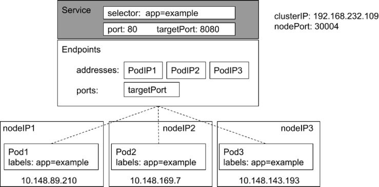
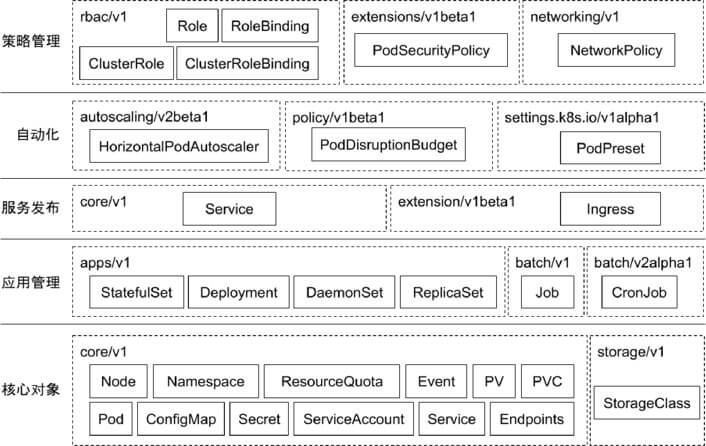

# k8s 架构原则和对象设计

### 云计算平台的分类

以 Openstack 为典型的虚拟化平台

* 虚拟机构建和业务代码部署分离。
* 可变的基础架构使后续维护风险变大。

以谷歌 borg 为典型的基于进程的作业调度平台

* 技术的迭代引发 borg 的换代需求。 
* 早期的隔离依靠 chroot jail 实现，一些不合理的设计需要在新产品中改进。
* 对象之间的强依赖 job 和 task 是强包含关系，不利于重组。
* 所有容器共享 IP，会导致端口冲突，隔离困难等问题。
* 为超级用户添加复杂逻辑导致系统过于复杂。


### Google Borg 

#### 简介

特性

* 物理资源利用率高。 
* 服务器共享，在进程级别做隔离。 
* 应用高可用，故障恢复时间短。 
* 调度策略灵活。
* 应用接入和使用方便，提供了完备的 Job 描述语言，服务发现，实时状态监控和诊断工具。

优势

* 对外隐藏底层资源管理和调度、故障处理等。
* 实现应用的高可靠和高可用。 
* 足够弹性，支持应用跑在成千上万的机器上。


#### 相关概念

Workload

* prod：在线任务，长期运行、对延时敏感、面向终端用户等，比如Gmail, Google Docs,Web Search 服务等。 
* non-prod ：离线任务，也称为批处理任务（Batch），比如一些分布式计算服务等。

Cell

*  一个 Cell 上跑一个集群管理系统 Borg。 通过定义 Cell 可以让Borg 对服务器资源进行统一抽象，作为用户就无需知道自己的应用跑在哪台机器上，也不用关心资源分配、程序安装、依赖管理、健康检查及故障恢复等。

Job 和 Task 

* 用户以 Job 的形式提交应用部署请求。一个Job 包含一个或多个相同的 Task，每个 Task运行相同的应用程序，Task 数量就是应用的副本数。 

* 每个 Job 可以定义属性、元信息和优先级，优先级涉及到抢占式调度过程。 

Naming

* Borg 的服务发现通过BNS （ Borg NameService）来实现。 

* 50.jfoo.ubar.cc.borg.google.com 可表示在一个名为 cc 的 Cell中由用户 uBar 部署的一个名为 jFoo 的 Job下的第50个 Task。


#### 架构


Borgmaster 主进程

* 处理客户端 RPC 请求，比如创建 Job，查询 Job 等。 
* 维护系统组件和服务的状态，比如服务器、Task 等。 
* 负责与 Borglet 通信。

Scheduler 进程

* 调度策略
  * Worst Fit
  * Best Fit
  * Hybrid
* 调度优化
  * Score caching: 当服务器或者任务的状态未发生变更或者变更很少时，直接采用缓存数据，避免重复计算。 
  * Equivalence classes: 调度同一 Job 下多个相同的 Task 只需计算一次。 
  * Relaxed randomization: 引入一些随机性，即每次随机选择一些机器，只要符合需求的服务器数量达到一定值时，就可以停止计算，无需每次对 Cell 中所有服务器进行 feasibility checking。

Borglet

* Borglet 是部署在所有服务器上的 Agent，负责接收 Borgmaster 进程的指令。

> 可以看出 k8s 中的很多概念都是源于 brog。


#### 应用高可用

* 被抢占的 non-prod 任务放回 pending queue，等待重新调度。

* **多副本应用跨故障域部署**。所谓故障域有大有小，比如相同机器、相同机架或相同电源插座等，一挂全挂。

* 对于类似服务器或操作系统升级的维护操作，避免大量服务器同时进行。 

* **支持幂等性**，支持客户端重复操作。

* **当服务器状态变为不可用时，要控制重新调度任务的速率**。因为 Borg 无法区分是节点故障还是出现了短暂的网络分区，如果是后者，静静地等待网络恢复更利于保障服务可用性。

* 当某种**任务 @ 服务器**的组合出现故障时，下次重新调度时需避免这种组合再次出现，因为极大可能会再次出现相同故障。

* **记录详细的内部信息，便于故障排查和分析。 **

* **保障应用高可用的关键性设计原则**：无论何种原因，即使 Borgmaster 或者 Borglet 挂掉、失联，都不能杀

  掉正在运行的服务（Task）。


#### Borg 系统自身高可用

* Borgmaster 组件多副本设计。 
* 采用一些简单的和底层（low-level）的工具来部署 Borg 系统实例，避免引入过多的外部依赖。
* 每个 Cell 的 Borg 均独立部署，避免不同 Borg 系统相互影响。


#### 资源利用率

* 通过将在线任务（prod）和离线任务（non-prod，Batch）混合部署，空闲时，离线任务可以充分利用计算资源；繁忙时，在线任务通过抢占的方式保证优先得到执行，合理地利用资源。 
* 98% 的服务器实现了混部。
* 90% 的服务器中跑了超过 25 个 Task 和 4500 个线程。 
* 在一个中等规模的 Cell 里，在线任务和离线任务独立部署比混合部署所需的服务器数量多出约 20%-30%。可以简单算一笔账，Google 的服务器数量在千万级别，按 20% 算也是百万级别，大概能省下的服务器采购费用就是百亿级别了，这还不包括省下的机房等基础设施和电费等费用。


brog 资源利用率优化：

* 实时计算任务实际消耗的 CPU，保留余量的同时回收掉多出的部分。


#### 隔离性

安全性隔离

* 早期采用 Chroot jail，后期版本基于 Namespace。


性能隔离

* 采用基于 Cgroup 的容器技术实现。 
* 在线任务（prod）是延时敏感（latency-sensitive）型的，优先级高，而离线任务（non-prod，Batch）优先级低。
* Borg 通过不同优先级之间的抢占式调度来优先保障在线任务的性能，牺牲离线任务
* Borg 将资源类型分成两类：
  * 可压榨的（compressible），CPU 是可压榨资源，资源耗尽不会终止进程；
  * 不可压榨的（non-compressible），内存是不可压榨资源，资源耗尽进程会被终止。


### Kubernetes

#### 什么是 Kubernetes

Kubernetes 是谷歌开源的容器集群管理系统，是 Google 多年大规模容器管理技术 Borg 的开源版本，主要功能包括：

* 基于容器的应用部署、维护和滚动升级；

* 负载均衡和服务发现；

* 跨机器和跨地区的集群调度；

* 自动伸缩；

* 无状态服务和有状态服务；

* 插件机制保证扩展性。

  


#### 命令式与声明式

命令（ Imperative） 系统关注 “如何做”

* 在软件工程领域，命令式系统是写出解决某个问题、完成某个任务或者达到某个目标的明确步骤。此方法明确写出系统应该执行某指令，并且期待系统返回期望结果。

声明式（Declarative）系统关注“做什么”

* 在软件工程领域，声明式系统指程序代码描述系统应该做什么而不是怎么做。仅限于描述要达到什么目的，如何达到目的交给系统。


命令式：

* 我要你做什么，怎么做，请严格按照我说的做。

声明式：

* 我需要你帮我做点事，但是我只告诉你我需要你做什么，不是你应该怎么做。
* 直接声明：我直接告诉你我需要什么。
* 间接声明：我不直接告诉你我的需求，我会把我的需求放在特定的地方，请在方便的时候拿出来处理。

幂等性：

* 状态固定，每次我要你做事，请给我返回相同结果

面向对象的

* 把一切抽象成对象


#### Kubernetes：声明式系统

Kubernetes 的所有管理能力构建在对象抽象的基础上，核心对象包括：

* Node：计算节点的抽象，用来描述计算节点的资源抽象、健康状态等。 
* Namespace：资源隔离的基本单位，可以简单理解为文件系统中的目录结构。 
* Pod：用来描述应用实例，包括镜像地址、资源需求等。 Kubernetes 中最核心的对象，也是打通应用和基础架构的秘密武器。 
* Service：服务如何将应用发布成服务，本质上是负载均衡和域名服务的声明。


#### 架构

k8s 采用和 brog 类似的架构：


#### Master Node

APIServer

* 这是 Kubernetes 控制面板中唯一带有用户可访问 API 以及用户可交互的组件。API 服务器会暴露一个 RESTful 的 Kubernetes API 并使用 JSON 格式的清单文件（manifest files）。

Cluster Data Store

* Kubernetes 使 用“etcd”。这是一个强大的、稳定的、高可用的键值存储，被Kubernetes 用于长久储存所有的 API 对象。

Controller Manager

* 被称为“kube-controller manager”，它运行着所有处理集群日常任务的控制器。包括了节点控制器、副本控制器、端点（endpoint）控制器以及服务账户等。

Scheduler

* 调度器会监控新建的 pods（一组或一个容器）并将其分配给节点。


#### Worker Node

Kubelet

* 负责调度到对应节点的 Pod 的生命周期管理，执行任务并将 Pod 状态报告给主节点的渠道，通过容器运行时（拉取镜像、启动和停止容器等）来运行这些容器。它还会定期执行被请求的容器的健康探测程序。

Kube-proxy

* 它负责节点的网络，在主机上维护网络规则并执行连接转发。它还负责对正在服务的 pods 进行负载平衡


#### etcd

etcd 是 CoreOS 基于 Raft 开发的分布式 key-value 存储，可用于服务发现、共享配置以及一致性保障（如数据库选主、分布式锁等）

* 基本的 key-value 存储；
* 监听（Watch）机制；
* key 的过期及续约机制，用于监控和服务发现；
* 原子 CAS 和 CAD，用于分布式锁和 leader 选举。


#### 直接访问 etcd 中的数据

使用 kubectl exec 进入到 etcd 容器中

在容器中执行以下命令即可查询数据

```bash
export ETCDCTL_API=3

etcdctl --endpoints https://localhost:2379 --cert /etc/kubernetes/pki/etcd/server.crt --key /etc/kubernetes/pki/etcd/server.key --cacert /etc/kubernetes/pki/etcd/ca.crt get --keys-only --prefix /
```


监听对象变化

```bash
etcdctl --endpoints https://localhost:2379 --cert /etc/kubernetes/pki/etcd/server.crt --key /etc/kubernetes/pki/etcd/server.key --cacert /etc/kubernetes/pki/etcd/ca.crt watch --prefix /registry/services/specs/default/mynginx
```


#### APIServer

Kube-APIServer 是 Kubernetes 最重要的核心组件之一，主要提供以下功能：

* 提供集群管理的 REST API 接口，包括: 
  * 认证 Authentication； 
  * 授权 Authorization； 
  * 准入 Admission（Mutating & Valiating）。
* 提供其他模块之间的数据交互和通信的枢纽（其他模块通过 APIServer 查询或修改数据，只有 APIServer 才直接操作 etcd）。 
*  APIServer 提供 etcd 数据缓存以减少集群对 etcd 的访问。


#### Controller Manager

* Controller Manager 是集群的大脑，是确保整个集群动起来的关键；

*  作用是确保 Kubernetes 遵循声明式系统规范，确保系统的真实状态（ActualState）与用户定义的期望状态（Desired State）一致；

* Controller Manager 是多个控制器的组合，**每个 Controller 事实上都是一个 control loop**，负责侦听其管控的对象，当对象发生变更时完成配置；

* Controller 配置失败通常会触发自动重试，整个集群会在控制器不断重试的机制下确保最终一致性（ **Eventual Consistency**）。


#### Controller Manager 工作流程


#### informer 内部机制


#### 控制器的协同工作原理


#### Scheduler

特殊的 Controller，工作原理与其他控制器无差别。

Scheduler 的特殊职责在于监控当前集群所有未调度的 Pod，并且获取当前集群所有节点的健康状况和资源

使用情况，为待调度 Pod 选择最佳计算节点，完成调度。

调度阶段分为：

* Predict：过滤不能满足业务需求的节点，如资源不足、端口冲突等。 
* Priority：按既定要素将满足调度需求的节点评分，选择最佳节点。 
* Bind：将计算节点与 Pod 绑定，完成调度。


#### Kubelet

Kubernetes 的初始化系统（init system） 

* 从不同源获取 Pod 清单，并按需求启停 Pod 的核心组件：
  * Pod 清单可从本地文件目录，给定的 HTTPServer 或 Kube-APIServer 等源头获取；
  * Kubelet 将运行时，网络和存储抽象成了 CRI，CNI，CSI。 

* 责汇报当前节点的资源信息和健康状态； 

* 负责 Pod 的健康检查和状态汇报


#### Kube-Proxy

监控集群中用户发布的服务，并完成负载均衡配置。 

每个节点的 Kube-Proxy 都会配置相同的负载均衡策略，使得整个集群的服务发现建立在分布式负载均衡器之上，服务调用无需经过额外的网络跳转（Network Hop）。 

* 负载均衡配置基于不同插件实现：
  * userspace。 
  * 操作系统网络协议栈不同的 Hooks 点和插件：
    * iptables； 
    * ipvs。




#### 推荐的 Add-ons

* kube-dns：负责为整个集群提供 DNS 服务； 
* Ingress Controller：为服务提供外网入口； 
* MetricsServer：提供资源监控； 
* Dashboard：提供 GUI； 
* Fluentd-Elasticsearch：提供集群日志采集、存储与查询。


### 了解 Kubectl

#### Kubectl 和 Kubeconfig

kubectl 是一个 Kubernetes 的命令行工具，它允许Kubernetes 用户以命令行的方式与 Kubernetes 交互，其默认读取配置文件 ~/.kube/config。 

* kubectl 会将接收到的用户请求转化为 rest 调用以 rest client 的形式与 apiserver 通讯。
* apiserver 的地址，用户信息等配置在 kubeconfig。

通过 -v 参数打印日志以查看 kubectl 具体执行流程：

```bash
kubectl get po -v 9
```


#### 常用命令

kubectl get po –o yaml -w 

* -o yaml ：输出详细信息为 yaml 格式。

* -w ：watch 该对象的后续变化。

* -o wide ：以详细列表的格式查看对象。

kubectl describe 展示资源的详细信息和相关 Event

kubectl exec 提供进入运行容器的通道，可以进入容器进行 debug 操作。

kubectl logs 可查看 pod 的标准输入（stdout, stderr），与 tail 用法类似


#### K8s 设计理念

可扩展性

* 基于CRD的扩展
* 插件化的生态系统

高可用

* 基于 replicaset，statefulset 的应用高可用
* Kubernetes 组件本身高可用

可移植性

* 多种 host Os 选择
* 多种基础架构的选择
* 多云和混合云

安全

* 基于 TLS 提供服务
* Serviceaccount 和 user
* 基于 Namespace 的隔离
* secret
* Taints，psp， networkpolicy


#### 分层架构

* 核心层：Kubernetes 最核心的功能，对外提供 API 构建高层的应用，对内提供插件式应用执行环境。 
* 应用层：部署（无状态应用、有状态应用、批处理任务、集群应用等）和路由（服务发现、DNS 解析等）。 
* 管理层：系统度量（如基础设施、容器和网络的度量）、自动化（如自动扩展、动态 Provision 等）、策略管理（RBAC、Quota、PSP、NetworkPolicy 等）。 
* 接口层：Kubectl 命令行工具、客户端 SDK 以及集群联邦。 
* 生态系统：在接口层之上的庞大容器集群管理调度的生态系统，可以划分为两个范畴：
  * Kubernetes 外部：日志、监控、配置管理、CI、CD、Workflow、FaaS、OTS 应用、ChatOps 等；
  * Kubernetes 内部：CRI、CNI、CVI、镜像仓库、Cloud Provider、集群自身的配置和管理等。


### API 设计原则

所有 API 都应是声明式的

* 相对于命令式操作，声明式操作对于重复操作的效果是稳定的，这对于容易出现数据丢失或重复的分布式环境来说是很重要的。 
* 声明式操作更易被用户使用，可以使系统向用户隐藏实现的细节，同时也保留了系统未来持续优化的可能性。 
* 此外，声明式的 API 还隐含了所有的 API 对象都是名词性质的，例如 Service、Volume 这些 API 都是名词，这些名词描述了用户所期望得到的一个目标对象。 

API 对象是彼此互补而且可组合的

* 这实际上鼓励 API 对象尽量实现面向对象设计时的要求，即“高内聚，松耦合”，对业务相关的概念有一个合适的分解，提高分解出来的对象的可重用性。 

高层 API 以操作意图为基础设计

* 如何能够设计好 API，跟如何能用面向对象的方法设计好应用系统有相通的地方，高层设计一定是从业务出发，而不是过早的从技术实现出发。 
* 因此，针对 Kubernetes 的高层 API 设计，一定是以 Kubernetes 的业务为基础出发，也就是以系统调度管理容器的操作意图为基础设计。

低层 API 根据高层 API 的控制需要设计

* 设计实现低层 API 的目的，是为了被高层 API 使用，考虑减少冗余、提高重用性的目的，低层 API 的设计也要以需求为基础，要尽量抵抗受技术实现影响的诱惑。 

尽量避免简单封装，不要有在外部 API 无法显式知道的内部隐藏的机制

* 简单的封装，实际没有提供新的功能，反而增加了对所封装 API 的依赖性。 

* 例如 StatefulSet 和 ReplicaSet，本来就是两种 Pod 集合，那么 Kubernetes 就用不同 API 对象来定义它们，而不会说只用同一个 ReplicaSet，内部通过特殊的算法再来区分这个 ReplicaSet 是有状态的还是无状态。

API 操作复杂度与对象数量成正比

* API 的操作复杂度不能超过 O(N)，否则系统就不具备水平伸缩性了。 

API 对象状态不能依赖于网络连接状态

* 由于众所周知，在分布式环境下，网络连接断开是经常发生的事情，因此要保证 API 对象状态能应对网络的不稳定，API 对象的状态就不能依赖于网络连接状态。

尽量避免让操作机制依赖于全局状态

* 因为在分布式系统中要保证全局状态的同步是非常困难的。


### 架构设计原则

* 只有 APIServer 可以直接访问 etcd 存储，其他服务必须通过 Kubernetes API 来访问集群状态；
* 单节点故障不应该影响集群的状态；
* 在没有新请求的情况下，所有组件应该在故障恢复后继续执行上次最后收到的请求（比如网络分区或服务重启等）；
* 所有组件都应该在内存中保持所需要的状态，APIServer 将状态写入 etcd 存储，而其他组件则通过 APIServer 更新并监听所有的变化；
* 优先使用事件监听而不是轮询。


#### 引导（Bootstrapping）原则

> k8s 安装、引导原则

* Self-hosting 是目标。 
* 减少依赖，特别是稳态运行的依赖。 
* 通过分层的原则管理依赖。 
* 循环依赖问题的原则：
  * 同时还接受其他方式的数据输入（比如本地文件等），这样在其他服务不可用时还可以手动配置引导服务；
  * 状态应该是可恢复或可重新发现的；
  * 支持简单的启动临时实例来创建稳态运行所需要的状态，使用分布式锁或文件锁等来协调不同状态的切换（通常称为 pivoting 技术）； 
  * 自动重启异常退出的服务，比如副本或者进程管理器等。


### 核心技术概念和 API 对象

> 云计算相关标准(抽象)的定义，保证了 k8s 处于不败之地。
>
> 因为当前所有云厂商都认可了 k8s 这套标准，后续就算有新的技术出现也必定遵循这套标准，否则云厂商肯定不会认可。

API 对象是 Kubernetes 集群中的管理操作单元。

Kubernetes 集群系统每支持一项新功能，引入一项新技术，一定会新引入对应的 API 对象，支持对该功能的管理操作。

每个 API 对象都有四大类属性：

* TypeMeta
* MetaData
* Spec
* Status


#### TypeMeta

Kubernetes对象的最基本定义，它通过引入**GKV（Group，Kind，Version）**模型定义了一个对象的类型。

**1. Group**

Kubernetes 定义了非常多的对象，如何将这些对象进行归类是一门学问，**将对象依据其功能范围归入不同的分组，比如把支撑最基本功能的对象归入 core 组，把与应用部署有关的对象归入 apps 组**，会使这些对象的可维护性和可理解性更高。

**2. Kind**

定义一个对象的基本类型，比如 Node、Pod、Deployment 等。

**3. Version**

社区每个季度会推出一个 Kubernetes 版本，随着 Kubernetes 版本的演进，对象从创建之初到能够完全生产化就

绪的版本是不断变化的。与软件版本类似，通常社区提出一个模型定义以后，随着该对象不断成熟，其版本可能会

从 v1alpha1 到 v1alpha2，或者到 v1beta1，最终变成生产就绪版本 v1。


#### MetaData

Metadata 中有两个最重要的属性：**Namespace和Name**，分别定义了对象的Namespace 归属及名字，**这两个属性唯一定义了某个对象实例**。

**1. Label**

顾名思义就是给对象打标签，一个对象可以有任意对标签，其存在形式是键值对。Label 定义了对象的可识别属性，Kubernetes API 支持以 Label 作为过滤条件查询对象。

* Label 是识别 Kubernetes 对象的标签，以 key/value 的方式附加到对象上。 
* key 最长不能超过 63 字节，value 可以为空，也可以是不超过 253 字节的字符串。 
* Label 不提供唯一性，并且实际上经常是很多对象（如 Pods）都使用相同的 label 来标志具体的应用。 
* Label 定义好后其他对象可以使用 Label Selector 来选择一组相同 label 的对象
* Label Selector 支持以下几种方式： 
  * 等式，如 app=nginx 和 env!=production； 
  * 集合，如 env in (production, qa)； 
  * 多个 label（它们之间是 AND 关系），如 app=nginx,env=test。

**2. Annotation**

Annotation 与 Label 一样用键值对来定义，但 Annotation 是作为属性扩展，更多面向于系统管理员和开发人员，因此需要像其他属性一样做合理归类。

* Annotations 是 key/value 形式附加于对象的注解。 
* 不同于 Labels 用于标志和选择对象，Annotations 则是用来记录一些附加信息，用来辅助应用部署、安全策略以及调度策略等。 
* 比如 deployment 使用 annotations 来记录 rolling update 的状态。


**3. Finalizer**

Finalizer 本质上是一个资源锁，Kubernetes 在接收某对象的删除请求时，会检查 Finalizer 是否为空，如果不为空则只对其做逻辑删除，即只会更新对象中的 metadata.deletionTimestamp 字段。


**4. ResourceVersion**

ResourceVersion 可以被看作一种乐观锁，每个对象在任意时刻都有其 ResourceVersion，当 Kubernetes 对象被客户端读取以后，ResourceVersion 信息也被一并读取。此机制确保了分布式系统中任意多线程能够无锁并发访问对象，极大提升了系统的整体效率。


#### Spec 和 Status

Spec 和 Status 才是对象的核心。

* Spec 是用户的期望状态，由创建对象的用户端来定义。
* Status 是对象的实际状态，由对应的控制器收集实际状态并更新。
* 与 TypeMeta 和 Metadata 等通用属性不同，Spec 和 Status 是每个对象独有的。


#### 常用对象及其分组




### 核心对象概览

#### Node

* Node 是 Pod 真正运行的主机，可以物理机，也可以是虚拟机。 
* 为了管理 Pod，每个 Node 节点上至少要运行 container runtime（比如 Docker 或者 Rkt）、Kubelet 和 Kube-proxy 服务。


#### Namespace

**Namespace 是对一组资源和对象的抽象集合**，比如可以用来将系统内部的对象划分为不同的项目组或用户组。

常见的 pods, services, replication controllers 和 deployments 等都是属于某一个 Namespace 的（默认是 default），而 Node, persistentVolumes等则不属于任何 Namespace。


#### Pod

* Pod 是一组紧密关联的容器集合，它们共享 PID、IPC、Network 和 UTS namespace，是 Kubernetes 调度的基本单位。
* Pod 的设计理念是支持多个容器在一个 Pod 中共享网络和文件系统，可以通过进程间通信和文件共享这种简单高效的方式组合完成服务。
* 同一个 Pod 中的不同容器可共享资源： 
  * 共享网络 Namespace； 
  * 可通过挂载存储卷共享存储； 
  * 共享 Security Context。


**存储卷**

通过存储卷可以将外挂存储挂载到 Pod 内部使用。 

存储卷定义包括两个部分: Volume 和 VolumeMounts。 

* Volume：定义 Pod 可以使用的存储卷来源； 
* VolumeMounts：定义存储卷如何 Mount 到容器内部


**Pod 网络**

Pod的多个容器是共享网络 Namespace 的，这意味着：

* 同一个 Pod 中的不同容器可以彼此通过 Loopback 地址访问： 
  * 在第一个容器中起了一个服务 http://127.0.0.1 。 
  * 在第二个容器内，是可以通过 httpGet http://172.0.0.1 访问到该地址的。

* 这种方法常用于不同容器的互相协作。


#### 资源限制

Kubernetes 通过 Cgroups 提供容器资源管理的功能，可以限制每个容器的 CPU 和内存使用，比如对于刚才创建的 deployment，可以通过下面的命令限制nginx 容器最多只用 50% 的 CPU 和 128MB 的内存：

```bash
$ kubectl set resources deployment nginx-app -c=nginx --limits=cpu=500m,memory=128Mi 

deployment "nginx" resource requirements updated
```

等同于在每个 Pod 中设置 resources limits。


#### 健康检查

Kubernetes 作为一个面向应用的集群管理工具，需要确保容器在部署后确实处在正常的运行状态。

**1. 探针类型：**

* LivenessProbe
  * 探测应用是否处于健康状态，如果不健康则删除并重新创建容器。

* ReadinessProbe
  * 探测应用是否就绪并且处于正常服务状态，如果不正常则不会接收来自 Kubernetes Service 的流量。

* StartupProbe
  * 探测应用是否启动完成，如果在 failureThreshold*periodSeconds 周期内未就绪，则会应用进程会被重启。

**2. 探活方式：**

* Exec

* TCP socket

* HTTP


#### ConfigMap

* ConfigMap 用来将非机密性的数据保存到键值对中。
* 使用时， Pods 可以将其用作环境变量、命令行参数或者存储卷中的配置文件。
* ConfigMap 将环境配置信息和 容器镜像解耦，便于应用配置的修改。


#### Secret

* Secret 是用来保存和传递密码、密钥、认证凭证这些敏感信息的对象。
* 使用 Secret 的好处是可以避免把敏感信息明文写在配置文件里。
* Kubernetes 集群中配置和使用服务不可避免的要用到各种敏感信息实现登录、认证等功能，例如访问 AWS 存储的用户名密码。
* 为了避免将类似的敏感信息明文写在所有需要使用的配置文件中，可以将这些信息存入一个 Secret 对象，而在配置文件中通过 Secret 对象引用这些敏感信息。
* 这种方式的好处包括：意图明确，避免重复，减少暴漏机会。


#### 用户（User Account）& 服务帐户（Service Account）

顾名思义，用户帐户为人提供账户标识，而服务账户为计算机进程和 Kubernetes 集群中运行的 Pod 提供账户标识。

**用户帐户和服务帐户的一个区别是作用范围**：

* 用户帐户对应的是人的身份，人的身份与服务的 Namespace 无关，所以用户账户是跨 Namespace 的；
* 而服务帐户对应的是一个运行中程序的身份，与特定 Namespace 是相关的。


#### Service

Service 是应用服务的抽象，通过 labels 为应用提供负载均衡和服务发现。匹 配 labels 的 Pod IP 和端口列表组成 endpoints，由 Kube-proxy 负责将服务IP 负载均衡到这些 endpoints 上。

每个 Service 都会自动分配一个 cluster IP（仅在集群内部可访问的虚拟地址） 和 DNS 名，其他容器可以通过该地址或 DNS 来访问服务，而不需要了解后端容器的运行。


#### Replica Set

* Pod 只是单个应用实例的抽象，要构建高可用应用，通常需要构建多个同样的副本，提供同一个服务。
* Kubernetes 为此抽象出副本集 ReplicaSet，其允许用户定义 Pod 的副本数，每一个 Pod 都会被当作一个无状态的成员进行管理，Kubernetes 保证总是有用户期望的数量的 Pod 正常运行。
* 当某个副本宕机以后，控制器将会创建一个新的副本。
* 当因业务负载发生变更而需要调整扩缩容时，可以方便地调整副本数量。


#### Deployment

* 部署表示用户对 Kubernetes 集群的一次更新操作。
* 部署是一个比 RS 应用模式更广的 API 对象，可以是创建一个新的服务，更新一个新的服务，也可以是滚动升级一个服务。
* 滚动升级一个服务，实际是创建一个新的 RS，然后逐渐将新 RS 中副本数增加到理想状态，将旧 RS 中的副本数减小到 0 的复合操作。
* 这样一个复合操作用一个 RS 是不太好描述的，所以用一个更通用的 Deployment 来描述。
* 以 Kubernetes 的发展方向，未来对所有长期伺服型的的业务的管理，都会通过 Deployment 来管理。


#### StatefulSet

* 对于 StatefulSet 中的 Pod，每个 Pod 挂载自己独立的存储，如果一个 Pod 出现故障，从其他节点启动一个同样名字的Pod，要挂载上原来 Pod 的存储继续以它的状态提供服务。

* 适合于 StatefulSet 的业务包括数据库服务 MySQL 和 PostgreSQL，集群化管理服务 ZooKeeper、etcd 等有状态服务。

* 使用 StatefulSet，Pod 仍然可以通过漂移到不同节点提供高可用，而存储也可以通过外挂的存储来提供高可靠性，StatefulSet 做的只是将确定的 Pod 与确定的存储关联起来保证状态的连续性。


**Statefulset 与 Deployment 的差异**

身份标识

* StatefulSet Controller 为每个 Pod 编号，序号从0开始。

数据存储

* StatefulSet 允许用户定义 volumeClaimTemplates，Pod 被创建的同时，Kubernetes 会以volumeClaimTemplates 中定义的模板创建存储卷，并挂载给 Pod。 

StatefulSet 的升级策略不同

* onDelete
* 滚动升级
* 分片升级


#### Job

* Job 是 Kubernetes 用来控制批处理型任务的 API 对象。
* Job 管理的 Pod 根据用户的设置把任务成功完成后就自动退出。
* 成功完成的标志根据不同的 spec.completions 策略而不同：
  * 单 Pod 型任务有一个 Pod 成功就标志完成；
  * 定数成功型任务保证有 N 个任务全部成功；
  * 工作队列型任务根据应用确认的全局成功而标志成功。


#### DaemonSet

* 长期伺服型和批处理型服务的核心在业务应用，可能有些节点运行多个同类业务的 Pod，有些节点上又没有这类 Pod 运行；
* 而后台支撑型服务的核心关注点在 Kubernetes 集群中的节点（物理机或虚拟机），要保证每个节点上都有一个此类 Pod 运行。 
* 节点可能是所有集群节点也可能是通过 nodeSelector 选定的一些特定节点。 
* 典型的后台支撑型服务包括存储、日志和监控等在每个节点上支撑 Kubernetes 集群运行的服务。


#### 存储 PV 和 PVC

* PersistentVolume（PV）是集群中的一块存储卷，可以由管理员手动设置，或当用户创建 PersistentVolumeClaim（PVC）时根据 StorageClass 动态设置。

* PV 和 PVC 与 Pod 生命周期无关。也就是说，当 Pod 中的容器重新启动、Pod 重新调度或者删除时，PV 和 PVC 不会受到影响，Pod 存储于 PV 里的数据得以保留。

* 对于不同的使用场景，用户通常需要不同属性（例如性能、访问模式等）的 PV。


#### CustomResourceDefinition

* CRD 就像数据库的开放式表结构，允许用户自定义 Schema。 
* 有了这种开放式设计，用户可以基于 CRD 定义一切需要的模型，满足不同业务的需求。
* 社区鼓励基于 CRD 的业务抽象，众多主流的扩展应用都是基于 CRD 构建的，比如 Istio、Knative。 
* 甚至基于 CRD 推出了 Operator Mode 和 Operator SDK，可以以极低的开发成本定义新对象，并构建新对象的控制器。
