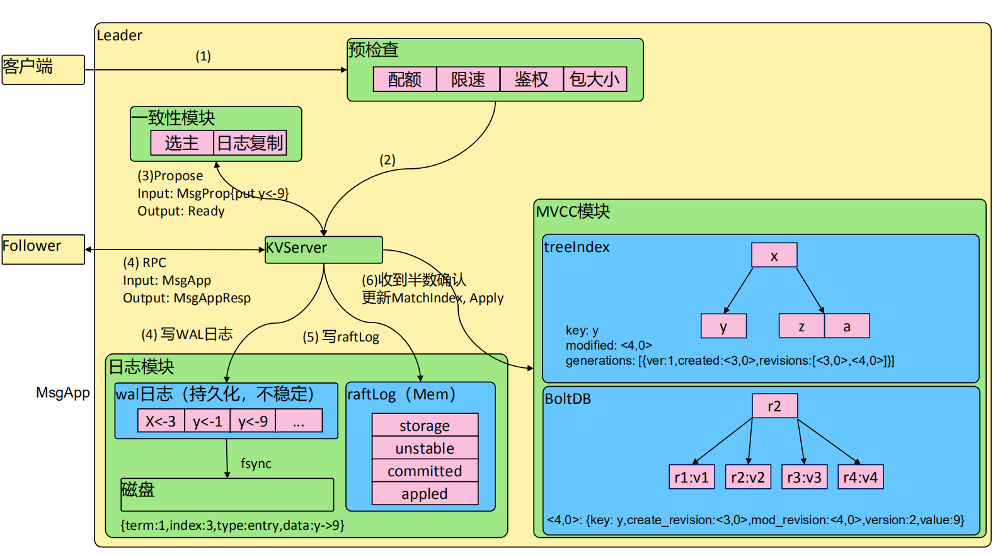

# etcd


#### 概述

Etcd是CoreOS基于Raft开发的分布式key-value存储，可用于服务发现、共享配置以及一致性保障（如数据库选主、分布式锁等）。

在分布式系统中，如何管理节点间的状态一直是一个难题，etcd像是专门为集群环境的服务发现和注册而设计，它提供了数据TTL失效、数据改变监视、多值、目录监听、分布式锁原子操作等功能，可以方便的跟踪并管理集群节点的状态。


* 键值对存储：将数据存储在分层组织的目录中，如同在标准文件系统中
* 监测变更：监测特定的键或目录以进行更改，并对值的更改做出反应
* 简单: curl可访问的用户的API（HTTP+JSON） 
* 安全: 可选的SSL客户端证书认证
* 快速: 单实例每秒 1000 次写操作，2000+次读操作
* 可靠: 使用Raft算法保证一致性


#### 主要功能

* 基本的key-value存储
* 监听机制
* key的过期及续约机制，用于监控和服务发现
* 原子Compare And Swap和Compare And Delete，用于分布式锁和leader选举


#### 使用场景

* 可以用于键值对存储，应用程序可以读取和写入 etcd 中的数据
* etcd 比较多的应用场景是用于服务注册与发现
* 基于监听机制的分布式异步系统


etcd 是一个**键值存储**的组件，其他的应用都是基于其键值存储的功能展开。

* 采用kv型数据存储，一般情况下比关系型数据库快。
* 支持动态存储(内存)以及静态存储(磁盘)。 
* 分布式存储，可集成为多节点集群。
* 存储方式，采用类似目录结构。（B+tree） 
  * 只有叶子节点才能真正存储数据，相当于文件。
  * 叶子节点的父节点一定是目录，目录不能存储数据。


**服务注册与发现**

* 强一致性、高可用的服务存储目录。
  * 基于 Raft 算法的 etcd 天生就是这样一个强一致性、高可用的服务存储目录。

* 一种注册服务和服务健康状况的机制。
  * 用户可以在 etcd 中注册服务，并且对注册的服务配置 key TTL，定时保持服务的心跳以达到监控健康状态的效果。


**消息发布订阅**

* 在分布式系统中，最适用的一种组件间通信方式就是消息发布与订阅。
* 即构建一个配置共享中心，数据提供者在这个配置中心发布消息，而消息使用者则订阅他们关心的主题，一旦主题有消息发布，就会实时通知订阅者。

* 通过这种方式可以做到分布式系统配置的集中式管理与动态更新。

* 应用中用到的一些配置信息放到etcd上进行集中管理。
* 应用在启动的时候主动从etcd获取一次配置信息，同时，在etcd节点上注册一个Watcher并等待，以后每次配置有更新的时候，etcd都会实时通知订阅者，以此达到获取最新配置信息的目的。


#### 安装使用 etcd

**下载 **

```bash
ETCD_VER=v3.4.17
DOWNLOAD_URL=https://github.com/etcd-io/etcd/releases/download
rm -f /tmp/etcd-${ETCD_VER}-linux-amd64.tar.gz
rm -rf /tmp/etcd-download-test && mkdir -p /tmp/etcd-download-test
curl -L ${DOWNLOAD_URL}/${ETCD_VER}/etcd-${ETCD_VER}-linux-amd64.tar.gz -o /tmp/etcd-${ETCD_VER}-linux-amd64.tar.gz
tar xzvf /tmp/etcd-${ETCD_VER}-linux-amd64.tar.gz -C /tmp/etcd-download-test --strip-components=1
rm -f /tmp/etcd-${ETCD_VER}-linux-amd64.tar.gz
rm -rf /tmp/etcd-download-test
```

**启动**

为避免跟本地的 hostNetwork 的 etcd 容器冲突，我们需要修改 etcd 的监听端口

- `initial-cluster`：初始化集群，需要列所有 member 地址

> What is the difference between listen-<client,peer>-urls, advertise-client-urls or initial-advertise-peer-urls?
>
> listen-client-urls and listen-peer-urls specify the local addresses etcd server binds to for accepting incoming connections. To listen on a port for all interfaces, specify 0.0.0.0 as the listen IP address.
>
> advertise-client-urls and initial-advertise-peer-urls specify the addresses etcd clients or other etcd members should use to contact the etcd server. The advertise addresses must be reachable from the remote machines. Do not advertise addresses like localhost or 0.0.0.0 for a production setup since these addresses are unreachable from remote machines.

```bash
etcd --listen-client-urls 'http://localhost:12379' \
 --advertise-client-urls 'http://localhost:12379' \
 --listen-peer-urls 'http://localhost:12380' \
 --initial-advertise-peer-urls 'http://localhost:12380' \
 --initial-cluster 'default=http://localhost:12380'
```

**演示**

查看集群 member

```bash
etcdctl member list --write-out=table --endpoints=localhost:12379
```

一些简单的操作

```bash
# 写入数据
etcdctl --endpoints=localhost:12379 put /key1 val1
# 查询数据
etcdctl --endpoints=localhost:12379 get /key1
# 查询数据-显示详细信息
etcdctl --endpoints=localhost:12379 get /key1 -w json
# 按key的前缀查询数据
etcdctl --endpoints=localhost:12379 get --prefix /
# 只显示键值
etcdctl --endpoints=localhost:12379 get --prefix / --keys-only
# watch 数据
etcdctl --endpoints=localhost:12379 watch --prefix /
```

```bash
etcdctl --endpoints=localhost:12379 put /key val1
etcdctl --endpoints=localhost:12379 put /key val2
etcdctl --endpoints=localhost:12379 put /key val3
etcdctl --endpoints=localhost:12379 put /key val4
etcdctl --endpoints=localhost:12379 get /key -wjson
etcdctl --endpoints=localhost:12379 watch --prefix / --rev 0
etcdctl --endpoints=localhost:12379 watch --prefix / --rev 1
etcdctl --endpoints=localhost:12379 watch --prefix / --rev 2
```


#### 核心：TTL & CAS

TTL（time to live）指的是给一个key设置一个有效期，到期后这个key就会被自动删掉，这在很多分布式锁的实现上都会用到，可以保证锁的实时有效性。

Atomic Compare-and-Swap（CAS）指的是在对key进行赋值的时候，客户端需要提供一些条件，当这些条件满足后，才能赋值成功。这些条件包括：

* prevExist：key当前赋值前是否存在
* prevValue：key当前赋值前的值
* prevIndex：key当前赋值前的Index

这样的话，key的设置是有前提的，需要知道这个key当前的具体情况才可以对其设置。


### Raft 协议

Raft协议基于quorum机制，即大多数同意原则，任何的变更都需超过半数的成员确认

> 推荐观看：[Raft协议动画](http://thesecretlivesofdata.com/raft/)


#### Learner

Raft 4.2.1引入的新角色

当出现一个etcd集群需要增加节点时，新节点与Leader的数据差异较大，需要较多数据同步才能跟上leader的最新的数据。

此时Leader的网络带宽很可能被用尽，进而使得leader无法正常保持心跳。进而导致follower重新发起投票。进而可能引发etcd集群不可用。

> 即：etcd 集群中加入成员会对集群稳定性造成很大的影响

因此增加了 learner 角色，该角色加入集群的节点不参与投票选举，近接收 leader 的 `replication message`，直到与 leader 保持同步为止。

**Learner角色只接收数据而不参与投票，也不提供读写服务，因此增加learner节点时，集群的quorum不变。**


集群管理员向集群中添加新节点时要尽可能减少不必要的操作项。通过 `member add --learner` 命令可以向 etcd 集群中添加 learner 节点，不参加投票，只接收 `replication message`。

当 `Learner` 节点与 leader 保持同步之后，可以通过 `member promote` 来将该节点的状态提升为 follower，然后将其计入 quorum 的大小之中。


#### etcd基于Raft的一致性

选举方法

* 初始启动时，节点处于follower状态并被设定一个election timeout，如果在这一时间周期内没有收到来自 leader 的 heartbeat，节点将发起选举：将自己切换为 candidate 之后，向集群中其它 follower 节点发送请求，询问其是否选举自己成为 leader。 

* 当收到来自集群中过半数节点的接受投票后，节点即成为 leader，开始接收保存 client 的数据并向其它的 follower 节点同步日志。如果没有达成一致，则candidate随机选择一个等待间隔（150ms ~ 300ms）再次发起投票，得到集群中半数以上follower接受的candidate将成为leader

* leader节点依靠定时向 follower 发送heartbeat来保持其地位。

* 任何时候如果其它 follower 在 election timeout 期间都没有收到来自 leader 的 heartbeat，同样会将自己的状态切换为 candidate 并发起选举。每成功选举一次，新 leader 的任期（Term）都会比之前leader 的任期大1。


#### 日志复制

当接Leader收到客户端的日志（事务请求）后先把该日志追加到本地的Log中，然后通过heartbeat把该Entry同步给其他Follower，Follower接收到日志后记录日志然后向Leader发送ACK，当Leader收到大多数（n/2+1）Follower的ACK信息后将该日志设置为已提交并追加到本地磁盘中，通知客户端并在下个heartbeat中Leader将通知所有的Follower将该日志存储在自己的本地磁盘中。


#### 安全性

安全性是用于保证每个节点都执行相同序列的安全机制，如当某个Follower在当前Leader commit Log时变得不可用了，稍后可能该Follower又会被选举为Leader，这时新Leader可能会用新的Log覆盖先前已committed的Log，这就是导致节点执行不同序列；Safety就是用于保证选举出来的Leader一定包含先前 committed Log的机制；选举安全性（Election Safety）：每个任期（Term）只能选举出一个LeaderLeader完整性（Leader Completeness）：指Leader日志的完整性，当Log在任期Term1被Commit后，那么以后任期Term2、Term3…等的Leader必须包含该Log；Raft在选举阶段就使用Term的判断用于保证完整性：当请求投票的该Candidate的Term较大或Term相同Index更大则投票，否则拒绝该请求。


#### 失效处理

* 1）Leader失效：其他没有收到heartbeat的节点会发起新的选举，而当Leader恢复后由于步进数小会自动成为follower（日志也会被新leader的日志覆盖）
* 2）follower节点不可用：follower 节点不可用的情况相对容易解决。因为集群中的日志内容始终是从 leader 节点同步的，只要这一节点再次加入集群时重新从 leader 节点处复制日志即可。
* 3）多个candidate：冲突后candidate将随机选择一个等待间隔（150ms ~ 300ms）再次发起投票，得到集群中半数以上follower接受的candidate将成为leader


#### wal 日志

wal日志是二进制的，解析出来后是以上数据结构LogEntry。其中第一个字段type，只有两种，一种是0表示Normal，1表示ConfChange（ConfChange表示 Etcd 本身的配置变更同步，比如有新的节点加入等）。第二个字段是term，每个term代表一个主节点的任期，每次主节点变更term就会变化。第三个字段是index，这个序号是严格有序递增的，代表变更序号。第四个字段是二进制的data，将raft request对象的pb结构整个保存下。etcd 源码下有个tools/etcddump-logs，可以将wal日志dump成文本查看，可以协助分析Raft协议。

Raft协议本身不关心应用数据，也就是data中的部分，一致性都通过同步wal日志来实现，每个节点将从主节点收到的data apply到本地的存储，Raft只关心日志的同步状态，如果本地存储实现的有bug，比如没有正确的将data apply到本地，也可能会导致数据不一致。


#### 存储机制

etcd v3 store 分为两部分，一部分是内存中的索引，kvindex，是基于Google开源的一个Golang的btree实现的，另外一部分是后端存储。按照它的设计，backend可以对接多种存储，当前使用的boltdb。boltdb是一个单机的支持事务的kv存储，etcd 的事务是基于boltdb的事务实现的。etcd 在boltdb中存储的key是reversion，value是 etcd 自己的key-value组合，也就是说 etcd 会在boltdb中把每个版本都保存下，从而实现了多版本机制。

reversion主要由两部分组成，第一部分main rev，每次事务进行加一，第二部分sub rev，同一个事务中的每次操作加一。

etcd 提供了命令和设置选项来控制compact，同时支持put操作的参数来精确控制某个key的历史版本数。

内存kvindex保存的就是key和reversion之前的映射关系，用来加速查询。


**etcd 请求流程图**：

> 重点关注图中的 3 4 5 6 步。



