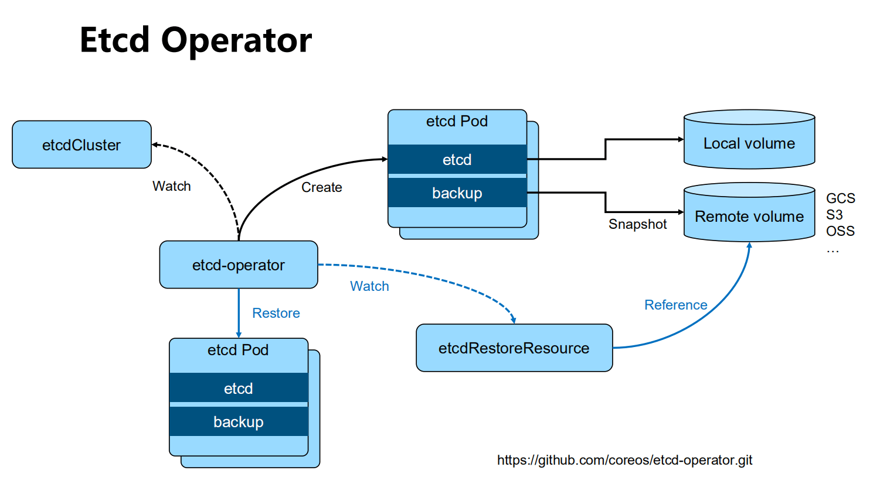
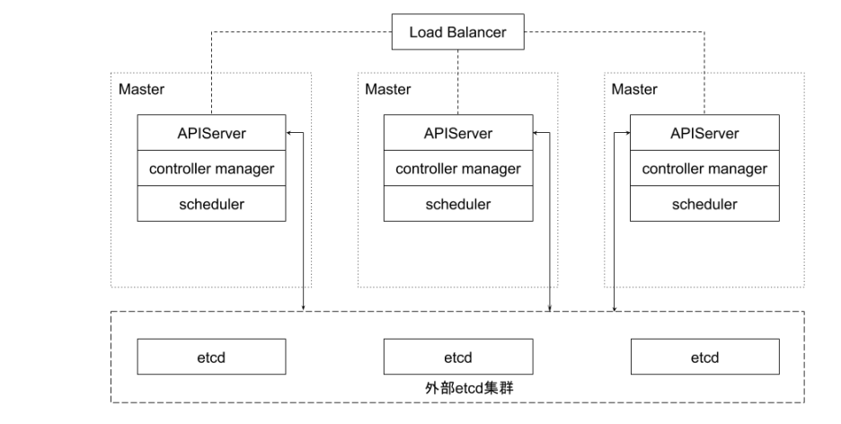
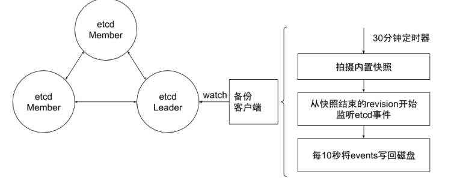

# etcd

### 相关参数

#### etcd 成员重要参数

成员相关参数

* --name 'default'
  * Human-readable name for this member.

* --data-dir '${name}.etcd'
  * Path to the data directory.

* --listen-peer-urls 'http://localhost:2380'
  * List of URLs to listen on for peer traffic.

* --listen-client-urls 'http://localhost:2379'
  * List of URLs to listen on for client traffic.

#### etcd集群重要参数

集群相关参数

* --initial-advertise-peer-urls 'http://localhost:2380'
  * List of this member's peer URLs to advertise to the rest of the cluster.

* --initial-cluster 'default=http://localhost:2380'
  * Initial cluster configuration for bootstrapping.

* --initial-cluster-state 'new'
  * Initial cluster state ('new' or 'existing').

* --initial-cluster-token 'etcd-cluster'
  * Initial cluster token for the etcd cluster during bootstrap.

* --advertise-client-urls 'http://localhost:2379'
  * List of this member's client URLs to advertise to the public.


#### etcd安全相关参数

* --cert-file ''
  * Path to the client server TLS cert file.

* --key-file ''
  * Path to the client server TLS key file.

* --client-crl-file ''
  * Path to the client certificate revocation list file.

* --trusted-ca-file ''
  * Path to the client server TLS trusted CA cert file.

* --peer-cert-file ''
  * Path to the peer server TLS cert file.

* --peer-key-file ''
  * Path to the peer server TLS key file.

* --peer-trusted-ca-file ''
  * Path to the peer server TLS trusted CA file.


#### 灾备

创建Snapshot

```bash
etcdctl --endpoints https://127.0.0.1:3379 --cert /tmp/etcd-certs/certs/127.0.0.1.pem --key /tmp/etcd-certs/certs/127.0.0.1-key.pem --cacert /tmp/etcd-certs/certs/ca.pem snapshot save snapshot.db
```

恢复数据

```bash
etcdctl snapshot restore snapshot.db \
--name infra2 \
--data-dir=/tmp/etcd/infra2 \
--initial-cluster infra0=http://127.0.0.1:3380,infra1=http://127.0.0.1:4380,infra2=http://127.0.0.1:5380 \
--initial-cluster-token etcd-cluster-1 \
--initial-advertise-peer-urls http://127.0.0.1:5380
```


#### 容量管理

单个对象不建议超过1.5M

默认容量2G

不建议超过8G

**Alarm & Disarm Alarm**

> etcd 容量写满后会出现 alarm，alarm 存在的时候 etcd 无法处理写请求。

设置 etcd 存储阈值

```bash
etcd --quota-backend-bytes**=$((16\*1024\*1024))**
```

死循环，模拟写爆磁盘

```bash
while [ 1 ]; do dd if=/dev/urandom bs=1024 count=1024 | ETCDCTL_API=3 etcdctl put key || break; done  
```

查看endpoint状态

```bash
ETCDCTL_API=3 etcdctl --write-out=table endpoint status
```

查看alarm

```bash
ETCDCTL_API=3 etcdctl alarm list
```

清理碎片

```bash
ETCDCTL_API=3 etcdctl defrag
```

清理 alarm

```bash
ETCDCTL_API=3 etcdctl alarm disarm 
```


#### 碎片整理

设置每小时压缩一次

```bash
etcd --auto-compaction-retention=1
```

compact up to revision 3

```bash
etcdctl compact 3
```

碎片整理

```bash
etcdctl defrag 
```


### 高可用etcd解决方案


etcd-operator: coreos开源的，基于kubernetes CRD完成etcd集群配置。Archived

https://github.com/coreos/etcd-operator

Etcd statefulset Helm chart: Bitnami(powered by vmware) 

https://bitnami.com/stack/etcd/helm

https://github.com/bitnami/charts/blob/master/bitnami/etcd


#### Etcd Operator




#### 基于 Bitnami 安装etcd高可用集群

安装helm

https://github.com/helm/helm/releases

通过helm安装etcd

```bash
helm repo add bitnami https://charts.bitnami.com/bitnami

helm install my-release bitnami/etcd
```


通过客户端与serve交互

```bash
kubectl run my-release-etcd-client --restart='Never' --image docker.io/bitnami/etcd:3.5.0-debian-10-r94 --env ROOT_PASSWORD=$(kubectl get secret --namespace default my-release-etcd -o jsonpath="{.data.etcd-root-password}"|base64 --decode) --env ETCDCTL_ENDPOINTS="my-release etcd.default.svc.cluster.local:2379" --namespace default --command -- sleep infinity
```


### Kubernetes如何使用etcd

etcd是kubernetes的后端存储,对于每一个kubernetes Object，都有对应的 storage.go 负责对象的存储操作。

> pkg/registry/core/pod/storage/storage.go


API server 启动脚本中指定etcd servers集群

```bash
spec:
containers:
  - command:
    - kube-apiserver
    - --advertise-address=192.168.34.2
    - --enable-bootstrap-token-auth=true
    - --etcd-cafile=/etc/kubernetes/pki/etcd/ca.crt
    - --etcd-certfile=/etc/kubernetes/pki/apiserver-etcd-client.crt
    - --etcd-keyfile=/etc/kubernetes/pki/apiserver-etcd-client.key
    - --etcd-servers=https://127.0.0.1:2379 
```

早期 API server 对 etcd 做简单的 Ping check 检测端口是否通，现在已经改为真实的 etcd api call。

> 端口通不一定代表服务正常。


#### Kubernets对象在etcd中的存储路径

进入 etcd pod

```bash
kubectl -n kube-system exec -it etcd-cadmin sh
```

使用容器内的 etcdctl 发请求

```bash
ETCDCTL_API=3

alias ectl='etcdctl --endpoints https://127.0.0.1:2379 \
--cacert /etc/kubernetes/pki/etcd/ca.crt \
--cert /etc/kubernetes/pki/etcd/server.crt \
--key /etc/kubernetes/pki/etcd/server.key'

ectl get --prefix --keys-only /
```


#### etcd-servers-overrides

k8s 集群中某些对象会大量创建删除，比如 event，创建一个 pod 可能会有几十条 event，这样就会对 etcd 造成较大压力，因此 apiserver 提供了 etcd-servers-overrides 参数，运行再主 etcd server 之外再提供一个 etcd 用来存放哪些不是那么重要的对象。

 ```bash
 /usr/local/bin/kube-apiserver --etcd_servers=https://localhost:4001 --etcd-cafile=/etc/ssl/kubernetes/ca.crt--storage-backend=etcd3 --etcd-servers-overrides=/events#https://localhost:4002
 ```


#### 堆叠式etcd集群的高可用拓扑

这种拓扑将相同节点上的控制平面和etcd成员耦合在一起。

优点在于建立起来非常容易，并且对副本的管理也更容易。但是，堆叠式存在耦合失败的风险。如果一个节点发生故障，则etcd成员和控制平面实例都会丢失，并且集群冗余也会受到损害。可以通过添加更多控制平面节点来减轻这种风险。因此为实现集群高可用应该至少运行三个堆叠的Master节点。


#### 外部etcd集群的高可用拓扑

该拓扑将控制平面和etcd成员解耦。如果丢失一个Master节点，对etcd成员的影响较小，并且不会像堆叠式拓扑那样对集群冗余产生太大影响。但是，此拓扑所需的主机数量是堆叠式拓扑的两倍。具有此拓扑的群集至少需要三个主机用于控制平面节点，三个主机用于etcd集群。




### 实践-etcd集群高可用

#### 多少个peer最适合

* 1个？3个？5个？
  * 生成环境推荐 3 个或者 5 个
  * 3 个性能较高，请求过来只需要两个节点确认即可返回
  * 3 个的问题就是出问题后需要运维立马处理，如果处理不及时，万一第二个也坏了整个集群就废了
  * 5 个则可以允许坏两个，能给运维多一点缓冲时间
  * **一般生产环境推荐使用 5 个**。

* 保证高可用是首要目标、
* 所有写操作都要经过 leader
* peer多了是否能提升集群并读操作的并发能力？
  * apiserver的配置只连本地的etcd peer
  * apiserver的配置指定所有etcd peers，但只有当前连接的etcd member异常，apiserver才会换目标
* 需要动态flex up吗？
  * 一般情况下 etcd 不需要动态扩缩容，规划好只会就不会在去动了。


#### 保证apiserver和etcd之间的高效性通讯

* apiserver和etcd 部署在同一节点
* apiserver和etcd之间的通讯基于gRPC
  * 针对每一个object，apiserver和etcd之间的Connection -> stream 共享
  * http2的特性
    * Stream quota
    * 带来的问题？对于大规模集群，会造成链路阻塞
    * 10000个pod，一次list操作需要返回的数据可能超过100M


#### etcd存储规划

本地 vs 远程？

* Remote Storage
  * 优势是假设永远可用，现实真是如此吗？
  * 劣势是IO效率，可能带来的问题？
* 最佳实践：
  * Local SSD
  * 利用local volume分配空间

多少空间？

* 与集群规模相关
* 默认 2G，一般不超过 8G。

思考：为什么每个member的DB size不一致？


#### 安全性

peer和peer之间的通讯加密

* 是否有需求
  * TLS的额外开销
  * 运营复杂度增加

数据加密

* 是否有需求？
* Kubernetes提供了针对secret的加密
  * https://kubernetes.io/docs/tasks/administer-cluster/encrypt-data/


**--etcd-servers-overrides**

* 对于大规模集群，大量的事件会对etcd造成压力
* API server 启动脚本中指定etcd servers集群

```bash
/usr/local/bin/kube-apiserver --etcd_servers=https://localhost:4001 --etcd-cafile=/etc/ssl/kubernetes/ca.crt--storage-backend=etcd3 --etcd-servers-overrides=/events#https://localhost:4002
```


#### 减少网络延迟

数据中心内的RTT大概是数毫秒，国内的典型RTT约为50ms，两大洲之间的RTT可能慢至400ms。因此建议etcd集群尽量同地域部署。

当客户端到Leader的并发连接数量过多，可能会导致其他Follower节点发往Leader的请求因为网络拥塞而被延迟处理。在Follower节点上，可能会看到这样的错误：

```console
dropped MsgProp to 247ae21ff9436b2d since streamMsg's sending buffer is  full
```

可以在节点上通过流量控制工具（Traffic Control）提高etcd成员之间发送数据的优先级来避免。


#### 减少磁盘I/O延迟

对于磁盘延迟，典型的旋转磁盘写延迟约为10毫秒。对于SSD（Solid State Drives，固态硬盘），延迟通常低于1毫秒。HDD（Hard Disk Drive，硬盘驱动器）或者网盘在大量数据读写操作的情况下延时会不稳定。因此**强烈建议使用SSD**。

同时为了降低其他应用程序的I/O操作对etcd的干扰，建议将etcd的数据存放在单独的磁盘内。也可以将不同类型的对象存储在不同的若干个etcd集群中，比如将频繁变更的event对象从主etcd集群中分离出来，以保证主集群的高性能。在APIServer处这是可以通过参数配置的。这些etcd集群最好也分别能有一块单独的存储磁盘。

如果不可避免地，etcd和其他的业务共享存储磁盘，那么就需要通过下面ionice命令对etcd服务设置更高的磁盘I/O优先级，尽可能避免其他进程的影响。

```bash
ionice -c2 -n0 -p 'pgrep etcd'
```


#### 保持合理的日志文件大小

etcd以日志的形式保存数据，无论是数据创建还是修改，它都将操作追加到日志文件，因此日志文件大小会随着数据修改次数而线性增长。

当Kubernetes集群规模较大时，其对etcd集群中的数据更改也会很频繁，集群日记文件会迅速增长。

为了有效降低日志文件大小，etcd会以固定周期创建快照保存系统的当前状态，并移除旧日志文件。另外当修改次数累积到一定的数量（默认是10000，通过参数“--snapshot-count”指定），etcd也会创建快照文件。

如果etcd的内存使用和磁盘使用过高，可以先分析是否数据写入频度过大导致快照频度过高，确认后可通过调低快照触发的阈值来降低其对内存和磁盘的使用。


#### 设置合理的存储配额

存储空间的配额用于控制etcd数据空间的大小。合理的存储配额可保证集群操作的可靠性。

> 推荐 8G。

如果没有存储配额，也就是etcd可以利用整个磁盘空间，etcd的性能会因为存储空间的持续增长而严重下降，甚至有耗完集群磁盘空间导致不可预测集群行为的风险。如果设置的存储配额太小，一旦其中一个节点的后台数据库的存储空间超出了存储配额，etcd就会触发集群范围的告警，并将集群置于只接受读和删除请求的维护模式。只有在释放足够的空间、消除后端数据库的碎片和清除存储配额告警之后，集群才能恢复正常操作。


#### 自动压缩历史版本

etcd会为每个键都保存了历史版本。为了避免出现性能问题或存储空间消耗完导致写不进去的问题，这些历史版本需要进行周期性地压缩。压缩历史版本就是丢弃该键给定版本之前的所有信息，节省出来的空间可以用于后续的写操作。etcd支持自动压缩历史版本。在启动参数中指定参数 **--auto-compaction**，其值以小时为单位。也就是etcd会自动压缩该值设置的时间窗口之前的历史版本。


#### 定期消除碎片化

压缩历史版本，相当于离散地抹去etcd存储空间某些数据，etcd存储空间中将会出现碎片。这些碎片无法被后台存储使用，却仍占据节点的存储空间。因此定期消除存储碎片，将释放碎片化的存储空间，重新调整整个存储空间。


#### 备份方案

备份方案

* etcd备份：备份完整的集群信息，灾难恢复
  * etcdctl snapshot save
* 备份Kubernetes event

 频度？

* 时间间隔太长：
  * 能否接受user data lost？ 
  * 如果有外部资源配置，如负载均衡等，能否接受数据丢失导致的leak？ 

* 时间间隔太短：
  * 对etcd的影响
    * 做snapshot的时候，etcd会锁住当前数据
    * 并发的写操作需要开辟新的空间进行增量写，导致磁盘空间增长

如何保证备份的时效性，同时防止磁盘爆掉？

* Auto defrag


#### 优化运行参数

当网络延迟和磁盘延迟固定的情况下，可以优化etcd运行参数来提升集群的工作效率。etcd基于Raft协议进行Leader选举，当Leader选定以后才能开始数据读写操作，因此频繁的Leader选举会导致数据读写性能显著降低。可以通过调整心跳周期（Heatbeat Interval）和选举超时时间（Election Timeout），来降低Leader选举的可能性。

心跳周期是控制Leader以何种频度向Follower发起心跳通知。心跳通知除表明Leader活跃状态之外，还带有待写入数据信息，Follower依据心跳信息进行数据写入，默认心跳周期是100ms。选举超时时间定义了当Follower多久没有收到Leader心跳，则重新发起选举，该参数的默认设置是1000ms。

如果etcd集群的不同实例部署在延迟较低的相同数据中心，通常使用默认配置即可。如果不同实例部署在多数据中心或者网络延迟较高的集群环境，则需要对心跳周期和选举超时时间进行调整。建议心跳周期参数推荐设置为接近etcd多个成员之间平均数据往返周期的最大值，一般是平均RTT的0.55-1.5倍。如果心跳周期设置得过低，etcd会发送很多不必要的心跳信息，从而增加CPU和网络的负担。如果设置得过高，则会导致选举频繁超时。选举超时时间也需要根据etcd成员之间的平均RTT时间来设置。选举超时时间最少设置为etcd成员之间RTT时间的10倍，以便对网络波动。

心跳间隔和选举超时时间的值必须对同一个etcd集群的所有节点都生效，如果各个节点配置不同，就会导致集群成员之间协商结果不可预知而不稳定。


#### etcd备份存储

etcd的默认工作目录下会生成两个子目录：wal和snap。wal是用于存放预写式日志，其最大的作用是记录整个数据变化的全部历程。所有数据的修改在提交前，都要先写入wal中。

snap是用于存放快照数据。为防止wal文件过多，etcd会定期（当wal中数据超过10000条记录时，由参数“--snapshot-count”设置）创建快照。当快照生成后，wal中数据就可以被删除了。

如果数据遭到破坏或错误修改需要回滚到之前某个状态时，方法就有两个：

* 一是从快照中恢复数据主体，但是未被拍入快照的数据会丢失；
* 二是执行所有WAL中记录的修改操作，从最原始的数据恢复到数据损坏之前的状态，但恢复的时间较长。


#### 备份方案实践

官方推荐etcd集群的备份方式是**定期创建快照**。和etcd内部定期创建快照的目的不同，该备份方式依赖外部程序定期创建快照，并将快照上传到网络存储设备以实现etcd数据的冗余备份。上传到网络设备的数据，都应进行了加密。即使当所有etcd实例都丢失了数据，也能允许etcd集群从一个已知的良好状态的时间点在任一地方进行恢复。根据集群对etcd备份粒度的要求，可适当调节备份的周期。在生产环境中实测，拍摄快照通常会影响集群当时的性能，因此不建议频繁创建快照。但是备份周期太长，就可能导致大量数据的丢失。

这里可以使用**增量备份**的方式。备份程序每30分钟触发一次快照的拍摄。紧接着它从快照结束的版本（Revision）开始，监听etcd集群的事件，并每10秒钟将事件保存到文件中，并将快照和事件文件上传到网络存储设备中。30分钟的快照周期对集群性能影响甚微。当大灾难来临时，也至多丢失10秒的数据。至于数据修复，首先把数据从网络存储设备中下载下来，然后从快照中恢复大块数据，并在此基础上依次应用存储的所有事件。这样就可以将集群数据恢复到灾难发生前。




#### ResourceVersion

单个对象的resourceVersion

* 对象的最后修改resourceVersion

List对象的resourceVersion

* 生成list response时的resourceVersion

List行为

* List对象时，如果不加resourceVersion，意味着需要Most Recent数据，请求会击穿APIServer 缓存，直接发送至etcd

* APIServer 通过Label过滤对象查询时，过滤动作是在APIServer端，APIServer需要向etcd发起全量查询请求

