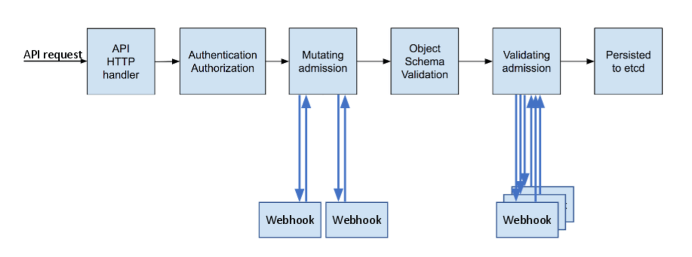
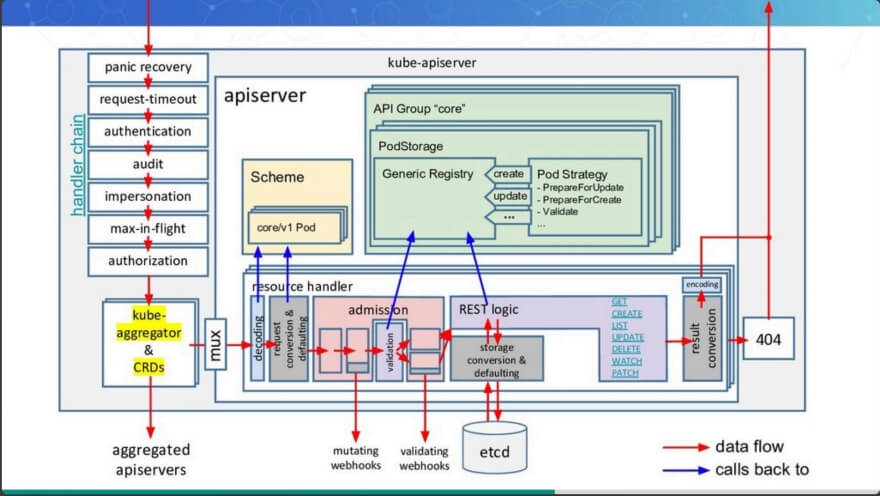
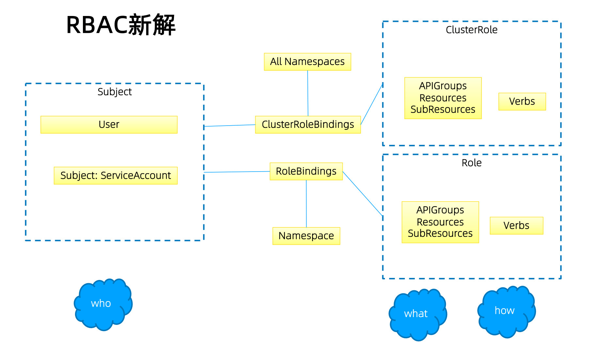

# 深入理解Kube-APIServer

kube-apiserver是Kubernetes最重要的核心组件之一，主要提供以下的功能 

* 提供集群管理的REST API接口，包括认证授权、数据校验以及集群状态变更等 
* 提供其他模块之间的数据交互和通信的枢纽（其他模块通过API Server查询或修改数据，只有API Server才直接操作etcd） 


apiserver 主要功能：

* 认证

* 鉴权

* 准入

  * Mutating
  * Validating
  * Admission

* 限流

* APIServer对象的实现


## 访问控制

Kubernetes API的每个请求都会经过多阶段的访问控制之后才会被接受，这包括**认证**、**授权**以及**准入控制**（Admission Control）等。



更加详细的请求处理流程：




## 认证

开启TLS时，所有的请求都需要首先认证。Kubernetes支持多种认证机制，并支持同时开启多个认证插件（只要有一个认证通过即可）。如果认证成功，则用户的username会传入授权模块做进一步授权验证；而对于认证失败的请求则返回HTTP 401。

### 认证插件

apiserver 支持多种认证方式：

* X509证书
  * 使用X509客户端证书只需要API Server启动时配置--client-ca-file=SOMEFILE。在证书认证时，**其CN域用作用户名，而组织机构域则用作group名**。
* 静态Token文件
  * 使用静态Token文件认证只需要API Server启动时配置--token-auth-file=SOMEFILE。 
  * 该文件为csv格式，每行至少包括三列token,username,user id,最后一列为可选的 group 字段。
  * 例如：token,user,uid,"group1,group2,group3”
* 引导Token
  * 为了支持平滑地启动引导新的集群，Kubernetes 包含了一种动态管理的持有者令牌类型， 称作 启动引导令牌（Bootstrap Token）。
  * 这些令牌以 Secret 的形式保存在 kube-system 名字空间中，可以被动态管理和创建。
  * 控制器管理器包含的 TokenCleaner 控制器能够在启动引导令牌过期时将其删除。
  * 在使用kubeadm部署Kubernetes时，可通过kubeadm token list命令查询。

* 静态密码文件

  * 需要API Server启动时配置--basic-auth-file=SOMEFILE，文件格式为csv，每行至少三列password, user, uid，后面是可选的group名 password,user,uid,"group1,group2,group3”

* ServiceAccount
  * ServiceAccount是Kubernetes自动生成的，并会自动挂载到容器的/run/secrets/kubernetes.io/serviceaccount目录中。 

* OpenID
  * OAuth 2.0的认证机制

* Webhook 令牌身份认证
  * --authentication-token-webhook-config-file 指向一个配置文件，其中描述 如何访问远程的 Webhook 服务。
  * --authentication-token-webhook-cache-ttl 用来设定身份认证决定的缓存时间。 默认时长为 2 分钟。

* 匿名请求
  * 如果使用AlwaysAllow以外的认证模式，则匿名请求默认开启，但可用--anonymous-auth=false禁止匿名请求。


### static token 认证 demo

static token 认证方式是 apiserver 中最简单的一种认证方式。

首先准备一个 static-token 文件，完整内容如下：

> 该文件为csv格式，每行至少包括三列token,username,user id,最后一列为可选的 group 字段。

```bash
cncamp-token,cncamp,1000,"group1,group2,group3"
```

将该文件放到指定目录下

```sh
mkdir -p /etc/kubernetes/auth
cp static-token /etc/kubernetes/auth
```

修改`/etc/kubernetes/manifests/kube-apiserver.yaml`文件，增加启动参数。

* 1）添加**--token-auth-file=/etc/kubernetes/auth/static-token**参数，
* 2）同时由于 apiserver 是容器化运行的，还需要额外添加hostpath 的 mount，把存放 static token 的目录也挂载到容器中。

修改完成后 kubelet 就会自动重启 apiserver pod。

然后我们可以拿 static token 去访问 apiserver 了：

```sh
curl https://192.168.34.2:6443/api/v1/namespaces/default -H "Authorization: Bearer cncamp-token" -k
```

当然了，现在访问会提升 403，因为还没有为该用户配置权限，不过可以说明的是此时 apiserver 已经能认识我们了。


### x509 证书认证demo

使用 k8s 里的 ca 来为 myuser 用户签发证书，并通过 rbac 为该用户添加权限，并配置到 kubeconfig 中。

创建一个私钥和 csr 文件：

```sh
openssl genrsa -out myuser.key 2048
openssl req -new -key myuser.key -out myuser.csr
openssl req -new -x509 -days 10000 -key .key -out <CA_public>.crt 

```

base64 以下

```sh
cat myuser.csr | base64 | tr -d "\n"
```

然后使用 base64 后的值往 k8s 里创建一个 csr 对象，表示我们需要签发一个证书

```sh
cat <<EOF | kubectl apply -f -
apiVersion: certificates.k8s.io/v1
kind: CertificateSigningRequest
metadata:
  name: myuser
spec:
  request: LS0tLS1CRUdJTiBDRVJUSUZJQ0FURSBSRVFVRVNULS0tLS0KTUlJQ3l6Q0NBYk1DQVFBd2dZVXhDekFKQmdOVkJBWVRBa05PTVJFd0R3WURWUVFJREFoVGFHRnVaMmhoYVRFUgpNQThHQTFVRUJ3d0lVMmhoYm1kb1lXa3hEekFOQmdOVkJBb01CbU51WTJGdGNERVBNQTBHQTFVRUN3d0dZMjVqCllXMXdNUTh3RFFZRFZRUUREQVpqYm1OaGJYQXhIVEFiQmdrcWhraUc5dzBCQ1FFV0RtTnVZMkZ0Y0VBeE5qTXUKWTI5dE1JSUJJakFOQmdrcWhraUc5dzBCQVFFRkFBT0NBUThBTUlJQkNnS0NBUUVBeG5LN09PRDEvR1FBR1ZZKwpBeVhhem85Y1FmKzFVTndNYk93M0pyaHV5R0ZvbnphU0FuSXhoZlFlVFRKSzJJUWlNODA5VU9ud2NpMnJ5RjRHCnVlaWRiMjlTZFc4VmJXZE9xWGRkWWhmTGJnZ0FtbFFNQmc5dTZPRWMrTW5OdStnM29ENGQvNTh0ZlBDbDQydnoKMURKbmFwa21ZWUs2UWpxanVQT2tqcUZQeElrMFphTFRWTlAvVk0zbGpGVnZWL2xNZlZ4RjdTMzEwSmhtRWNhcApMMHdXN0VNazdwV242aFJ3SkFsSkxQTHlSNGRiT1NhRFlpYWVqbHF5RWt4WFBWbE1EVmFieEF5Z01Ca2pJbGlxCjJ2dnJ3UERzYnorWXppMFRxVEpYamtzV3REUngxeXladU5DVkl4V01ib3IxdEI0c3NoOWk2dnhEakxFWGMwVjEKK204MmVRSURBUUFCb0FBd0RRWUpLb1pJaHZjTkFRRUxCUUFEZ2dFQkFESWJ3S1JxVnQxWllmN3QzdVlsL3pybgpiV2JFbEFNUmY4UEhOTDl3SXRCRGpDMFZjb1pNdTFMVW9JNXN0V0V2Z0UwbFJLVTUwTkg4MG1XbmphbUViWGFMCkJWbXZNcGxFSEVVbk9tOXY1SGNIUzNZV3NEU1hocTVIOE5yb1dkNTNKN3NOazVkU25XYWJZa3RHMm9mWFIweVgKbEt4MGt5bW16ajJlTkFvMUFLTGIrUmVocW9od08xdlhnWEU4WXJvNUV6cFU0NFhGa0dHN2RyVWJ5MlZCMG5hQwpXZHZ1MVl0VGk1RVVhblNpK3BncC94aUtrb0s0MVlZMHIrOENSOUtHQk1vY2UvUGlRcDU0RThRMHNheU1KWXZuCmYxVTZmT3BiQUJ2aXIzWU9Vd3QwOHFZNlNnWmo3ZjZBRU5qcUU3T3pJVzg3QTZ2Z3B6WWNubXpOTFlWakp0OD0KLS0tLS1FTkQgQ0VSVElGSUNBVEUgUkVRVUVTVC0tLS0tCg==
  signerName: kubernetes.io/kube-apiserver-client
  expirationSeconds: 86400  # one day
  usages:
  - client auth
EOF
```

然后用默认的管理员账号执行命令，同意这个请求

```sh
kubectl certificate approve myuser
```

接着在查看就可以发现，证书已经被签发好了

```sh
kubectl get csr/myuser -o yaml
```

使用 jsonpath 把我们的证书提取出来，写入到 myuser.crt 文件中

```sh
kubectl get csr myuser -o jsonpath='{.status.certificate}'| base64 -d > myuser.crt
```

使用证书和key来配置 kubeconfig 中的 user

```sh
kubectl config set-credentials myuser --client-key=myuser.key --client-certificate=myuser.crt --embed-certs=true
```

使用 role 和 rolebinding 为该用户添加权限

```sh
kubectl create role developer --verb=create --verb=get --verb=list --verb=update --verb=delete --resource=pods
kubectl create rolebinding developer-binding-myuser --role=developer --user=myuser
```

kubectl 命令中指定使用该用户进行查询：

```bash
# 指定使用 myuser 这个用户来访问 apiserver
kubectl get po --user myuser
```


### 基于 webhook 的认证服务集成


#### 构建符合Kubernetes规范的认证服务

需要依照Kubernetes规范，构建认证服务，用来认证tokenreview request，构建认证服务，认证服务需要满足如下Kubernetes的规范


URL： https://authn.example.com/authenticate

> 必须以 authenticate 结尾

Method： POST

> 必须是 POST 方法

Input:

> 携带上token

```bash
{ "apiVersion": "authentication.k8s.io/v1beta1", "kind": "TokenReview", 
"spec": { "token": "(BEARERTOKEN)" } }
```

Output: 

> 解析token并返回验证结果以及相应用户的数据

```bash
{ 
	"apiVersion": "authentication.k8s.io/v1beta1",
    "kind": "TokenReview",
    "status": {
    "authenticated": true,
    "user": {
        "username": "janedoe@example.com",
        "uid": "42",
        "groups": [
            "developers",
            "qa"
            ]
        }
    }
}
```


#### 配置 apiserver

**apiserver 怎么知道请求哪个 webhook 来进行验证呢？**

> 问题：apiserver 是遇到无法识别的用户都会发到 webhook 吗？

这就需要我们进行配置了


可以是任何认证系统

* 但在用户认证完成后，生成代表用户身份的token
* 该token通常是有失效时间的
* 用户获取该token以后以后，将token配置进 kubeconfig


修改apiserver设置，开启认证服务，apiserver保证将所有收到的请求中的token信息，发给认证服务进行验证

* --authentication-token-webhook-config-file，该文件描述如何访问认证服务
* --authentication-token-webhook-cache-ttl，默认2分钟

配置文件需要mount进Pod

配置文件中的服务器地址需要指向authService


配置文件格式如下：

```json
{
  "kind": "Config",
  "apiVersion": "v1",
  "preferences": {},
  "clusters": [
    {
      "name": "github-authn",
      "cluster": {
        "server": "http://192.168.34.2:3000/authenticate"
      }
    }
  ],
  "users": [
    {
      "name": "authn-apiserver",
      "user": {
        "token": "secret"
      }
    }
  ],
  "contexts": [
    {
      "name": "webhook",
      "context": {
        "cluster": "github-authn",
        "user": "authn-apiserver"
      }
    }
  ],
  "current-context": "webhook"
}
```


### 生产系统中遇到的陷阱

**基于 Keystone 的认证插件导致 Keystone 故障且无法恢复**

Keystone 是企业关键服务

Kubernetes 以 Keystone 作为认证插件

Keystone 在出现故障后会抛出 401 错误

Kubernetes 发现 401 错误后会尝试重新认证

大多数 controller都有指数级back off，重试间隔越来越慢，但 gophercloud 针对过期 token 会一直 retry

大量的 request 积压在 Keystone 导致服务无法恢复

> 随着时间推移，apiserver 中越来越多的 token 过期，需要访问 Keystone 进行认证，因此 Keystone  压力越来越大，然后大量压力下 Keystone 根本无法正常启动，刚起来又被大量请求打死，从而形成恶性循环。

Kubernetes 成为压死企业认证服务的最后一根稻草

解决方案？

* Circuit break
* Rate limit


## 鉴权

### 授权

授权主要是用于对集群资源的访问控制，通过检查请求包含的相关属性值，与相对应的访问策略相比较，API请求必须满足某些策略才能被处理。跟认证类似，Kubernetes也支持多种授权机制，并支持同时开启多个授权插件（只要有一个验证通过即可）。如果授权成功，则用户的请求会发送到准入控制模块做进一步的请求验证；对于授权失败的请求则返回HTTP 403。

Kubernetes授权仅处理以下的请求属性：

* user, group, extra
* API、请求方法（如get、post、update、patch和delete）和请求路径（如/api） 
* 请求资源和子资源
* Namespace
* API Group

目前，Kubernetes支持以下授权插件：

* ABAC
* RBAC
  * 由于控制对象的 k8s 中的对象，因此 RBAC 基本可以满足绝大部分需求
* Webhook
* Node
  * 节点上的 kubelet 只能操作当前节点上的对象，不能操作那些和当前节点没有关系的对象


#### RBAC vs ABAC

ABAC（Attribute Based Access Control）本来是不错的概念，但是在 Kubernetes 中的实现比较难于管理和理解，而且需要对 Master 所在节点的 SSH 和文件系统权限，要使得对授权的变更成功生效，还需要重新启动 API Server。 

> ABAC 类似我认证中的 static-token，将数据配置到静态文件中，然后通过 apiserver 的参数指定该文件，如果有更新还需要重启 apiserver 比较麻烦。

而 RBAC 的授权策略可以利用 kubectl 或者 Kubernetes API 直接进行配置。RBAC 可以授权给用户，让用户有权进行授权管理，这样就可以无需接触节点，直接进行授权管理。RBAC 在 Kubernetes 中被映射为 API 资源和操作。





#### Role与ClusterRole

Role（角色）是一系列权限的集合，例如一个角色可以包含读取 Pod 的权限和列出 Pod 的权限。

Role只能用来给某个特定namespace中的资源作鉴权，对多namespace和集群级的资源或者是非

资源类的API（如/healthz）使用ClusterRole。

Role 是有 namespace，只能在该 namespace 下进行 bind。

ClusterRole则没有namespace，在任意namespace下都可以bind。


#### roleBinding 和 clusterRoleBinding

roleBinding 可以引用 Role与ClusterRole，但是最终权限会被限制在 namespace 下。

clusterRoleBinding 则只能引用ClusterRole，但最终权限则是整个集群中。


#### 账户／组的管理

角色绑定（Role Binding）是将角色中定义的权限赋予一个或者一组用户。

它包含若干 **主体**（用户、组或服务账户）的列表和对这些主体所获得的角色的引用。

组的概念：

* 当与外部认证系统对接时，用户信息（UserInfo）可包含Group信息，授权可针对用户群组
* **当对ServiceAccount授权时，Group代表某个Namespace下的所有ServiceAccount**


#### 针对群组授权

```yaml
apiVersion: rbac.authorization.k8s.io/v1
kind: ClusterRoleBinding
metadata:
name: read-secrets-global
subjects: - kind: Group
name: manager # 'name' 是区分大小写的
apiGroup: rbac.authorization.k8s.io
roleRef:
kind: ClusterRole
name: secret-reader
apiGroup: rbac.authorization.k8s.io
```


```yaml
apiVersion: rbac.authorization.k8s.io/v1
kind: ClusterRoleBinding
metadata:
name: read-secrets-global
subjects:
subjects: - kind: Group
name: system:serviceaccounts:qa
apiGroup: rbac.authorization.k8s.io
roleRef:
kind: ClusterRole
name: secret-reader
apiGroup: rbac.authorization.k8s.io
```


#### 规划系统角色

User

* 管理员
  * 所有资源的所有权限？？

* 普通用户
  * 是否有该用户创建的namespace下的所有object的操作权限？
  * 对其他用户的namespace资源是否可读，是否可写？

SystemAccount

* SystemAccount是开发者（kubernetes developer或者domain developer）创建应用后，应用于apiserver通讯需要的身份
* 用户可以创建自定的ServiceAccount，kubernetes也为每个namespace创建default ServiceAccount
* Default ServiceAccount通常需要给定权限以后才能对apiserver做写操作


#### 实现方案

在cluster创建时，创建自定义的role，比如namespace-creator

Namespace-creator role定义用户可操作的对象和对应的读写操作。

创建自定义的namespace admission webhook

* 当namespace创建请求被处理时，获取当前用户信息并annotate到namespace

创建RBAC controller

* Watch namespace的创建事件
* 获取当前namespace的创建者信息
* 在当前namespace创建rolebinding对象，并将namespace-creator 角色和用户绑定


#### 与权限相关的其他最佳实践

ClusterRole是非namespace绑定的，针对整个集群生效

通常需要创建一个管理员角色，并且绑定给开发运营团队成员

CustomResourceDefinition 是全局资源，普通用户创建 CustomResourceDefinition 以后，需要管理员授予相应权限后才能真正操作该对象

针对所有的角色管理，建议创建spec，用源代码驱动

* 虽然可以通过edit操作来修改权限，但后期会导致权限管理混乱，可能会有很多临时创建出来的角色和角色绑定对象，重复绑定某一个资源权限

权限是可以传递的，用户A可以将其对某对象的某操作，抽取成一个权限，并赋给用户B

防止海量的角色和角色绑定对象，因为大量的对象会导致鉴权效率低，同时给apiserver增加负担

ServiceAccount也需要授权的，否则你的component可能无法操作某对象

Tips：SSH到master节点通过insecure port访问apiserver可绕过鉴权，当需要做管理操作又没

有权限时可以使用（不推荐）


#### 运营过程中出现的陷阱

案例1:

* 研发人员为提高系统效率，将update方法修改为patch
* 研发人员本地非安全测试环境测试通过
* 上生产，发现不work
* 原因：忘记更新rolebinding，对应的serviceaccount没有patch权限

案例2:

* 研发人员创建CRD，并针对该CRD编程
* 上生产后不工作
* 原因，该CRD未授权，对应的组件get不到对应的CRD资源
