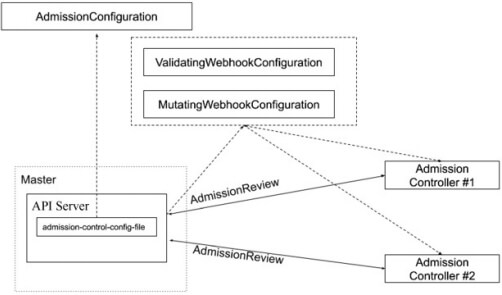
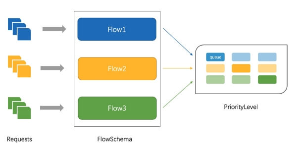

# apiserver

## 准入

### 准入控制

为资源增加自定义属性

* 作为多租户集群方案中的一环，我们需要在namespace的准入控制中，获取用户信息，并将用户信息更新的namespace的annotation

只有当namespace中有有效用户信息时，我们才可以在namespace创建时，自动绑定用户权限，

namespace才可用。


准入控制（Admission Control）在授权后对请求做进一步的验证或添加默认参数。不同于授权

和认证只关心请求的用户和操作，准入控制还处理请求的内容，并且仅对创建、更新、删除或连

接（如代理）等有效，而对读操作无效。

准入控制支持同时开启多个插件，它们依次调用，只有全部插件都通过的请求才可以放过进入系统


#### 准入控制插件

AlwaysAdmit: 接受所有请求。

AlwaysPullImages: 总是拉取最新镜像。在多租户场景下非常有用。

DenyEscalatingExec: 禁止特权容器的exec和attach操作。

ImagePolicyWebhook: 通过webhook决定image策略，需要同时配置--admission-control

config-file

ServiceAccount：自动创建默认ServiceAccount，并确保Pod引用的ServiceAccount已经存在

SecurityContextDeny：拒绝包含非法SecurityContext配置的容器

ResourceQuota：限制Pod的请求不会超过配额，需要在namespace中创建一个

ResourceQuota对象

LimitRanger：为Pod设置默认资源请求和限制，需要在namespace中创建一个LimitRange对 

象

InitialResources：根据镜像的历史使用记录，为容器设置默认资源请求和限制

NamespaceLifecycle：确保处于termination状态的namespace不再接收新的对象创建请求，

并拒绝请求不存在的namespace

DefaultStorageClass：为PVC设置默认StorageClass

DefaultTolerationSeconds：设置Pod的默认forgiveness toleration为5分钟

PodSecurityPolicy：使用Pod Security Policies时必须开启

NodeRestriction：限制kubelet仅可访问node、endpoint、pod、service以及secret、

configmap、PV和PVC等相关的资源


#### 准入控制插件的开发

除默认的准入控制插件以外，Kubernetes预留了准入控制插件的扩展点，用户可自定义准入控制插件实现自定义准入功能。

使用以下两个对象进行配置：

* MutatingWebhookConfiguration：变形插件，支持对准入对象的修改
* ValidatingWebhookConfiguration：校验插件，只能对准入对象合法性进行校验，不能修改

具体流程如下：

apiserver 读取对应 WebhookConfiguration 对象，知道当前配置了哪些 webhook，然后在请求过来时调用对应 webhook 实现扩展功能。




### 配额管理

配额管理

* 原因：资源有限，如何限定某个用户有多少资源？

方案：

* 预定义每个Namespace的ResourceQuota，并把spec保存为configmap

  * 用户可以创建多少个Pod

    * BestEffortPod
    * QoSPod
  * 用户可以创建多少个service
  * 用户可以创建多少个ingress
  * 用户可以创建多少个service VIP
  
* 创建ResourceQuota Controller
  * 监控namespace创建事件，当namespace创建时，在该namespace创建对应的ResourceQuota 对象
  
* apiserver中开启ResourceQuota的admission plugin


## 限流

### 常见算法

#### 计数器固定窗口算法

原理就是对一段固定时间窗口内的请求进行计数，如果请求数超过了阈值，则舍弃该请求；如果没有达到设定的阈值，则接受该请求，且计数加1。当时间窗口结束时，重置计数器为0。

#### 计数器滑动窗口算法

在固定窗口的基础上，将一个计时窗口分成了若干个小窗口，然后每个小窗口维护一个独立的计数器。

当请求的时间大于当前窗口的最大时间时，则将计时窗口向前平移一个小窗口。

平移时，将第一个小窗口的数据丢弃，然后将第二个小窗口设置为第一个小窗口，同时在最后面新增一个小窗口，将新的请求放在新增的小窗口中。

同时要保证整个窗口中所有小窗口的请求数目之后不能超过设定的阈值。

#### 漏斗算法

漏斗算法的原理也很容易理解。请求来了之后会首先进到漏斗里，然后漏斗以恒定的速率将请求流出进行处理，从而起到平滑流量的作用。

当请求的流量过大时，漏斗达到最大容量时会溢出，此时请求被丢弃。

在系统看来，请求永远是以平滑的传输速率过来，从而起到了保护系统的作用。


#### 令牌桶算法

令牌桶算法是对漏斗算法的一种改进，除了能够起到限流的作用外，还允许一定程度的流量突发。

在令牌桶算法中，存在一个令牌桶，算法中存在一种机制以恒定的速率向令牌桶中放入令牌。

令牌桶也有一定的容量，如果满了令牌就无法放进去了。

当请求来时，会首先到令牌桶中去拿令牌，如果拿到了令牌，则该请求会被处理，并消耗掉拿到的令牌；

如果令牌桶为空，则该请求会被丢弃。

#### 自适应限流

根据系统 CPU、Memory 占用、系统负载等数据进行限流。


### APIServer中的限流

相关参数：

* max-requests-inflight： 在给定时间内的最大 non-mutating 请求数

* max-mutating-requests-inflight： 在给定时间内的最大 mutating 请求数，调整 apiserver 的流控 qos

代码：staging/src/k8s.io/apiserver/pkg/server/filters/maxinflight.go:WithMaxInFlightLimit()


|                                | 默认值 | 节点数1000~3000 | 节点数>3000 |
| ------------------------------ | ------ | --------------- | ----------- |
| max-requests-inflight          | 400    | 1500            | 3000        |
| max-mutating-requests-inflight | 200    | 500             | 1000        |


### 传统限流方法的局限性

粒度粗

* 无法为不同用户，不同场景设置不通的限流

单队列

* 共享限流窗口/桶，一个坏用户可能会将整个系统堵塞，其他正常用户的请求无法被及时处理 

不公平

* 正常用户的请求会被排到队尾，无法及时处理而饿死

无优先级

* 重要的系统指令一并被限流，系统故障难以恢复


### API Priority and Fairness

> apiserver 中使用的一个限流方式，看起来比较科学。

* APF 以更细粒度的方式对请求进行分类和隔离。

* 它还引入了空间有限的排队机制，因此在非常短暂的突发情况下，API 服务器不会拒绝任何请求。

* 通过使用公平排队技术从队列中分发请求，这样， 一个行为不佳的控制器就不会饿死其他控制器（即使优先级相同）。

* APF的核心
  * 多等级
  * 多队列


具体流程如下：




* APF 的实现依赖两个非常重要的资源 FlowSchema, PriorityLevelConfiguration
* APF 对请求进行更细粒度的分类，每一个请求分类对应一个 FlowSchema (FS)
* FS 内的请求又会根据 distinguisher 进一步划分为不同的 Flow.
* FS 会设置一个优先级 (Priority Level, PL)，不同优先级的并发资源是隔离的。所以不同优先级的资源不会相互排挤。特定优先级的请求可以被高优处理。
* 一个 PL 可以对应多个 FS，PL 中维护了一个 QueueSet，用于缓存不能及时处理的请求，请求不会因为超出 PL 的并发限制而被丢弃。
* FS 中的每个 Flow 通过 shuffle sharding 算法从 QueueSet 选取特定的 queues 缓存请求。
* 每次从 QueueSet 中取请求执行时，会先应用 fair queuing 算法从 QueueSet 中选中一个 queue，然后从这个 queue 中取出 oldest 请求执行。所以即使是同一个 PL 内的请求，也不会出现一个 Flow 内的请求一直占用资源的不公平现象。


#### 概念

* 传入的请求通过 *FlowSchema* 按照其属性分类，并分配优先级。
* 每个优先级维护自定义的并发限制，加强了隔离度，这样不同优先级的请求，就不会相互饿死。
* 在同一个优先级内，公平排队算法可以防止来自不同 *flow* 的请求相互饿死。
* 该算法将请求排队，通过排队机制，防止在平均负载较低时，通信量突增而导致请求失败。


#### 优先级

* 如果未启用 APF，API 服务器中的整体并发量将受到 kube-apiserver 的参数 --max-requests-inflight 和 --max-mutating-requests-inflight 的限制。

* 启用 APF 后，将对这些参数定义的并发限制进行求和，然后将总和分配到一组可配置的 *优先**级* 中。 每个传入的请求都会分配一个优先级；

* 每个优先级都有各自的配置，设定允许分发的并发请求数。

* 例如，默认配置包括针对领导者选举请求、内置控制器请求和 Pod 请求都单独设置优先级。这表示即使异常的 Pod 向 API 服务器发送大量请求，也无法阻止领导者选举或内置控制器的操作执行成功。


#### 排队

* 即使在同一优先级内，也可能存在大量不同的流量源。
* 在过载情况下，防止一个请求流饿死其他流是非常有价值的 （尤其是在一个较为常见的场景中，一个有故障的客户端会疯狂地向 kube-apiserver 发送请求， 理想情况下，这个有故障的客户端不应对其他客户端产生太大的影响）。

* 公平排队算法在处理具有相同优先级的请求时，实现了上述场景。

* 每个请求都被分配到某个 流 中，该流由对应的 FlowSchema 的名字加上一个 流区分项（Flow Distinguisher） 来标识。

* 这里的流区分项可以是发出请求的用户、目标资源的名称空间或什么都不是。

* 系统尝试为不同流中具有相同优先级的请求赋予近似相等的权重。

* 将请求划分到流中之后，APF 功能将请求分配到队列中。

* 分配时使用一种称为 混洗分片（Shuffle-Sharding） 的技术。 该技术可以相对有效地利用队列隔离低强度流与高强度流。

* 排队算法的细节可针对每个优先等级进行调整，并允许管理员在内存占用、 公平性（当总流量超标时，各个独立的流将都会取得进展）、 突发流量的容忍度以及排队引发的额外延迟之间进行权衡。


#### 豁免请求

某些特别重要的请求不受制于此特性施加的任何限制。这些豁免可防止不当的流控配置完全禁用 API 服务器。


#### 默认配置

system

* 用于 system:nodes 组（即 kubelets）的请求； kubelet 必须能连上 API 服务器，以便工作负载能够调度到其上。

leader-election

* 用于内置控制器的领导选举的请求 （特别是来自 kube-system 名称空间中 system:kube- controller-manager 和 system:kube-scheduler 用户和服务账号，针对 endpoints、 configmaps 或 leases 的请求）。

* 将这些请求与其他流量相隔离非常重要，因为领导者选举失败会导致控制器发生故障并重新启动，这反过来会导致新启动的控制器在同步信息时，流量开销更大。

workload-high

* 优先级用于内置控制器的请求。

workload-low

* 优先级适用于来自任何服务帐户的请求，通常包括来自 Pods 中运行的控制器的所有请求。

global-default

* 优先级可处理所有其他流量，例如：非特权用户运行的交互式 kubectl 命令。

exempt

* 优先级的请求完全不受流控限制：它们总是立刻被分发。 特殊的 exempt FlowSchema 把 system:masters 组的所有请求都归入该优先级组。

catch-all

* 优先级与特殊的 catch-all FlowSchema 结合使用，以确保每个请求都分类。

* 一般不应该依赖于 catch-all 的配置，而应适当地创建自己的 catch-all FlowSchema 和PriorityLevelConfigurations（或使用默认安装的 global-default 配置）。

* 为了帮助捕获部分请求未分类的配置错误，强制要求 catch-all 优先级仅允许5个并发份额，并且不对请求进行排队，使得仅与 catch-all FlowSchema 匹配的流量被拒绝的可能性更高，并显示 HTTP 429 错误。


#### PriorityLevelConfiguration

一个 PriorityLevelConfiguration 表示单个隔离类型。每个 PriorityLevelConfigurations 对未完成的请求数有各自的限制，对排队中的请求数也有限制。


```yaml
apiVersion: flowcontrol.apiserver.k8s.io/v1beta1
kind: PriorityLevelConfiguration
metadata:
  name: global-default
spec:
  limited:
    # 允许的并发请求数 
    assuredConcurrencyShares: 20
    limitResponse:
      queuing:
        # shuffle sharding 的配置，每个flowschema+distinguisher的请求会被enqueue到多少个对列
        handSize: 6
        # 每个队列中的对象数量
        queueLengthLimit: 50
        # 当前PriorityLevel的队列总数
        queues: 128
        type: Queue
  type: Limited
```


#### FlowSchema

FlowSchema 匹配一些入站请求，并将它们分配给优先级。

每个入站请求都会对所有 FlowSchema 测试是否匹配， 首先从 matchingPrecedence 数值最低的匹配开始

（我们认为这是逻辑上匹配度最高）， 然后依次进行，直到首个匹配出现

> 使用 FlowSchema名 + Distinguisher 唯一确定一个 flow

```yaml
apiVersion: flowcontrol.apiserver.k8s.io/v1beta1
kind: FlowSchema
metadata:
  # FlowSchema名
  name: kube-scheduler
spec:
  distinguisherMethod:
    # Distinguisher
    type: ByNamespace
  # 规则优先级
  matchingPrecedence: 800
  # 对应的队列优先级
  priorityLevelConfiguration:
    name: workload-high
  rules: 
  - resourceRules: 
  # 对应的资源和请求类型
    - resources: 
      - '*'
      verbs: 
      - '*'
    subjects: 
    - kind: User
      user:
        name: system:kube-scheduler
```


#### 调试

/debug/api_priority_and_fairness/dump_priority_levels —— 所有优先级及其当前状态的列表

```bash
kubectl get --raw /debug/api_priority_and_fairness/dump_priority_levels
```

/debug/api_priority_and_fairness/dump_queues —— 所有队列及其当前状态的列表

```bash
kubectl get --raw /debug/api_priority_and_fairness/dump_queues
```

/debug/api_priority_and_fairness/dump_requests ——当前正在队列中等待的所有请求的列表

```bash
kubectl get --raw /debug/api_priority_and_fairness/dump_requests
```


#### 小结

大致流程为：

* 1）使用 FlowSchema 对请求归类，把每一类请求看作是一个 flow

```yaml
apiVersion: flowcontrol.apiserver.k8s.io/v1beta1
kind: FlowSchema
metadata:
  # FlowSchema名
  name: kube-scheduler
spec:
  distinguisherMethod:
    # Distinguisher
    type: ByNamespace
  # 规则优先级
  matchingPrecedence: 800
  # 对应的队列优先级
  priorityLevelConfiguration:
    name: workload-high
  rules: 
  - resourceRules: 
  # 对应的资源和请求类型
    - resources: 
      - '*'
      verbs: 
      - '*'
    subjects: 
    - kind: User
      user:
        name: system:kube-scheduler
```

和 rbac 有点像，其中的 metadata.name + distinguisherMethod.type 合起来就是一个 flow

然后那些请求算是这个 flow 里的呢，就需要看 rules 了，上例中就是 system:kube-scheduler 这个 serviceaccount 发起的所有请求。


* 2）然后使用 PriorityLevelConfiguration 对每一个 flow 设置优先级、以及队列大小等参数。

上例中的 flowschema 中有一个 priorityLevelConfiguration.name 字段，指定了 这个 flow 对应的是那个优先级配置，上例中是 workload-high。

然后看下具体的 priorityLevelConfiguration：

```yaml
apiVersion: flowcontrol.apiserver.k8s.io/v1beta1
kind: PriorityLevelConfiguration
metadata:
  name: global-default
spec:
  limited:
    # 允许的并发请求数 
    assuredConcurrencyShares: 20
    limitResponse:
      queuing:
        # shuffle sharding 的配置，每个flowschema+distinguisher的请求会被enqueue到多少个对列
        handSize: 6
        # 每个队列中的对象数量
        queueLengthLimit: 50
        # 当前PriorityLevel的队列总数
        queues: 128
        type: Queue
  type: Limited
```

包括并发数、队列大小等配置。

这样每个请求过来就会根据 flowschema 被分配到对应的 flow，然后进入到对应的 queue 里。


## 高可用APIServer


#### 启动参数示例

```bash
kube-apiserver --feature-gates=AllAlpha=true --runtime-config=api/all=true \
--requestheader-allowed-names=front-proxy-client \
--client-ca-file=/etc/kubernetes/pki/ca.crt \
--allow-privileged=true \
--experimental-bootstrap-token-auth=true \
--storage-backend=etcd3 \
--requestheader-username-headers=X-Remote-User \
--requestheader-extra-headers-prefix=X-Remote-Extra- \
--service-account-key-file=/etc/kubernetes/pki/sa.pub \
--tls-cert-file=/etc/kubernetes/pki/apiserver.crt \
--tls-private-key-file=/etc/kubernetes/pki/apiserver.key \
--kubelet-client-certificate=/etc/kubernetes/pki/apiserver-kubelet-client.crt \
--requestheader-client-ca-file=/etc/kubernetes/pki/front-proxy-ca.crt \
--enabled-hooks=NamespaceLifecycle,LimitRanger,ServiceAccount,PersistentVolumeLabel,DefaultStorageClass,ResourceQuota \
--requestheader-group-headers=X-Remote-Group \
--kubelet-client-key=/etc/kubernetes/pki/apiserver-kubelet-client.key \
--secure-port=6443 \
--kubelet-preferred-address-types=InternalIP,ExternalIP,Hostname \
--service-cluster-ip-range=10.96.0.0/12 \
--advertise-address=192.168.0.20 --etcd-servers=http://127.0.0.1:2379
```


#### 构建高可用的多副本apiserver

apiserver是无状态的 Rest Server,无状态所以方便Scale Up／down。

负载均衡

* 在多个apiserver实例之上，配置负载均衡
* 证书可能需要加上Loadbalancer VIP重新生成


#### 预留充足的CPU、内存资源

随着集群中节点数量不断增多，APIServer对CPU和内存的开销也不断增大。过少的CPU资源会降低其处理效率，过少的内存资源会导致Pod被OOMKilled，直接导致服务不可用。在规划 APIServer资源时，不能仅看当下需求，也要为未来预留充分。


#### 善用速率限制（RateLimit）

APIServer的参数“--max-requests-inflight”和“--max-mutating-requests-inflight”支持在给定时间内限制并行处理读请求（包括Get、List和Watch操作）和写请求（包括Create、Delete、Update和Patch操作）的最大数量。

当 APIServer 接收到的请求超过这两个参数设定的值时，再接收到的请求将会被直接拒绝。通过速率限制机制，可以有效地控制 APIServer 内存的使用。

* 如果该值配置过低，会经常出现请求超过限制的错误，
* 如果配置过高，则APIServer可能会因为占用过多内存而被强制终止，
* 因此需要根据实际的运行环境，结合实时用户请求数量和 APIServer的资源配置进行调优。


客户端在接收到拒绝请求的返回值后，应等待一段时间再发起重试，无间隔的重试会加重 APIServer 的压力，导致性能进一步降低。

针对并行处理请求数的过滤颗粒度太大，在请求数量比较多的场景，重要的消息可能会被拒绝掉，**自1.18版本开始，社区引入了优先级和公平保证（Priority and Fairness）功能**，以提供更细粒度地客户端请求控制。该功能支持将不同用户或不同类型的请求进行优先级归类，保证高优先级的请求总是能够更快得到处理，从而不受低优先级请求的影响。


#### 设置合适的缓存大小

APIServer 与 etcd 之间基于 gRPC 协议进行通信，gRPC 协议保证了二者在大规模集群中的数据高速传输。gRPC基于连接复用的 HTTP/2 协议，即针对相同分组的对象，APIServer 和 etcd 之间共享相同的 TCP 连接，不同请求由不同的 stream 传输。


一个 HTTP/2 连接有其 stream 配额 ，配额的大小限制了能支持的并发请求。APIServer 提供了集群对象的缓存机制，当客户端发起查询请求时，APIServer 默认会将其缓存直接返回给客户端。缓存区大小可以通过参数**--watch-cache-sizes**设置。针对访问请求比较多的对象，适当设置缓存的大小，极大降低对etcd的访问频率，节省了网络调用，降低了对etcd集群的读写压力，从而提高对象访问的性能。

**但是 APIServer 也是允许客户端忽略缓存的**，例如客户端请求中 ListOption 中没有设置 resourceVersion，这时APIServer 直接从 etcd 拉取最新数据返回给客户端。客户端应尽量避免此操作，应在 ListOption中 设置resourceVersion 为 0，APIServer 则将从缓存里面读取数据，而不会直接访问etcd。


#### 客户端尽量使用长连接

当查询请求的返回数据较大且此类请求并发量较大时，容易引发 TCP 链路的阻塞，导致其他查询操作超时。

因此基于 Kubernetes 开发组件时，例如某些 DaemonSet 和 Controller，如果要查询某类对象，**应尽量通过长连接 ListWatch 监听对象变更，避免全量从 APIServer 获取资源**。如果在同一应用程序中，如果有多个 Informer监听 APIServer 资源变化，可以将这些 Informer 合并，减少和 APIServer 的长连接数，从而降低对 APIServer 的压力。


#### 如何访问APIServer

对外部客户（user/client/admin)，永远只通过 LoadBalancer 访问，只有当负载均衡出现故障时，管理员才切换到apiserver IP进行管理

内部客户端，优先访问cluster IP？（是否一定如此？）


推荐：所有 k8s 组件使用一个入口访问 apiserver，防止出现一个入口好一个入口坏，导致不同组件看到集群状态不一致的情况。


### 搭建多租户的Kubernetes集群

授信

* 认证：禁止匿名访问，只允许可信用户做操作。
* 授权：基于授信的操作，防止多用户之间互相影响，比如普通用户删除Kubernetes核心服务，或者A用户删除或修改B用户 的应用。

隔离

* 可见行隔离： 用户只关心自己的应用，无需看到其他用户的服务和部署。

* 资源隔离：有些关键项目对资源需求较高，需要专有设备，不与其他人共享。

* 应用访问隔离：用户创建的服务，按既定规则允许其他用户访问。

资源管理

* Quota管理：谁能用多少资源？


#### 认证


与企业现有认证系统集成

* 很多企业基于Microsoft Active Directory 提供认证服务

选择认证插件

* 选择webhook作为认证插件（*以此为例展开）
* 也可以选择Keystone作为认证插件，以Microsoft Ad作为backend搭建keystone服务一旦认证完成，Kubernetes即可获取当前用户信息（主要是用户名），并针对该用户做授权。授权和准入控制完成后，该用户的请求完成。


## apimachinery

### 回顾GKV

Group

Kind

Version

* Internel version 和External version
* 版本转换


### 如何定义Group

相关代码：pkg/apis/core/register.go

```go

// 定义group
GroupName

// 定义groupversion
var SchemeGroupVersion = schema.GroupVersion{Group: GroupName, Version: 
runtime.APIVersionInternal}

// 定义SchemeBuilder
var (
    SchemeBuilder = runtime.NewSchemeBuilder(addKnownTypes)
    AddToScheme = SchemeBuilder.AddToScheme
)

// 将对象加入SchemeBuild
func addKnownTypes(scheme *runtime.Scheme) error {
    if err := scheme.AddIgnoredConversionType(&metav1.TypeMeta{}, &metav1.TypeMeta{}); err != nil {
    return err
    }
    scheme.AddKnownTypes(SchemeGroupVersion,
    &Pod{},
    &PodList{},
}}
```


### 定义对象类型 types.go


对于 单一对象数据结构，一般包括以下 4 个部分：

* TypeMeta
* ObjectMeta
* Spec
* Status

同时必须定义一个 list 类型的结构来存放对象列表，比如 pod 和 podList。


### 代码生成Tags

为了减少重复工作，k8s 中定义好类型后，一般会自动生成相关方法，为了控制生成器的行为，可以在对应文件中添加 tag 来实现。

Global Tags

* 定义在doc.go中 
  * // +k8s:deepcopy-gen=package：表示需要为整个 package 中的所有对象都生成 deepcopy 方法

Local Tags

* 定义在types.go中的每个对象里
  * // +k8s:deepcopy-gen:interfaces=k8s.io/apimachinery/pkg/runtime.Object
  * // +genclient
  * // +genclient:nonNamespaced
  * // +genclient:noVerbs
  * // +genclient:onlyVerbs=create,delete
  * // +genclient:skipVerbs=get,list,create,update,patch,delete,deleteCollection,watch
  * // +genclient:method=Create,verb=create,result=k8s.io/apimachinery/pkg/apis/meta/v1.Status


### 实现etcd storage

相关代码：pkg/registry/core/configmap/storage/storage.go


```go
func NewREST(optsGetter generic.RESTOptionsGetter) *REST {
    store := &genericregistry.Store{
        NewFunc: func() runtime.Object { return &api.ConfigMap{} },
        NewListFunc: func() runtime.Object { return &api.ConfigMapList{} },
        DefaultQualifiedResource: api.Resource("configmaps"),
        CreateStrategy: configmap.Strategy,
        UpdateStrategy: configmap.Strategy,
        DeleteStrategy: configmap.Strategy,
        TableConvertor: printerstorage.TableConvertor{TableGenerator: printers.NewTableGenerator().With(printersinternal.AddHandlers)},
    }
    options := &generic.StoreOptions{RESTOptions: optsGetter}
    if err := store.CompleteWithOptions(options); err != nil {
   	 panic(err) // TODO: Propagate error up
    }
    return &REST{store}
}
```


### 创建和更新对象时的业务逻辑-Strategy

创建或者更新对象前进行一些自定义校验。

比如校验字段格式是否正确。

```go
func (strategy) PrepareForCreate(ctx context.Context, obj runtime.Object) {
_ = obj.(*api.ConfigMap) }

func (strategy) Validate(ctx context.Context, obj runtime.Object) field.ErrorList {
cfg := obj.(*api.ConfigMap)
return validation.ValidateConfigMap(cfg) }

func (strategy) PrepareForUpdate(ctx context.Context, newObj, oldObj runtime.Object) {
_ = oldObj.(*api.ConfigMap) _ = newObj.(*api.ConfigMap) }
```


### subresource

什么是subresource，内嵌在kubernetes对象中，有独立的操作逻辑的属性集合，如podstatus。

demo 如下：

```go
statusStore.UpdateStrategy = pod.StatusStrategy
var StatusStrategy = podStatusStrategy{Strategy}

func (podStatusStrategy) PrepareForUpdate(ctx context.Context, obj, old runtime.Object) {
    newPod := obj.(*api.Pod)
    oldPod := old.(*api.Pod)
    newPod.Spec = oldPod.Spec
    newPod.DeletionTimestamp = nil
    // don't allow the pods/status endpoint to touch owner references since old kubelets corrupt them in a way
    // that breaks garbage collection
    newPod.OwnerReferences = oldPod.OwnerReferences
}
```

上述代码中可以看到，在更新 pod 时只把旧的 spec 带上了，旧的 status 被丢弃了。

**为什么要这么设计？**

因为 pod 的 status 更新非常频繁，如果不拆分出来单独更新，就会导致一个问题：在更新 pod.Spec 时由于 status 冲突导致更新失败。

而把 spec 和 status 拆分出来单独更新后就很大程度上**避免了这种冲突**。

同时还有一个比较重要的原因是：**subresource 可有单独给权限**。

> 比如可以给 pod.status 访问权限就不直接给完整的 pod 访问权限。


### 注册APIGroup

```go
// 定义Storage
configMapStorage := configmapstore.NewREST(restOptionsGetter)
restStorageMap := map[string]rest.Storage{ "configMaps": configMapStorage, }


// 定义对象的StorageMap
apiGroupInfo.VersionedResourcesStorageMap["v1"] = restStorageMap

// 将对象注册至APIServer（挂载handler）
if err := 
m.GenericAPIServer.InstallLegacyAPIGroup(genericapiserver.DefaultLegacyAPIPrefix, 
&apiGroupInfo); err != nil {
  klog.Fatalf("Error in registering group versions: %v", err)
}
```


### 代码生成

deepcopy-gen

* 为对象生成DeepCopy方法，用于创建对象副本、

client-gen

* 创建Clientset，用于操作对象的CRUD

informer-gen

* 为对象创建Informer框架，用于监听对象变化

lister-gen

* 为对象构建Lister框架，用于为Get和List操作，构建客户端缓存

coversion-gen

* 为对象构建Conversion方法，用于内外版本转换以及不同版本号的转换


### hack/update-codegen.sh

依赖

```shell
BUILD_TARGETS=(
vendor/k8s.io/code-generator/cmd/client-gen
vendor/k8s.io/code-generator/cmd/lister-gen
vendor/k8s.io/code-generator/cmd/informer-gen
)
```


生成命令

```bash
${GOPATH}/bin/deepcopy-gen --input-dirs {versioned-package-pach} 
-O zz_generated.deepcopy \
--bounding-dirs {output-package-path} \
--go-header-file ${SCRIPT_ROOT}/hack/boilerplate.go.txt
```


### APIServer代码走读

https://cncamp.notion.site/kube-apiserver-10d5695cbbb14387b60c6d622005583d

```go
cmd/kube-apiserver/app/server.go:NewAPIServerCommand()-->
completedOptions, err := Complete(s)-->
	s.Etcd.WatchCacheSizes, err = serveroptions.WriteWatchCacheSizes(sizes)
Run(completedOptions, genericapiserver.SetupSignalHandler())-->CreateServerChain()-->
	CreateServerChain()-->
		CreateKubeAPIServerConfig-->
			buildGenericConfig(s.ServerRunOptions, proxyTransport)-->
				genericapiserver.NewConfig(legacyscheme.Codecs) // create codec factory for encoding/decoding
				controlplane.DefaultAPIResourceConfigSource() // group version: enabled/disabled
				storageFactoryConfig.Complete(s.Etcd)
				completedStorageFactoryConfig.New()--> // register access path in etcd for all k8s objects
					storageFactory.AddCohabitatingResources(networking.Resource("networkpolicies"), extensions.Resource("networkpolicies"))
				s.Etcd.ApplyWithStorageFactoryTo(storageFactory, genericConfig)-->
					c.AddHealthChecks()
					c.RESTOptionsGetter = &StorageFactoryRestOptionsFactory{Options: *s, StorageFactory: factory}
// 认证
				s.Authentication.ApplyTo()--> // clientcert, serviceaccount, bootstrap token, 
					authenticatorConfig.New()-->
						newWebhookTokenAuthenticator(config) // webhook
// 鉴权
				BuildAuthorizer(s, genericConfig.EgressSelector, versionedInformers)-->
					authorizationConfig.New()-->
						rbacAuthorizer := rbac.New()--> // if authorizer type is rbac
// 准入
				buildServiceResolver(s.EnableAggregatorRouting, genericConfig.LoopbackClientConfig.Host, versionedInformers)
				admissionConfig.New(proxyTransport, genericConfig.EgressSelector, serviceResolver)-->
					admission.PluginInitializer{webhookPluginInitializer, kubePluginInitializer}

			net.SplitHostPort(s.Etcd.StorageConfig.Transport.ServerList[0])
			utilwait.PollImmediate(etcdRetryInterval, etcdRetryLimit*etcdRetryInterval, preflight.EtcdConnection{ServerList: s.Etcd.StorageConfig.Transport.ServerList}.CheckEtcdServers)
			capabilities.Initialize() // allow privillage?
			config := &controlplane.Config{}
		createAPIExtensionsConfig()
		createAPIExtensionsServer()-->
			apiextensionsConfig.Complete().New(delegateAPIServer)-->
				s.AddHealthChecks(delegateCheck)
// 注册通用handler
				installAPI(s, c.Config) // register generic api handler e.g. index, profiling, metrics, flow control
		CreateKubeAPIServer(kubeAPIServerConfig, apiExtensionsServer.GenericAPIServer)
			kubeAPIServerConfig.Complete().New(delegateAPIServer)
				m.InstallLegacyAPI(&c, c.GenericConfig.RESTOptionsGetter, legacyRESTStorageProvider)-->
					m.GenericAPIServer.AddPostStartHookOrDie(controllerName, bootstrapController.PostStartHook)-->
						controlplane.controller.Start()-->
							async.NewRunner(c.RunKubernetesNamespaces, c.RunKubernetesService, repairClusterIPs.RunUntil, repairNodePorts.RunUntil)
					m.GenericAPIServer.AddPreShutdownHookOrDie(controllerName, bootstrapController.PreShutdownHook)
// 注册core group API handler
					m.GenericAPIServer.InstallLegacyAPIGroup() // register handler for /api
					restStorageProviders := []RESTStorageProvider{appsrest.StorageProvider{}}
				m.InstallAPIs(c.ExtraConfig.APIResourceConfigSource, c.GenericConfig.RESTOptionsGetter, restStorageProviders...)-->
// 初始化对应group中对象的watch cache
					restStorageBuilder.NewRESTStorage(apiResourceConfigSource, restOptionsGetter)--> // trigger appsrest.StorageProvider
						p.v1Storage(apiResourceConfigSource, restOptionsGetter)-->
							daemonsetstore.NewREST(restOptionsGetter)-->
								store.CompleteWithOptions(options)-->
									opts, err := options.RESTOptions.GetRESTOptions(e.DefaultQualifiedResource)--> // etcd.go
										ret.Decorator = genericregistry.StorageWithCacher()-->
											cacherstorage.NewCacherFromConfig(cacherConfig)-->
												watchCache := newWatchCache()-->
// 注册API handler
					m.GenericAPIServer.InstallAPIGroups(apiGroupsInfo...)-->  // register handler for /apis
						s.installAPIResources(APIGroupPrefix, apiGroupInfo, openAPIModels)-->
							apiGroupVersion.InstallREST(s.Handler.GoRestfulContainer)-->
								discovery.NewAPIVersionHandler(g.Serializer, g.GroupVersion, staticLister{apiResources})
		createAggregatorServer(aggregatorConfig, kubeAPIServer.GenericAPIServer, apiExtensionsServer.Informers)-->
			apiServices := apiServicesToRegister(delegateAPIServer, autoRegistrationController)
	server.PrepareRun()-->
		s.GenericAPIServer.PrepareRun()-->
			s.installHealthz()
			s.installLivez()
			s.installReadyz()
	prepared.Run(stopCh)-->
		s.runnable.Run(stopCh)--> // preparedGenericAPIServer.Run()
			s.NonBlockingRun(delayedStopCh)-->
				s.SecureServingInfo.Serve(s.Handler, s.ShutdownTimeout, internalStopCh)-->
					RunServer(secureServer, s.Listener, shutdownTimeout, stopCh)
```

