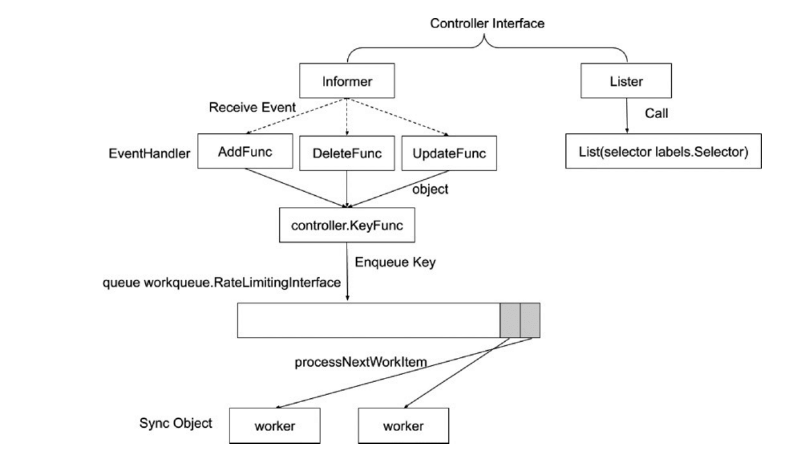
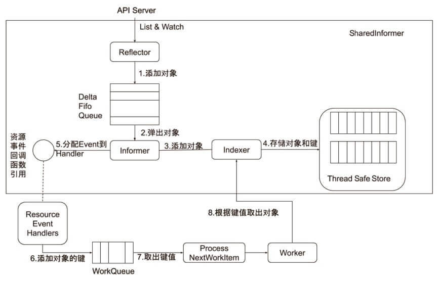
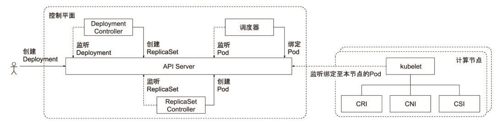
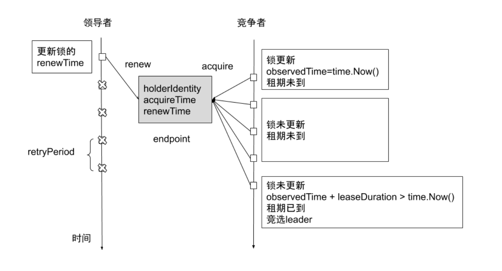

# Controller Manager


### 控制器处理流程




### informer 的内部工作机制




### 控制器的协同流程




### 通用 controller

进入到  kube-controller-manager pod 中执行 `kube-controller-manager -h` 命令来查询默认启用的 controller。

```bash
kubectl -n kube-system exec -it kube-controller-manager-cadmin -- kube-controller-manager -h
```


常见 controller 如下：

* Job Controller：处理 job
* Pod AutoScaler：处理 pod 的自动缩容/扩容。
* RelicaSet：依据 Replicaset Spec 创建 Pod。
* Service Controller：为 LoadBalancer type 的 service 创建 LB VIP。
* ServiceAccount Controller：确保 serviceaccount 在当前 namespace 存在。
* StatefulSet Controller：处理 statefulse t中的 pod。
* Volume Controller: 依据 PV spec 创建 volume。
* Resource quota Controller：在用户使用资源之后，更新状态。

* Namespace Controller：保证 namespace 删除时，该 namespace 下的所有资源都先被删除
* Replication Controller：创建 RC 后，负责创建 pod。
* Node Controller：维护 node 状态，处理 evict 请求等。
* Daemon Controller：依据 damonset 创建 pod。
* Deployment Controller：依据 deployment spec 创建 replicaset。
* Endpoint Controller：依据 service spec 创建 endpoint,依据 podip 更新 endpoint。
* Garbage Collector：处理级联删除，比如删除 deployment 的同时删除 replicaset 以及 pod。
* CronJob Controller：处理cronjob。


### cloud controller manager

**什么时候需要cloud controller manager?**

Cloud Controller Manager 自 Kubernetes1.6 开始，从 kube-controller-manager 中分离出来，主要因为 Cloud Controller Manager 往往需要跟企业 cloud 做深度集成，release cycle 跟 Kubernetes 相对独立。
与 Kubernetes 核心管理组件一起升级是一件费时费力的事。

通常 cloud controller manager 需要:

* 认证授权：企业 cloud 往往需要认证信息，Kubernetes 要与 Cloud API 通信，需要获取 cloud 系统里的 ServiceAccount;
* Cloud controller manager 本身作为一个用户态的 component, 需要在 Kubernetes 中有正确的 RBAC 设置，获得资源操作权限;
* 高可用：需要通过 leader election 来确保 cloud controller manger 高可用。


cloud controller manager 是从老版本的 APIServer 分离出来的。
Kube-APIServer 和 kube-controller-manager 中一定不能指定 cloud-provider,否则会加载内置的 cloud controller manager。

Kubelet 要配置 --cloud-provider=external。

Cloud Controller Manage r主要支持:

* Node controller：
  * 访问 cloud API,来更新 node 状态;
  * 在 cloud 删除该节点以后，从 kubernetes 删除 node;
* Service controller：负责配置为 loadbalancer 类型的服务配置LB VIP;
* Route Controller：在 cloud 环境配置路由;

可以自定义任何需要的 Cloud Controller。

需要定制的 Cloud Controller

* Ingress controller;
* Service Controller;
* 自主研发的controller ,比如之前提到的:
  * RBAC controller;
  * Account controller。


#### 来自生产的经验

保护好 controller manager 的 kubeconfig:

* 此 kubeconfig 拥有所有资源的所有操作权限，防止普通用户通过 `kubectl exec kube-controller-manager ca`t 获取该文件。
* 用户可能做任何你想象不到的操作，然后来找你 support.

Pod evict 后 IP 发生变化，但 endpoint 中的 address 更新失败:

* 分析 stacktrace 发现 endpoint 在更新 LoadBalancer 时调用 gophercloud 连接 hang 住，导致 endpoint worker 线程全部卡死。


### 确保 scheduler 和 controller 的高可用

Leader Election
Kubenetes 提供基于 configmap 和 endpoint 的 leader election类库。

> 新版本提供了更轻量级的 lease 对象。

Kubernetes 采用 leader election 模式启动 component 后，会创建对应 endpoint,并把当前的
leader 信息 annotate 到 endponit 上。

> 和基于 etcd 的分布式锁差不多，很类似。

