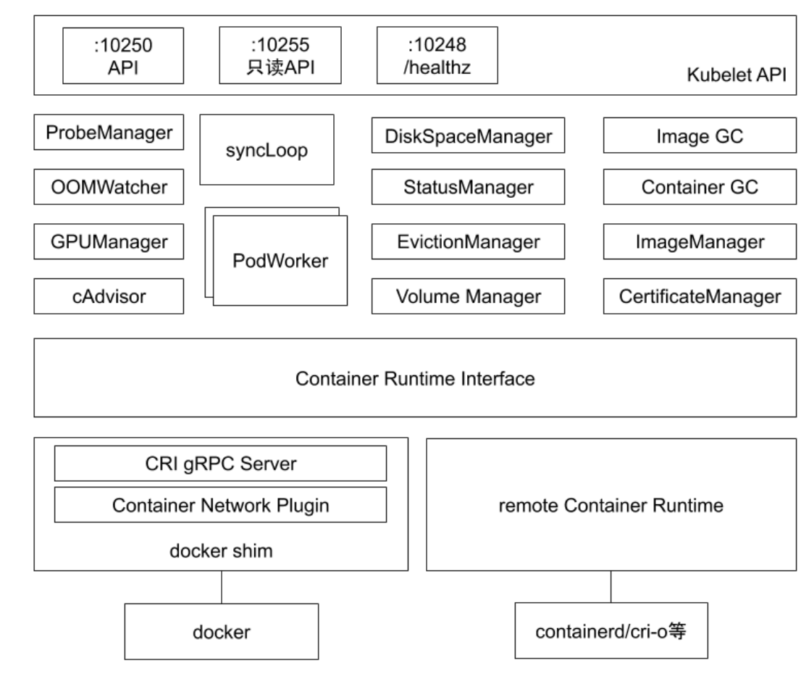
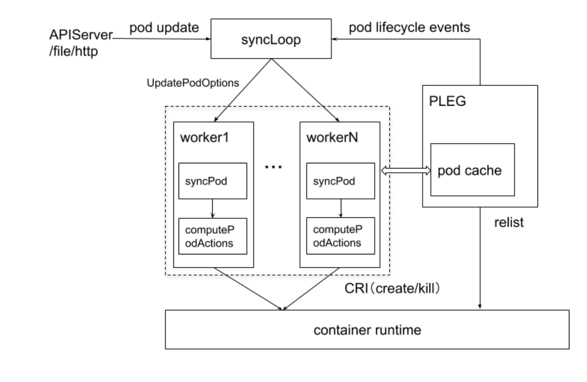
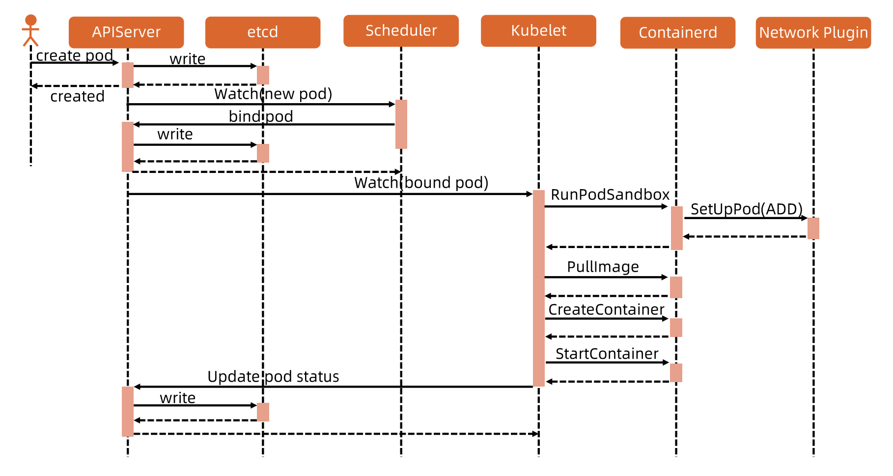
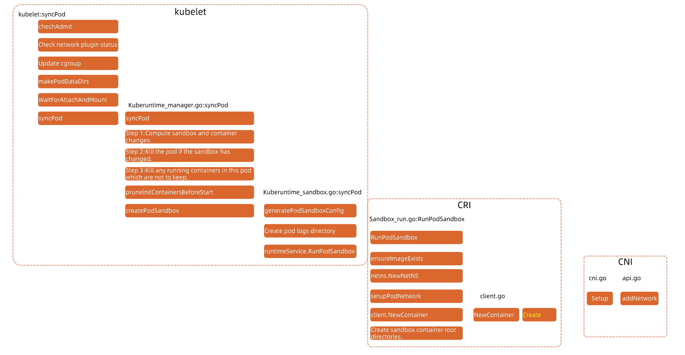

# kubelet

[Kubelet组件解析](https://blog.csdn.net/jettery/article/details/78891733)

### kubelet 架构

每个节点上都运行一一个 kubelet 服务进程，默认监听 10250 端口。

* 接收并执行 master 发来的指令;
* 管理 Pod 及 Pod 中的容器;
* 每个 kubelet 进程会在 API Server上注册节点自身信息，定期向 master 节点汇报节点的资源使用情况，并通过 cAdvisor 监控节点和容器的资源。

kubelet 架构如下图所示：

kubelet 默认会监听 4 个端口：

* **10250（kubelet API）**：**kubelet server 与 apiserver 通信的端口，定期请求 apiserver 获取自己所应当处理的任务**，通过该端口可以访问获取 node 资源以及状态。**kubectl查看pod的日志和cmd命令，都是通过kubelet端口10250访问。**
* **10248（健康检查端口)**： kubelet 是否正常工作, 通过 kubelet 的启动参数 –healthz-port 和 –healthz-bind-address 来指定监听的地址和端口。
* **4194（cAdvisor 监听）**：kublet 通过该端口可以获取到该节点的环境信息以及 node 上运行的容器状态等内容，访问 `http://localhost:4194` 可以看到 cAdvisor 的管理界面, 通过 kubelet 的启动参数 –cadvisor-port 可以指定 启动的端口。
* **10255 （readonly API）**：提供了 pod 和 node 的信息，接口以只读形式暴露出去，访问该端口不需要认证和鉴权。 获取 pod 的接口，与 apiserver 的 `http://127.0.0.1:8080/api/v1/pods?fieldSelector=spec.nodeName=xxx` 接口类似

* ProbeManager：实现 k8s 中的探针功能，在 pod 中配置了各个探针后，由 ProbeManager 来管理并执行
* OOMWatcher：系统OOM的监听器，将会与cadvisor模块之间建立SystemOOM,通过Watch方式从cadvisor那里收到的OOM信号，并记录到节点的 Event
* GPUManager：对于Node上可使用的GPU的管理，当前版本需要在kubelet启动参数中指定feature-gates中添加Accelerators=true，并且需要才用runtime=Docker的情况下才能支持使用GPU,并且当前只支持NvidiaGPU,GPUManager主要需要实现interface定义的Start()/Capacity()/AllocateGPU()三个函数
* cAdvisor：cAdvisor集成在kubelet中，起到收集本Node的节点和启动的容器的监控的信息，启动一个Http Server服务器，对外接收rest api请求．cAvisor模块对外提供了interface接口，可以通过interface接口获取到node节点信息，本地文件系统的状态等信息，该接口被imageManager，OOMWatcher，containerManager等所使用
* PLEG：PLEG全称为PodLifecycleEvent,PLEG会一直调用container runtime获取本节点的pods,之后比较本模块中之前缓存的pods信息，比较最新的pods中的容器的状态是否发生改变，当状态发生切换的时候，生成一个eventRecord事件，输出到eventChannel中．　syncPod模块会接收到eventChannel中的event事件，来触发pod同步处理过程，调用contaiener runtime来重建pod，保证pod工作正常．
* StatusManager：该模块负责pod里面的容器的状态，接受从其它模块发送过来的pod状态改变的事件，进行处理，并更新到kube-apiserver中．
* EvictionManager：当node的节点资源不足的时候，达到了配置的evict的策略，将会从node上驱赶pod，来保证node节点的稳定性．可以通过kubelet启动参数来决定evict的策略．另外当node的内存以及disk资源达到evict的策略的时候会生成对应的node状态记录
* VolumeManager：负责node节点上pod所使用的ｖolume的管理．主要涉及如下功能
  Volume状态的同步，模块中会启动gorountine去获取当前node上volume的状态信息以及期望的volume的状态信息，会去周期性的sync　volume的状态，另外volume与pod的生命周期关联，pod的创建删除过程中volume的attach/detach流程．更重要的是kubernetes支持多种存储的插件
* ImageGC：负责Node节点的镜像回收，当本地的存放镜像的本地磁盘空间达到某阈值的时候，会触发镜像的回收，删除掉不被pod所使用的镜像．回收镜像的阈值可以通过kubelet的启动参数来设置．
* ContainerGC：负责NOde节点上的dead状态的container,自动清理掉node上残留的容器．具体的GC操作由runtime来实现
* ImageManager：调用kubecontainer.ImageService提供的PullImage/GetImageRef/ListImages/RemoveImage/ImageStates的方法来保证pod运行所需要的镜像，主要是为了kubelet支持cni．

### kubelet 管理 Pod 的核心流程

来源包括 file 和 http 两种类型：

* file 主要是用于 static pod
* http 则是 apiserver 进行调用

### kubelet 节点管理

节点管理主要是节点自注册和节点状态更新:

* Kubelet 可以通过设置启动参数**--register-node**来确定是否向 API Server 注册自己;
* 如果 Kubelet 没有选择自注册模式，则需要用户自己配置 Node 资源信息，同时需要告知 Kubelet 集群上的API Server 的位置;
* Kubelet 在启动时通过 API Server 注册节点信息,并定时向 API Server 发送节点新消息，API Server 在接收到新消息后，将信息写入etcd。

### Pod 管理

获取Pod清单:

* 文件：启动参数**--config**指定的配置目录下的文件(默认/etc/ Kubernetes/manifests/)。该文件每20秒重新检查一次( 可配置)
* HTTP endpoint (URL) ：启动参数**--manifest-url**设置。每20秒检查一次这个端点(可配置）
* API Server：通过 API Server 监听 etcd 目录，同步 Pod 清单。
* HTTP server: kubelet 侦听 HTTP 请求，并响应简单的 API 以提交新的 Pod 清单。

### Pod 启动流程

更加详细的流程：

> 按组件分类，细致到方法级别。

