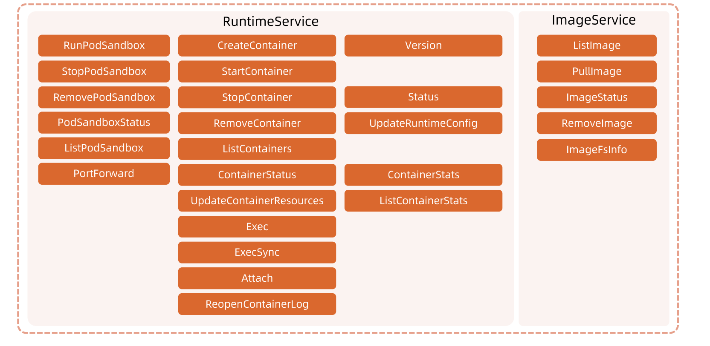
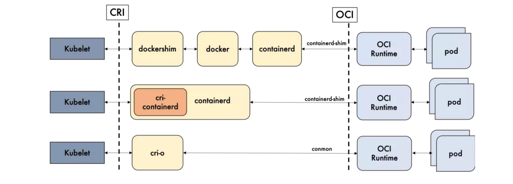

# CRI


### 容器运行时

容器运行时(Container Runtime)，运行于Kubernetes (k8s)集群的每个节点中，负责容器的整
个生命周期。其中Docker是目前应用最广的。随着容器云的发展,越来越多的容器运行时涌现。为了
解决这些容器运行时和Kubernetes的集成问题，在Kubernetes 1.5版本中，社区推出了CRI (
Container Runtime Interface,容器运行时接口)以支持更多的容器运行时。


### 什么是 CRI

**CRI 是 Kubernetes 定义的一组 gRPC 服务。**

kubelet 作为客户端，基于 gRPC 框架，通过 Socket 和容器运行时通信。它包括两类服务: 

* **镜像服务(Image Service)**：提供下载、检查和删除镜像的远程程序调用；

* **运行时服务(Runtime Service)**：包含用于管理容器生命周期，以及与容器交互的调用(exec/ attach / port-forward)的远程程序调用。


### 运行时的层级

容器运行时可以分为高层和低层的运行时：

* **高层级运行时(High-level Runtime)**：主要包括 Docker,containerd 和 CRI-O,

* **低层级运行时(Low-level Runtime)**：包含了 **runc**, kata,以及 gVisor。

低层运行时 kata 和 gVisor 都还处于小规模落地或者实验阶段，其生态成熟度和使用案例都比较欠缺，所以除非有特殊的需求，否则 runc 几乎是必然的选择。因此在对容器运行时的选择上，主要是聚焦于上层运行时的选择。


### OCI

**OCI (Open Container Initiative,开放容器计划)**定义了创建容器的格式和运行时的开源行业标准,
包括：

* **镜像规范(Image Specification)**：定义了 OCI 镜像的标准。高层级运行时将会下载一个**OCI 镜像**,并把它解压成**OCI 运行时文件系统包(filesystem bundle)**。
* **运行时规范(Runtime Specification)**：描述了如何从 OCI 运行时文件系统包运行容器程序，并且定义它的配置、运行环境和生命周期，如何为新容器设置命名空间(namepsaces)和控制组(cgroups) ，以及挂载根文件系统等等操作。


### CRI 方法列表




### 开源运行时的比较

Docker 的多层封装和调用，导致其在可维护性上略逊一筹,增加了线上问题的定位难度;几乎除了重启 Docker,我们就毫无他法了。
containerd 和 CRI-O 的方案比起 Docker 简洁很多。




#### 性能差异

containerd 在各个方面都表现良好，除了启动容器这项。从总用时来看，containerd 的用时还是要比
CRI-O 要短的。


#### 优劣对比

功能性来讲，containerd 和 CRI-O 都符合 CRI 和 OCI 的标准;
在稳定性上，containerd 略胜一筹;
从性能上讲，containerd 胜出。

|        | containerd | CRI-O | 备注            |
| ------ | ---------- | ----- | --------------- |
| 性能   | 更优       | 优    |                 |
| 功能   | 优         | 优    | CRI 与 OCI 兼容 |
| 稳定性 | 稳定       | 未知  |                 |


#### Docker & Containerd

Docker 内部关于容器运行时功能的核心组件是 containerd,后来 containerd 也可直接和 kubelet 通过 CRI 对接,独立在 Kubernetes 中使用。

相对于 Docker而言，containerd 减少了Docker 所需的处理模块 Dockerd 和 Docker-shim,并且对 Docker 支持的存储驱动进行了优化，因此在容器的创建启动停止和删除，以及对镜像的拉取上，都具有性能上的优势。架构的简化同时也带来了维护的便利。

当然 Docker 也具有很多 containerd 不具有的功能，例如支持 zfs 存储驱动，支持对日志的大小和文件限制，在以 overlayfs2 做存储驱动的情况下，可以通过 xfs_quota 来对容器的可写层进行大小限制等。尽管如此，containerd 目前也基本上能够满足容器的众多管理需求,所以将它作为运行时的也越来越多。


#### docker 和 containerd 的差异细节


可以看到 docker 中有许多 k8s 不需要的功能，k8s 需要的只是 红框中的部分，其他的都是冗余，即便去掉这部分，剩下的调用链也是非常的长。

相比之下 containerd 整个代码和调用链都远优于 docker 的。


### 如何从 Docker 切换到 Containerd

https://kubernetes.io/zh/docs/setup/production-environment/container-runtimes/#containerd

Stop service

```sh
systemctl stop kubelet
systemctl stop docker
systemctl stop containerd
```

Create containerd config folder

```sh
sudo mkdir -p /etc/containerd
containerd config default | sudo tee /etc/containerd/config.toml
```

Update default config

```sh
sed -i s#k8s.gcr.io/pause:3.5#registry.aliyuncs.com/google_containers/pause:3.5#g /etc/containerd/config.toml
sed -i s#'SystemdCgroup = false'#'SystemdCgroup = true'#g /etc/containerd/config.toml
```

Edit kubelet config and add extra args

```sh
vi /etc/systemd/system/kubelet.service.d/10-kubeadm.conf
Environment="KUBELET_EXTRA_ARGS=--container-runtime=remote --container-runtime-endpoint=unix:///run/containerd/containerd.sock --pod-infra-container-image=registry.aliyuncs.com/google_containers/pause:3.5"
```

Restart

```sh
systemctl daemon-reload
systemctl restart containerd
systemctl restart kubelet
```

Config crictl to set correct endpoint

```sh
cat <<EOF | sudo tee /etc/crictl.yaml
runtime-endpoint: unix:///run/containerd/containerd.sock
EOF
```