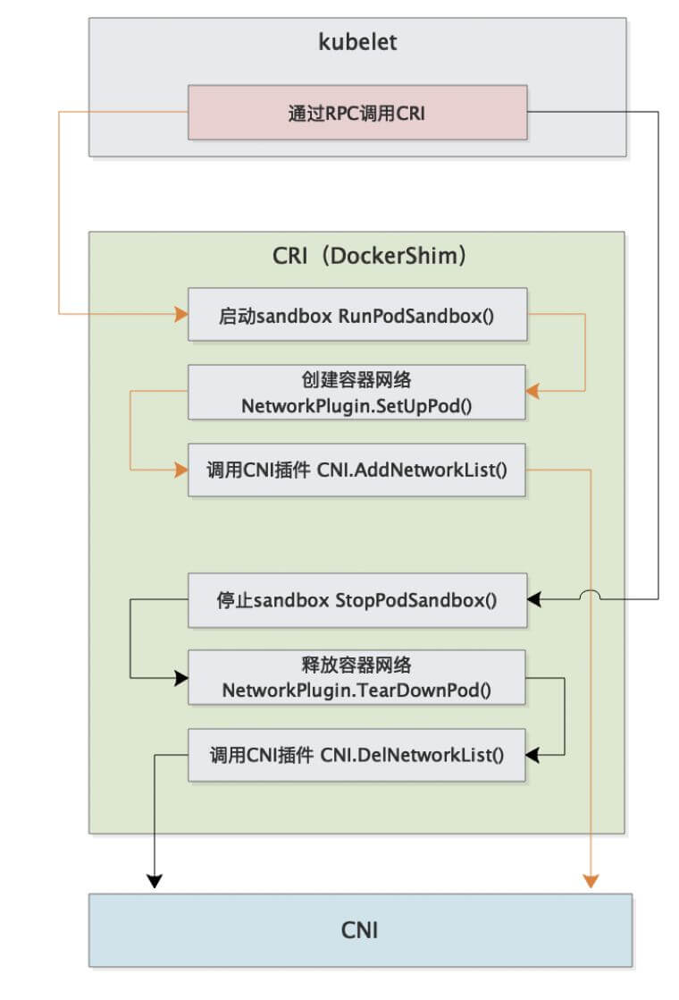

# CNI

[k8s 网络包流转分析](https://dramasamy.medium.com/life-of-a-packet-in-kubernetes-part-1-f9bc0909e051)


Kubernetes网络模型设计的基础原则是:

* 所有的Pod能够不通过NAT就能相互访问。
* 所有的节点能够不通过NAT就能相互访问。
* 容器内看见的IP地址和外部组件看到的容器IP是一样的。

Kubernetes 的集群里，IP 地址是以 Pod 为单位进行分配的，每个 Pod 都拥有一个独立的 IP 地址。一个 Pod 内部的所有容器共享一个网络栈，即宿主机上的一个网络命名空间，包括它们的 IP 地址、网络设备、配置等都是共享的。也就是说，Pod 里面的所有容器能通过 localhost:port 来连接对方。在 Kubernetes 中，提供了一个轻量的通用容器网络接口 CNI ( Container Network Interface)，专门用于设置和删除容器的网络连通性。容器运行时通过 CNI 调用网络插件来完成容器的网络设置。


### CNI 插件分类和常见插件

* IPAM： IP地址分配
* 主插件：网卡设置
  * bridge：创建一个网桥，并把主机端口和容器端口插入网桥
  * ipvlan：为容器添加ipvlan网口
  * loopback：设置loopback网口

* Meta： 附加功能
    * portmap：设置主机端口和容器端口映射
    * bandwidth：利用 Linux Traffic Control限流
    * firewall：通过 iptables 或 firewalld 为容器设置防火墙规则
    


[https://github.com/containernetworking/plugins](https://github.com/containernetworking/plugins)


### CNI 插件运行机制

容器运行时在启动时会从 CNI 的配置目录中读取 JSON 格式的配置文件，文件后缀为 .conf、 .conflist、 .json。如果配置目录中包含多个文件，一般情况下，会以名字排序选用第一个配置文件作为默认的网络配置，并加载获取其中指定的 CNI 插件名称和配置参数。

> 我们可以看到有个 .conflist 结尾的文件，是的，**k8s 的 cni 允许同时使用多个插件，并且会把上一个插件的执行结果作为参数传递给下一个插件，以此我们可以串通多个插件**，让多个插件做不同的事情。比如我可以第一个插件只负责让同一台主机上的节点通信，然后第二个插件可以负责让不同节点上的 pod 通信，总之还是那句话，配置文件有了，pod 信息也被 k8s 传过来了，爱怎么玩儿是你插件自己的事儿了~

关于容器网络管理，容器运行时一般需要配置两个参数**--cni-bin-dir**和**--cni-conf-dir**。

* cni-bin-dir：网络插件的可执行文件所在目录。默认是 /opt/cni/bin。
* cni-conf-dir：网络插件的配置文件所在目录。默认是 /etc/cni/net.d。

> 有一种特殊情况，kubelet 内置的 Docker 作为容器运行时，是由 kubelet 来查找 CNI 插件的，运行插件来为容器设置网络,这两个参数应该配置在 kubelet 处。
>
> 后续 k8s v1.24 彻底移除 docker 之后就不用考虑这种特殊情况了。


具体流程如下：


完整的调用链如下：

首先 Pod 是由 kubelet 来起的，然后 kubelet 通过 CRI 接口来起 Pod。

而起 Pod 的过程中又包含网络相关配置，这部分就要由 CRI 来调用 CNI 实现了。

因此整个调用链就是 kubelet --> CRI --> CNI。





### CNI 部署？

CNI 插件部署的时候一般会启动一个 DaemonSet，然后把 镜像里的二进制文件复制到宿主机的  /opt/cni/bin 目录下，这样就算是完成了部署。

> 因此写一个 CNI 插件实际就是提供一些包含对应功能的二进制文件给 kubelet 调用。


### CNI 插件设计考量

* 容器运行时必须在调用任何插件之前为容器创建个新的网络命名空间。
* 容器运行时必须决定这个容器属于哪些网络，针对每个网络，哪些插件必须要执行。
* 容器运行时必须加载配置文件，并确定设置网络时哪些插件必须被执行
* 网络配置采用 JSON 格式，可以很容易地存储在文件中。
* 容器运行时必须按顺序执行配置文件里相应的插件
* 在完成容器生命周期后容器运行时必须按照与执行添加容器相反的顺序执行插件，以便将容器与网络断开连接
* 容器运行时被同一容器调用时不能并行操作但被不同的容 器调用时，允许并行操作。
* 容器运行时针对一个容器必须按顺序执行 ADD 和 DEL 操作，ADD 后面总是跟着相应的 DEL。DEL 可能跟着额外的 DEL,插件应该允许处理多个 DEL。
* 容器必须由 ContainerID 来唯一标识，需要存储状态的插件需要使用网络名称容器 ID 和网络接口组成的主 key 用于索引。
* 容器运行时针对同一个网络、同一个容器同一个网络接口， 不能连续调用两次 ADD 命令。


### 打通主机层网络

CNI 插件外，Kubernetes 还需要标准的 CNI 插件 lo,最低版本为 0.2.0 版本。网络插件除支持设置和清理 Pod 网络接口外,该插件还需要支持 Iptables。如果 Kube-proxy 工作在 Iptables 模式，网络插件需要确保容器流量能使用 Iptables 转发。例如，如果网络插件将容器连接到 Linux 网桥，必须将 net/bridge/bridge-nf-call-iptables 参数 sysctl 设置为 1，网桥上数据包将遍历 Iptables 规则。如果插件不使用 Linux 桥接器( 而是类似 Open vSwitch或其他某种机制的插件)，则应确保容器流量被正确设置了路由。


### CNI Plugin

ContainerNetworking 组维护了一些 CNI 插件，包括网络接口创建的 bridge、ipvlan、 loopback、macvlan、ptp、host-device 等，IP 地址分配的 DHCP、host-local 和 static,其他的 Flannel、tunning、portmap、 firewall 等。
社区还有些第三方网络策略方面的插件，例 如Calico、Cilium 和 Weave 等。可用选项的多样性意味着大多数用户将能够找到适合其当前需求和部署环境的 CNI 插件,并在情况变化时迅捷转换解决方案。


### Flannel

Flannel 是由 CoreOS 开发的项目，是 CNI 插件早期的入门产品，简单易用。
Flannel 使用 Kubernetes 集群的现有 etcd 集群来存储其状态信息，从而不必提供专用的数据存储，只需要在每个节点上运行 flanneld 来守护进程。

每个节点都被分配一一个子网，为该节点上的 Pod 分配 IP 地址。
同一主机内的 Pod 可以使用网桥进行通信，而不同主机上的 Pod 将通过 flanneld 将其流量封装在 UDP 数据包中，以路由到适当的目的地。
封装方式默认和推荐的方法是使用 VxLAN,因为它具有良好的性能,并且比其他选项要少些人为干预。虽然使用VxLAN 之类的技术封装的解决方案效果很好，但缺点就是该过程使流量跟踪变得困难。


同时 Flannel 不支持 network policy。


Flannel 通过封包解包方式实现。

### Calico

Calico 以其性能、灵活性和网络策略而闻名，不仅涉及在主机和 Pod 之间提供网络连接，而且还涉及网络安全和
策略管理。

对于同网段通信，基于第 3 层，Calico 使用 BGP 路由协议在主机之间路由数据包，使用 BGP 路由协议也意味着数据包在主机之间移动时不需要包装在额外的封装层中。

对于跨网段通信，基于 IPinIP 使用虚拟网卡设备 tunl0,用一个 IP 数据包封装另一个 IP 数据包，外层 IP 数据包头的源地址为隧道入口设备的 IP 地址，目标地址为隧道出口设备的 IP 地址。

网络策略是 Calico 最受欢迎的功能之一，使用 ACLS 协议和 kube-proxy 来创建 iptables 过滤规则，从而实现隔离容器网络的目的。

此外，Calico 还可以与服务网格 Istio 集成，在服务网格层和网络基础结构层上解释和实施集群中工作负载的策略。这意味着您可以配置功能强大的规则，以描述 Pod 应该如何发送和接收流量，提高安全性及加强对网络环境的控制。

Calico 属于完全分布式的横向扩展结构，允许开发人员和管理员快速和平稳地扩展部署规模。对于性能和功能(如
网络策略)要求高的环境，Calico 是一个不错选择。


Calico 有两种模式：

* 封包解包的隧道模式
* 动态路由模式


#### Calico 运行流程

插件部署后会启动 DaemonSet，该 DaemonSet 会把存放配置文件(`/etc/cni/net.d`)和二进制文件(`/opt/cni/bin`)的目录挂载到 Pod 里去,然后把镜像里的配置文件和二进制文件复制到对应目录。

> DaemonSet 会运行再所有节点上，所以添加或者删除节点时都可以处理。


#### Calico VxLAN


Pod1 和 Pod2 处于不同 Node，且不属于同一网段，无法直接路由到达。

然后安装了 Calico 之后会在每个节点上都有一个 vxland 进程和 vxlan-calico 的网络设备，Pod 中的数据通过 vxlan-calico 设备转发到 vxland 进程，这个 vxland 进程就会进行封包，把 Pod 里发出来的网络包整个作为 payload，然后再次增加 IP 头，这里添加的源IP就是当前节点的IP+vxland 监听的 4789 端口，目标IP就是Pod2所在Node的IP，然后这个包就走外部节点的路由从master 节点到了 node 节点，然后 node 节点的 vxland 进行解包后又通过vxlan-calico 设备进入到 Pod2 里面。 

> 实际和 Flannel 的原理是一样的，都是封包解包


#### IPAM 数据存储

Calico 默认使用的是在集群中创建 crd 方式来存储。

> 当前也可以配置其他存储方式


* IPPool：定义一个集群的预定义的 IP 段
* IPAMBlock：定义每个主机预分配的 IP 段
* IPAMHandle：用来记录 IP 分配的具体细节


### Calico 数据流转演示

#### 同一节点间不同 Pod

首先启动一个包含大量工具的容器，比如 centos

```bash
kubectl run --images=centos centos
```

然后进入该 Pod

```shell
$ k exec -it centos-5fdd4bb694-7cgc8 bash
```

查看该 Pod 的 IP 和路由信息

```shell
$ ip a
1: lo: <LOOPBACK,UP,LOWER_UP> mtu 65536 qdisc noqueue state UNKNOWN group default qlen 1000
    link/loopback 00:00:00:00:00:00 brd 00:00:00:00:00:00
    inet 127.0.0.1/8 scope host lo
       valid_lft forever preferred_lft forever
3: eth0@if48: <BROADCAST,MULTICAST,UP,LOWER_UP> mtu 1450 qdisc noqueue state UP group default
    link/ether 16:4c:ec:e4:3a:d6 brd ff:ff:ff:ff:ff:ff link-netnsid 0
    inet 192.168.119.78/32 brd 192.168.119.78 scope global eth0
       valid_lft forever preferred_lft forever

$ ip r
default via 169.254.1.1 dev eth0
169.254.1.1 dev eth0 scope link
```

可以看到有一个默认路由，所有数据都要通过 eth0 发送到 169.254.1.1 这个IP。

然后使用 arpping 看一下 169.254.1.1 这个 IP 是哪个设备

```shell
$ arping 169.254.1.1
ARPING 169.254.1.1 from 192.168.119.78 eth0
Unicast reply from 169.254.1.1 [EE:EE:EE:EE:EE:EE]  0.579ms
Unicast reply from 169.254.1.1 [EE:EE:EE:EE:EE:EE]  0.536ms
```

发现这个 IP 对应的 mac 地址是 EE:EE:EE:EE:EE:EE.

然后退出容器，到主机上看一下有没有 mac 地址全为 e 的设备

```shell
$ ip a
45: calie3f1daf7d15@if3: <BROADCAST,MULTICAST,UP,LOWER_UP> mtu 1450 qdisc noqueue state UP group default
    link/ether ee:ee:ee:ee:ee:ee brd ff:ff:ff:ff:ff:ff link-netnsid 11
    inet6 fe80::ecee:eeff:feee:eeee/64 scope link
       valid_lft forever preferred_lft forever
```

发现还真有，所有以 cali 开头的设备都是这个 mac 地址，这些实际是 calico 创建的 veth pair，一端在 Pod 里，一端在主机上。

然后再看一下宿主机上的路由信息

```bash
[root@agent-1 ~]# ip r
default via 192.168.10.1 dev eth0 
169.254.169.254 via 192.168.10.3 dev eth0 proto static 
blackhole 172.25.0.128/26 proto 80 
172.25.0.131 dev cali1cc9705ed50 scope link 
172.25.0.132 dev cali9d0f51d41f9 scope link 
172.25.0.133 dev cali4dcdb8d77a9 scope link 
172.25.0.134 dev caliac318995356 scope link 
```

发现有好几个 IP 的流量都要转给 cali* 设备，实际上这些流量就是通过 veth pair 又进入到了别的容器里了，这也就是为什么在 Pod 里 ping 别的 Pod 能通。

> 流量到宿主机转一圈又进入到 Pod 里了。


#### 不同节点上的 Pod

具体节点及 IP 信息如下：

```sh
ipamblock:
10-233-90-0-24
node1
cidr: 10.233.90.0/24

ipamblock:
10-233-96-0-24
node: node2
cidr: 10.233.96.0/24
```

然后 calico 部署后会起一个叫做 bird 的守护进程，该进程的作用就是同步不同节点间的路由信息。

Pod 的网络实际上是一个私有的信息，和组宿主机的网络没有任何关系，其他节点也无法感知当前节点上的 Pod 网段，因此需要借助 bird 这个工具来进行同步。

具体同步的信息就是就是哪个 IP 段和哪个宿主机的 IP 是绑定关系。比如下面的要访问 10.233.96.0/24 这个IP 段就要转发到  192.168.34.11，要访问 10.233.90.0/24 这个 IP 段就需要转发到 192.168.34.10。

因此在 node1 上就会出现这么一条指向 node2 的路由信息

```bash
10.233.96.0/24 via 192.168.34.11 dev tunl0 proto bird onlink
```

同样的 node2 上也有到 node1 的路由信息

```bash
10.233.90.0/24 via 192.168.34.10 dev tunl0 proto bird onlink
```


这样彼此就可以进行通信了。

具体 bird 相关信息可以通过 calico daemonset 中进行查看：

```shell
$ k get po -n calico-system calico-node-xk4kn -oyaml
    - name: CALICO_NETWORKING_BACKEND
      value: bird
    name: calico-node
    readinessProbe:
      exec:
        command:
        - /bin/calico-node
        - -bird-ready
        - -felix-ready
      failureThreshold: 3
      periodSeconds: 10
      successThreshold: 1
      timeoutSeconds: 5
```

在宿主机上查看 bird 进程

```shell
$ ps -ef|grep bird
root        2433    2386  0 10:58 ?        00:00:00 runsv bird
root        2435    2386  0 10:58 ?        00:00:00 runsv bird6
root        2505    2469  0 10:58 ?        00:00:00 svlogd -ttt /var/log/calico/bird6
root        2516    2510  0 10:58 ?        00:00:00 svlogd -ttt /var/log/calico/bird
root        3662    2433  0 10:58 ?        00:00:00 bird -R -s /var/run/calico/bird.ctl -d -c /etc/calico/confd/config/bird.cfg
root        3664    2435  0 10:58 ?        00:00:00 bird6 -R -s /var/run/calico/bird6.ctl -d -c /etc/calico/confd/config/bird6.cfg
root        9167    5788  0 11:05 pts/0    00:00:00 grep --color=auto bird
```

进入 Pod 查看 bird 配置文件

```shell
$ k exec -it calico-node-7hmbt -n calico-system cat /etc/calico/confd/config/bird.cfg

router id 192.168.34.2;

protocol direct {
  debug { states };
  interface -"cali*", -"kube-ipvs*", "*"; # Exclude cali* and kube-ipvs* but
                                          # include everything else.  In
                                          # IPVS-mode, kube-proxy creates a
                                          # kube-ipvs0 interface. We exclude
                                          # kube-ipvs0 because this interface
                                          # gets an address for every in use
                                          # cluster IP. We use static routes
                                          # for when we legitimately want to
                                          # export cluster IPs.
}
```

对应的 iptables 规则：

iptables-save, masq all traffic to outside

```sh
-A cali-nat-outgoing -m comment --comment "cali:flqWnvo8yq4ULQLa" -m set --match-set cali40masq-ipam-pools src -m set ! --match-set cali40all-ipam-pools dst -j MASQUERADE --random-fully
```


### CNI Plugin 的对比

| 解决方案  | 是否支持网络策略 | 是否支持 ipv6 | 基于网络层级          | 部署方式  | 命令行    |
| --------- | ---------------- | ------------- | --------------------- | --------- | --------- |
| Calico    | 是               | 是            | L3(IPinIP,BGP)        | DaemonSet | calicoctl |
| Cilium    | 是               | 是            | L3 / L4+L7(filtering) | DaemonSet | cilium    |
| Contiv    | 否               | 是            | L2(VxLAN) / L3(BGP)   | DaemonSet | 无        |
| Flannel   | 否               | 否            | L2(VxLAN)             | DaemonSet | 无        |
| Weave net | 是               | 是            | L2(VxLAN)             | DaemonSet | 无        |


## 参考文档

[【K8s概念】理解容器网络接口 CNI 和 CNI 插件 ](https://www.cnblogs.com/varden/p/15140293.html)

[【干货分享】Kubernetes容器网络之CNI漫谈](http://www.javashuo.com/article/p-ezbzsjlc-vd.html)

[K8s 网络之深入理解 CNI](https://zhuanlan.zhihu.com/p/450140876)