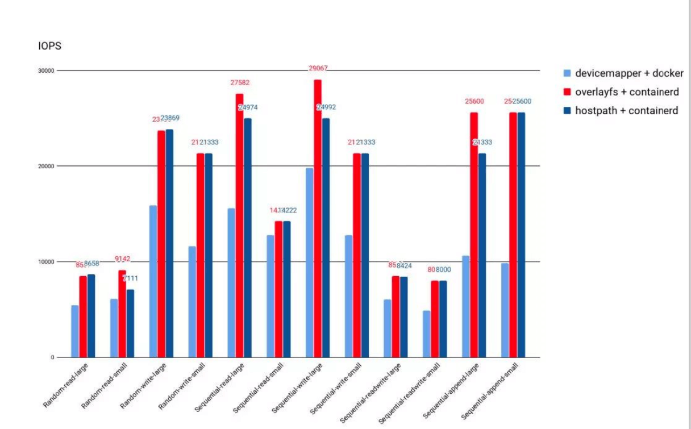
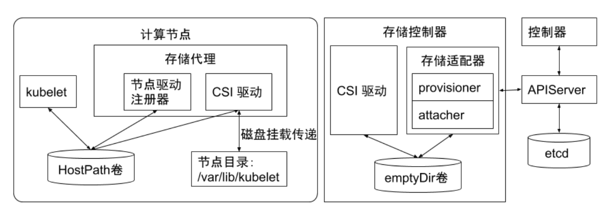
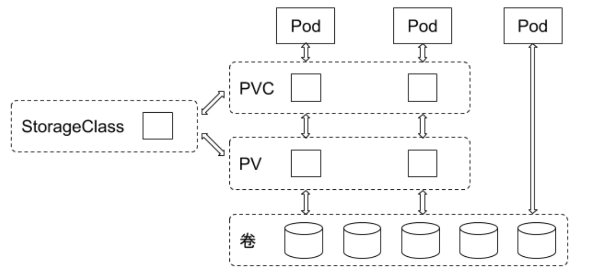
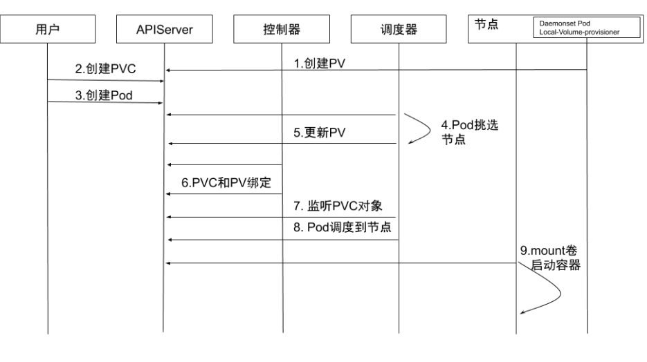
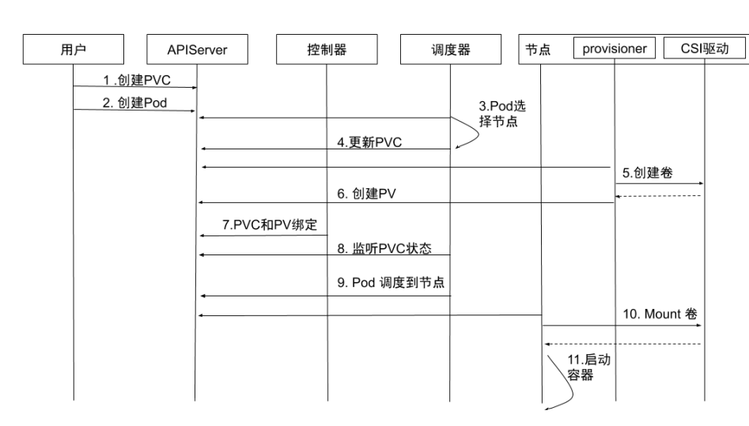

# CSI

### 容器运行时存储

* 除外挂存储卷外，容器启动后，运行时所需文件系统性能直接影响容器性能;
* 早期的 Docker 采用 Device Mapper 作为容器运行时存储驱动，因为 OverlayFS 尚未合并进 Kernel;
* 目前 Docker 和 containerd 都默认以 OverlayFS 作为运行时存储驱动;
* OverlayFS 目前已经有非常好的性能，与 DeviceMapper 相比优 20%，与操作主机文件性能几乎一致。

### 存储卷插件管理

Kubernetes支持以插件的形式来实现对不同存储的支持和扩展，这些扩展基于如下三种方式:

* in-tree 插件：直接下载 k8s 仓库中的插件，当前 k8s 社区已经不在接受新的 in-tree 存储插件了，必须以 out-of-tree 插件方式支持
* out-of-tree FlexVolume 插件：这个模式也逐渐取消了
  * FlexVolume 是指 Kubernetes 通过调用计算节点的本地可执行文件与存储插件进行交互
  * FlexVolume 插件需要宿主机用 root 权限来安装插件驱动
  * FlexVolume 存储驱动需要宿主机安装 attach、mount 等工具，也需要具有 root 访问权限。
* out-of-tree CSI 插件：插件通过 RPC 与存储驱动交互，当前主流的插件形式。
  * 思考：CNI 插件是否也可以改成这种调用方式？

### CSI 插件

在设计 CSI 的时候，Kubernetes 对 CSI 存储驱动的打包和部署要求很少，主要定义了 Kubernetes 的两个相关
模块：

* kube-controller-manager :
  * kube-controller-manager 模块用于感知 CSI 驱动存在。
  * Kubernetes 的主控模块通过 Unix domain socket (而不是 CSI 驱动)或者其他方式进行直接地交互。
  * Kubernetes 的主控模块只与 Kubernetes 相关的 API 进行交互，因此 CSI 驱动若有依赖于 Kubernetes API 的操作，例如卷的创建 、卷的 attach、 卷的快照等，需要在 CSI 驱动里面通过 Kubernetes 的 API,来触发相关的 CSI 操作。
* kubelet：
  * kubelet 模块用于与 CSI 驱动进行交互。
  * kubelet 通过 Unix domain socket 向CSI 驱动发起 CSI 调用(如 NodeStageVolume、NodePublishkubelet通过插件注册机制发现CSI驱动及用于和CSI驱动交互的Unix Domain Socket。Volume等)，再发起 mount 卷和 umount 卷。
  * kubelet 通过插件注册机制发现 CSI 驱动及用于和 CSI 驱动交互的 Unix Domain Socket。
  * 所有部署在 Kubernetes 集群中的 CSI 驱动都要通过 kubelet 的插件注册机制来注册自己。

### CSI 驱动

CSI的驱动一般包含 external-attacher、external-provisioner、 external-resizer、 external-snapshotter、node-driver-register、 CSI driver 等模块，可以根据实际的存储类型和需求进行不同方式的部署。

### 临时存储卷

常见的临时存储主要就是 emptyDir 卷。

emptyDir 是一种经常被用户使用的卷类型,顾名思义，“卷”最初是空的。当 Pod 从节点上删除时，emptyDir 卷中的数据也会被永久删除。但当Pod的容器因为某些原因退出再重启时，emptyDir 卷内的数据并不会丢失。

默认情况下，emptyDir 卷存储在支持该节点所使用的存储介质上，可以是本地磁盘或网络存储。
emptyDir 也可以通过将 emptyDir.medium 字段设置为"Memory" 来通知 Kubernetes 为容器安装 tmpfs,此时数据被存储在内存中，速度相对于本地存储和网络存储快很多。但是在节点重启的时候,内存数据会被清除;

而如果存在磁盘上,则重启后数据依然存在。另外，使用 tmpfs 的内存也会计入容器的使用内存总量中，受系统的Cgroup 限制。

emptyDir 设计的初衷主要是给应用充当缓存空间，或者存储中间数据，用于快速恢复。然而，这并不是说满足以上需求的用户都被推荐使用 emptyDir,我们要根据用户业务的实际特点来判断是否使用 emptyDir。因为 emptyDir 的空间位于系统根盘，被所有容器共享，所以在磁盘的使用率较高时会触发 Pod 的 eviction 操作，从而影响业务的稳定。

### 半持久化存储

常见的半持久化存储主要是 hostPath 卷。hostPath 卷能将主机节点文件系统上的文件或目录挂载到指定 Pod中。

对普通用户而言一般不需要这样的卷，但是对很多需要获取节点系统信息的 Pod 而言，却是非常必要的。
例如，hostPath 的用法举例如下:

* 某个 Pod 需要获取节点上所有 Pod 的 log, 可以通过 hostPath 访问所有 Pod 的 stdout 输出存储目录,例如 /var/log/pods 路径。
* 某个 Pod 需要统计系统相关的信息，可以通过 hostPath 访问系统的 /proc 目录。

使用 hostPath 的时候，除设置必需的 path 属性外，用户还可以有选择性地为 hostPath 卷指定类型,支持类型包含目录、字符设备、块设备等。

#### hostpath 注意事项

* 使用同一个目录的 Pod 可能会由于调度到不同的节点，导致目录中的内容有所不同。
* Kubernetes 在调度时无法顾及由 hostPath 使用的资源。
* Pod 被删除后，如果没有特别处理，那么 hostPath上写的数据会遗留到节点上，占用磁盘空间。

### 持久化存储

支持持久化的存储是所有分布式系统所必备的特性。

针对持久化存储，Kubernetes 引入了 StorageClass、Volume、 PVC ( Persistent Volume Claim)、PV (Persitent Volume)的概念，将存储独立于 Pod 的生命周期来进行管理。

Kuberntes 目前支持的持久化存储包含各种主流的块存储和文件存储，譬如 awsElasticBlockStore、azureDisk、cinder、 NFS、 cephfs、 iscsi 等,在大类上可以将其分为**网络存储**和**本地存储**两种类型。

#### StorageClass

StorageClass 用于指示存储的类型，不同的存储类型可以通过不同的 StorageClass 来为用户提供服务。

StorageClass 主要包含存储插件 provisioner、卷的创建和 mount 参数等字段。

#### PVC

由用户创建,代表用户对存储需求的声明，主要包含需要的存储大小、存储卷的访问模式、StroageClass 等类型，其中存储卷的访问模式必须与存储的类型一致。

* RWO：ReadWriteOnce，该卷只能在一个节点上被 mount，属性为可读写
* ROX：ReadOnlyMany，该卷可以在不同节点上被 mount，属性为可读
* RWX：ReadWriteMany，该卷可以在不同节点上被 mount，属性为可读写

#### PV

由集群管理员提前创建，或者根据 PVC 的申请需求动态地创建，它代表系统后端的真实的存储空间，可以称之为卷空间。

> 在 k8s 中创建一个 pv 来代表外部系统的存储空间。

#### 存储对象关系

用户通过创建 PVC 来申请存储。控制器通过 PVC 的 StorageClass 和请求的大小声明来存储后端创建卷，进而创建 PV, Pod 通过指定 PVC 来引用存储。

pod 什么需要使用的 pvc，pvc 和 pv 关联，pv 对应后端存储。

> 具体需要创建哪个插件控制的后端存储就是由 pvc 中指定的 StorageClass 来控制了。

### 生产实践经验分享

不同介质类型的磁盘，需要设置不同的 StorageClass,以便让用户做区分。StorageClass 需要设置磁盘介质的类
型，以便用户了解该类存储的属性。

在本地存储的PV静态部署模式下，每个物理磁盘都尽量只创建一个 PV,而不是划分为多个分区来提供多个本地存
储PV,避免在使用时分区之间的 I/O 干扰。

本地存储需要配合磁盘检测来使用。当集群部署规模化后，每个集群的本地存储 PV 可能会超过几万个，如磁盘损坏将是频发事件。此时，需要在检测到磁盘损坏、丟盘等问题后，对节点的磁盘和相应的本地存储 PV 进行特定的处理,例如触发告警、自动 cordon 节点、自动通知用户等。

对于提供本地存储节点的磁盘管理，需要做到灵活管理和自动化。节点磁盘的信息可以归一、集中化管理。在
local-volume- provisioner 中增加部署逻辑，当容器运行起来时，拉取该节点需要提供本地存储的磁盘信息，例如磁盘的设备路径，以 Filesystem 或 Block 的模式提供本地存储，或者是否需要加入某个 LVM 的虚拟组(VG)等。
local-volume-provisioner 根据获取的磁盘信息对磁盘进行格式化，或者加入到某个 VG,从而形成对本地存储支
持的自动化闭环。

### 独占的 LocalVolume

* **创建 PV**：通过 local-volume-provisioner DaemonSet 创建本地存储的 PV。
* **创建 PVC**：用户创建 PVC,由于它处于 pending 状态，所以kube-controller-manager 并不会对该 PVC 做任何操作。
* **创建Pod**：用户创建Pod。
* **Pod 挑选节点**：kube-scheduler 开始调度 Pod,通过 PVC 的 resources.request. storage 和 volumeMode 选择满足条件的 PV,并且为 Pod 选择一个合适的节点。
* **更新PV**：kube-scheduler 将 PV 的 pv.Spec.claimRef 设置为对应的 PVC,并且设置 annotation pv.kubernetes.io/ bound-by-controller 的值为 "yes" 。
* **PVC 和 PV绑定**：pv_controller 同步 PVC 和 PV 的状态，并将 PVC 和 PV 进行绑定。
* **监听PVC对象**：kube-scheduler 等待 PVC 的状态变成 Bound 状态。
* **Pod调度到节点**：如果 PVC 的状态变为 Bound 则说明调度成功，而如果 PVC 一直处于 pending 状态，超时后会再次进行调度。
* **Mount 卷启动容器**：kubelet 监听到有 Pod 已经调度到节点上，对本地存储进行 mount 操作，并启动容器。

### Dynamic Local Volume

CSI 驱动需要汇报节点上相关存储的资源信息，以便用于调度

但是机器的厂家不同，汇报方式也不同。

例如，有的厂家的机器节点上具有 NVMe、SSD、 HDD 等多种存储介质,希望将这些存储介质分别进行汇报。

这种需求有别于其他存储类型的 CSI 驱动对接口的需求，因此如何汇报节点的存储信息，以及如何让节点的存储信息应用于调度，目前并没有形成统一的意见。

集群管理员可以基于节点存储的实际情况对开源 CSI 驱动和调度进行一些代码修改， 再进行部署和使用

### Local Dynamic 的挂载流程

* **创建PVC**：用户创建 PVC，PVC 处于 pending 状态。

* **创建 Pod**：用户创建 Pod。

* **Pod选择节点**： kube-scheduler 开始调度 Pod,通过 PVC 的 pvc.spec.resources.request.storage 等选择满足条件的节点。

* **更新 PVC**：选择节点后，kube-scheduler 会给 PVC 添加包含节点信息的annotation:volume.kubernetes.io/selected-node: <节点名字>。

* **创建卷**：运行在节点上的容器 external-provisioner 监听到 PVC 带有该节点相关的 annotation,向相应的 CSI 驱动申请分配卷。

* **创建PV**： PVC 申请到所需的存储空间后，external-provisioner 创建 PV,该 PV 的 pv.Spec.claimRef 设置为对应的 PVC。

* **PVC和PV绑定**：kube-controller-manager 将PVC 和 PV 进行绑定，状态修改为 Bound。

* **监听PVC状态**：kube-scheduler 等待 PVC 变成 Bound 状态。

* **Pod调度到节点**：当PVC的状态为 Bound 时，Pod 才算真正调度成功了。如果 PVC 一直处于 Pending 状态,超时后会再次进行调度。

* **Mount 卷**：kubelet 监听到有 Pod 已经调度到节点上,对本地存储进行 mount 操作。

* **启动容器**：启动容器。

  

### Local Dynamic 的挑战

如果将磁盘空间作为一个存储池(例如 LVM )来动态分配，那么在分配出来的逻辑卷空间的使用上,可能会受到其他逻辑卷的 I/O 干扰，因为底层的物理卷可能是同一个。

如果 PV 后端的磁盘空间是一块独立的物理磁盘，则 I/O 就不会受到干扰。

### Rook

> https://github.com/rook/rook

Rook是一款云原生环境下的开源分布式存储编排系统，目前支持 Ceph、NFS、EdgeFS、Cassandra、CockroachDB 等存储系统。它实现了一个自动管理的、自动扩容的、自动修复的分布式存储服务。

Rook 支持自动部署、启动、配置、分配、扩容/缩容、升级、迁移、灾难恢复、监控以及资源管理。