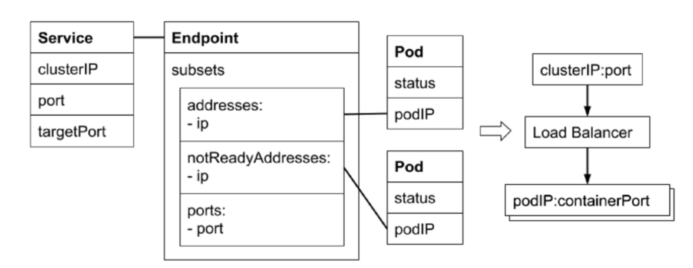

# service


### Service 对象

Service Selector

* Kubernetes 允许将 Pod 对象通过标签(Label)进行标记，并通过 Service Selector 定义基于 Pod 标签的过滤规则,以便选择服务的上游应用实例

Ports

* Ports 属性中定义了服务的端口、协议目标端口等信息

```yaml
apiVersion: v1
kind: Service
metadata:
  name: nginx
spec:
  #如果设置了PublishNotReadyAdddress为 true,则无论Pod是否就绪都会被加入endpoint readyAddress list 中
  #publishNotReadyAddresses: true
  ports:
    - name: http
      port: 80
      protocol: TCP
      targetPort: 80
  selector:
    app: nginx
```

### Endpoint 对象

* 当 Service 的 selector 不为空时，Kubernetes Endpoint Controller 会侦听服务创建事件，创建与 Service 同名的 Endpoint 对象
* selector 能够选取的所有 PodIP 都会被配置到 addresses 属性中
  * 如果此时 selector 所对应的 filter 查询不到对应的 Pod,则 addresses 列表为空
  * 默认配置下，如果此时对应的 Pod 为 not ready 状态，则对应的 PodIP 只会出现在 subsets 的notReadyAddresses 属性中，这意味着对应的 Pod 还没准备好提供服务，不能作为流量转发的目标。
  * 如果设置了 PublishNotReadyAdddress 为 true,则无论 Pod 是否就绪都会被加入 readyAddress list 中

```yaml
apiVersion: v1
kind: Endpoints
metadata:
  name: service-without-selector
subsets:
  - addresses:
      - ip: 220.181.38.148
    ports:
      - name: http
        port: 80
        protocol: TCP
```


### EndpointSlice 对象

* 当某个 Service 对应的 backend Pod 较多时,Endpoint 对象就会因保存的地址信息过多而变得异常庞大

* Pod 状态的变更会引起 Endpoint 的变更,Endpoint 的变更会被推送至所有节点，从而导致持续占用大量网络带宽

* EndpointSlice 对象，用于对 Pod 较多的 Endpoint 进行切片,切片大小可以自定义


### 不定义 selector 的 service

用户创建了 Service 但不定义 Selector

* Endpoint Controller 不会为该 Service 自动创建 Endpoint
* 用户可以手动创建 Endpoint 对象，并设置任意 IP 地址到 Address 属性
* 访问该服务的请求会被转发至目标地址

通过该类型服务，可以为集群外的一组 Endpoint 创建服务


### Service Endpoint Pod 的关系




### Service 的类型

* clusterIP
  * Service 的默认类型， 服务被发布至仅集群内部可见的虚拟 IP 地址上。
  * 在 API Server 启动时，需要通过 service-cluster-ip-range 参数配置虚拟 IP 地址段，API Server 中有用于分配 IP 地址和端口的组件，当该组件捕获 Service 对象并创建事件时，会从配置的虚拟 IP 地址段中取一个有效的 IP 地址，分配给该 Service 对象。
* nodePort
  * 在 API Server 启动时，需要通过 node-port-range 参数配置 nodePort 的范围， 同样的，API Server 组件会捕获 Service 对象并创建事件，即从配置好的 nodePort 范围取一个有效端口，分配给该 Service。
  * 每个节点的 kube-proxy 会尝试在服务分配的 nodePort 上建立侦听器接收请求，并转发给服务对应的后端 Pod 实例。
* LoadBalancer
  * 企业数据中心一 般会采购一些负载均衡器，作为外网请求进入数据中心内部的统一流量入口。
  * 针对不同的基础架构云平台，Kubernertes Cloud Manager 提供支持不同供应商 API 的 Service Controller。如果需要在 Openstack 云平台上搭建 Kubernetes 集群，那么只需提供一份 openstack.rc, Openstack Service Controller 即可通过调用 LBaaS API 完成负载均衡配置。
* Headless Service
  * Headless 服务是用户将 clusterIP 显示定义为 None 的服务。
  * 无头的服务意味着 Kubernetes 不会为该服务分配统一入口，包括 clusterIP， nodePort 等


  * ExternalName

    * 为一个服务创建别名


ExternalName demo：

> 访问该 service 的情况会被转发到指定域名。

```yaml
apiVersion: v1
kind: Service
metadata:
  name: my-service
  namespace: prod
spec:
  type: ExternalName
  externalName: tencent.com
```


### Service Topology

* 一个网络调用的延迟受客户端和服务器所处位置的影响，两者是否在同一节点、同一机架、同一可用区、同一数据中心，都会影响参与数据传输的设备数量

* 在分布式系统中，为保证系统的高可用,往往需要控制应用的错误域(Failure Domain)，比如通过反亲和性配置，将一个应用的多个副本部署在不同机架，甚至不同的数据中心

* Kubernetes 提供通用标签来标记节点所处的物理位置，如：
  * topology.kubernetes.io/ zone: us-west2-a
  * failure-domain. beta.kubernetes.io/ region: us-west
  * failure-domain.tess.io/ network-device: us-west05-ra053
  * failure-domain.tess.io/rack: us_westO2_02-314_19_12
  * kubernetes.io/hostname: node-1
* Service 引入了 topologyKeys 属性，可以通过如下设置来控制流量
  * 当 topologyKeys 设置为["kubernetes.io/hostname"]时，调用服务的客户端所在节点上如
    果有服务实例正在运行，则该实例处理请求，否则，调用失败。
  * 当topologyKeys设置为["kubernetes.io/hostname" , "topology.kubernetes.io/zone",
    "topology. kubernetes.io/region"]时，若同一节点有对应的服务实例，则请求会优先转发至该实例。否则，顺序查找当前 zone 及当前 region 是否有服务实例,并将请求按顺序转发。
  * 当 topologyKeys 设置为["topology.kubernetes.io/ zone", "*"] 时，请求会被优先转发至当前 zone 的服务实例。如果当前 zone 不存在服务实例，则请求会被转发至任意服务实例。


该 Service 的访问只会转发到 client 所在 node 上的 Pod：

```yaml
apiVersion: v1
kind: Service
metadata:
  name: nodelocal
spec:
  ports:
    - port: 80
      protocol: TCP
      name: http
  selector:
    app: nginx
  topologyKeys:
    - "kubernetes.io/hostname"
```

该 Service 的访问会按照优先级转发：


```yaml
apiVersion: v1
kind: Service
metadata:
  name: prefer-nodelocal
spec:
  ports:
    - port: 80
      protocol: TCP
      name: http
  selector:
    app: nginx
  topologyKeys:
    - "kubernetes.io/hostname"
    - "topology.kubernetes.io/zone"
    - "topology.kubernetes.io/region"
    - "*"
```

