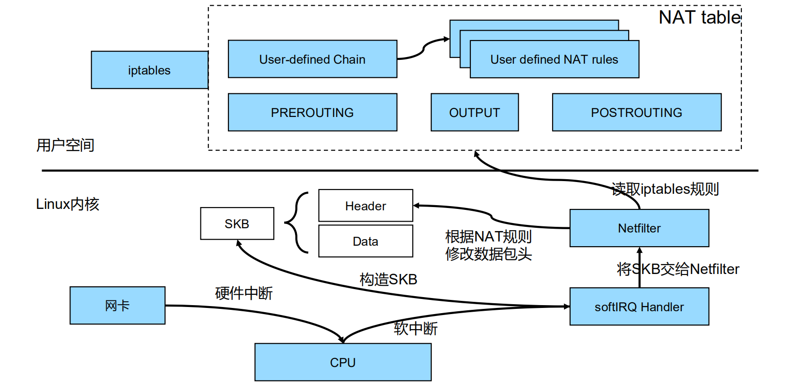
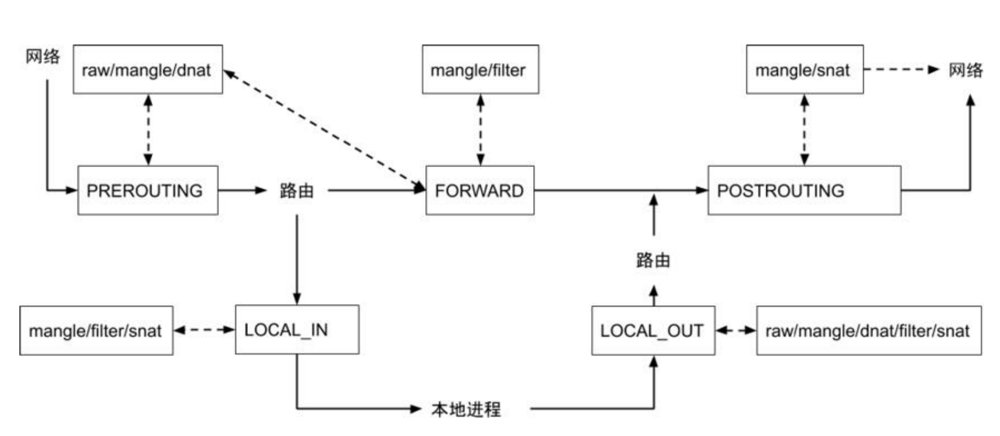
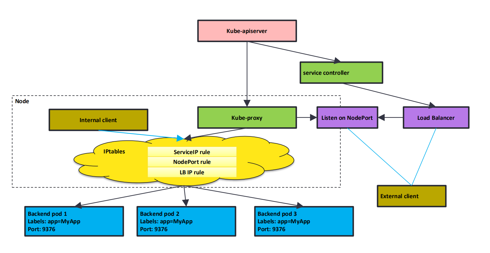
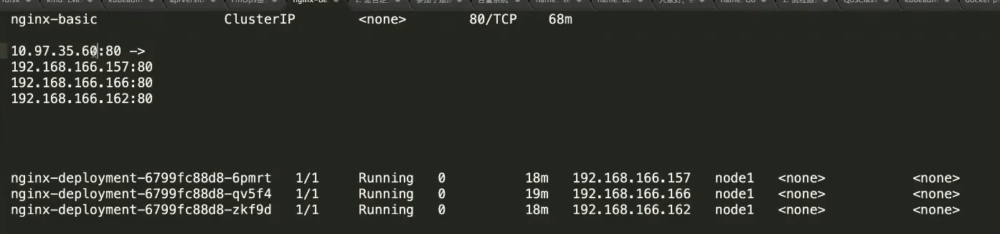
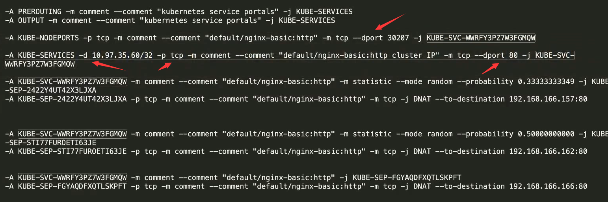
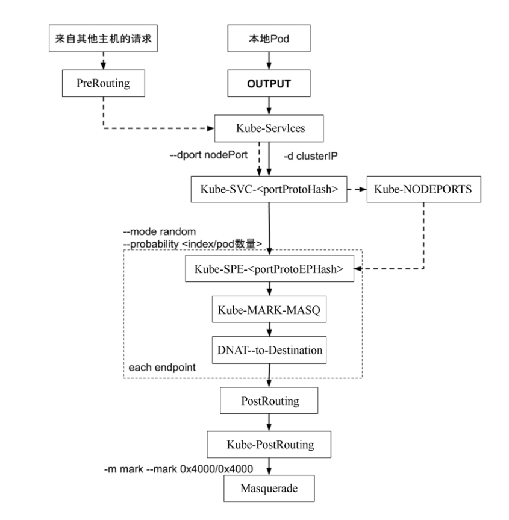
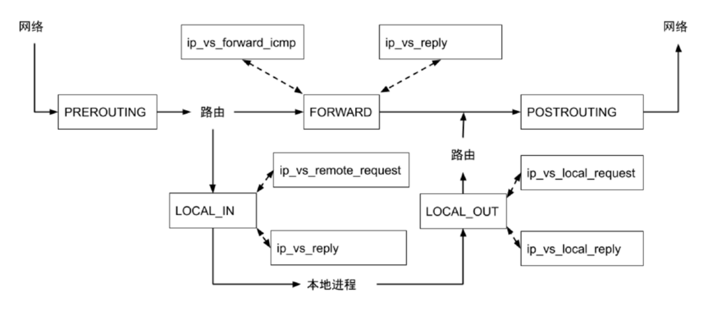

# kube-proxy


### 什么是 kube-proxy

每台机器上都运行一个 kube-proxy 服务,它监听 API server 中 service 和 endpoint 的变化情况，并通过 iptables等来为服务配置负载均衡(仅支持TCP和UDP)。

kube-proxy 可以直接运行在物理机上，也可以以 static pod 或者 DaemonSet 的方式运行。

kube-proxy当前支持以下几种实现：

* userspace：最早的负载均衡方案，它在用户空间监听一个端口，所有服务通过 iptables 转发到这个端口，然后在其内部负载均衡到实际的 Pod。该方式最主要的问题是效率低,有明显的性能瓶颈。

* iptables：目前推荐的方案，完全以 iptables 规则的方式来实现 service 负载均衡。该方式最主要的问题是在服务多的时候产生太多的 iptables 规则，非增量式更新会引入一定的时延，大规模情况下有明显的性能问题

* ipvs：为解决 iptables 模式的性能问题，v1 .8 新增了 ipvs 模式，采用增量式更新，并可以保证 service 更新期间连接保持不断开 

* winuserspace：同 userspace, 但仅工作在 windows 上


### netfilter


### netfilter & iptables




### iptables




iptables 支持的锚点

| table/chain | PREROUTING | INPUT | FORWARD | OUTPUT | POSTROUTING |
| ----------- | ---------- | ----- | ------- | ------ | ----------- |
| raw         | 支持       |       |         | 支持   |             |
| mangle      | 支持       | 支持  | 支持    | 支持   | 支持        |
| dnat        | 支持       |       |         | 支持   |             |
| filter      |            | 支持  | 支持    | 支持   |             |
| snat        |            | 支持  |         | 支持   | 支持        |


### kube-proxy 工作原理




查看 iptables 规则：

* **iptables -L -t nat**：查看 nat 表所有规则
* **iptables-save -t nat**：打印出 nat 表所有规则添加时的原始命令，更容易理解
  * 推荐使用该方式查看
  * 和 iptables-restore 配合可以做备份用

如何快速找到 service 对应的 iptables 规则？

* ClusterIP 类型的 svc 直接使用 ip 去 iptables-save 的结果中搜索
* NodePort 类型的 svc 则使用 port 去搜索


注意：

* 如果一个服务被配置为 ClusterIP 类型，那么他只有一个虚拟的 ClusterIP 可以在集群内部访问
* 如果是 NodePort 类型的 Service，则同时有 NodePort 以及 ClusterIP
* 如果是 LB 类型的 Service，则同时有 NodePort  以及 LB IP

原因？

#### NodePort SVC

为了把集群中的服务，对外暴露，就可以使用 NodePort 类型的 Service。

在创建出 NodePort SVC 时，kube-proxy 就会监听对应的端口，这样客户端直接访问节点的该端口即可访问到对应服务。

> 所有节点都有 kube-proxy，因此随便访问哪个节点都可以


#### LB SVC

NodePort SVC 以及可以对外暴露服务了，但是节点可能会坏，为了保证高可用，一般会再接一个 LB。

社区的 LB 方案：客户端访问 LB，LB 再访问 NodePort，然后就进入 NodePort 的流程，根据 iptables 进行转发，最终进入 Pod。

问题：这里存在两次转发，LB 这里已经负载均衡一次了，访问 NodePort 的时候 iptables 又会负载均衡一次，对性能有一定影响。

**云厂商改造**

如果 node 有公网 IP 能全局路由的话，LB 直接通过公网IP访问到Pod，从而跳过 iptables。

因此很多云厂商都会改造社区方案，直接把 Pod IP 配置在 LB。

**问题**

云厂商直接把 PodIP 配置在 LB 上也会引入其他问题，比如 Pod 挂了重启后 IP 变了，LB 那边需要同步更新，然后 Pod 变得不 Ready 了，LB 那边也要移除对应 IP。

因此 LB 压力会非常大，这部分需要做很多优化。


### 真实场景 iptables 规则分析

svc ip 为 10.97.35.60，port 为 80，svc 代理的 pod 为 3个 nginx pod，IP分别如下：




该 svc 对应的 iptables 规则为：



* 其中带箭头的第一条 --dprot 30207 是NodePort 类型的 svc 生成的规则
* 带箭头的第二条 -d 10.97.356.60/32 -p tcp --dport 80 是 ClusterIP 类型 svc 生成的规则

然后后续的 KUBE-SVC-XXX 这些 chain，不同类型的 SVC 也是一样的，也就是说，**不同类型的 SVC 的 iptables 规则只有入口部分不同**。

另外如果是一个 LB 类型的 SVC，那么生成的规则和 ClusterIP 类型的 SVC 差不多，把目标 IP 替换成 LB IP 即可。

这些 iptables 规则会在所有节点上存在，也就是说，在 Pod 中访问 LB 类型的 svc，实际上流量根本不会真的从宿主机走到 LB，然后再转发会宿主机。从 Pod 中出去，到宿主机的时候检测到目标IP是 LB的时候就直接被 iptables 拦截了，然后就转发到对应 Pod。


另外 SVC IP 是 ping 不通的，因为该 IP 没有对应任何设备，只存在于 iptables 规则里，之所以能访问是被 iptables 进行了转发。

> 因为 iptables 中该 svc 对应的规则中指定的是 目标IP+目标端口+ tcp 协议才处理，而 ping 是 icmp 协议。


### k8s 的 iptables 规则




```txt
 KUBE-MARK-DROP -j MARK --set-xmark 0x8000/0x8000

-A KUBE-MARK-MASQ -j MARK --set-xmark 0x4000/0x4000

-A KUBE-POSTROUTING -m comment --comment "kubernetes service traffic requiring SNAT" -m mark --mark 

0x4000/0x4000 -j MASQUERADE

-A KUBE-SEP-55QZ6T7MF3AHPOOB -s 10.244.1.6/32 -m comment --comment "default/http:" -j KUBE-MARK-MASQ

-A KUBE-SEP-55QZ6T7MF3AHPOOB -p tcp -m comment --comment "default/http:" -m tcp -j DNAT --to-destination 

10.244.1.6:80

-A KUBE-SEP-KJZJRL2KRWMXNR3J -s 10.244.1.5/32 -m comment --comment "default/http:" -j KUBE-MARK-MASQ

-A KUBE-SEP-KJZJRL2KRWMXNR3J -p tcp -m comment --comment "default/http:" -m tcp -j DNAT --to-destination 

10.244.1.5:80

-A KUBE-SERVICES -d 10.101.85.234/32 -p tcp -m comment --comment "default/http: cluster IP" -m tcp --dport 80 -j 

KUBE-SVC-7IMAZDGB2ONQNK4Z

-A KUBE-SVC-7IMAZDGB2ONQNK4Z -m comment --comment "default/http:" -m statistic --mode random --

probability 0.50000000000 -j KUBE-SEP-KJZJRL2KRWMXNR3J

-A KUBE-SVC-7IMAZDGB2ONQNK4Z -m comment --comment "default/http:" -j KUBE-SEP-55QZ6T7MF3AHPOOB
```


### iptables 的问题

在大规模时 iptables 存在性能问题。

iptables 最初设计出来就是为了防火墙，一般也就几十上百条的规模。

在 k8s 集群中 iptables 几千上万条规则都是很常见的，而且 kube-proxy 更新 iptables 规则是全量更新，如果一个 svc 后面挂了 1000 个 Pod，其中一个 Pod 挂了，kube-proxy 就会重新生成一个包含 999 pod 的规则并进行替换，然后等 deploy 把一个新的 pod 拉起来的时候，又要生成一个 1000 pod 的规则来替换掉这个 999 pod 的规则。

因此大规模场景下，光是更新 iptables 规则都会消耗很多资源和时间。


### IPVS

ipvs 和 iptables 类似，都是 netfilter 插件，但是钩子点不一样。



ipvs 只有 LOCAL_IN、FORWARD、LOCAL_OUT 这 3 个地方有钩子，PREROUTING 这里是没有的，因此不能在路由之前做一些操作。

因此，如果按照 iptables 的逻辑在走的话，访问 svc 的流量过来后，在 PREROUTING 由于不能修改，因此会拿着 真实的 clusterIP 去路由，然后一看发现这个 IP 根本就达到不了，数据包直接就被丢弃了，或者能网络上这个IP能达到，就转发出去了。

> 在 k8s 里的网段都是我们自己可以随便配置的，很可能就是外界的一个真实IP，能访问的话就走 FORWARD 这一步，不能访问就直接丢弃了。

**因此在开启 ipvs 模式时，会在机器上创建一个叫做 ipvs0 的虚拟网卡**，他会把所有 ClusterIP 绑定在这个网卡上，同时这个网卡不会接收 arp 请求，这样就是我们 ping svc ip 还是 ping 不通，但是可以访问。

通过这个 ipvs0 虚拟网卡就解决了路由这一步的问题，路由时发现这个 ip 是本机的 ip，因此就可以进入下一步了，下一步就是 LOCAL_IN，在这里 ipvs 就开始操作了。

小结：**iptables 在 PREROUTING 处进行处理，ipvs 在 LOCAL_IN 处进行处理**。


#### IPVS 支持的锚点和核心函数

| HOOK              | 函数                  | 核心函数      | Priority              |
| ----------------- | --------------------- | ------------- | --------------------- |
| NF_INET_LOCAL_IN  | ip_vs_reply4          | ip_vs_out     | NF_IP_PRI_NAT_SRC - 2 |
| NF_INET_LOCAL_IN  | ip_vs_remote_request4 | ip_vs_in      | NF_IP_PRI_NAT_SRC - 1 |
| NF_INET_LOCAL_OUT | ip_vs_local_reply4    | ip_vs_out     | NF_IP_PRI_NAT_DST + 1 |
| NF_INET_LOCAL_OUT | ip_vs_local_request4  | ip_vs_in      | NF_IP_PRI_NAT_DST + 2 |
| NF_INET_FORWARD   | ip_vs_forward_icmp    | ip_vs_in_icmp | 99                    |
| NF_INET_FORWARD   | ip_vs_reply4          | ip_vs_out     | 100                   |


### k8s 切换 ipvs 或者 iptables 

kube-proxy 配置文件中有一个 mode 字段，用于指定使用 iptables 还是 ipvs。

> 为空时默认为 iptables

切换后需要删除 kube-proxy 使其重新加载配置，iptables 切换为 ipvs 还需要使用`iptables -F -t nat`命令手动把 iptables 规则刷掉。

**如果节点没有 ipvs 相关模块则会降级到 iptables。**

#### ipvs 查询

可以使用 ipvsadm -L 命令进行查询

相比之下 ipvs 的规则看起来会比较清晰，但是对于新手来说 iptables 中能比较清晰的看到具体的流转过程，ipvs 就没有这些细节。


### IP伪装

某些情况下可能需要把数据包伪装成从Node发出去的，而不是Pod发出去的，一般是在 POSTROUTING 这里进行处理，但是 ipvs 没有这个能力，因此这种场景下还是需要使用 iptables 进行配合。

但是这种场景的 iptables 规则比较少，就不用担心性能问题了。

同时还可以使用 ipset 进一步提升性能。


### FAQ

**为什么每个节点都需要全量的 iptables 规则，不能专门几台节点做这个吗？**

k8s 要实现的是在任意一个节点的请求负载均衡都能直接在本地就完成，而不是先跳转到某个节点在进行转发，因此每个节点都需要全量的 iptables 规则。

**iptables 和 ipvs 都配置了，那么请求进来会都走一遍吗？先后顺序呢?**

先走 iptables，如果 iptables 走完了还能满足 ipvs 的条件就会在走 ipvs，不过一般 iptables 处理完（比如 DNAT）之后就不满足 ipvs 的条件了，因此两个都配置也不会影响正常使用。
