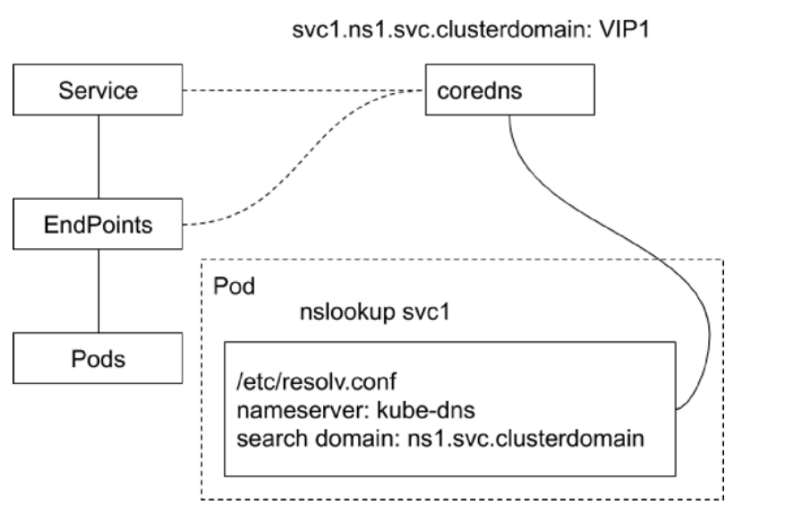

# CoreDNS


### 域名服务

* Kubernetes Service 通过虚拟 IP 地址或者节点端口为用户应用提供访问入口
* 然而这些 IP 地址和端口是动态分配的，如果用户重建一个服务，其分配的 clusterIP 和 nodePort，以及LoadBalancerIP 都是会变化的，我们不能把一个可变的入口发布出去供他人访问
* Kubernetes 提供了内置的域名服务,用户定义的服务会自动获得域名，而无论服务重建多少次，只要服务名不改变，其对应的域名就不会改变


### CoreDNS

CoreDNS 包含一个内存态 DNS，以及与其他 controller 类似的控制器。

CoreDNS 的实现原理是,控制器监听 Service 和 Endpoint 的变化并配置 DNS,客户端 Pod 在进行域名解析时，从CoreDNS 中查询服务对应的地址记录。




### 不同类型服务的解析记录

普通 Service

* ClusterIP、 nodePort、 LoadBalancer 类型的 Service 都拥有 API Server 分配的 ClusterIP, CoreDNS 会为这些Service 创建 FQDN 格式为 `$svcname.$namespace.svc.$clusterdomain: clusterIP`的 A 记录及 PTR 记录，并为端口创建 SRV 记录。

Headless Service

* 顾名思义，无头,是用户在 Spec 显式指定 ClusterIP 为 None 的 Service,对于这类 Service,API Server 不会为其分配 ClusterlP。CoreDNS 为此类 Service 创建多条 A 记录，并且目标为每个就绪的 PodIP。另外，每个 Pod 会拥有一个FQDN格式为 `$podname. $svcname. $namespace.svc.$clusterdomain`的 A 记录指向 PodIP。

ExternalName Service

* 此类 Service 用来引用一个已经存在的域名, CoreDNS 会为该 Service 创建一 个 CName 记录指向目标域名。


### k8s 中的域名解析

* Kubernetes Pod 有一个与 DNS 策略相关的属性 DNSPolicy,默认值是 ClusterFirst

* Pod 启动后的 /etc/resolv.conf 会被改写，所有的地址解析优先发送至 CoreDNS

```bash
$ cat /etc/resolv.conf
search ns1.svc.cluster.local sVC.cluster.local cluster.local
nameserver 192.168.0.10
options ndots:4
```


* 当 Pod 启动时，同一 Namespace 的所有 Service 都会以环境变量的形式设置到容器内
* 影响?


### 关于 DNS 的落地实践

Kubernetes 作为企业基础架构的一部分，Kubernetes 服务也需要发布到企业 DNS,需要定制企业 DNS 控制器

* 对于 Kubernetes 中的服务,在企业 DNS 同样创建 A/PTR/SRV records (通常解析地址是 LoadBalancer VIP )
* 针对 headless service,在 PodIP 可全局路由的前提下，按需创建 DNS records
* Headless service 的 DNS 记录，应该按需创建，否则对企业 DNS 冲击过大

服务在集群内通过 CoreDNS 寻址，在集群外通过企业 DNS 寻址，服务在集群内外有统一标识。


